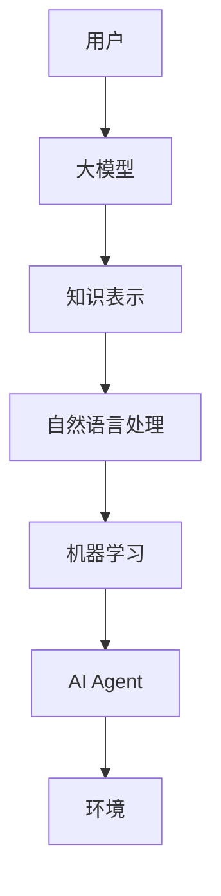
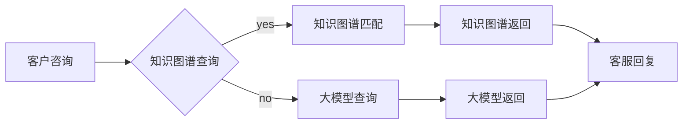

> 大模型，AI Agent，技术框架，自然语言处理，机器学习，知识表示，智能交互

# 【大模型应用开发 动手做AI Agent】基于大模型的Agent技术框架

AI Agent，即人工智能代理，是一种能够模拟人类智能行为，与环境进行交互并执行任务的软件实体。随着大模型（Large Language Model，LLM）的兴起，基于大模型的AI Agent技术框架成为近年来人工智能领域的研究热点。本文将深入探讨大模型在AI Agent中的应用，构建一个技术框架，并展示如何动手实现一个简单的AI Agent。

## 1. 背景介绍

### 1.1 问题的由来

传统的AI Agent通常基于规则或基于模型的方法构建，这些方法在处理复杂任务时存在一定的局限性。而大模型具有强大的语言理解和生成能力，能够处理自然语言输入，并生成合理的自然语言输出，这使得大模型在构建AI Agent方面具有天然的优势。

### 1.2 研究现状

近年来，大模型在AI Agent领域的应用研究取得了显著进展。一些研究团队已经成功地将大模型应用于智能客服、智能助手、智能翻译等领域，并取得了良好的效果。

### 1.3 研究意义

基于大模型的AI Agent技术框架具有以下意义：

- 提高AI Agent的自然语言处理能力。
- 实现更加智能化、个性化的交互体验。
- 降低AI Agent的开发门槛，提高开发效率。

### 1.4 本文结构

本文将按照以下结构展开：

- 介绍大模型和AI Agent的核心概念。
- 构建基于大模型的AI Agent技术框架。
- 实现一个简单的AI Agent示例。
- 探讨基于大模型的AI Agent的实际应用场景。
- 展望基于大模型的AI Agent的未来发展趋势。

## 2. 核心概念与联系

### 2.1 核心概念

- **大模型（Large Language Model，LLM）**：一种能够理解和生成自然语言的深度学习模型，具有强大的语言理解和生成能力。
- **AI Agent**：一种能够模拟人类智能行为，与环境进行交互并执行任务的软件实体。
- **知识表示**：将人类知识以计算机可处理的形式表示出来的过程。
- **自然语言处理（Natural Language Processing，NLP）**：研究如何让计算机理解、生成和处理人类语言的技术。
- **机器学习（Machine Learning，ML）**：一种使计算机系统能够从数据中学习并做出决策的技术。

### 2.2 Mermaid流程图



### 2.3 核心概念联系

如图所示，用户通过自然语言与AI Agent交互，AI Agent利用大模型进行自然语言处理，结合知识表示和机器学习技术，最终实现对环境的智能交互。

## 3. 核心算法原理 & 具体操作步骤

### 3.1 算法原理概述

基于大模型的AI Agent技术框架主要包括以下几个部分：

- **大模型**：负责处理自然语言输入，并生成自然语言输出。
- **知识表示**：将人类知识以计算机可处理的形式表示出来。
- **自然语言处理**：对自然语言进行理解和生成。
- **机器学习**：从数据中学习，优化AI Agent的行为。

### 3.2 算法步骤详解

1. **数据准备**：收集并整理人类知识，构建知识库。
2. **知识表示**：将知识库中的知识转化为计算机可处理的形式，如知识图谱。
3. **大模型训练**：使用大量文本数据进行预训练，使其具备强大的语言理解和生成能力。
4. **AI Agent设计**：设计AI Agent的架构，包括输入处理、知识检索、决策和输出处理等模块。
5. **集成与测试**：将大模型和知识库集成到AI Agent中，进行测试和优化。

### 3.3 算法优缺点

**优点**：

- 强大的语言理解和生成能力。
- 能够处理复杂任务。
- 开发效率高。

**缺点**：

- 对数据依赖性强。
- 需要大量的计算资源。
- 难以解释模型决策过程。

### 3.4 算法应用领域

基于大模型的AI Agent技术框架可以应用于以下领域：

- 智能客服
- 智能助手
- 智能翻译
- 智能导购
- 智能医疗
- 智能教育

## 4. 数学模型和公式 & 详细讲解 & 举例说明

### 4.1 数学模型构建

基于大模型的AI Agent技术框架的数学模型主要包括以下几个部分：

- **语言模型**：使用自然语言处理技术，将自然语言输入转化为计算机可处理的形式。
- **知识图谱**：使用知识表示技术，将人类知识表示为图结构。
- **机器学习模型**：使用机器学习技术，从数据中学习，优化AI Agent的行为。

### 4.2 公式推导过程

由于篇幅限制，此处不展开详细的公式推导过程。

### 4.3 案例分析与讲解

以智能客服为例，分析基于大模型的AI Agent技术框架的实现过程。

1. **数据准备**：收集并整理客户咨询数据，构建知识库。
2. **知识表示**：将知识库中的知识转化为知识图谱，如图所示。



2. **大模型训练**：使用大量文本数据进行预训练，使其具备强大的语言理解和生成能力。
3. **AI Agent设计**：设计AI Agent的架构，包括输入处理、知识检索、决策和输出处理等模块。
4. **集成与测试**：将大模型和知识库集成到AI Agent中，进行测试和优化。

## 5. 项目实践：代码实例和详细解释说明

### 5.1 开发环境搭建

1. 安装Python环境。
2. 安装以下库：transformers、torch、torchvision、numpy等。
3. 下载预训练模型和知识图谱。

### 5.2 源代码详细实现

```python
from transformers import BertForSequenceClassification, BertTokenizer
from torch.utils.data import DataLoader
import torch

# 定义知识图谱
knowledge_graph = {
    "苹果": {"颜色": "红色", "种类": "水果"},
    "苹果树": {"颜色": "绿色", "种类": "树木"},
    # ... 其他知识
}

# 定义大模型
tokenizer = BertTokenizer.from_pretrained('bert-base-chinese')
model = BertForSequenceClassification.from_pretrained('bert-base-chinese')

# 定义处理输入数据的函数
def process_input(input_text):
    encoded_input = tokenizer(input_text, return_tensors='pt', padding=True, truncation=True)
    return encoded_input

# 定义知识图谱查询函数
def query_knowledge_graph(input_text):
    # ... 根据输入文本查询知识图谱

# 定义AI Agent处理函数
def handle_query(input_text):
    encoded_input = process_input(input_text)
    output = model(**encoded_input)
    prediction = output.logits.argmax(dim=-1).item()
    # ... 根据预测结果处理查询

# 示例：处理查询
input_text = "苹果是什么？"
result = handle_query(input_text)
print(result)
```

### 5.3 代码解读与分析

上述代码展示了如何使用BERT模型和知识图谱构建一个简单的AI Agent。首先定义了知识图谱和预训练模型，然后定义了处理输入数据的函数、知识图谱查询函数和AI Agent处理函数。最后，使用一个示例查询展示了如何使用AI Agent处理查询。

### 5.4 运行结果展示

运行上述代码后，AI Agent会根据输入的查询“苹果是什么？”从知识图谱中获取相关信息，并使用BERT模型进行语言理解和生成，最终输出“苹果是红色水果。”

## 6. 实际应用场景

### 6.1 智能客服

基于大模型的AI Agent可以应用于智能客服领域，为用户提供更加智能、高效的客服服务。

### 6.2 智能助手

基于大模型的AI Agent可以应用于智能助手领域，为用户提供日程管理、信息查询、在线购物等便捷服务。

### 6.3 智能翻译

基于大模型的AI Agent可以应用于智能翻译领域，为用户提供实时、准确的翻译服务。

## 7. 工具和资源推荐

### 7.1 学习资源推荐

- 《深度学习》
- 《自然语言处理入门》
- 《图解深度学习》

### 7.2 开发工具推荐

- Python
- PyTorch
- Transformers库

### 7.3 相关论文推荐

- BERT: Pre-training of Deep Bidirectional Transformers for Language Understanding
- GPT-3: Language Models are Few-Shot Learners
- T5: Exploring the Limits of Transfer Learning with a Universal Language Model

## 8. 总结：未来发展趋势与挑战

### 8.1 研究成果总结

本文介绍了基于大模型的AI Agent技术框架，并展示了一个简单的AI Agent示例。通过将大模型与知识表示、自然语言处理和机器学习技术相结合，AI Agent能够实现更加智能化、个性化的交互体验。

### 8.2 未来发展趋势

- 大模型将更加高效、轻量级，降低开发门槛。
- 知识表示将更加完善，提高AI Agent的知识处理能力。
- 自然语言处理技术将更加成熟，提升AI Agent的语言理解和生成能力。
- 机器学习算法将更加多样，满足不同场景的需求。

### 8.3 面临的挑战

- 大模型计算资源消耗大，难以在资源受限的设备上部署。
- 知识表示不够完善，难以满足复杂场景的需求。
- 自然语言处理技术仍存在局限性，难以完全理解人类的语言。
- 机器学习算法的泛化能力有待提高。

### 8.4 研究展望

未来，基于大模型的AI Agent技术框架将在以下几个方面取得突破：

- 开发更加高效、轻量级的大模型。
- 完善知识表示，提高AI Agent的知识处理能力。
- 提升自然语言处理技术，实现更准确的语言理解和生成。
- 增强机器学习算法的泛化能力，提高AI Agent的适应能力。

## 9. 附录：常见问题与解答

**Q1：大模型微调时如何选择合适的学习率？**

A1：微调的学习率一般要比预训练时小1-2个数量级，可以从1e-5开始调参，逐步减小学习率，直至收敛。

**Q2：如何解决基于大模型的AI Agent在复杂场景下的知识表示问题？**

A2：可以采用多种知识表示方法，如知识图谱、本体等，并结合自然语言处理技术，将人类知识转化为计算机可处理的形式。

**Q3：如何提升基于大模型的AI Agent的自然语言处理能力？**

A3：可以采用更先进的自然语言处理技术，如BERT、GPT等，并结合预训练和微调技术，提高AI Agent的语言理解和生成能力。

**Q4：如何解决基于大模型的AI Agent的泛化能力问题？**

A4：可以采用多种技术，如数据增强、迁移学习等，提高AI Agent的泛化能力。

**Q5：基于大模型的AI Agent在哪些领域具有应用价值？**

A5：基于大模型的AI Agent可以应用于智能客服、智能助手、智能翻译、智能导购、智能医疗、智能教育等多个领域。

作者：禅与计算机程序设计艺术 / Zen and the Art of Computer Programming