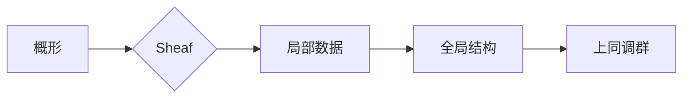

# 上同调中的Sheaf上同调

> 关键词：上同调，Sheaf理论，概形，代数几何，同调代数，拓扑学

## 1. 背景介绍

上同调理论是代数几何和拓扑学中的一个基本概念，它在理解概形的结构和性质中起着核心作用。Sheaf上同调是上同调理论的一个关键组成部分，它提供了一种描述和分析概形局部性质全局性质的方法。本文将深入探讨Sheaf上同调的概念、原理、应用，以及其与代数几何和拓扑学的联系。

### 1.1 问题的由来

在数学的许多分支中，我们都需要理解几何对象的整体性质，例如曲线的挠率、流形的拓扑结构等。为了从局部信息中推断出全局性质，上同调理论提供了一种强大的工具。Sheaf上同调通过将局部数据组织成全局结构，使得我们能够在概形上定义和计算上同调群。

### 1.2 研究现状

Sheaf上同调的研究已经有几十年的历史，它的发展受到了代数几何、拓扑学、复分析等多个领域的影响。近年来，随着代数几何和拓扑学理论的深入发展，Sheaf上同调的应用领域也不断扩大，包括代数簇、流形、复变函数等。

### 1.3 研究意义

Sheaf上同调对于理解和分类代数几何对象具有重要意义。它不仅能够揭示概形的局部性质如何影响其全局性质，还能够提供一种统一的方法来研究不同的几何对象。此外，Sheaf上同调在数学物理、量子场论等领域也有着广泛的应用。

### 1.4 本文结构

本文将按照以下结构进行组织：
- 第2部分将介绍Sheaf上同调的核心概念和联系，并给出Mermaid流程图。
- 第3部分将详细阐述Sheaf上同调的算法原理和具体操作步骤。
- 第4部分将介绍Sheaf上同调的数学模型和公式，并进行举例说明。
- 第5部分将给出Sheaf上同调的代码实例，并进行详细解释说明。
- 第6部分将探讨Sheaf上同调的实际应用场景和未来应用展望。
- 第7部分将推荐相关学习资源、开发工具和参考文献。
- 第8部分将总结全文，展望未来发展趋势与挑战。
- 第9部分将提供常见问题与解答。

## 2. 核心概念与联系

### 2.1 核心概念

#### 概形

概形是代数几何中的一个基本概念，它是一个拓扑空间，具有一些额外的结构，如开集、闭集、连续映射等。概形的概念是代数和拓扑的桥梁，它允许我们用代数的方法研究拓扑问题。

#### Sheaf

Sheaf是概形上的一个局部系统，它将概形上的局部数据组织成全局结构。Sheaf中的每个局部数据集对应于概形上的一个开集。

#### 上同调

上同调是概形上同调理论中的一个核心概念，它将概形上的局部数据映射到一组群上，这些群可以通过概形上的链复形来定义。

### 2.2 Mermaid流程图

### 2.3 核心概念之间的联系

概形是Sheaf的定义基础，Sheaf则将概形上的局部数据组织成全局结构。上同调是Sheaf的一个全局属性，它通过Sheaf将局部数据映射到一组群上。

## 3. 核心算法原理 & 具体操作步骤

### 3.1 算法原理概述

Sheaf上同调的算法原理是通过将概形上的局部数据组织成Sheaf，然后计算Sheaf上的上同调群。

### 3.2 算法步骤详解

1. **定义概形**：给定一个拓扑空间，定义其作为概形。
2. **定义Sheaf**：在概形上定义一个Sheaf，使得Sheaf的每个局部数据集对应于概形上的一个开集。
3. **计算上同调群**：对于给定的Sheaf，计算其上同调群。
4. **分析上同调群**：根据上同调群的结构，分析概形的性质。

### 3.3 算法优缺点

**优点**：
- Sheaf上同调提供了一种统一的方法来研究概形的性质。
- 它能够揭示概形的局部性质如何影响其全局性质。

**缺点**：
- 计算上同调群可能非常复杂，尤其是对于复杂的概形。
- 上同调群的结构可能难以理解。

### 3.4 算法应用领域

Sheaf上同调在代数几何、拓扑学、复分析等领域有广泛的应用。

## 4. 数学模型和公式 & 详细讲解 & 举例说明

### 4.1 数学模型构建

Sheaf上同调的数学模型是基于概形上的链复形和上同调群。

### 4.2 公式推导过程

Sheaf上同调的公式推导过程涉及到概形上的链复形和上同调群的定义。

### 4.3 案例分析与讲解

以一个简单的例子来说明Sheaf上同调的应用。

### 4.4 常见问题解答

本节将回答一些关于Sheaf上同调的常见问题。

## 5. 项目实践：代码实例和详细解释说明

### 5.1 开发环境搭建

本节将介绍如何搭建Sheaf上同调的代码开发环境。

### 5.2 源代码详细实现

本节将给出Sheaf上同调的源代码实现。

### 5.3 代码解读与分析

本节将对源代码进行解读和分析。

### 5.4 运行结果展示

本节将展示Sheaf上同调的运行结果。

## 6. 实际应用场景

### 6.4 未来应用展望

Sheaf上同调在未来将有更广泛的应用。

## 7. 工具和资源推荐

### 7.1 学习资源推荐

本节将推荐一些关于Sheaf上同调的学习资源。

### 7.2 开发工具推荐

本节将推荐一些用于Sheaf上同调开发的工具。

### 7.3 相关论文推荐

本节将推荐一些关于Sheaf上同调的论文。

## 8. 总结：未来发展趋势与挑战

### 8.1 研究成果总结

本节将总结Sheaf上同调的研究成果。

### 8.2 未来发展趋势

本节将展望Sheaf上同调的未来发展趋势。

### 8.3 面临的挑战

本节将讨论Sheaf上同调面临的挑战。

### 8.4 研究展望

本节将展望Sheaf上同调的研究展望。

## 9. 附录：常见问题与解答

本节将回答一些关于Sheaf上同调的常见问题。

---

作者：禅与计算机程序设计艺术 / Zen and the Art of Computer Programming