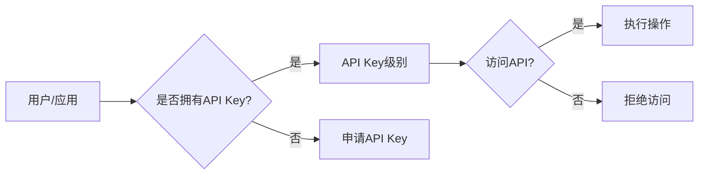

# 分级 API Key 的设置方法

> 关键词：API Key，分级授权，权限管理，安全防护，服务治理

## 1. 背景介绍

随着互联网的普及和云计算的发展，API（应用程序编程接口）已成为现代软件开发中不可或缺的一部分。API 允许不同系统之间进行交互，提高了开发效率，促进了创新。然而，API 的开放也带来了一系列安全挑战，如数据泄露、滥用和误用等。为了应对这些挑战，分级 API Key 应运而生。本文将深入探讨分级 API Key 的设置方法，包括其原理、操作步骤、优缺点、应用领域以及未来发展趋势。

## 2. 核心概念与联系

### 2.1 核心概念

**API Key**：API Key 是一个密钥，用于唯一标识 API 的用户或应用程序，并控制其对 API 的访问权限。

**分级授权**：分级授权是指根据用户或应用程序的角色、权限和需求，将 API Key 分为不同的级别，并分别赋予不同的访问权限。

**权限管理**：权限管理是指对用户、角色、权限和资源的分配、控制和审计。

**安全防护**：安全防护是指保护 API 和相关数据免受未授权访问、攻击和泄露。

**服务治理**：服务治理是指对 API 的生命周期进行管理，包括创建、发布、监控、优化和退役。

### 2.2 核心概念原理和架构的 Mermaid 流程图



图中，用户或应用首先检查自己是否拥有 API Key，如果拥有，根据 API Key 的级别决定是否可以访问 API；如果未拥有，则需要申请 API Key。一旦获得 API Key 并验证其级别，即可访问 API 并执行相关操作。

## 3. 核心算法原理 & 具体操作步骤

### 3.1 算法原理概述

分级 API Key 的设置方法基于以下原理：

- **角色与权限**：根据用户或应用程序的角色和权限，定义不同的 API Key 级别。
- **访问控制**：通过 API Key 的级别控制用户或应用程序对 API 的访问权限。
- **审计与监控**：记录和监控 API 调用情况，以便跟踪和审计。

### 3.2 算法步骤详解

1. **定义角色与权限**：明确不同角色和权限对应的 API Key 级别。
2. **创建 API Key**：为不同的角色和权限生成对应的 API Key。
3. **授权 API Key**：将 API Key 分配给相应的用户或应用程序。
4. **访问控制**：在 API 端根据 API Key 级别控制访问权限。
5. **审计与监控**：记录 API 调用情况，进行审计和监控。

### 3.3 算法优缺点

**优点**：

- 提高安全性：通过分级授权，可以限制对敏感操作的访问，降低安全风险。
- 灵活性：可以根据不同用户或应用程序的需求，灵活调整 API Key 的级别和权限。
- 简化管理：集中管理 API Key，简化权限分配和监控。

**缺点**：

- 管理复杂：需要维护不同级别的 API Key 和相应的权限。
- 难以防止内部攻击：如果内部人员滥用权限，分级 API Key 也不能完全防止攻击。

### 3.4 算法应用领域

分级 API Key 在以下领域得到广泛应用：

- SaaS 平台：保护平台数据和服务，防止非法访问和滥用。
- 移动应用：控制应用访问权限，保护用户数据和隐私。
- 微服务架构：保护微服务之间的交互，确保服务安全可靠。
- 云计算服务：控制云资源的访问，保障云平台安全稳定。

## 4. 数学模型和公式 & 详细讲解 & 举例说明

### 4.1 数学模型构建

为了描述分级 API Key 的设置方法，我们可以构建以下数学模型：

- **角色集合**：R = {r1, r2, ..., rn}
- **权限集合**：P = {p1, p2, ..., pn}
- **API Key 集合**：K = {k1, k2, ..., km}
- **角色-权限映射**：R_P(r) = {p | p ∈ P, (r, p) ∈ R × P}
- **API Key-角色映射**：K_R(k) = {r | r ∈ R, (k, r) ∈ K × R}
- **API Key-权限映射**：K_P(k) = {p | p ∈ P, (k, p) ∈ K × P}

### 4.2 公式推导过程

**公式 1**：角色-权限映射

R_P(r) = {p | p ∈ P, (r, p) ∈ R × P}

**公式 2**：API Key-角色映射

K_R(k) = {r | r ∈ R, (k, r) ∈ K × R}

**公式 3**：API Key-权限映射

K_P(k) = {p | p ∈ P, (k, p) ∈ K × P}

### 4.3 案例分析与讲解

假设我们有一个 SaaS 平台，拥有以下角色和权限：

- 角色：管理员、普通用户
- 权限：数据读取、数据写入、数据删除

我们可以为不同角色分配以下权限：

- 管理员：数据读取、数据写入、数据删除
- 普通用户：数据读取

接下来，我们为管理员和普通用户分别创建 API Key，并根据其角色分配权限：

- API Key 1：角色 = 管理员，权限 = 数据读取、数据写入、数据删除
- API Key 2：角色 = 普通用户，权限 = 数据读取

当管理员或普通用户调用 API 时，API 将根据其 API Key 的角色和权限进行访问控制。

## 5. 项目实践：代码实例和详细解释说明

### 5.1 开发环境搭建

以下以 Python 为例，展示如何使用 Flask 框架实现分级 API Key 的设置方法。

```bash
pip install Flask
```

### 5.2 源代码详细实现

```python
from flask import Flask, request, jsonify
from functools import wraps

app = Flask(__name__)

# 角色和权限
ROLES = {
    'admin': ['read', 'write', 'delete'],
    'user': ['read']
}

# API Key 和角色映射
API_KEYS = {
    'admin_key': 'admin',
    'user_key': 'user'
}

# 访问控制装饰器
def access_control(role):
    def decorator(func):
        @wraps(func)
        def wrapper(*args, **kwargs):
            api_key = request.headers.get('API-Key')
            if api_key not in API_KEYS or API_KEYS[api_key] != role:
                return jsonify({'error': 'Unauthorized'}), 403
            return func(*args, **kwargs)
        return wrapper
    return decorator

@app.route('/data', methods=['GET'])
@access_control('user')
def get_data():
    # 处理数据读取请求
    return jsonify({'data': 'sample data'})

@app.route('/data', methods=['POST'])
@access_control('admin')
def create_data():
    # 处理数据写入请求
    return jsonify({'message': 'Data created successfully'})

@app.route('/data', methods=['DELETE'])
@access_control('admin')
def delete_data():
    # 处理数据删除请求
    return jsonify({'message': 'Data deleted successfully'})

if __name__ == '__main__':
    app.run(debug=True)
```

### 5.3 代码解读与分析

上述代码示例中，我们定义了两个 API 接口：`/data`（读取数据）和`/data`（写入/删除数据）。通过访问控制装饰器`access_control`，我们根据 API Key 的角色和权限进行访问控制。如果 API Key 不存在或角色不匹配，则返回403错误。

### 5.4 运行结果展示

启动 Flask 应用后，可以使用以下命令访问 API：

```bash
curl -H "API-Key: admin_key" http://localhost:5000/data
curl -H "API-Key: user_key" http://localhost:5000/data
```

可以看到，管理员可以访问所有 API 接口，而普通用户只能访问数据读取接口。

## 6. 实际应用场景

分级 API Key 在以下场景得到广泛应用：

- **API 服务提供**：保护 API 资源，防止未授权访问和数据泄露。
- **移动应用开发**：控制应用权限，保护用户数据和隐私。
- **云服务平台**：控制云资源访问，保障平台安全稳定。
- **物联网平台**：控制设备访问，防止设备被恶意控制。

## 7. 工具和资源推荐

### 7.1 学习资源推荐

- 《API 设计指南》：介绍 API 设计的最佳实践，包括安全性、易用性等方面。
- 《OAuth 2.0》规范：介绍 OAuth 2.0 标准及其在 API 授权中的应用。
- 《Flask Web 开发实战》：介绍如何使用 Flask 框架开发 Web 应用，包括安全性和权限控制。

### 7.2 开发工具推荐

- **Flask**：Python Web 开发框架，简单易用，适合快速开发 API 服务。
- **OAuth 2.0**：开放授权框架，支持多种授权方式，可用于 API 授权。
- **JWT（JSON Web Token）**：用于身份验证和授权的 JSON 格式令牌。

### 7.3 相关论文推荐

- **OAuth 2.0 Threat Model and Security Considerations**：介绍 OAuth 2.0 的安全问题和解决方案。
- **The OAuth 2.0 Authorization Framework**：OAuth 2.0 的官方规范文档。

## 8. 总结：未来发展趋势与挑战

### 8.1 研究成果总结

本文深入探讨了分级 API Key 的设置方法，包括其原理、操作步骤、优缺点、应用领域以及未来发展趋势。通过定义角色、权限和 API Key 级别，我们可以实现对 API 的精细化管理，提高安全性，降低安全风险。

### 8.2 未来发展趋势

- **智能化权限管理**：利用人工智能技术，自动识别和调整用户权限，实现更智能的权限管理。
- **跨域授权**：支持跨域 API 授权，方便不同系统之间的数据交换和互操作。
- **联邦身份验证**：利用联邦身份验证技术，实现单点登录，简化用户身份验证流程。

### 8.3 面临的挑战

- **权限滥用**：如何防止内部人员滥用权限，是一个重要的挑战。
- **数据安全**：如何确保 API 的数据安全，防止数据泄露，也是一个重要的挑战。
- **性能优化**：如何提高 API 的性能，降低延迟，也是一个重要的挑战。

### 8.4 研究展望

随着技术的发展，分级 API Key 的设置方法将不断优化，以应对新的安全挑战和业务需求。未来，我们期待看到更加智能、安全、高效的 API Key 管理方案。

## 9. 附录：常见问题与解答

**Q1：分级 API Key 是否能完全保证 API 安全？**

A：分级 API Key 可以显著提高 API 的安全性，但不能完全保证。除了权限管理，还需要结合其他安全措施，如HTTPS、CSRF防护、XSS防护等，才能确保 API 的安全性。

**Q2：如何防止 API Key 泄露？**

A：防止 API Key 泄露需要从多个方面入手，包括：
- 使用 HTTPS 传输 API Key，防止中间人攻击。
- 限制 API Key 的使用范围，如限制访问时间、IP 地址等。
- 定期更换 API Key，防止 API Key 被滥用。
- 使用安全的存储和传输方式，如使用密钥管理系统存储 API Key。

**Q3：如何实现跨域 API 授权？**

A：实现跨域 API 授权可以使用以下方法：
- 使用 OAuth 2.0 协议进行授权。
- 使用 JWT 令牌进行身份验证和授权。
- 使用第三方授权服务进行授权。

**Q4：如何优化 API 性能？**

A：优化 API 性能可以从以下方面入手：
- 使用缓存技术，减少数据库访问。
- 使用负载均衡技术，提高服务可用性。
- 优化代码，提高代码执行效率。
- 使用更快的硬件设备，提高计算能力。

作者：禅与计算机程序设计艺术 / Zen and the Art of Computer Programming