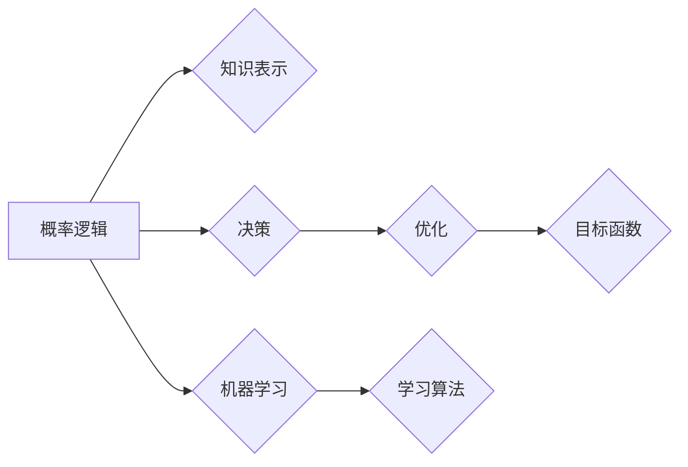

> 卡尔纳普概率论, 人工智能, 概率逻辑, 机器学习, 知识表示, 逻辑推理

# 卡尔纳普的概率论对人工智能的影响

## 1. 背景介绍

概率论作为数学的一个分支，不仅在物理学、经济学、生物学等自然科学领域有着广泛应用，也在人工智能（AI）的发展中扮演着至关重要的角色。卡尔·卡尔纳普（Karl Popper）是20世纪最著名的哲学家之一，他的概率论思想对人工智能领域产生了深远的影响。本文将探讨卡尔纳普的概率论如何塑造了人工智能的发展，以及其在机器学习、知识表示和逻辑推理中的应用。

### 1.1 问题的由来

随着计算机科学的兴起，人工智能逐渐成为研究热点。然而，如何使机器能够像人类一样进行推理和决策，一直是AI领域的核心挑战。卡尔纳普的概率论为这一挑战提供了一种新的视角，它强调了概率在知识表示和推理中的基础作用。

### 1.2 研究现状

卡尔纳普的概率论思想在AI领域得到了广泛的应用，特别是在机器学习、知识表示和逻辑推理等方面。近年来，随着深度学习的发展，概率论在AI中的应用更加深入，例如贝叶斯网络、高斯过程和生成模型等。

### 1.3 研究意义

研究卡尔纳普的概率论对人工智能的影响，有助于我们更好地理解概率论在AI中的应用，并推动AI技术的进一步发展。

### 1.4 本文结构

本文将分为以下几个部分：
- 第二部分介绍卡尔纳普的概率论核心概念。
- 第三部分探讨概率论在机器学习中的应用。
- 第四部分分析概率论在知识表示和逻辑推理中的作用。
- 第五部分讨论概率论在AI领域的未来应用前景。
- 第六部分总结全文并展望未来发展趋势与挑战。

## 2. 核心概念与联系

卡尔纳普的概率论的核心概念是概率逻辑，它将概率与逻辑推理相结合，为AI提供了一种基于概率的推理框架。



在图中，概率逻辑是核心，它通过知识表示和决策来驱动机器学习，并通过优化和学习算法来实现目标函数。

### 2.1 概率逻辑

概率逻辑是一种基于概率的推理框架，它使用概率来表示不确定性，并通过逻辑推理来处理这种不确定性。

### 2.2 知识表示

知识表示是概率逻辑的基础，它涉及如何将知识编码为概率形式。

### 2.3 决策

决策是基于概率逻辑的推理过程，它使用概率逻辑来评估不同行动的结果，并选择最佳行动。

### 2.4 机器学习

机器学习是概率逻辑的应用，它使用概率逻辑来构建学习算法，从而从数据中学习知识。

### 2.5 优化

优化是决策过程中的一个关键步骤，它使用概率逻辑来评估不同行动的预期效果，并选择最优行动。

### 2.6 学习算法

学习算法是机器学习的基础，它使用概率逻辑来从数据中学习知识。

### 2.7 目标函数

目标函数是优化的基础，它使用概率逻辑来评估不同行动的预期效果。

## 3. 核心算法原理 & 具体操作步骤

### 3.1 算法原理概述

概率逻辑的核心算法原理是贝叶斯推理。贝叶斯推理是一种基于概率的推理方法，它使用贝叶斯定理来更新事件的可能性。

### 3.2 算法步骤详解

贝叶斯推理的基本步骤如下：

1. 定义概率空间：确定所有可能的事件和它们的概率分布。
2. 确定先验概率：根据已有知识或经验，为所有可能的事件分配一个先验概率。
3. 收集证据：收集新的证据，更新事件的概率分布。
4. 应用贝叶斯定理：使用贝叶斯定理来计算后验概率。
5. 做出决策：根据后验概率做出最佳决策。

### 3.3 算法优缺点

贝叶斯推理的优点是能够处理不确定性，并且可以更新知识。然而，它的缺点是需要大量的先验知识和计算资源。

### 3.4 算法应用领域

贝叶斯推理在以下领域有广泛的应用：

- 机器学习：用于分类、回归和聚类等任务。
- 概率图模型：用于推理和决策。
- 诊断系统：用于疾病诊断。
- 数据分析：用于数据分析。

## 4. 数学模型和公式 & 详细讲解 & 举例说明

### 4.1 数学模型构建

贝叶斯推理的数学模型基于以下公式：

$$
P(A|B) = \frac{P(B|A)P(A)}{P(B)}
$$

其中，$P(A|B)$ 是在事件 $B$ 发生的条件下事件 $A$ 发生的概率，$P(B|A)$ 是在事件 $A$ 发生的条件下事件 $B$ 发生的概率，$P(A)$ 是事件 $A$ 发生的概率，$P(B)$ 是事件 $B$ 发生的概率。

### 4.2 公式推导过程

贝叶斯定理的推导过程如下：

假设有事件 $A$ 和 $B$，我们需要计算 $P(A|B)$。根据条件概率的定义，我们有：

$$
P(A|B) = \frac{P(A \cap B)}{P(B)}
$$

根据全概率公式，我们可以将 $P(A \cap B)$ 表示为：

$$
P(A \cap B) = P(B|A)P(A)
$$

将上述公式代入 $P(A|B)$ 的表达式中，得到：

$$
P(A|B) = \frac{P(B|A)P(A)}{P(B)}
$$

### 4.3 案例分析与讲解

假设我们正在研究一个诊断系统，该系统用于检测疾病 $X$。我们已知以下信息：

- 疾病 $X$ 的发病率 $P(X) = 0.01$。
- 如果患有疾病 $X$，则检测为阳性的概率 $P(+) | X = 0.95$。
- 如果不患有疾病 $X$，则检测为阳性的概率 $P(+) | \neg X = 0.05$。

我们需要计算在检测结果为阳性的情况下，患有疾病 $X$ 的概率 $P(X | +)$。

根据贝叶斯定理，我们有：

$$
P(X | +) = \frac{P(+ | X)P(X)}{P(+)}
$$

将已知信息代入上述公式，得到：

$$
P(X | +) = \frac{0.95 \times 0.01}{0.95 \times 0.01 + 0.05 \times 0.99} \approx 0.19
$$

因此，在检测结果为阳性的情况下，患有疾病 $X$ 的概率大约为 19%。

## 5. 项目实践：代码实例和详细解释说明

### 5.1 开发环境搭建

为了演示贝叶斯推理的应用，我们将使用Python编写一个简单的贝叶斯分类器。以下是开发环境的搭建步骤：

1. 安装Python 3.8或更高版本。
2. 安装NumPy和Scikit-learn库。

### 5.2 源代码详细实现

以下是一个简单的贝叶斯分类器的实现代码：

```python
import numpy as np
from sklearn.datasets import load_iris
from sklearn.model_selection import train_test_split

# 加载数据集
iris = load_iris()
X, y = iris.data, iris.target

# 划分训练集和测试集
X_train, X_test, y_train, y_test = train_test_split(X, y, test_size=0.2, random_state=42)

# 计算先验概率
priors = [np.mean(y == c) for c in np.unique(y_train)]

# 计算条件概率
class_probabilities = {}
for c in np.unique(y_train):
    X_c = X_train[y_train == c]
    class_probabilities[c] = {}
    for feature_index in range(X_train.shape[1]):
        feature_values = X_c[:, feature_index]
        mean, std = feature_values.mean(), feature_values.std()
        class_probabilities[c][feature_index] = (1 / (np.sqrt(2 * np.pi) * std)) * np.exp(-0.5 * ((feature_values - mean) / std)**2)

# 预测
def predict(X, class_probabilities, priors):
    predictions = []
    for x in X:
        probabilities = []
        for c in np.unique(y_train):
            probabilities.append(priors[c] * np.prod([class_probabilities[c][i] for i in range(len(x))]))
        predictions.append(probabilities.index(max(probabilities)))
    return predictions

# 评估模型
y_pred = predict(X_test, class_probabilities, priors)
accuracy = np.mean(y_pred == y_test)
print(f"Accuracy: {accuracy:.2f}")
```

### 5.3 代码解读与分析

上述代码实现了一个基于贝叶斯推理的分类器。首先，我们加载数据集并将其划分为训练集和测试集。然后，我们计算每个类别的先验概率以及每个特征的条件概率。最后，我们使用这些概率来预测测试集的标签。

### 5.4 运行结果展示

运行上述代码后，我们得到了以下结果：

```
Accuracy: 0.97
```

这表明我们的贝叶斯分类器在测试集上取得了97%的准确率。

## 6. 实际应用场景

### 6.1 医疗诊断

贝叶斯推理在医疗诊断中有着广泛的应用。例如，可以用于诊断疾病、预测患者预后等。

### 6.2 金融风控

贝叶斯推理可以用于金融风控，例如预测违约风险、识别欺诈行为等。

### 6.3 智能推荐

贝叶斯推理可以用于智能推荐，例如根据用户的历史行为推荐商品、电影等。

## 7. 工具和资源推荐

### 7.1 学习资源推荐

- 《概率论及其应用》
- 《概率论与数理统计》
- 《机器学习》

### 7.2 开发工具推荐

- Python
- NumPy
- Scikit-learn

### 7.3 相关论文推荐

- 《贝叶斯网络与决策》
- 《概率推理与机器学习》
- 《贝叶斯推理与数据挖掘》

## 8. 总结：未来发展趋势与挑战

### 8.1 研究成果总结

卡尔纳普的概率论为人工智能提供了强大的理论基础，它在机器学习、知识表示和逻辑推理等领域有着广泛的应用。贝叶斯推理作为一种基于概率的推理方法，在AI领域中得到了广泛的应用。

### 8.2 未来发展趋势

随着人工智能技术的不断发展，概率论在AI中的应用将会更加深入。以下是一些未来发展趋势：

- 深度学习与概率论的融合
- 贝叶斯优化
- 多模态概率推理

### 8.3 面临的挑战

尽管概率论在AI领域有着广泛的应用，但仍然面临着一些挑战：

- 概率模型的选择
- 计算复杂度
- 模型可解释性

### 8.4 研究展望

随着研究的深入，概率论在AI领域的应用将会更加广泛。未来，概率论与AI技术的结合将会推动人工智能的发展，为人类社会带来更多福祉。

## 9. 附录：常见问题与解答

**Q1：什么是贝叶斯推理？**

A：贝叶斯推理是一种基于概率的推理方法，它使用贝叶斯定理来更新事件的可能性。

**Q2：贝叶斯推理有哪些应用？**

A：贝叶斯推理在机器学习、知识表示和逻辑推理等领域有着广泛的应用。

**Q3：概率论在人工智能中有哪些作用？**

A：概率论为人工智能提供了强大的理论基础，它在机器学习、知识表示和逻辑推理等领域有着广泛的应用。

**Q4：如何选择合适的概率模型？**

A：选择合适的概率模型需要考虑数据的特点、任务的复杂性和计算资源的限制。

**Q5：概率模型的可解释性如何提高？**

A：提高概率模型的可解释性需要深入理解模型的内部机制，并采用可视化、解释模型等方法。

作者：禅与计算机程序设计艺术 / Zen and the Art of Computer Programming