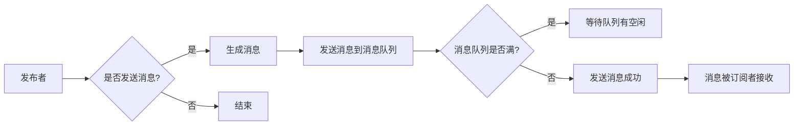

> 发布订阅模式,消息队列,事件驱动,系统架构,微服务,异步通信,消息传递

# 发布订阅 原理与代码实例讲解

## 1. 背景介绍

发布订阅模式是一种在软件架构中用于实现消息传递和通信的模式。它允许消息的生产者不需要知道消息的消费者，同样，消费者也不需要知道生产者的存在。这种解耦的特性使得发布订阅模式在构建可扩展、高可用性的系统时变得非常流行。

### 1.1 问题的由来

在传统的点对点通信模式下，消息的生产者需要知道消费者的地址和通信协议，这使得系统耦合度高，扩展性差。随着互联网应用的发展，需要处理的数据量和用户数量呈指数级增长，传统的通信方式已无法满足需求。发布订阅模式应运而生，通过引入消息队列和中间件，实现了生产者和消费者之间的松耦合。

### 1.2 研究现状

发布订阅模式已经在多个领域得到广泛应用，包括社交媒体、即时通讯、电子商务、物联网等。常见的消息队列系统有RabbitMQ、Kafka、ActiveMQ等。这些系统提供了丰富的功能，如消息持久化、消息分发、消息过滤、死信队列等。

### 1.3 研究意义

发布订阅模式具有以下优势：
- 解耦：生产者和消费者之间的解耦，提高了系统的灵活性。
- 扩展性：易于水平扩展，可以应对高并发场景。
- 可靠性：消息持久化和死信队列机制保证了消息传递的可靠性。
- 异步处理：支持异步通信，提高了系统的吞吐量。

### 1.4 本文结构

本文将围绕发布订阅模式展开，包括以下内容：
- 核心概念与联系
- 核心算法原理与具体操作步骤
- 数学模型和公式
- 项目实践
- 实际应用场景
- 工具和资源推荐
- 总结：未来发展趋势与挑战

## 2. 核心概念与联系

### 2.1 核心概念

- **发布者(Publisher)**: 发送消息的对象，它不需要知道消息会被哪些订阅者接收。
- **订阅者(Subscriber)**: 接收消息的对象，它可以订阅多个主题。
- **主题(Subject)**: 消息的分类，发布者和订阅者通过主题进行消息的发布和订阅。
- **消息队列(Message Queue)**: 用于存储消息的缓冲区，消息在生产者和消费者之间传递时，会被暂时存储在消息队列中。

### 2.2 Mermaid 流程图



### 2.3 联系

发布订阅模式中，发布者生成消息后，将消息发送到消息队列。消息队列将消息存储起来，等待订阅者来消费。订阅者可以从消息队列中取出消息并处理。整个过程中，发布者和消费者之间没有直接的交互，实现了解耦。

## 3. 核心算法原理 & 具体操作步骤

### 3.1 算法原理概述

发布订阅模式的核心原理是消息队列。消息队列负责接收生产者的消息，并将其存储起来，直到有消费者订阅相关主题并取出消息进行处理。

### 3.2 算法步骤详解

1. **初始化消息队列**：创建消息队列，用于存储消息。
2. **发布者发布消息**：发布者生成消息，并将其发送到消息队列。
3. **订阅者订阅主题**：订阅者指定要订阅的主题，并等待消息队列中的消息。
4. **消息队列处理消息**：当有消息到达消息队列时，队列会将其分发给订阅该主题的消费者。
5. **消费者消费消息**：消费者从消息队列中取出消息并进行处理。

### 3.3 算法优缺点

**优点**：
- 解耦：发布者和消费者之间解耦，提高了系统的灵活性。
- 扩展性：易于水平扩展，可以应对高并发场景。
- 可靠性：消息持久化和死信队列机制保证了消息传递的可靠性。
- 异步处理：支持异步通信，提高了系统的吞吐量。

**缺点**：
- 复杂性：需要维护消息队列和订阅者之间的关系。
- 延迟：消息在队列中可能存在延迟。
- 资源消耗：消息队列需要消耗存储资源。

### 3.4 算法应用领域

发布订阅模式适用于以下场景：
- 系统解耦：降低系统组件之间的耦合度。
- 异步通信：实现异步通信，提高系统吞吐量。
- 高并发：应对高并发场景，提高系统性能。
- 分布式系统：在分布式系统中实现消息传递。

## 4. 数学模型和公式

发布订阅模式的数学模型可以用以下公式表示：

```
P: 发布者
S: 订阅者
T: 主题
M: 消息

P -> M: 发布者发布消息到主题 T
S <- M: 订阅者从主题 T 接收消息
```

## 5. 项目实践：代码实例和详细解释说明

### 5.1 开发环境搭建

以下是使用Python和RabbitMQ进行发布订阅模式实践的步骤：

1. 安装RabbitMQ：从官网下载并安装RabbitMQ。
2. 安装Python开发环境：安装Python和pip。
3. 安装RabbitMQ Python客户端：`pip install pika`。

### 5.2 源代码详细实现

**生产者代码**：

```python
import pika

# 连接到RabbitMQ服务器
connection = pika.BlockingConnection(pika.ConnectionParameters('localhost'))
channel = connection.channel()

# 声明队列
channel.queue_declare(queue='task_queue', durable=True)

# 发送消息
for method_frame, properties, body in channel.consume('task_queue', auto_ack=True):
    print(f" [x] Received {body}")
    # 模拟处理消息
    print("Task received...")
    print(f" [x] Done")
    break

# 关闭连接
connection.close()
```

**消费者代码**：

```python
import pika

# 连接到RabbitMQ服务器
connection = pika.BlockingConnection(pika.ConnectionParameters('localhost'))
channel = connection.channel()

# 定义回调函数
def callback(ch, method, properties, body):
    print(f" [x] Received {body}")
    # 模拟处理消息
    print("Task received...")
    print(f" [x] Done")

# 声明队列
channel.queue_declare(queue='task_queue', durable=True)

# 消费消息
channel.basic_consume(queue='task_queue', on_message_callback=callback, auto_ack=True)

print(' [*] Waiting for messages. To exit press CTRL+C')
channel.start_consuming()
```

### 5.3 代码解读与分析

- 生产者代码：连接到RabbitMQ服务器，声明一个持久化的队列，然后循环发送消息。
- 消费者代码：连接到RabbitMQ服务器，声明队列，并设置回调函数，等待接收消息。

通过上述代码，我们可以看到发布订阅模式的实现过程。生产者发送消息到队列，消费者从队列中接收消息并进行处理。

### 5.4 运行结果展示

运行生产者代码，可以看到控制台输出消息内容。运行消费者代码，可以看到控制台输出接收到消息的信息。

## 6. 实际应用场景

### 6.1 微服务架构

在微服务架构中，各个服务之间需要通过消息队列进行通信。发布订阅模式可以实现服务之间的异步解耦，提高系统的可扩展性和可靠性。

### 6.2 订单处理系统

在订单处理系统中，当用户提交订单后，系统会通过消息队列将订单信息发送给支付系统、库存系统等。各个系统在接收到订单信息后，可以异步处理订单，提高系统性能。

### 6.3 实时消息系统

在实时消息系统中，可以使用发布订阅模式实现用户之间的实时通信。例如，当用户发送消息时，消息会被发送到消息队列，然后被所有订阅了该主题的用户接收。

## 7. 工具和资源推荐

### 7.1 学习资源推荐

- 《RabbitMQ官方文档》：RabbitMQ官方文档提供了详细的教程和API文档。
- 《Kafka官方文档》：Kafka官方文档提供了详细的教程和API文档。
- 《Apache ActiveMQ官方文档》：ActiveMQ官方文档提供了详细的教程和API文档。

### 7.2 开发工具推荐

- RabbitMQ：一个开源的消息队列系统，支持多种编程语言。
- Kafka：一个高性能、可扩展、可分区、可复制的消息队列系统。
- ActiveMQ：一个开源的消息队列系统，支持多种协议和语言。

### 7.3 相关论文推荐

- 《Message Queuing: The Next Generation of Messaging》
- 《Kafka: A Distributed Streaming Platform》
- 《The Design of the Apache ActiveMQ Message Broker》

## 8. 总结：未来发展趋势与挑战

### 8.1 研究成果总结

发布订阅模式是一种在软件架构中用于实现消息传递和通信的模式。它具有解耦、扩展性、可靠性和异步处理等优点，在多个领域得到广泛应用。

### 8.2 未来发展趋势

- 消息队列系统的性能和可靠性将进一步提升。
- 消息队列系统将支持更多的编程语言和协议。
- 消息队列系统将与其他中间件（如服务网格）进行集成。

### 8.3 面临的挑战

- 消息队列系统的性能瓶颈。
- 消息队列系统的安全性。
- 消息队列系统的可维护性。

### 8.4 研究展望

未来，发布订阅模式将继续发展，并与其他技术进行融合，为构建更高效、可靠的系统提供支持。

## 9. 附录：常见问题与解答

**Q1：发布订阅模式与传统消息队列有什么区别？**

A: 传统消息队列是一种点对点的通信方式，而发布订阅模式是一种广播式的通信方式。在发布订阅模式中，消息可以被多个消费者订阅，而在传统消息队列中，消息只能被一个消费者消费。

**Q2：发布订阅模式适用于哪些场景？**

A: 发布订阅模式适用于需要解耦、高扩展性、可靠性和异步处理的场景，如微服务架构、实时消息系统等。

**Q3：如何选择合适的消息队列系统？**

A: 选择合适的消息队列系统需要考虑以下因素：性能、可靠性、可扩展性、易用性、社区支持等。

**Q4：如何保证消息队列系统的安全性？**

A: 可以通过以下措施保证消息队列系统的安全性：访问控制、数据加密、消息签名等。

**Q5：如何解决消息队列系统的性能瓶颈？**

A: 可以通过以下措施解决消息队列系统的性能瓶颈：垂直扩展、水平扩展、负载均衡、缓存等。

作者：禅与计算机程序设计艺术 / Zen and the Art of Computer Programming