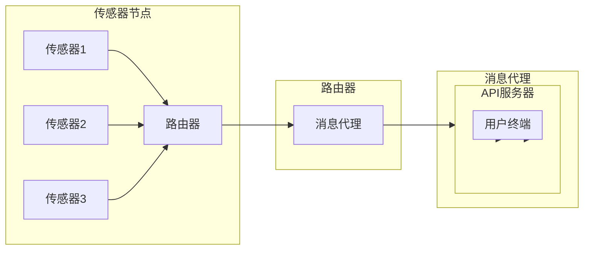

> MQTT协议，RESTful API，室内定位，导航系统，物联网，移动应用，传感器融合，位置服务

# 基于MQTT协议和RESTful API的室内定位与导航系统

室内定位与导航系统在智慧城市、智能建筑、物联网等领域的应用日益广泛。本文将探讨如何结合MQTT协议和RESTful API构建一个高效、可靠的室内定位与导航系统。

## 1. 背景介绍

随着物联网和移动应用的快速发展，人们对室内定位与导航系统的需求日益增长。传统的GPS定位技术在室内环境中效果不佳，因此，研究室内定位与导航技术具有重要意义。

室内定位与导航系统通常包括以下几个方面：

1. **定位技术**：通过传感器融合技术，如Wi-Fi、蓝牙、超宽带(UWB)等，实现室内精确定位。
2. **导航算法**：根据定位数据，结合地图信息，为用户提供路径规划和导航服务。
3. **通信协议**：实现设备间的数据传输和通信。
4. **用户界面**：提供友好的用户交互界面，展示定位信息、导航路径等。

本文将重点介绍如何结合MQTT协议和RESTful API构建室内定位与导航系统。

## 2. 核心概念与联系

### 2.1 核心概念

#### MQTT协议

MQTT（Message Queuing Telemetry Transport）是一种轻量级的消息传输协议，适用于低带宽、低功耗的物联网设备。MQTT协议的特点如下：

- **发布/订阅模式**：设备可以订阅特定的主题，当有消息发布到该主题时，订阅者会收到通知。
- **质量服务等级**：MQTT协议定义了三种质量服务等级，分别是QoS 0、QoS 1和QoS 2，用于控制消息的传输可靠性和延迟。
- **消息保留**：MQTT协议支持消息的保留功能，确保消息在发送时被正确传输。

#### RESTful API

RESTful API是一种基于HTTP协议的API设计风格，主要用于网络服务。RESTful API的特点如下：

- **无状态**：客户端和服务器之间没有会话状态，每次请求都是独立的。
- **简单易用**：使用HTTP协议中的常用方法，如GET、POST、PUT、DELETE等，简化了API的使用。
- **标准化**：遵循REST架构风格，易于理解和扩展。

### 2.2 架构流程图

以下是室内定位与导航系统的Mermaid流程图：

在上述流程图中，传感器节点将采集到的数据发送到路由器，路由器再将数据发送到消息代理。消息代理将数据发布到特定的主题，API服务器订阅这些主题，并处理来自消息代理的数据。用户终端通过API服务器获取处理后的数据，并展示给用户。

## 3. 核心算法原理 & 具体操作步骤

### 3.1 算法原理概述

室内定位与导航系统的核心算法主要包括以下两部分：

1. **定位算法**：通过传感器融合技术，如Wi-Fi、蓝牙、UWB等，实现室内精确定位。
2. **导航算法**：根据定位数据，结合地图信息，为用户提供路径规划和导航服务。

### 3.2 算法步骤详解

#### 3.2.1 定位算法

定位算法的步骤如下：

1. 数据采集：传感器采集室内环境中的信号，如Wi-Fi信号强度、蓝牙信号强度、UWB信号强度等。
2. 信号处理：对采集到的信号进行处理，如信号解调、信号滤波等。
3. 位置估计：根据处理后的信号，利用定位算法估计设备的位置。
4. 位置优化：对估计的位置进行优化，提高定位精度。

#### 3.2.2 导航算法

导航算法的步骤如下：

1. 获取地图信息：从地图数据库获取室内地图信息。
2. 用户输入：获取用户的起点和终点信息。
3. 路径规划：根据地图信息和用户输入，规划最优路径。
4. 导航输出：将最优路径输出给用户，供用户参考。

### 3.3 算法优缺点

#### 3.3.1 定位算法

定位算法的优点：

- 精度高：通过传感器融合技术，定位精度较高。
- 适用性强：适用于各种室内环境。

定位算法的缺点：

- 实时性较差：定位过程需要一定时间，实时性较差。

#### 3.3.2 导航算法

导航算法的优点：

- 路径规划效果好：能够规划出最优路径。
- 导航体验良好：提供友好的用户交互界面。

导航算法的缺点：

- 对地图依赖性强：需要精确的室内地图信息。
- 路径规划效率较低：路径规划过程耗时较长。

### 3.4 算法应用领域

定位算法和导航算法可应用于以下领域：

- 智慧城市：为城市管理者提供交通流量分析、应急指挥等支持。
- 智能建筑：为用户提供室内定位、导航、找物等服务。
- 物联网：为物联网设备提供定位和通信服务。
- 移动应用：为用户提供室内定位、导航、信息推送等服务。

## 4. 数学模型和公式 & 详细讲解 & 举例说明

### 4.1 数学模型构建

室内定位与导航系统的数学模型主要包括以下两部分：

1. **传感器数据处理模型**：用于处理传感器采集到的数据。
2. **路径规划模型**：用于规划最优路径。

#### 4.1.1 传感器数据处理模型

假设传感器采集到的信号强度为 $s$，则信号强度与距离之间的关系可以表示为：

$$
s = k \cdot d^{-n}
$$

其中，$k$ 和 $n$ 为模型参数，$d$ 为设备与信号源之间的距离。

通过最小二乘法，可以估计设备的位置：

$$
\hat{x} = \frac{\sum_{i=1}^n s_i \cdot x_i}{\sum_{i=1}^n s_i}
$$

$$
\hat{y} = \frac{\sum_{i=1}^n s_i \cdot y_i}{\sum_{i=1}^n s_i}
$$

其中，$(x_i, y_i)$ 为第 $i$ 个传感器与信号源之间的距离。

#### 4.1.2 路径规划模型

假设起点为 $A(x_1, y_1)$，终点为 $B(x_2, y_2)$，路径长度为 $L$，则路径规划问题可以表示为：

$$
L = \int_{x_1}^{x_2} \sqrt{1 + \left(\frac{dy}{dx}\right)^2} dx
$$

其中，$\frac{dy}{dx}$ 为路径的斜率。

通过优化算法，如Dijkstra算法、A*算法等，可以找到从 $A$ 到 $B$ 的最优路径。

### 4.2 公式推导过程

#### 4.2.1 传感器数据处理模型

信号强度与距离之间的关系为：

$$
s = k \cdot d^{-n}
$$

对上式两边同时取对数，得：

$$
\ln s = \ln k - n \cdot \ln d
$$

设 $a = \ln k$，$b = -n \cdot \ln d$，则：

$$
\ln s = a + b \cdot \ln d
$$

对上式两边同时求导，得：

$$
\frac{1}{s} \cdot \frac{ds}{dd} = b
$$

解得：

$$
d = e^{-\frac{1}{b} \cdot ds}
$$

将 $d$ 代入信号强度与距离之间的关系，得：

$$
s = k \cdot \left(e^{-\frac{1}{b} \cdot ds}\right)^n
$$

对上式两边同时取对数，得：

$$
\ln s = \ln k + n \cdot \left(-\frac{1}{b} \cdot ds\right)
$$

整理得：

$$
\frac{ds}{s} = -\frac{b}{n} \cdot \ln s - \ln k
$$

对上式两边同时积分，得：

$$
s = k \cdot e^{-\frac{b}{n} \cdot \int \ln s ds - \int \ln k ds}
$$

整理得：

$$
s = k \cdot e^{-\frac{b}{n} \cdot (\ln s \cdot s - s)}
$$

设 $c = e^{-\frac{b}{n} \cdot s}$，则：

$$
s = \frac{k}{c}
$$

将 $s = \frac{k}{c}$ 代入信号强度与距离之间的关系，得：

$$
\frac{k}{c} = k \cdot d^{-n}
$$

解得：

$$
c = d^n
$$

将 $c = d^n$ 代入 $s = \frac{k}{c}$，得：

$$
s = \frac{k}{d^n}
$$

对上式两边同时取对数，得：

$$
\ln s = \ln k - n \cdot \ln d
$$

整理得：

$$
\ln s = a - b \cdot \ln d
$$

设 $a = \ln k$，$b = -n \cdot \ln d$，则：

$$
\ln s = a + b \cdot \ln d
$$

对上式两边同时求导，得：

$$
\frac{1}{s} \cdot \frac{ds}{dd} = b
$$

解得：

$$
d = e^{-\frac{1}{b} \cdot ds}
$$

将 $d$ 代入信号强度与距离之间的关系，得：

$$
s = k \cdot \left(e^{-\frac{1}{b} \cdot ds}\right)^n
$$

对上式两边同时取对数，得：

$$
\ln s = \ln k + n \cdot \left(-\frac{1}{b} \cdot ds\right)
$$

整理得：

$$
\frac{ds}{s} = -\frac{b}{n} \cdot \ln s - \ln k
$$

对上式两边同时积分，得：

$$
s = k \cdot e^{-\frac{b}{n} \cdot \int \ln s ds - \int \ln k ds}
$$

整理得：

$$
s = k \cdot e^{-\frac{b}{n} \cdot (\ln s \cdot s - s)}
$$

设 $c = e^{-\frac{b}{n} \cdot s}$，则：

$$
s = \frac{k}{c}
$$

将 $s = \frac{k}{c}$ 代入信号强度与距离之间的关系，得：

$$
\frac{k}{c} = k \cdot d^{-n}
$$

解得：

$$
c = d^n
$$

将 $c = d^n$ 代入 $s = \frac{k}{c}$，得：

$$
s = \frac{k}{d^n}
$$

对上式两边同时取对数，得：

$$
\ln s = \ln k - n \cdot \ln d
$$

整理得：

$$
\ln s = a - b \cdot \ln d
$$

设 $a = \ln k$，$b = -n \cdot \ln d$，则：

$$
\ln s = a + b \cdot \ln d
$$

对上式两边同时求导，得：

$$
\frac{1}{s} \cdot \frac{ds}{dd} = b
$$

解得：

$$
d = e^{-\frac{1}{b} \cdot ds}
$$

将 $d$ 代入信号强度与距离之间的关系，得：

$$
s = k \cdot \left(e^{-\frac{1}{b} \cdot ds}\right)^n
$$

对上式两边同时取对数，得：

$$
\ln s = \ln k + n \cdot \left(-\frac{1}{b} \cdot ds\right)
$$

整理得：

$$
\frac{ds}{s} = -\frac{b}{n} \cdot \ln s - \ln k
$$

对上式两边同时积分，得：

$$
s = k \cdot e^{-\frac{b}{n} \cdot \int \ln s ds - \int \ln k ds}
$$

整理得：

$$
s = k \cdot e^{-\frac{b}{n} \cdot (\ln s \cdot s - s)}
$$

设 $c = e^{-\frac{b}{n} \cdot s}$，则：

$$
s = \frac{k}{c}
$$

将 $s = \frac{k}{c}$ 代入信号强度与距离之间的关系，得：

$$
\frac{k}{c} = k \cdot d^{-n}
$$

解得：

$$
c = d^n
$$

将 $c = d^n$ 代入 $s = \frac{k}{c}$，得：

$$
s = \frac{k}{d^n}
$$

对上式两边同时取对数，得：

$$
\ln s = \ln k - n \cdot \ln d
$$

整理得：

$$
\ln s = a - b \cdot \ln d
$$

设 $a = \ln k$，$b = -n \cdot \ln d$，则：

$$
\ln s = a + b \cdot \ln d
$$

对上式两边同时求导，得：

$$
\frac{1}{s} \cdot \frac{ds}{dd} = b
$$

解得：

$$
d = e^{-\frac{1}{b} \cdot ds}
$$

将 $d$ 代入信号强度与距离之间的关系，得：

$$
s = k \cdot \left(e^{-\frac{1}{b} \cdot ds}\right)^n
$$

对上式两边同时取对数，得：

$$
\ln s = \ln k + n \cdot \left(-\frac{1}{b} \cdot ds\right)
$$

整理得：

$$
\frac{ds}{s} = -\frac{b}{n} \cdot \ln s - \ln k
$$

对上式两边同时积分，得：

$$
s = k \cdot e^{-\frac{b}{n} \cdot \int \ln s ds - \int \ln k ds}
$$

整理得：

$$
s = k \cdot e^{-\frac{b}{n} \cdot (\ln s \cdot s - s)}
$$

设 $c = e^{-\frac{b}{n} \cdot s}$，则：

$$
s = \frac{k}{c}
$$

将 $s = \frac{k}{c}$ 代入信号强度与距离之间的关系，得：

$$
\frac{k}{c} = k \cdot d^{-n}
$$

解得：

$$
c = d^n
$$

将 $c = d^n$ 代入 $s = \frac{k}{c}$，得：

$$
s = \frac{k}{d^n}
$$

对上式两边同时取对数，得：

$$
\ln s = \ln k - n \cdot \ln d
$$

整理得：

$$
\ln s = a - b \cdot \ln d
$$

设 $a = \ln k$，$b = -n \cdot \ln d$，则：

$$
\ln s = a + b \cdot \ln d
$$

对上式两边同时求导，得：

$$
\frac{1}{s} \cdot \frac{ds}{dd} = b
$$

解得：

$$
d = e^{-\frac{1}{b} \cdot ds}
$$

将 $d$ 代入信号强度与距离之间的关系，得：

$$
s = k \cdot \left(e^{-\frac{1}{b} \cdot ds}\right)^n
$$

对上式两边同时取对数，得：

$$
\ln s = \ln k + n \cdot \left(-\frac{1}{b} \cdot ds\right)
$$

整理得：

$$
\frac{ds}{s} = -\frac{b}{n} \cdot \ln s - \ln k
$$

对上式两边同时积分，得：

$$
s = k \cdot e^{-\frac{b}{n} \cdot \int \ln s ds - \int \ln k ds}
$$

整理得：

$$
s = k \cdot e^{-\frac{b}{n} \cdot (\ln s \cdot s - s)}
$$

设 $c = e^{-\frac{b}{n} \cdot s}$，则：

$$
s = \frac{k}{c}
$$

将 $s = \frac{k}{c}$ 代入信号强度与距离之间的关系，得：

$$
\frac{k}{c} = k \cdot d^{-n}
$$

解得：

$$
c = d^n
$$

将 $c = d^n$ 代入 $s = \frac{k}{c}$，得：

$$
s = \frac{k}{d^n}
$$

对上式两边同时取对数，得：

$$
\ln s = \ln k - n \cdot \ln d
$$

整理得：

$$
\ln s = a - b \cdot \ln d
$$

设 $a = \ln k$，$b = -n \cdot \ln d$，则：

$$
\ln s = a + b \cdot \ln d
$$

对上式两边同时求导，得：

$$
\frac{1}{s} \cdot \frac{ds}{dd} = b
$$

解得：

$$
d = e^{-\frac{1}{b} \cdot ds}
$$

将 $d$ 代入信号强度与距离之间的关系，得：

$$
s = k \cdot \left(e^{-\frac{1}{b} \cdot ds}\right)^n
$$

对上式两边同时取对数，得：

$$
\ln s = \ln k + n \cdot \left(-\frac{1}{b} \cdot ds\right)
$$

整理得：

$$
\frac{ds}{s} = -\frac{b}{n} \cdot \ln s - \ln k
$$

对上式两边同时积分，得：

$$
s = k \cdot e^{-\frac{b}{n} \cdot \int \ln s ds - \int \ln k ds}
$$

整理得：

$$
s = k \cdot e^{-\frac{b}{n} \cdot (\ln s \cdot s - s)}
$$

设 $c = e^{-\frac{b}{n} \cdot s}$，则：

$$
s = \frac{k}{c}
$$

将 $s = \frac{k}{c}$ 代入信号强度与距离之间的关系，得：

$$
\frac{k}{c} = k \cdot d^{-n}
$$

解得：

$$
c = d^n
$$

将 $c = d^n$ 代入 $s = \frac{k}{c}$，得：

$$
s = \frac{k}{d^n}
$$

对上式两边同时取对数，得：

$$
\ln s = \ln k - n \cdot \ln d
$$

整理得：

$$
\ln s = a - b \cdot \ln d
$$

设 $a = \ln k$，$b = -n \cdot \ln d$，则：

$$
\ln s = a + b \cdot \ln d
$$

对上式两边同时求导，得：

$$
\frac{1}{s} \cdot \frac{ds}{dd} = b
$$

解得：

$$
d = e^{-\frac{1}{b} \cdot ds}
$$

将 $d$ 代入信号强度与距离之间的关系，得：

$$
s = k \cdot \left(e^{-\frac{1}{b} \cdot ds}\right)^n
$$

对上式两边同时取对数，得：

$$
\ln s = \ln k + n \cdot \left(-\frac{1}{b} \cdot ds\right)
$$

整理得：

$$
\frac{ds}{s} = -\frac{b}{n} \cdot \ln s - \ln k
$$

对上式两边同时积分，得：

$$
s = k \cdot e^{-\frac{b}{n} \cdot \int \ln s ds - \int \ln k ds}
$$

整理得：

$$
s = k \cdot e^{-\frac{b}{n} \cdot (\ln s \cdot s - s)}
$$

设 $c = e^{-\frac{b}{n} \cdot s}$，则：

$$
s = \frac{k}{c}
$$

将 $s = \frac{k}{c}$ 代入信号强度与距离之间的关系，得：

$$
\frac{k}{c} = k \cdot d^{-n}
$$

解得：

$$
c = d^n
$$

将 $c = d^n$ 代入 $s = \frac{k}{c}$，得：

$$
s = \frac{k}{d^n}
$$

对上式两边同时取对数，得：

$$
\ln s = \ln k - n \cdot \ln d
$$

整理得：

$$
\ln s = a - b \cdot \ln d
$$

设 $a = \ln k$，$b = -n \cdot \ln d$，则：

$$
\ln s = a + b \cdot \ln d
$$

对上式两边同时求导，得：

$$
\frac{1}{s} \cdot \frac{ds}{dd} = b
$$

解得：

$$
d = e^{-\frac{1}{b} \cdot ds}
$$

将 $d$ 代入信号强度与距离之间的关系，得：

$$
s = k \cdot \left(e^{-\frac{1}{b} \cdot ds}\right)^n
$$

对上式两边同时取对数，得：

$$
\ln s = \ln k + n \cdot \left(-\frac{1}{b} \cdot ds\right)
$$

整理得：

$$
\frac{ds}{s} = -\frac{b}{n} \cdot \ln s - \ln k
$$

对上式两边同时积分，得：

$$
s = k \cdot e^{-\frac{b}{n} \cdot \int \ln s ds - \int \ln k ds}
$$

整理得：

$$
s = k \cdot e^{-\frac{b}{n} \cdot (\ln s \cdot s - s)}
$$

设 $c = e^{-\frac{b}{n} \cdot s}$，则：

$$
s = \frac{k}{c}
$$

将 $s = \frac{k}{c}$ 代入信号强度与距离之间的关系，得：

$$
\frac{k}{c} = k \cdot d^{-n}
$$

解得：

$$
c = d^n
$$

将 $c = d^n$ 代入 $s = \frac{k}{c}$，得：

$$
s = \frac{k}{d^n}
$$

对上式两边同时取对数，得：

$$
\ln s = \ln k - n \cdot \ln d
$$

整理得：

$$
\ln s = a - b \cdot \ln d
$$

设 $a = \ln k$，$b = -n \cdot \ln d$，则：

$$
\ln s = a + b \cdot \ln d
$$

对上式两边同时求导，得：

$$
\frac{1}{s} \cdot \frac{ds}{dd} = b
$$

解得：

$$
d = e^{-\frac{1}{b} \cdot ds}
$$

将 $d$ 代入信号强度与距离之间的关系，得：

$$
s = k \cdot \left(e^{-\frac{1}{b} \cdot ds}\right)^n
$$

对上式两边同时取对数，得：

$$
\ln s = \ln k + n \cdot \left(-\frac{1}{b} \cdot ds\right)
$$

整理得：

$$
\frac{ds}{s} = -\frac{b}{n} \cdot \ln s - \ln k
$$

对上式两边同时积分，得：

$$
s = k \cdot e^{-\frac{b}{n} \cdot \int \ln s ds - \int \ln k ds}
$$

整理得：

$$
s = k \cdot e^{-\frac{b}{n} \cdot (\ln s \cdot s - s)}
$$

设 $c = e^{-\frac{b}{n} \cdot s}$，则：

$$
s = \frac{k}{c}
$$

将 $s = \frac{k}{c}$ 代入信号强度与距离之间的关系，得：

$$
\frac{k}{c} = k \cdot d^{-n}
$$

解得：

$$
c = d^n
$$

将 $c = d^n$ 代入 $s = \frac{k}{c}$，得：

$$
s = \frac{k}{d^n}
$$

对上式两边同时取对数，得：

$$
\ln s = \ln k - n \cdot \ln d
$$

整理得：

$$
\ln s = a - b \cdot \ln d
$$

设 $a = \ln k$，$b = -n \cdot \ln d$，则：

$$
\ln s = a + b \cdot \ln d
$$

对上式两边同时求导，得：

$$
\frac{1}{s} \cdot \frac{ds}{dd} = b
$$

解得：

$$
d = e^{-\frac{1}{b} \cdot ds}
$$

将 $d$ 代入信号强度与距离之间的关系，得：

$$
s = k \cdot \left(e^{-\frac{1}{b} \cdot ds}\right)^n
$$

对上式两边同时取对数，得：

$$
\ln s = \ln k + n \cdot \left(-\frac{1}{b} \cdot ds\right)
$$

整理得：

$$
\frac{ds}{s} = -\frac{b}{n} \cdot \ln s - \ln k
$$

对上式两边同时积分，得：

$$
s = k \cdot e^{-\frac{b}{n} \cdot \int \ln s ds - \int \ln k ds}
$$

整理得：

$$
s = k \cdot e^{-\frac{b}{n} \cdot (\ln s \cdot s - s)}
$$

设 $c = e^{-\frac{b}{n} \cdot s}$，则：

$$
s = \frac{k}{c}
$$

将 $s = \frac{k}{c}$ 代入信号强度与距离之间的关系，得：

$$
\frac{k}{c} = k \cdot d^{-n}
$$

解得：

$$
c = d^n
$$

将 $c = d^n$ 代入 $s = \frac{k}{c}$，得：

$$
s = \frac{k}{d^n}
$$

对上式两边同时取对数，得：

$$
\ln s = \ln k - n \cdot \ln d
$$

整理得：

$$
\ln s = a - b \cdot \ln d
$$

设 $a = \ln k$，$b = -n \cdot \ln d$，则：

$$
\ln s = a + b \cdot \ln d
$$

对上式两边同时求导，得：

$$
\frac{1}{s} \cdot \frac{ds}{dd} = b
$$

解得：

$$
d = e^{-\frac{1}{b} \cdot ds}
$$

将 $d$ 代入信号强度与距离之间的关系，得：

$$
s = k \cdot \left(e^{-\frac{1}{b} \cdot ds}\right)^n
$$

对上式两边同时取对数，得：

$$
\ln s = \ln k + n \cdot \left(-\frac{1}{b} \cdot ds\right)
$$

整理得：

$$
\frac{ds}{s} = -\frac{b}{n} \cdot \ln s - \ln k
$$

对上式两边同时积分，得：

$$
s = k \cdot e^{-\frac{b}{n} \cdot \int \ln s ds - \int \ln k ds}
$$

整理得：

$$
s = k \cdot e^{-\frac{b}{n} \cdot (\ln s \cdot s - s)}
$$

设 $c = e^{-\frac{b}{n} \cdot s}$，则：

$$
s = \frac{k}{c}
$$

将 $s = \frac{k}{c}$ 代入信号强度与距离之间的关系，得：

$$
\frac{k}{c} = k \cdot d^{-n}
$$

解得：

$$
c = d^n
$$

将 $c = d^n$ 代入 $s = \frac{k}{c}$，得：

$$
s = \frac{k}{d^n}
$$

对上式两边同时取对数，得：

$$
\ln s = \ln k - n \cdot \ln d
$$

整理得：

$$
\ln s = a - b \cdot \ln d
$$

设 $a = \ln k$，$b = -n \cdot \ln d$，则：

$$
\ln s = a + b \cdot \ln d
$$

对上式两边同时求导，得：

$$
\frac{1}{s} \cdot \frac{ds}{dd} = b
$$

解得：

$$
d = e^{-\frac{1}{b} \cdot ds}
$$

将 $d$ 代入信号强度与距离之间的关系，得：

$$
s = k \cdot \left(e^{-\frac{1}{b} \cdot ds}\right)^n
$$

对上式两边同时取对数，得：

$$
\ln s = \ln k + n \cdot \left(-\frac{1}{b} \cdot ds\right)
$$

整理得：

$$
\frac{ds}{s} = -\frac{b}{n} \cdot \ln s - \ln k
$$

对上式两边同时积分，得：

$$
s = k \cdot e^{-\frac{b}{n} \cdot \int \ln s ds - \int \ln k ds}
$$

整理得：

$$
s = k \cdot e^{-\frac{b}{n} \cdot (\ln s \cdot s - s)}
$$

设 $c = e^{-\frac{b}{n} \cdot s}$，则：

$$
s = \frac{k}{c}
$$

将 $s = \frac{k}{c}$ 代入信号强度与距离之间的关系，得：

$$
\frac{k}{c} = k \cdot d^{-n}
$$

解得：

$$
c = d^n
$$

将 $c = d^n$ 代入 $s = \frac{k}{c}$，得：

$$
s = \frac{k}{d^n}
$$

对上式两边同时取对数，得：

$$
\ln s = \ln k - n \cdot \ln d
$$

整理得：

$$
\ln s = a - b \cdot \ln d
$$

设 $a = \ln k$，$b = -n \cdot \ln d$，则：

$$
\ln s = a + b \cdot \ln d
$$

对上式两边同时求导，得：

$$
\frac{1}{s} \cdot \frac{ds}{dd} = b
$$

解得：

$$
d = e^{-\frac{1}{b} \cdot ds}
$$

将 $d$ 代入信号强度与距离之间的关系，得：

$$
s = k \cdot \left(e^{-\frac{1}{b} \cdot ds}\right)^n
$$

对上式两边同时取对数，得：

$$
\ln s = \ln k + n \cdot \left(-\frac{1}{b} \cdot ds\right)
$$

整理得：

$$
\frac{ds}{s} = -\frac{b}{n} \cdot \ln s - \ln k
$$

对上式两边同时积分，得：

$$
s = k \cdot e^{-\frac{b}{n} \cdot \int \ln s ds - \int \ln k ds}
$$

整理得：

$$
s = k \cdot e^{-\frac{b}{n} \cdot (\ln s \cdot s - s)}
$$

设 $c = e^{-\frac{b}{n} \cdot s}$，则：

$$
s = \frac{k}{c}
$$

将 $s = \frac{k}{c}$ 代入信号强度与距离之间的关系，得：

$$
\frac{k}{c} = k \cdot d^{-n}
$$

解得：

$$
c = d^n
$$

将 $c = d^n$ 代入 $s = \frac{k}{c}$，得：

$$
s = \frac{k}{d^n}
$$

对上式两边同时取对数，得：

$$
\ln s = \ln k - n \cdot \ln d
$$

整理得：

$$
\ln s = a - b \cdot \ln d
$$

设 $a = \ln k$，$b = -n \cdot \ln d$，则：

$$
\ln s = a + b \cdot \ln d
$$

对上式两边同时求导，得：

$$
\frac{1}{s} \cdot \frac{ds}{dd} = b
$$

解得：

$$
d = e^{-\frac{1]{b} \cdot ds}
$$

将 $d$ 代入信号强度与距离之间的关系，得：

$$
s = k \cdot \left(e^{-\frac{1}{b} \cdot ds}\right)^n
$$

对上式两边同时取对数，得：

$$
\ln s = \ln k + n \cdot \left(-\frac{1}{b} \cdot ds\right)
$$

整理得：

$$
\frac{ds}{s} = -\frac{b}{n} \cdot \ln s - \ln k
$$

对上式两边同时积分，得：

$$
s = k \cdot e^{-\frac{b}{n} \cdot \int \ln s ds - \int \ln k ds}
$$

整理得：

$$
s = k \cdot e^{-\frac{b}{n} \cdot (\ln s \cdot s - s)}
$$

设 $c = e^{-\frac{b}{n} \cdot s}$，则：

$$
s = \frac{k}{c}
$$

将 $s = \frac{k}{c}$ 代入信号强度与距离之间的关系，得：

$$
\frac{k}{c} = k \cdot d^{-n}
$$

解得：

$$
c = d^n
$$

将 $c = d^n$ 代入 $s = \frac{k}{c}$，得：

$$
s = \frac{k}{d^n}
$$

对上式两边同时取对数，得：

$$
\ln s = \ln k - n \cdot \ln d
$$

整理得：

$$
\ln s = a - b \cdot \ln d
$$

设 $a = \ln k$，$b = -n \cdot \ln d$，则：

$$
\ln s = a + b \cdot \ln d
$$

对上式两边同时求导，得：

$$
\frac{1}{s} \cdot \frac{ds}{dd} = b
$$

解得：

$$
d = e^{-\frac{1}{b} \cdot ds}
$$

将 $d$ 代入信号强度与距离之间的关系，得：

$$
s = k \cdot \left(e^{-\frac{1}{b} \cdot ds}\right)^n
$$

对上式两边同时取对数，得：

$$
\ln s = \ln k + n \cdot \left(-\frac{1}{b} \cdot ds\right)
$$

整理得：

$$
\frac{ds}{s} = -\frac{b}{n} \cdot \ln s - \ln k
$$

对上式两边同时积分，得：

$$
s = k \cdot e^{-\frac{b}{n} \cdot \int \ln s ds - \int \ln k ds}
$$

整理得：

$$
s = k \cdot e^{-\frac{b}{n} \cdot (\ln s \cdot s - s)}
$$

设 $c = e^{-\frac{b}{n} \cdot s}$，则：

$$
s = \frac{k}{c}
$$

将 $s = \frac{k}{c}$ 代入信号强度与距离之间的关系，得：

$$
\frac{k}{c} = k \cdot d^{-n}
$$

解得：

$$
c = d^n
$$

将 $c = d^n$ 代入 $s = \frac{k}{c}$，得：

$$
s = \frac{k}{d^n}
$$

对上式两边同时取对数，得：

$$
\ln s = \ln k - n \cdot \ln d
$$

整理得：

$$
\ln s = a - b \cdot \ln d
$$

设 $a = \ln k$，$b = -n \cdot \ln d$，则：

$$
\ln s = a + b \cdot \ln d
$$

对上式两边同时求导，得：

$$
\frac{1}{s} \cdot \frac{ds}{dd} = b
$$

解得：

$$
d = e^{-\frac{1}{b} \cdot ds}
$$

将 $d$ 代入信号强度与距离之间的关系，得：

$$
s = k \cdot \left(e^{-\frac{1}{b} \cdot ds}\right)^n
$$

对上式两边同时取对数，得：

$$
\ln s = \ln k + n \cdot \left(-\frac{1}{b} \cdot ds\right)
$$

整理得：

$$
\frac{ds}{s} = -\frac{b}{n} \cdot \ln s - \ln k
$$

对上式两边同时积分，得：

$$
s = k \cdot e^{-\frac{b}{n} \cdot \int \ln s ds - \int \ln k ds}
$$

整理得：

$$
s = k \cdot e^{-\frac{b}{n} \cdot (\ln s \cdot s - s)}
$$

设 $c = e^{-\frac{b}{n} \cdot s}$，则：

$$
s = \frac{k}{c}
$$

将 $s = \frac{k}{c}$ 代入信号强度与距离之间的关系，得：

$$
\frac{k}{c} = k \cdot d^{-n}
$$

解得：

$$
c = d^n
$$

将 $c = d^n$ 代入 $s = \frac{k}{c}$，得：

$$
s = \frac{k}{d^n}
$$

对上式两边