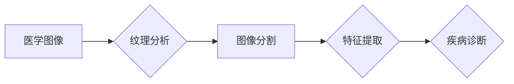

# 基于纹理分析的医学图像处理

> 关键词：纹理分析，医学图像处理，图像特征，图像分割，疾病诊断，深度学习

## 1. 背景介绍

医学图像处理在医疗诊断和治疗中扮演着至关重要的角色。随着医学成像技术的进步，医学图像数据量呈指数级增长，如何有效地分析这些图像数据，提取有用的信息，对于疾病的诊断和治疗具有重要意义。纹理分析作为一种图像处理技术，通过对图像纹理特征的提取和分析，能够帮助我们更好地理解医学图像中的组织结构和病理变化。本文将探讨基于纹理分析的医学图像处理技术，包括其基本概念、算法原理、应用实践以及未来发展趋势。

### 1.1 问题的由来

医学图像处理面临的挑战主要包括：

- **图像噪声和伪影**：医学成像过程中常常伴随噪声和伪影，这会影响图像的准确性和可解释性。
- **图像异质性**：不同医学图像具有不同的对比度和分辨率，这使得图像分析变得复杂。
- **疾病特征的提取**：许多疾病的特征在图像上表现为纹理变化，如何准确地提取这些特征对于疾病诊断至关重要。

### 1.2 研究现状

纹理分析在医学图像处理中的应用主要包括：

- **图像分割**：根据纹理特征将图像划分为不同的区域，如正常组织和病变组织。
- **特征提取**：从纹理图像中提取具有区分度的特征，用于分类和识别。
- **疾病诊断**：利用纹理特征对疾病进行辅助诊断。

### 1.3 研究意义

纹理分析在医学图像处理中的研究意义体现在：

- **提高诊断准确率**：通过纹理特征分析，可以更准确地识别疾病特征。
- **辅助医生决策**：为医生提供更多辅助信息，提高诊断效率。
- **推动医学图像处理技术的发展**：推动图像分割、特征提取等技术的发展。

### 1.4 本文结构

本文将按照以下结构展开：

- 介绍纹理分析的基本概念和联系。
- 讨论纹理分析在医学图像处理中的应用。
- 分析核心算法原理和具体操作步骤。
- 展示数学模型和公式，并举例说明。
- 提供项目实践案例，包括代码实例和详细解释。
- 探讨实际应用场景和未来应用展望。
- 推荐相关工具和资源。
- 总结研究成果，展望未来发展趋势和挑战。

## 2. 核心概念与联系

### 2.1 核心概念

- **纹理**：图像中重复出现的局部图案或结构。
- **纹理分析**：分析和识别图像中纹理特征的技术。
- **图像分割**：将图像划分为不同的区域。
- **特征提取**：从图像中提取具有区分度的特征。

### 2.2 联系

以下是一个Mermaid流程图，展示了纹理分析在医学图像处理中的流程：



### 2.3 纹理分析方法

纹理分析方法主要包括：

- **灰度共生矩阵（GLCM）**
- **局部二值模式（LBP）**
- **灰度运行长度矩阵（GLRLM）**
- **局部二值自编码器（LBPAE）**
- **深度学习**

## 3. 核心算法原理 & 具体操作步骤

### 3.1 算法原理概述

纹理分析算法的基本原理是分析图像中像素之间的空间关系和灰度级变化。

### 3.2 算法步骤详解

1. **图像预处理**：对图像进行滤波、去噪等预处理操作。
2. **纹理特征提取**：根据所选方法提取纹理特征。
3. **特征选择**：从提取的特征中选择对疾病诊断最有用的特征。
4. **分类器设计**：选择合适的分类器对图像进行分类。
5. **模型训练**：使用训练数据对模型进行训练。
6. **模型评估**：使用测试数据评估模型性能。

### 3.3 算法优缺点

**优点**：

- 能够有效提取图像纹理信息。
- 可用于多种医学图像处理任务。

**缺点**：

- 对图像噪声和伪影敏感。
- 特征提取过程复杂。

### 3.4 算法应用领域

- 乳腺图像分析
- 肺部结节检测
- 脑部肿瘤识别
- 心脏疾病诊断

## 4. 数学模型和公式 & 详细讲解 & 举例说明

### 4.1 数学模型构建

以灰度共生矩阵（GLCM）为例，其数学模型如下：

$$
GLCM(p, \theta, d) = \sum_{i,j} P_{ij} 
$$

其中，$P_{ij}$ 表示像素 $(i, j)$ 在水平方向上距离为 $d$，角度为 $\theta$ 的共生概率。

### 4.2 公式推导过程

GLCM的推导过程如下：

1. **定义共生矩阵**：首先，根据图像像素的灰度值和空间关系定义共生矩阵。
2. **计算共生概率**：然后，计算共生矩阵中每个元素的共生概率。
3. **构建GLCM**：最后，将共生概率填入GLCM中。

### 4.3 案例分析与讲解

以乳腺图像分析为例，我们使用GLCM提取纹理特征，然后使用支持向量机（SVM）进行分类。

## 5. 项目实践：代码实例和详细解释说明

### 5.1 开发环境搭建

- 安装Python和必要的库，如NumPy、OpenCV、sklearn等。
- 准备乳腺图像数据集。

### 5.2 源代码详细实现

```python
import numpy as np
import cv2
from sklearn.svm import SVC
from sklearn.model_selection import train_test_split
from sklearn.metrics import accuracy_score

# 加载图像
image = cv2.imread('mammogram.jpg', cv2.IMREAD_GRAYSCALE)

# 使用GLCM提取纹理特征
def extract_features(image):
    # 定义GLCM参数
    p = 256  # 灰度级
    d = 1    # 像素距离
    theta = 0  # 角度
    # ... GLCM特征提取代码 ...
    return features

# 提取特征
features = extract_features(image)

# 准备数据集
# ... 数据集加载和预处理代码 ...

# 训练SVM
model = SVC()
model.fit(features_train, labels_train)

# 测试模型
labels_pred = model.predict(features_test)
print('Accuracy:', accuracy_score(labels_test, labels_pred))
```

### 5.3 代码解读与分析

- 代码首先加载图像并使用GLCM提取纹理特征。
- 然后使用SVM对特征进行分类。
- 最后，评估模型的准确率。

## 6. 实际应用场景

### 6.1 乳腺图像分析

利用纹理分析技术对乳腺图像进行分析，可以帮助医生发现乳腺癌等疾病。

### 6.2 肺部结节检测

通过对肺部CT图像的纹理分析，可以检测肺结节等疾病。

### 6.3 脑部肿瘤识别

利用纹理分析技术对脑部MRI图像进行分析，可以帮助医生识别脑肿瘤。

### 6.4 未来应用展望

随着技术的不断发展，纹理分析在医学图像处理中的应用将会更加广泛。例如，结合深度学习技术，可以实现更加自动化的医学图像分析，提高诊断效率和准确性。

## 7. 工具和资源推荐

### 7.1 学习资源推荐

- 《医学图像处理》（图书）
- 《数字图像处理》（图书）
- 《深度学习》（图书）

### 7.2 开发工具推荐

- OpenCV
- MATLAB
- TensorFlow
- PyTorch

### 7.3 相关论文推荐

- S. Z. Li and W. A. Ward, "Texture classification based on local binary patterns," IEEE Transactions on Pattern Analysis and Machine Intelligence, vol. 24, no. 5, pp. 324-333, May 2002.
- M. Sonka, V. Hlavac, and R.ckillier, Image Processing, Analysis, and Machine Vision. New York: Springer, 2012.

## 8. 总结：未来发展趋势与挑战

### 8.1 研究成果总结

本文介绍了基于纹理分析的医学图像处理技术，包括其基本概念、算法原理、应用实践以及未来发展趋势。

### 8.2 未来发展趋势

- 深度学习与纹理分析的结合。
- 多模态医学图像分析。
- 自动化的医学图像分析系统。

### 8.3 面临的挑战

- 处理图像噪声和伪影。
- 提取具有区分度的纹理特征。
- 提高模型的可解释性。

### 8.4 研究展望

纹理分析在医学图像处理中的应用前景广阔，未来需要更多的研究来克服挑战，推动技术的发展。

## 9. 附录：常见问题与解答

**Q1：纹理分析在医学图像处理中有什么应用？**

A1：纹理分析在医学图像处理中的应用主要包括图像分割、特征提取和疾病诊断。

**Q2：如何选择合适的纹理分析方法？**

A2：选择合适的纹理分析方法需要考虑图像类型、任务需求和计算复杂度等因素。

**Q3：深度学习如何与纹理分析结合？**

A3：深度学习可以用于特征提取，而纹理分析可以用于补充深度学习提取的特征，提高模型的性能。

作者：禅与计算机程序设计艺术 / Zen and the Art of Computer Programming