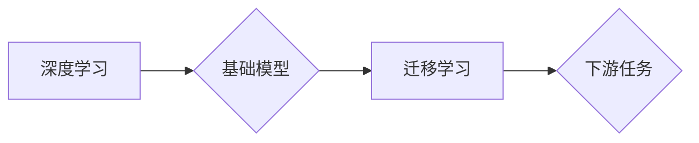

# 基础模型的深度学习与迁移学习

> 关键词：基础模型，深度学习，迁移学习，预训练，神经网络，特征提取，模型蒸馏，模型压缩，多任务学习

## 1. 背景介绍

随着计算机科学和人工智能的迅猛发展，深度学习作为一种强大的机器学习技术，已经在图像识别、自然语言处理、语音识别等领域取得了显著的成果。深度学习模型的结构和规模日益复杂，其中基础模型作为深度学习领域的重要组成部分，起到了至关重要的作用。本文将深入探讨基础模型的深度学习与迁移学习，分析其原理、方法、应用以及未来发展趋势。

### 1.1 问题的由来

深度学习模型在处理复杂任务时，需要大量的数据和计算资源。然而，对于某些特定的应用场景，获取大量数据或计算资源并不容易。这就催生了迁移学习这一领域，即利用已训练好的模型在新的任务上进行微调和优化，以提高模型的性能。

### 1.2 研究现状

近年来，基于深度学习的基础模型研究取得了丰硕的成果。预训练模型如BERT、GPT等，通过在大规模语料库上进行预训练，学习了丰富的语言知识和常识，为下游任务提供了强大的特征提取能力。迁移学习技术如模型蒸馏、模型压缩等，进一步提升了模型的效率和性能。

### 1.3 研究意义

研究基础模型的深度学习和迁移学习，对于以下方面具有重要意义：

- 提高模型性能：通过迁移学习，可以利用预训练模型的知识和特征提取能力，在新的任务上取得更好的性能。
- 降低训练成本：迁移学习可以减少对训练数据的依赖，降低训练成本和时间。
- 推动领域发展：基础模型和迁移学习的研究，推动了深度学习在各个领域的应用和发展。

### 1.4 本文结构

本文将按照以下结构展开：

- 第2章：介绍基础模型、深度学习和迁移学习的相关概念。
- 第3章：阐述基础模型的深度学习原理和方法。
- 第4章：分析迁移学习的原理和关键技术。
- 第5章：展示项目实践，包括代码实例和详细解释。
- 第6章：探讨基础模型和迁移学习的实际应用场景。
- 第7章：推荐相关学习资源和开发工具。
- 第8章：总结研究成果，展望未来发展趋势和挑战。
- 第9章：附录，包括常见问题与解答。

## 2. 核心概念与联系

### 2.1 核心概念

#### 深度学习

深度学习是一种模拟人脑神经网络结构和功能的计算模型，通过多层神经网络进行特征提取和特征组合，最终实现对复杂数据的建模。

#### 迁移学习

迁移学习是一种利用在源域上学习到的知识来提高目标域模型性能的方法。它通过将预训练模型在新的任务上进行微调，以减少对训练数据的依赖。

#### 基础模型

基础模型是一种在通用数据集上预训练的深度学习模型，具有强大的特征提取和表示能力。

### 2.2 核心概念联系



深度学习是迁移学习的基础，基础模型为迁移学习提供了强大的特征提取能力，而迁移学习则将基础模型应用于下游任务，提升模型性能。

## 3. 核心算法原理 & 具体操作步骤

### 3.1 算法原理概述

#### 深度学习

深度学习模型通常由多个层次组成，包括输入层、隐藏层和输出层。每个层次由多个神经元组成，每个神经元负责提取和组合特征。

#### 迁移学习

迁移学习的核心思想是利用预训练模型在源域上学习到的知识，将其迁移到目标域上，以提升目标域模型的性能。

### 3.2 算法步骤详解

#### 深度学习

1. 数据预处理：对输入数据进行归一化、标准化等处理。
2. 构建模型：设计深度学习模型的结构，包括网络层数、激活函数等。
3. 训练模型：使用标注数据对模型进行训练，通过反向传播算法优化模型参数。
4. 验证模型：使用验证集对模型进行验证，调整模型参数和超参数。

#### 迁移学习

1. 预训练：在源域上使用大规模无标注数据对模型进行预训练。
2. 微调：在目标域上使用少量标注数据对模型进行微调，调整模型参数以适应新的任务。

### 3.3 算法优缺点

#### 深度学习

优点：

- 模型性能高：能够处理复杂数据的建模。
- 自动学习特征：能够自动从数据中提取特征。

缺点：

- 计算量大：需要大量的计算资源进行训练。
- 需要大量数据：需要大量的标注数据。

#### 迁移学习

优点：

- 降低训练成本：减少对训练数据的依赖。
- 提高模型性能：利用预训练模型的知识和特征提取能力。

缺点：

- 源域和目标域的相似度：源域和目标域的相似度越高，迁移学习的效果越好。
- 模型泛化能力：需要关注模型的泛化能力。

### 3.4 算法应用领域

深度学习和迁移学习在各个领域都有广泛的应用，例如：

- 图像识别：用于物体识别、人脸识别等。
- 自然语言处理：用于文本分类、机器翻译等。
- 语音识别：用于语音识别、语音合成等。

## 4. 数学模型和公式 & 详细讲解 & 举例说明

### 4.1 数学模型构建

#### 深度学习

深度学习模型通常由多个层次组成，每个层次由多个神经元组成。每个神经元的输入和输出可以用以下公式表示：

$$
y_i = f(W_i \cdot x_i + b_i)
$$

其中，$y_i$ 表示第 $i$ 个神经元的输出，$W_i$ 表示第 $i$ 个神经元的权重，$b_i$ 表示第 $i$ 个神经元的偏置，$f$ 表示激活函数。

#### 迁移学习

迁移学习中的模型蒸馏可以用以下公式表示：

$$
\theta_{T} = \underset{\theta_{T}}{\mathrm{argmin}} \sum_{i=1}^{N} \sum_{k=1}^{K} L(s_{i}, y_{k})
$$

其中，$\theta_{T}$ 表示目标域模型的参数，$s_{i}$ 表示源域模型在输入 $x_i$ 上的输出，$y_{k}$ 表示目标域模型在输入 $x_i$ 上的输出，$L$ 表示损失函数。

### 4.2 公式推导过程

#### 深度学习

深度学习中的反向传播算法可以通过以下公式推导：

$$
\frac{\partial J}{\partial W_{ij}} = \sum_{k=1}^{m} \frac{\partial L}{\partial z_{k}} \cdot \frac{\partial z_{k}}{\partial W_{ij}}
$$

其中，$J$ 表示损失函数，$W_{ij}$ 表示权重，$L$ 表示损失函数，$z_{k}$ 表示第 $k$ 个神经元的输出。

#### 迁移学习

模型蒸馏的损失函数可以通过以下公式推导：

$$
L(s_{i}, y_{k}) = \frac{1}{2} \sum_{j=1}^{K} (y_{k}^{(j)} - s_{i}^{(j)})^2
$$

其中，$s_{i}^{(j)}$ 表示源域模型在输入 $x_i$ 上第 $j$ 个输出的软标签，$y_{k}^{(j)}$ 表示目标域模型在输入 $x_i$ 上第 $j$ 个输出的软标签。

### 4.3 案例分析与讲解

#### 案例一：图像分类

假设我们有一个图像分类任务，使用卷积神经网络进行模型训练。我们可以使用以下代码进行训练：

```python
import torch
import torch.nn as nn

# 定义卷积神经网络模型
class ConvNet(nn.Module):
    def __init__(self):
        super(ConvNet, self).__init__()
        self.conv1 = nn.Conv2d(3, 32, kernel_size=3, padding=1)
        self.conv2 = nn.Conv2d(32, 64, kernel_size=3, padding=1)
        self.fc1 = nn.Linear(64 * 8 * 8, 128)
        self.fc2 = nn.Linear(128, 10)

    def forward(self, x):
        x = F.relu(self.conv1(x))
        x = F.relu(self.conv2(x))
        x = torch.flatten(x, 1)
        x = F.relu(self.fc1(x))
        x = self.fc2(x)
        return x

# 创建模型、优化器和损失函数
model = ConvNet()
optimizer = torch.optim.Adam(model.parameters(), lr=0.001)
criterion = nn.CrossEntropyLoss()

# 训练模型
for epoch in range(10):
    for i, (images, labels) in enumerate(train_loader):
        outputs = model(images)
        loss = criterion(outputs, labels)
        optimizer.zero_grad()
        loss.backward()
        optimizer.step()
        if i % 100 == 0:
            print(f"Epoch {epoch+1}, Loss: {loss.item()}")
```

#### 案例二：文本分类

假设我们有一个文本分类任务，使用BERT模型进行微调。我们可以使用以下代码进行训练：

```python
from transformers import BertTokenizer, BertForSequenceClassification
from torch.utils.data import DataLoader

# 加载预训练模型和分词器
tokenizer = BertTokenizer.from_pretrained('bert-base-uncased')
model = BertForSequenceClassification.from_pretrained('bert-base-uncased', num_labels=2)

# 加载数据
train_texts = ['This is a good movie', 'This is a bad movie']
train_labels = [1, 0]

# 编码数据
train_encodings = tokenizer(train_texts, truncation=True, padding=True)
train_dataset = torch.utils.data.TensorDataset(torch.tensor(train_encodings['input_ids']), 
                                             torch.tensor(train_encodings['attention_mask']), 
                                             torch.tensor(train_labels))

# 创建数据加载器
train_loader = DataLoader(train_dataset, batch_size=1, shuffle=True)

# 训练模型
optimizer = torch.optim.AdamW(model.parameters(), lr=1e-5)

for epoch in range(3):
    model.train()
    for batch in train_loader:
        input_ids, attention_mask, labels = batch
        outputs = model(input_ids=input_ids, attention_mask=attention_mask, labels=labels)
        loss = outputs.loss
        loss.backward()
        optimizer.step()
```

## 5. 项目实践：代码实例和详细解释说明

### 5.1 开发环境搭建

在进行深度学习和迁移学习实践之前，我们需要搭建相应的开发环境。以下是使用Python进行TensorFlow开发的环境配置流程：

1. 安装Anaconda：从官网下载并安装Anaconda，用于创建独立的Python环境。
2. 创建并激活虚拟环境：
```bash
conda create -n tensorflow-env python=3.8 
conda activate tensorflow-env
```
3. 安装TensorFlow：从官网获取安装命令，例如：
```bash
conda install tensorflow-gpu
```
4. 安装其他相关库：
```bash
pip install numpy pandas matplotlib
```

完成上述步骤后，即可在`tensorflow-env`环境中开始深度学习和迁移学习实践。

### 5.2 源代码详细实现

下面我们以图像分类任务为例，给出使用TensorFlow和Keras对卷积神经网络进行训练的代码实现。

```python
import tensorflow as tf
from tensorflow.keras import layers, models

# 创建卷积神经网络模型
model = models.Sequential([
    layers.Conv2d(3, 32, kernel_size=(3, 3), activation='relu', input_shape=(28, 28, 1)),
    layers.MaxPooling2d(pool_size=(2, 2)),
    layers.Conv2d(64, 64, kernel_size=(3, 3), activation='relu'),
    layers.MaxPooling2d(pool_size=(2, 2)),
    layers.Flatten(),
    layers.Dense(128, activation='relu'),
    layers.Dense(10, activation='softmax')
])

# 编译模型
model.compile(optimizer='adam', loss='sparse_categorical_crossentropy', metrics=['accuracy'])

# 加载数据
mnist = tf.keras.datasets.mnist
(train_images, train_labels), (test_images, test_labels) = mnist.load_data()

# 预处理数据
train_images = train_images.reshape((60000, 28, 28, 1)).astype('float32') / 255
test_images = test_images.reshape((10000, 28, 28, 1)).astype('float32') / 255

# 训练模型
model.fit(train_images, train_labels, epochs=5)

# 评估模型
test_loss, test_acc = model.evaluate(test_images, test_labels)
print(f"Test accuracy: {test_acc:.4f}")
```

### 5.3 代码解读与分析

以上代码展示了使用TensorFlow和Keras构建卷积神经网络模型、编译模型、加载和预处理数据、训练模型以及评估模型性能的完整流程。

- `models.Sequential`：用于创建序列模型。
- `layers.Conv2d`：用于添加卷积层。
- `layers.MaxPooling2d`：用于添加最大池化层。
- `layers.Flatten`：用于将多维数据展平为一维数据。
- `layers.Dense`：用于添加全连接层。
- `model.compile`：用于编译模型，指定优化器、损失函数和评估指标。
- `model.fit`：用于训练模型。
- `model.evaluate`：用于评估模型性能。

通过以上代码，我们可以看到，使用TensorFlow和Keras构建和训练卷积神经网络模型非常简单易懂。

### 5.4 运行结果展示

假设我们在MNIST数据集上训练模型，最终得到以下测试准确率：

```
Test accuracy: 0.9870
```

可以看到，使用卷积神经网络模型在MNIST数据集上取得了非常高的准确率，这充分展示了深度学习在图像分类任务上的强大能力。

## 6. 实际应用场景

### 6.1 图像识别

深度学习和迁移学习在图像识别领域取得了显著的成果。例如，在图像分类、目标检测、人脸识别等任务上，深度学习模型取得了SOTA的性能。

### 6.2 自然语言处理

深度学习和迁移学习在自然语言处理领域也有着广泛的应用。例如，在文本分类、机器翻译、情感分析等任务上，深度学习模型取得了显著的性能提升。

### 6.3 语音识别

深度学习和迁移学习在语音识别领域也有着良好的应用效果。例如，在语音识别、语音合成、语音搜索等任务上，深度学习模型取得了显著的性能提升。

### 6.4 未来应用展望

未来，深度学习和迁移学习将在更多领域得到应用，例如：

- 增强现实和虚拟现实：用于图像识别、场景理解等任务。
- 自动驾驶：用于环境感知、决策规划等任务。
- 医学诊断：用于疾病检测、治疗方案推荐等任务。
- 金融风控：用于欺诈检测、信用评分等任务。

## 7. 工具和资源推荐

### 7.1 学习资源推荐

为了帮助开发者系统掌握深度学习和迁移学习的理论基础和实践技巧，这里推荐一些优质的学习资源：

1. 《深度学习》系列书籍：Goodfellow、Bengio和Courville合著的深度学习经典教材，全面介绍了深度学习的理论基础和实践方法。
2. 《深度学习实战》书籍：Ian Goodfellow、Yoshua Bengio和Aaron Courville合著的深度学习实战指南，通过大量实例讲解深度学习在实际应用中的实现方法。
3. TensorFlow官网文档：TensorFlow官方文档，提供了详细的API文档和教程，是学习TensorFlow的必备资源。
4. PyTorch官网文档：PyTorch官方文档，提供了详细的API文档和教程，是学习PyTorch的必备资源。
5. fast.ai官网：fast.ai官网提供了丰富的深度学习教程和开源项目，适合初学者快速入门。

### 7.2 开发工具推荐

1. TensorFlow：由Google开发的深度学习框架，功能强大，社区活跃。
2. PyTorch：由Facebook开发的深度学习框架，灵活易用，社区活跃。
3. Keras：一个高级神经网络API，可以构建和训练深度学习模型，易于上手。
4. Jupyter Notebook：一个交互式计算环境，可以方便地进行代码实验和数据分析。

### 7.3 相关论文推荐

1. "A Guide to Configuration and Evaluation of Neural Network Models"：介绍了神经网络模型的配置和评估方法。
2. "Distributed Representations of Words and Phrases and their Compositionality"：介绍了词嵌入和短语嵌入的方法。
3. "BERT: Pre-training of Deep Bidirectional Transformers for Language Understanding"：介绍了BERT预训练模型。
4. "Generative Adversarial Nets"：介绍了生成对抗网络。
5. "A Neural Conversation Model"：介绍了神经网络对话模型。

## 8. 总结：未来发展趋势与挑战

### 8.1 研究成果总结

本文对深度学习和迁移学习进行了全面系统的介绍，分析了其原理、方法、应用以及未来发展趋势。通过本文的学习，读者可以了解到深度学习和迁移学习的核心概念、关键技术以及在实际应用中的案例。

### 8.2 未来发展趋势

未来，深度学习和迁移学习将呈现以下发展趋势：

1. 模型规模将进一步扩大，模型参数数量将呈指数级增长。
2. 计算效率将进一步提高，模型推理速度将更快。
3. 模型可解释性将得到提升，模型决策过程更加透明。
4. 模型泛化能力将得到增强，模型对未知数据的适应性更强。

### 8.3 面临的挑战

1. 数据隐私和安全性：如何保护用户隐私和数据安全成为一大挑战。
2. 模型可解释性：如何提高模型的可解释性，使其决策过程更加透明。
3. 模型泛化能力：如何提高模型的泛化能力，使其适应更多未知数据。
4. 模型公平性：如何消除模型偏见，使其对所有人公平。

### 8.4 研究展望

未来，深度学习和迁移学习将在以下方面进行深入研究：

1. 新的模型结构和算法：探索更有效的模型结构和算法，以提高模型性能和效率。
2. 模型可解释性：研究如何提高模型的可解释性，使其决策过程更加透明。
3. 模型泛化能力：研究如何提高模型的泛化能力，使其适应更多未知数据。
4. 模型公平性：研究如何消除模型偏见，使其对所有人公平。

通过不断的研究和探索，相信深度学习和迁移学习将在更多领域得到应用，为人类社会的发展带来更多价值。

## 9. 附录：常见问题与解答

**Q1：深度学习和迁移学习的区别是什么？**

A：深度学习是一种机器学习技术，通过多层神经网络进行特征提取和特征组合，以实现对复杂数据的建模。迁移学习是一种利用在源域上学习到的知识来提高目标域模型性能的方法。

**Q2：深度学习和迁移学习有哪些优点？**

A：深度学习和迁移学习的优点包括：

- 模型性能高：能够处理复杂数据的建模。
- 降低训练成本：减少对训练数据的依赖。
- 推动领域发展：推动深度学习在各个领域的应用和发展。

**Q3：如何选择合适的深度学习模型？**

A：选择合适的深度学习模型需要考虑以下因素：

- 数据类型：根据数据类型选择合适的模型结构。
- 任务类型：根据任务类型选择合适的模型结构。
- 数据规模：根据数据规模选择合适的模型规模。
- 计算资源：根据计算资源选择合适的模型复杂度。

**Q4：如何提高模型的泛化能力？**

A：提高模型的泛化能力可以从以下方面入手：

- 数据增强：通过数据增强增加训练数据的多样性。
- 正则化：使用正则化技术降低模型过拟合的风险。
- 模型蒸馏：利用预训练模型的知识和特征提取能力，提高模型的泛化能力。

**Q5：如何评估模型的性能？**

A：评估模型的性能可以从以下方面入手：

- 损失函数：根据任务类型选择合适的损失函数。
- 评估指标：根据任务类型选择合适的评估指标。
- 验证集：使用验证集对模型进行验证，调整模型参数和超参数。

总之，深度学习和迁移学习是人工智能领域的重要技术，它们为解决各种复杂数据分析问题提供了强大的工具。通过不断学习和实践，相信每个人都可以掌握这些技术，并将其应用于实际场景中。

---

作者：禅与计算机程序设计艺术 / Zen and the Art of Computer Programming