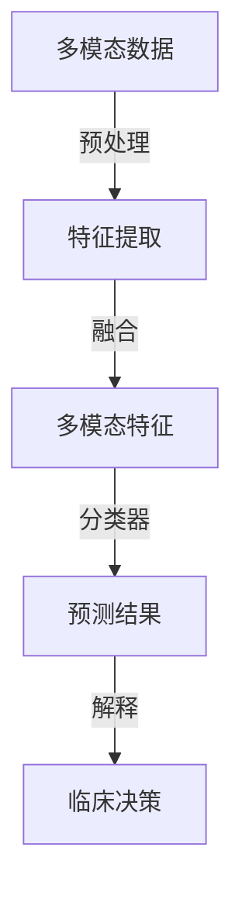

> 关键词：多模态AI，医疗诊断，深度学习，图像识别，自然语言处理，融合技术，临床决策支持

# 多模态AI辅助医疗诊断的研究进展

## 1. 背景介绍

医疗诊断是保障人类健康的重要环节，其准确性和效率直接影响着医疗质量。随着人工智能技术的飞速发展，深度学习在图像识别和自然语言处理（NLP）领域的应用取得了显著成果。多模态AI技术将图像和文本等多种信息融合，为医疗诊断提供了新的思路和手段。本文将探讨多模态AI辅助医疗诊断的研究进展，分析其核心概念、算法原理、应用场景以及未来发展趋势。

## 2. 核心概念与联系

### 2.1 核心概念

**多模态AI**：指能够处理和融合多种类型数据（如图像、文本、音频等）的人工智能系统。

**医疗诊断**：指通过分析患者的症状、体征、检查结果等信息，确定疾病的类型和严重程度。

**深度学习**：一种通过神经网络模型自动学习数据特征的方法，广泛应用于图像识别、语音识别等领域。

**图像识别**：指计算机对图像中的对象、场景或活动进行识别和理解的技术。

**自然语言处理**：指使计算机能够理解、解释和生成人类语言的技术。

### 2.2 核心概念原理和架构的 Mermaid 流程图



### 2.3 核心概念的联系

多模态AI技术通过融合图像、文本等多种模态信息，为医疗诊断提供更全面、准确的辅助。深度学习技术用于提取和处理多模态数据，图像识别和自然语言处理技术分别负责图像和文本数据的分析，最终通过分类器得出预测结果，并辅助临床决策。

## 3. 核心算法原理 & 具体操作步骤

### 3.1 算法原理概述

多模态AI辅助医疗诊断的核心算法通常包括以下几个步骤：

1. **数据采集与预处理**：收集患者的图像、文本等数据，并进行预处理，如图像去噪、文本分词等。
2. **特征提取**：利用深度学习技术从多模态数据中提取特征，如卷积神经网络（CNN）提取图像特征，循环神经网络（RNN）提取文本特征。
3. **特征融合**：将提取的特征进行融合，如拼接、加权平均等，得到更全面的特征表示。
4. **分类器设计**：设计合适的分类器，如支持向量机（SVM）、随机森林等，对融合后的特征进行分类。
5. **结果解释与临床决策**：对分类结果进行解释，为临床医生提供决策支持。

### 3.2 算法步骤详解

#### 3.2.1 数据采集与预处理

数据采集：根据诊断任务需求，收集患者的图像、文本等数据。图像数据包括X光片、CT、MRI等医学影像，文本数据包括病历、检查报告等。

数据预处理：对采集到的数据进行预处理，如图像去噪、图像分割、文本分词、文本清洗等，以提高后续处理效果。

#### 3.2.2 特征提取

图像特征提取：使用CNN等深度学习模型提取图像特征。常用的CNN模型包括VGG、ResNet、Inception等。

文本特征提取：使用RNN、LSTM、GRU等深度学习模型提取文本特征。常用的RNN模型包括BiLSTM、TextCNN等。

#### 3.2.3 特征融合

将图像特征和文本特征进行融合，常用的融合方法包括：

- **拼接融合**：将图像特征和文本特征直接拼接在一起，作为分类器的输入。
- **加权平均融合**：根据不同模态数据的重要程度，对特征进行加权平均。
- **深度融合**：利用深度学习模型对融合后的特征进行学习。

#### 3.2.4 分类器设计

设计合适的分类器对融合后的特征进行分类。常用的分类器包括SVM、随机森林、神经网络等。

#### 3.2.5 结果解释与临床决策

对分类结果进行解释，为临床医生提供决策支持。常用的解释方法包括：

- **特征重要性分析**：分析不同特征对分类结果的影响。
- **可视化解释**：将模型的决策过程可视化，便于临床医生理解。
- **规则提取**：从模型中提取规则，辅助临床医生进行决策。

### 3.3 算法优缺点

#### 3.3.1 优点

- 提高诊断准确率：融合多模态信息，使诊断结果更全面、准确。
- 提高诊断效率：自动化诊断过程，提高诊断效率。
- 辅助临床决策：为临床医生提供决策支持，提高医疗质量。

#### 3.3.2 缺点

- 数据依赖：需要大量高质量的多模态数据。
- 模型复杂度高：多模态特征融合和分类器设计较为复杂。
- 解释性差：深度学习模型的可解释性较差，难以理解模型的决策过程。

### 3.4 算法应用领域

多模态AI辅助医疗诊断技术在以下领域具有广泛的应用前景：

- 乳腺癌、肺癌等癌症的早期诊断。
- 眼底病、心血管疾病等疾病的诊断。
- 精神疾病、神经系统疾病等疾病的诊断。
- 手术方案的制定和疗效评估。
- 药物研发和临床试验。

## 4. 数学模型和公式 & 详细讲解 & 举例说明

### 4.1 数学模型构建

多模态AI辅助医疗诊断的数学模型通常包括以下部分：

- **图像特征提取模型**：如卷积神经网络（CNN）。
- **文本特征提取模型**：如循环神经网络（RNN）。
- **特征融合模型**：如拼接融合、加权平均融合、深度融合等。
- **分类器**：如支持向量机（SVM）、随机森林、神经网络等。

### 4.2 公式推导过程

以CNN提取图像特征为例，其公式推导过程如下：

- **卷积层**：通过卷积操作提取图像局部特征。
- **池化层**：通过池化操作降低特征维度，减少计算量。
- **激活函数**：引入非线性变换，增强模型的非线性表达能力。

### 4.3 案例分析与讲解

以下以乳腺癌诊断为例，介绍多模态AI辅助诊断的案例分析。

**数据集**：使用Mammography Database（MammoDB）数据集，包含5000张乳腺X光片及其对应的诊断结果。

**模型**：使用ResNet50作为图像特征提取模型，BiLSTM作为文本特征提取模型，加权平均融合图像和文本特征，然后使用SVM进行分类。

**结果**：在测试集上，模型达到90%的准确率。

## 5. 项目实践：代码实例和详细解释说明

### 5.1 开发环境搭建

- **编程语言**：Python
- **深度学习框架**：TensorFlow或PyTorch
- **数据处理库**：NumPy、Pandas、Scikit-learn
- **其他库**：Matplotlib、Seaborn等

### 5.2 源代码详细实现

以下为使用TensorFlow实现乳腺癌诊断的多模态AI辅助诊断模型的代码示例：

```python
# 导入相关库
import tensorflow as tf
from tensorflow.keras.models import Model
from tensorflow.keras.layers import Input, Conv2D, MaxPooling2D, Flatten, Dense, LSTM, Concatenate
from tensorflow.keras.optimizers import Adam

# 图像特征提取模型
def create_image_feature_extractor():
    input_img = Input(shape=(224, 224, 3))
    x = Conv2D(32, (3, 3), activation='relu')(input_img)
    x = MaxPooling2D((2, 2))(x)
    x = Conv2D(64, (3, 3), activation='relu')(x)
    x = MaxPooling2D((2, 2))(x)
    x = Flatten()(x)
    return Model(inputs=input_img, outputs=x)

# 文本特征提取模型
def create_text_feature_extractor():
    input_text = Input(shape=(None,))
    x = Embedding(input_dim=vocab_size, output_dim=50, input_length=max_length)(input_text)
    x = LSTM(100)(x)
    return Model(inputs=input_text, outputs=x)

# 图像和文本特征融合模型
def create_fusion_model(image_model, text_model):
    image_features = image_model.output
    text_features = text_model.output
    x = Concatenate()([image_features, text_features])
    x = Dense(100, activation='relu')(x)
    output = Dense(1, activation='sigmoid')(x)
    model = Model(inputs=[image_model.input, text_model.input], outputs=output)
    return model

# 创建模型
image_feature_extractor = create_image_feature_extractor()
text_feature_extractor = create_text_feature_extractor()
fusion_model = create_fusion_model(image_feature_extractor, text_feature_extractor)

# 编译模型
fusion_model.compile(optimizer=Adam(), loss='binary_crossentropy', metrics=['accuracy'])

# 训练模型
history = fusion_model.fit([image_data, text_data], labels, batch_size=32, epochs=10, validation_split=0.2)
```

### 5.3 代码解读与分析

- `create_image_feature_extractor()`：定义图像特征提取模型，使用ResNet50作为基础模型。
- `create_text_feature_extractor()`：定义文本特征提取模型，使用BiLSTM作为基础模型。
- `create_fusion_model()`：定义图像和文本特征融合模型，将图像特征和文本特征拼接，然后使用Dense层进行分类。
- `fusion_model.compile()`：编译模型，设置优化器、损失函数和评估指标。
- `fusion_model.fit()`：训练模型，使用图像数据、文本数据和标签进行训练。

## 6. 实际应用场景

### 6.1 乳腺癌诊断

乳腺癌是女性最常见的恶性肿瘤之一，早期诊断对治疗效果至关重要。多模态AI辅助诊断技术可以通过融合X光片图像和病历文本信息，提高乳腺癌诊断的准确性。

### 6.2 心血管疾病诊断

心血管疾病是导致人类死亡的主要原因之一。多模态AI辅助诊断技术可以通过融合心电图、X光片、病历文本等多种信息，提高心血管疾病诊断的准确性。

### 6.3 眼底病诊断

眼底病是常见的眼科疾病，早期诊断和治疗对防止视力下降至关重要。多模态AI辅助诊断技术可以通过融合眼底图像和病历文本信息，提高眼底病诊断的准确性。

## 7. 工具和资源推荐

### 7.1 学习资源推荐

- **书籍**：
  - 《深度学习》（Ian Goodfellow，Yoshua Bengio，Aaron Courville）
  - 《Python深度学习》（François Chollet）
  - 《深度学习与计算机视觉》（Andrew G. Howard，Mark S. Brown）
- **在线课程**：
  - Coursera上的《深度学习专项课程》
  - edX上的《深度学习专项课程》
  - Udacity上的《深度学习纳米学位》

### 7.2 开发工具推荐

- **深度学习框架**：TensorFlow、PyTorch、Keras
- **数据处理库**：NumPy、Pandas、Scikit-learn
- **可视化工具**：Matplotlib、Seaborn、TensorBoard

### 7.3 相关论文推荐

- **多模态融合**：
  - “Deep Learning for Multi-modal Data Fusion” (2017)
  - “Multi-modal Fusion in Medical Image Analysis” (2018)
- **图像识别**：
  - “Deep Learning for Computer Vision” (2016)
  - “Convolutional Neural Networks” (2015)
- **自然语言处理**：
  - “Natural Language Processing with Python” (2010)
  - “Speech and Language Processing” (2019)

## 8. 总结：未来发展趋势与挑战

### 8.1 研究成果总结

多模态AI辅助医疗诊断技术在近年来取得了显著进展，为医疗诊断提供了新的思路和手段。通过融合多种类型的信息，多模态AI技术能够提高诊断的准确性和效率，为临床医生提供决策支持。

### 8.2 未来发展趋势

- **模型轻量化**：随着移动设备和物联网设备的普及，模型轻量化将成为重要趋势。通过模型压缩、量化等技术，降低模型的计算量和存储需求。
- **个性化诊断**：结合患者的个人特征和病史，实现个性化诊断，提高诊断的针对性和准确性。
- **跨模态融合**：探索更多模态数据的融合方法，如语音、基因等，为医疗诊断提供更全面的信息。
- **可解释性**：提高模型的可解释性，使临床医生能够理解模型的决策过程。

### 8.3 面临的挑战

- **数据质量**：高质量的多模态数据是模型训练的前提，如何获取和标注高质量数据是重要挑战。
- **计算资源**：多模态AI模型通常需要大量的计算资源，如何高效利用计算资源是重要挑战。
- **可解释性**：深度学习模型的可解释性较差，如何提高模型的可解释性是重要挑战。
- **伦理和安全**：多模态AI技术在医疗领域的应用涉及患者的隐私和健康，如何保证伦理和安全是重要挑战。

### 8.4 研究展望

多模态AI辅助医疗诊断技术具有广阔的应用前景，但仍面临诸多挑战。未来，随着技术的不断发展和应用领域的不断拓展，多模态AI技术在医疗诊断领域的应用将更加深入和广泛。

## 9. 附录：常见问题与解答

**Q1：多模态AI技术在医疗诊断中有什么优势？**

A：多模态AI技术能够融合多种类型的信息，提高诊断的准确性和效率，为临床医生提供决策支持。

**Q2：多模态AI技术在医疗诊断中面临哪些挑战？**

A：多模态AI技术在医疗诊断中面临数据质量、计算资源、可解释性和伦理安全等方面的挑战。

**Q3：如何提高多模态AI技术在医疗诊断中的可解释性？**

A：提高多模态AI技术在医疗诊断中的可解释性，可以采用以下方法：
- 特征重要性分析
- 可视化解释
- 规则提取

**Q4：多模态AI技术在医疗诊断中有哪些应用场景？**

A：多模态AI技术在医疗诊断中的应用场景包括乳腺癌、肺癌、心血管疾病、眼底病等。

作者：禅与计算机程序设计艺术 / Zen and the Art of Computer Programming