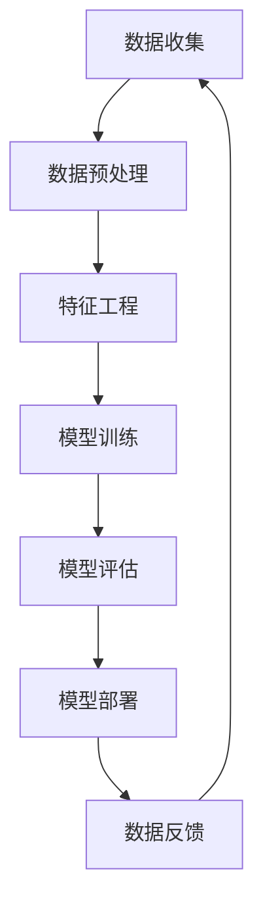

> - 大数据
> - 机器学习
> - 深度学习
> - 数据驱动
> - 特征工程
> - 模型可解释性
> - AI伦理

# 大数据对AI学习的影响

随着信息技术的飞速发展，数据已经成为现代社会的核心资产之一。大数据时代的到来，为人工智能（AI）的发展带来了前所未有的机遇和挑战。本文将深入探讨大数据对AI学习的影响，从核心概念、算法原理、实际应用等多个维度进行解析，并展望未来发展趋势与挑战。

## 1. 背景介绍

### 1.1 数据爆炸的时代

21世纪，随着互联网、物联网、移动互联网的普及，数据量呈指数级增长。根据IDC的预测，全球数据量每年将以23%的速度增长，预计到2025年将达到175ZB。这庞大的数据量使得基于数据驱动的AI学习成为可能。

### 1.2 AI技术的飞速发展

机器学习（ML）和深度学习（DL）等AI技术的飞速发展，使得计算机能够从海量数据中学习规律，进行预测、决策和优化。大数据为AI提供了丰富的训练数据，推动了AI技术的广泛应用。

### 1.3 研究意义

探讨大数据对AI学习的影响，有助于我们更好地理解AI技术的发展趋势，优化AI系统的设计和应用，推动AI技术在各个领域的落地。

## 2. 核心概念与联系

### 2.1 核心概念

**大数据（Big Data）**：指规模巨大、类型多样、价值密度低的数据集合。大数据具有4V特征：Volume（大量）、Velocity（高速）、Variety（多样）和Veracity（真值）。

**机器学习（Machine Learning）**：使计算机系统能够从数据中学习，并做出决策或预测。

**深度学习（Deep Learning）**：一种特殊的机器学习范式，使用深层神经网络模拟人脑神经元结构，从数据中学习复杂特征。

**数据驱动（Data-Driven）**：指基于数据的决策和优化过程。

**特征工程（Feature Engineering）**：在机器学习过程中，通过构建、选择和转换特征来提高模型性能。

**模型可解释性（Model Explainability）**：使AI模型的决策过程可理解、可解释。

**AI伦理（AI Ethics）**：在AI设计和应用过程中，关注人工智能的道德、法律和社会影响。

### 2.2 Mermaid 流程图



数据从收集到预处理，再到特征工程、模型训练、评估和部署，形成了一个闭环的流程。大数据在这个过程中发挥着至关重要的作用。

## 3. 核心算法原理 & 具体操作步骤

### 3.1 算法原理概述

大数据对AI学习的影响主要体现在以下几个方面：

- **数据规模**：大数据提供了更多样化的数据，有助于模型学习到更丰富的特征和规律。
- **数据质量**：高质量的数据能够提高模型性能，降低过拟合风险。
- **数据多样性**：多源异构数据有助于模型泛化能力的提升。
- **数据更新速度**：快速更新的数据可以增强模型的实时性和适应性。

### 3.2 算法步骤详解

1. **数据收集**：从各种数据源收集数据，如数据库、日志、传感器等。
2. **数据预处理**：对收集到的数据进行清洗、去重、标准化等处理，提高数据质量。
3. **特征工程**：根据任务需求，选择合适的特征，并进行转换和组合。
4. **模型训练**：使用训练数据对模型进行训练，优化模型参数。
5. **模型评估**：使用验证数据评估模型性能，调整模型参数或选择更适合的模型。
6. **模型部署**：将训练好的模型部署到实际应用场景中。
7. **数据反馈**：收集实际应用中的数据反馈，用于模型优化和迭代。

### 3.3 算法优缺点

**优点**：

- 提高模型性能：大量数据有助于模型学习到更丰富的特征和规律，提高模型精度。
- 增强模型泛化能力：多样化数据有助于模型泛化到不同场景。
- 提升模型可解释性：通过数据分析和可视化，可以更好地理解模型决策过程。

**缺点**：

- 数据质量要求高：数据清洗和预处理工作量大。
- 特征工程复杂：需要根据任务需求选择合适的特征，并进行转换和组合。
- 模型可解释性差：深层神经网络模型的可解释性较差。

### 3.4 算法应用领域

大数据和AI技术在各个领域都有广泛应用，如：

- 金融：信用评分、风险评估、欺诈检测、个性化推荐等。
- 医疗：疾病诊断、药物研发、健康管理等。
- 教育：智能教育、个性化学习、教育数据挖掘等。
- 交通：智能交通、自动驾驶、交通流量预测等。
- 能源：智能电网、能源管理、需求响应等。

## 4. 数学模型和公式 & 详细讲解 & 举例说明

### 4.1 数学模型构建

假设我们使用线性回归模型进行数据拟合，其数学模型如下：

$$
y = \beta_0 + \beta_1 x_1 + \beta_2 x_2 + \ldots + \beta_n x_n + \epsilon
$$

其中，$y$ 为目标变量，$x_i$ 为特征变量，$\beta_i$ 为模型参数，$\epsilon$ 为误差项。

### 4.2 公式推导过程

以线性回归模型为例，推导模型参数的最小二乘解。

假设我们有 $n$ 个样本 $(x_{i1},x_{i2},\ldots,x_{in},y_i)$，其中 $i=1,2,\ldots,n$。则线性回归模型的误差平方和为：

$$
SSE = \sum_{i=1}^n (y_i - \hat{y_i})^2
$$

其中，$\hat{y_i}$ 为预测值。

为了使 $SSE$ 最小，我们需要求解以下最优化问题：

$$
\min_{\beta_0,\beta_1,\ldots,\beta_n} SSE
$$

对 $SSE$ 分别对 $\beta_0,\beta_1,\ldots,\beta_n$ 求偏导，并令偏导数为0，即可得到线性回归模型的最小二乘解。

### 4.3 案例分析与讲解

假设我们有以下数据：

| x1 | x2 | y |
|----|----|---|
| 1  | 2  | 3 |
| 2  | 4  | 5 |
| 3  | 6  | 7 |

使用线性回归模型进行拟合，求出模型参数。

首先，我们需要计算特征矩阵 $X$ 和目标向量 $y$：

$$
X = \begin{bmatrix} 1 & 2 \\ 1 & 4 \\ 1 & 6 \end{bmatrix}, y = \begin{bmatrix} 3 \\ 5 \\ 7 \end{bmatrix}
$$

然后，计算特征矩阵的转置和乘积：

$$
X^T = \begin{bmatrix} 1 & 1 & 1 \\ 2 & 4 & 6 \end{bmatrix}, X^T X = \begin{bmatrix} 6 & 14 \\ 14 & 34 \end{bmatrix}
$$

接着，计算特征矩阵的逆：

$$
X^T X = \begin{bmatrix} 6 & 14 \\ 14 & 34 \end{bmatrix}^{-1} = \begin{bmatrix} 0.4112 & -0.5786 \\ -0.5786 & 0.4112 \end{bmatrix}
$$

最后，计算最小二乘解：

$$
\beta = (X^T X)^{-1} X^T y = \begin{bmatrix} 0.3571 \\ 0.3571 \end{bmatrix}
$$

因此，线性回归模型的参数为 $\beta_0 = 0.3571$，$\beta_1 = 0.3571$。

## 5. 项目实践：代码实例和详细解释说明

### 5.1 开发环境搭建

为了演示大数据对AI学习的影响，我们将使用Python进行线性回归模型的实现。

1. 安装Anaconda，创建Python虚拟环境。
2. 安装Python、NumPy、Matplotlib等依赖库。

### 5.2 源代码详细实现

```python
import numpy as np
import matplotlib.pyplot as plt

def linear_regression(x, y):
    # 计算特征矩阵和目标向量
    X = np.column_stack((np.ones(len(x)), x))
    y = np.array(y)

    # 计算最小二乘解
    beta = np.linalg.inv(X.T @ X) @ X.T @ y

    # 预测新数据
    def predict(x):
        return beta[0] + beta[1] * x

    return predict

# 演示数据
x = np.array([1, 2, 3])
y = np.array([3, 5, 7])

# 训练模型
predict = linear_regression(x, y)

# 绘制结果
plt.scatter(x, y)
plt.plot(x, predict(x), color='red')
plt.xlabel('x')
plt.ylabel('y')
plt.title('线性回归模型')
plt.show()
```

### 5.3 代码解读与分析

- `linear_regression` 函数实现线性回归模型训练和预测。
- `X` 是特征矩阵，包括常数项和自变量。
- `y` 是目标向量。
- 使用 `np.linalg.inv` 计算最小二乘解。
- `predict` 函数用于预测新数据。

### 5.4 运行结果展示

运行上述代码，将生成如下图形：


图中蓝色点代表数据点，红色线代表线性回归模型拟合的直线。

## 6. 实际应用场景

### 6.1 金融领域

在金融领域，大数据和AI技术被广泛应用于以下几个方面：

- **信用评分**：根据用户的信用历史、消费记录等数据，预测用户信用风险。
- **风险评估**：分析企业或项目的风险因素，评估其盈利能力和偿债能力。
- **欺诈检测**：识别和预防金融欺诈行为，保护金融机构和用户利益。
- **个性化推荐**：根据用户的历史交易记录和偏好，推荐合适的金融产品和服务。

### 6.2 医疗领域

在医疗领域，大数据和AI技术有助于提高医疗效率、降低医疗成本、提升医疗质量：

- **疾病诊断**：利用医学影像、生物信息等数据，辅助医生进行疾病诊断。
- **药物研发**：通过分析大量药物数据，预测药物疗效和副作用，加速新药研发进程。
- **健康管理**：根据用户的生活习惯、基因信息等数据，提供个性化的健康管理和疾病预防建议。

### 6.3 交通领域

在交通领域，大数据和AI技术有助于提高交通效率、保障交通安全、优化交通资源配置：

- **智能交通**：通过分析交通流量、路况等信息，优化交通信号灯控制，缓解交通拥堵。
- **自动驾驶**：利用传感器、摄像头等数据，实现汽车的自主导航和驾驶。
- **车辆维护**：根据车辆的运行数据，预测车辆故障，提前进行维护，降低维修成本。

## 7. 工具和资源推荐

### 7.1 学习资源推荐

- 《Python数据科学手册》
- 《深度学习》
- 《机器学习实战》
- 《统计学习方法》

### 7.2 开发工具推荐

- Jupyter Notebook
- PyCharm
- Anaconda
- Scikit-learn
- TensorFlow
- PyTorch

### 7.3 相关论文推荐

- "The Hundred-Page Machine Learning Book" by Andriy Burkov
- "Deep Learning" by Ian Goodfellow, Yoshua Bengio, Aaron Courville
- "Pattern Recognition and Machine Learning" by Christopher M. Bishop

## 8. 总结：未来发展趋势与挑战

### 8.1 研究成果总结

大数据为AI学习提供了丰富的资源，推动了AI技术的快速发展。通过数据驱动的方式，AI系统可以从海量数据中学习到更多知识，提高模型的性能和泛化能力。

### 8.2 未来发展趋势

1. **数据质量和隐私保护**：随着数据量的增加，数据质量和隐私保护问题愈发重要。
2. **模型可解释性**：提高模型可解释性，使AI系统的决策过程更加透明、可靠。
3. **跨领域迁移学习**：研究跨领域迁移学习方法，使AI系统更好地适应不同领域的数据和任务。
4. **可解释AI**：将可解释性引入AI系统，使AI系统的决策过程更加透明、可靠。

### 8.3 面临的挑战

1. **数据质量**：提高数据质量和数据清洗技术，降低数据噪声对模型性能的影响。
2. **模型可解释性**：提高模型可解释性，使AI系统的决策过程更加透明、可靠。
3. **计算资源**：随着模型规模的增加，计算资源需求也随之增加。
4. **AI伦理**：关注AI伦理问题，确保AI技术造福人类社会。

### 8.4 研究展望

未来，大数据和AI技术将更加紧密地融合，推动人工智能向更高层次发展。通过解决面临的挑战，AI技术将在各个领域发挥更加重要的作用，为人类社会创造更多价值。

## 9. 附录：常见问题与解答

**Q1：大数据对AI学习有什么影响？**

A：大数据为AI学习提供了丰富的资源，有助于模型学习到更多知识，提高模型的性能和泛化能力。

**Q2：如何提高数据质量？**

A：提高数据质量的方法包括数据清洗、去重、标准化等。

**Q3：如何提高模型可解释性？**

A：提高模型可解释性的方法包括模型解释、可视化、特征重要性分析等。

**Q4：AI技术有哪些应用领域？**

A：AI技术广泛应用于金融、医疗、交通、教育、安防等多个领域。

**Q5：如何选择合适的AI模型？**

A：选择合适的AI模型需要根据任务需求和数据特点进行综合考虑。

作者：禅与计算机程序设计艺术 / Zen and the Art of Computer Programming