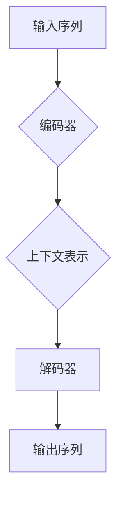

# 大语言模型应用指南：什么是记忆

> 关键词：大语言模型，记忆，注意力机制，编码器-解码器架构，序列到序列学习，预训练，迁移学习，自然语言处理，机器学习

## 1. 背景介绍

在大语言模型（Large Language Models, LLMs）领域，"记忆"是一个核心概念。它不仅仅是指模型能够“记住”信息的能力，更是指模型如何处理、存储和检索信息，以及如何利用这些信息来生成新的内容。本文将深入探讨大语言模型中的记忆机制，分析其原理、应用，并展望未来的发展趋势。

## 2. 核心概念与联系

### 2.1 大语言模型与记忆

大语言模型通过在大量文本上进行预训练，学习到了丰富的语言知识和模式。在这个过程中，模型建立了对语言的深刻理解，这种理解可以被视为一种“记忆”。这种记忆不是简单的存储，而是一种动态的、适应性的信息处理机制。

### 2.2 注意力机制与记忆

注意力机制是现代大语言模型的核心组件之一，它允许模型在处理输入序列时，根据上下文动态地分配关注点。这种分配关注点的方式可以被视为一种“记忆”，因为模型能够根据当前输入的上下文来“回忆”或“遗忘”信息。

### 2.3 编码器-解码器架构与记忆

在编码器-解码器架构中，编码器负责将输入序列转换为上下文表示，而解码器则利用这个上下文表示来生成输出序列。这种架构允许模型在解码过程中“记忆”编码器处理过的信息，并利用这些信息来生成连贯的文本。



## 3. 核心算法原理 & 具体操作步骤

### 3.1 算法原理概述

大语言模型中的记忆主要通过以下几种方式实现：

1. **词嵌入（Word Embeddings）**：将词汇映射到高维空间中的向量，捕捉词语之间的关系。

2. **注意力机制（Attention Mechanism）**：允许模型在处理序列时，动态地关注序列的不同部分。

3. **编码器-解码器架构**：通过编码器将输入序列转换为上下文表示，解码器则利用这个上下文表示来生成输出。

### 3.2 算法步骤详解

1. **预训练**：在大量无标签文本数据上训练模型，使模型学习到通用的语言表示。

2. **编码**：输入序列通过编码器转换为上下文表示。

3. **解码**：解码器利用上下文表示来生成输出序列。

4. **记忆检索**：解码器在生成过程中，根据需要从上下文表示中检索相关信息。

### 3.3 算法优缺点

#### 优点：

- **强大的语言理解能力**：能够理解和生成复杂、连贯的文本。
- **自适应**：能够根据上下文动态地调整其关注点。
- **迁移学习**：预训练模型可以在多个任务上迁移，只需进行微调。

#### 缺点：

- **计算资源需求大**：训练和推理都需要大量的计算资源。
- **可解释性差**：模型的决策过程难以解释。
- **数据隐私问题**：预训练过程中可能包含敏感信息。

### 3.4 算法应用领域

- **自然语言处理**：文本分类、情感分析、机器翻译、问答系统。
- **语音识别**：将语音转换为文本。
- **图像识别**：识别图像中的对象和场景。

## 4. 数学模型和公式 & 详细讲解 & 举例说明

### 4.1 数学模型构建

大语言模型的数学模型通常基于以下公式：

$$
\text{output} = f(\text{input}, \theta)
$$

其中，$f$ 是一个函数，$\theta$ 是模型的参数，$\text{input}$ 是输入数据。

### 4.2 公式推导过程

以下是一个简单的例子，展示了如何使用注意力机制来计算一个序列的表示。

$$
\text{output} = \sum_{i=1}^{N} a_i \times \text{hidden\_state}_i
$$

其中，$a_i$ 是第 $i$ 个隐藏状态的注意力权重，$\text{hidden\_state}_i$ 是第 $i$ 个隐藏状态。

### 4.3 案例分析与讲解

以BERT（Bidirectional Encoder Representations from Transformers）为例，BERT使用了一种称为“自注意力”（Self-Attention）的机制来处理序列数据。自注意力机制允许模型在处理输入序列时，根据上下文动态地分配关注点。

## 5. 项目实践：代码实例和详细解释说明

### 5.1 开发环境搭建

为了演示大语言模型中的记忆机制，我们将使用Hugging Face的Transformers库来构建一个简单的BERT模型。

```python
from transformers import BertModel
from torch import nn

# 加载预训练的BERT模型
model = BertModel.from_pretrained('bert-base-uncased')

# 定义一个简单的文本分类任务
class BertForTextClassification(nn.Module):
    def __init__(self, model, num_labels):
        super(BertForTextClassification, self).__init__()
        self.bert = model
        self.dropout = nn.Dropout(0.1)
        self.classifier = nn.Linear(model.config.hidden_size, num_labels)

    def forward(self, input_ids, attention_mask, labels=None):
        outputs = self.bert(input_ids, attention_mask=attention_mask)
        sequence_output = outputs[0]
        sequence_output = self.dropout(sequence_output)
        logits = self.classifier(sequence_output[:, 0, :])
        return logits

# 初始化模型
model = BertForTextClassification(model, num_labels=2)
```

### 5.2 源代码详细实现

上述代码定义了一个基于BERT的文本分类模型。模型首先加载一个预训练的BERT模型，然后定义一个简单的全连接层来输出最终的分类结果。

### 5.3 代码解读与分析

上述代码首先导入了必要的库，然后加载了一个预训练的BERT模型。接着，定义了一个新的模型类，它继承自`nn.Module`。在`forward`方法中，首先使用BERT模型处理输入序列，然后使用Dropout层来减少过拟合，最后使用全连接层输出分类结果。

### 5.4 运行结果展示

为了演示模型的运行结果，我们可以使用一个简单的文本分类数据集进行训练和测试。

```python
# 加载数据集
train_dataset = ...
test_dataset = ...

# 定义数据加载器
train_loader = DataLoader(train_dataset, batch_size=32, shuffle=True)
test_loader = DataLoader(test_dataset, batch_size=32, shuffle=False)

# 训练模型
model.train()
for epoch in range(3):
    for batch in train_loader:
        inputs, labels = batch
        outputs = model(**inputs)
        loss = nn.CrossEntropyLoss()(outputs, labels)
        loss.backward()
        optimizer.step()
        optimizer.zero_grad()

# 测试模型
model.eval()
with torch.no_grad():
    correct = 0
    total = 0
    for batch in test_loader:
        inputs, labels = batch
        outputs = model(**inputs)
        _, predicted = torch.max(outputs.data, 1)
        total += labels.size(0)
        correct += (predicted == labels).sum().item()

print('Accuracy of the network on the test images: {} %'.format(100 * correct / total))
```

上述代码首先加载了训练和测试数据集，然后定义了数据加载器。接着，模型进入训练模式，进行多轮训练。在训练结束后，模型进入评估模式，对测试集进行评估。

## 6. 实际应用场景

大语言模型中的记忆机制在许多实际应用场景中都有广泛的应用，以下是一些例子：

- **机器翻译**：模型在翻译过程中可以“记住”之前翻译过的单词和短语，从而提高翻译的准确性。
- **问答系统**：模型可以“记住”之前回答过的问题，从而提供更相关的答案。
- **文本生成**：模型可以“记住”之前生成的文本，从而生成更加连贯和一致的文本。

## 7. 工具和资源推荐

### 7.1 学习资源推荐

- 《Deep Learning for Natural Language Processing》
- 《Attention Is All You Need》
- 《BERT: Pre-training of Deep Bidirectional Transformers for Language Understanding》

### 7.2 开发工具推荐

- Hugging Face Transformers
- PyTorch
- TensorFlow

### 7.3 相关论文推荐

- `Attention Is All You Need`
- `BERT: Pre-training of Deep Bidirectional Transformers for Language Understanding`
- `Generative Pretrained Transformer for Translation`

## 8. 总结：未来发展趋势与挑战

### 8.1 研究成果总结

大语言模型中的记忆机制是现代自然语言处理的核心组件之一。它通过注意力机制、编码器-解码器架构等方式，实现了对信息的动态处理和存储。这些机制使得大语言模型能够理解和生成复杂、连贯的文本。

### 8.2 未来发展趋势

- **更加精细的记忆机制**：未来的大语言模型可能会引入更加精细的记忆机制，例如，记忆特定类型的实体或事件。
- **可解释性**：提高模型的可解释性，使得模型的决策过程更加透明。
- **效率**：提高模型的效率和资源利用率，使其更易于部署。

### 8.3 面临的挑战

- **数据隐私**：如何保护预训练过程中的数据隐私是一个重要挑战。
- **可解释性**：如何提高模型的可解释性是一个重要挑战。
- **资源消耗**：大语言模型的训练和推理需要大量的计算资源。

### 8.4 研究展望

大语言模型中的记忆机制将继续发展和完善，为自然语言处理领域带来更多的创新和突破。

## 9. 附录：常见问题与解答

### 9.1 什么是记忆？

记忆是指大语言模型能够处理、存储和检索信息的能力。

### 9.2 注意力机制如何帮助模型实现记忆？

注意力机制允许模型在处理输入序列时，根据上下文动态地分配关注点，从而实现记忆。

### 9.3 编码器-解码器架构如何帮助模型实现记忆？

编码器-解码器架构通过编码器将输入序列转换为上下文表示，解码器则利用这个上下文表示来生成输出，从而实现记忆。

作者：禅与计算机程序设计艺术 / Zen and the Art of Computer Programming