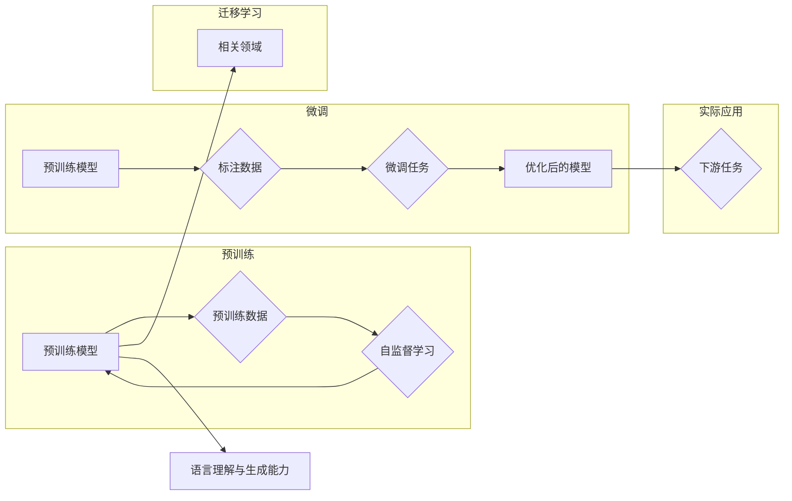

> 关键词：大语言模型，生态，未来，预训练，微调，NLP，AI，应用，技术

# 大语言模型应用指南：大语言模型的生态与未来

> 人工智能的浪潮正在席卷全球，而大语言模型（Large Language Models，LLMs）作为其中的一颗璀璨明珠，正以其无与伦比的能力，改变着我们的工作方式、生活方式乃至整个社会。本文将深入探讨大语言模型的生态构建、应用实践及其未来发展趋势，为读者提供一份全面的大语言模型应用指南。

## 1. 背景介绍

### 1.1 问题的由来

随着深度学习技术的飞速发展，自然语言处理（NLP）领域取得了突破性进展。从早期的统计机器学习方法到深度神经网络的应用，再到如今的预训练大语言模型，NLP技术正逐渐走向成熟。然而，传统的NLP模型往往需要大量的标注数据，且难以处理复杂任务。大语言模型的出现，为我们解决这些问题提供了新的思路。

### 1.2 研究现状

大语言模型的核心思想是在海量无标签文本数据上进行预训练，学习通用语言知识，并在此基础上进行下游任务的微调（Fine-Tuning）。目前，最具代表性的大语言模型包括BERT、GPT、T5等。这些模型在多个NLP任务上取得了令人瞩目的成绩，如文本分类、机器翻译、问答系统等。

### 1.3 研究意义

大语言模型的应用具有以下重要意义：

- **降低开发成本**：大语言模型的预训练过程已经完成了对通用语言知识的积累，开发者只需在特定领域进行微调，即可快速构建应用。
- **提升模型性能**：大语言模型在预训练过程中积累了丰富的语言知识，能够有效提升下游任务的性能。
- **加速技术进步**：大语言模型的兴起推动了NLP技术的快速发展，为相关领域的创新提供了新的动力。

### 1.4 本文结构

本文将从以下几个方面展开：

- 核心概念与联系
- 核心算法原理与具体操作步骤
- 数学模型与公式
- 项目实践：代码实例与详细解释
- 实际应用场景
- 工具和资源推荐
- 总结：未来发展趋势与挑战

## 2. 核心概念与联系

### 2.1 核心概念

- **大语言模型（Large Language Models，LLMs）**：在海量无标签文本数据上进行预训练，具备强大语言理解和生成能力的模型。
- **预训练（Pre-training）**：在大规模无标签文本语料上进行自监督学习，使模型学习通用语言知识。
- **微调（Fine-Tuning）**：在预训练模型的基础上，使用少量标注数据优化模型在特定任务上的性能。
- **迁移学习（Transfer Learning）**：将一个领域学习到的知识迁移应用到另一个相关领域的学习范式。

### 2.2 Mermaid流程图



## 3. 核心算法原理与具体操作步骤

### 3.1 算法原理概述

大语言模型微调的核心是利用预训练模型在通用语料上的知识，通过在特定领域的标注数据上进行微调，使模型能够更好地适应下游任务。

### 3.2 算法步骤详解

1. **选择预训练模型**：选择合适的预训练模型作为基础，如BERT、GPT等。
2. **准备标注数据**：收集特定领域的标注数据，用于微调模型。
3. **设计微调任务**：根据下游任务设计合适的微调任务，如文本分类、命名实体识别等。
4. **微调模型**：在标注数据上对预训练模型进行微调，优化模型参数。
5. **评估模型性能**：在测试集上评估微调后模型的性能，并进行调整。

### 3.3 算法优缺点

#### 优点：

- **性能优异**：大语言模型在预训练阶段积累了丰富的语言知识，能够有效提升下游任务的性能。
- **开发效率高**：只需少量标注数据，即可快速构建应用。
- **适用性强**：可应用于各种NLP任务。

#### 缺点：

- **数据依赖性**：微调效果很大程度上取决于标注数据的质量和数量。
- **计算资源消耗大**：微调过程需要大量的计算资源。

### 3.4 算法应用领域

大语言模型微调技术已广泛应用于以下领域：

- **文本分类**：如新闻分类、情感分析等。
- **机器翻译**：如英译中、中译英等。
- **问答系统**：如知识图谱问答、对话式问答等。
- **文本生成**：如自动写作、对话生成等。

## 4. 数学模型与公式

### 4.1 数学模型构建

大语言模型微调的数学模型主要涉及以下内容：

- **预训练模型**：如BERT、GPT等，其数学模型通常基于神经网络，包含多个层和激活函数。
- **微调任务**：如文本分类、命名实体识别等，其数学模型通常包括输入层、隐藏层和输出层。

### 4.2 公式推导过程

以BERT模型为例，其预训练阶段的数学模型如下：

$$
\text{[CLS]} \text{[SEP]} X_1, \text{[CLS]} \text{[SEP]} X_2 = \text{Transformer}(X_1, X_2)
$$

其中，$X_1$ 和 $X_2$ 分别代表输入的两个句子，$\text{[CLS]}$ 和 $\text{[SEP]}$ 是特殊的[CLS]和[SEP]标记，$\text{Transformer}$ 表示Transformer模型。

微调阶段的数学模型如下：

$$
\text{[CLS]} \text{[SEP]} X_1, \text{[CLS]} \text{[SEP]} X_2 = \text{Transformer}(X_1, X_2)
$$
$$
[CLS]_1 = \text{pooler}([CLS]_1, [SEP]_1)
$$
$$
[CLS]_2 = \text{pooler}([CLS]_2, [SEP]_2)
$$

其中，$[CLS]_1$ 和 $[CLS]_2$ 分别代表两个句子[CLS]标记的输出，$\text{pooler}$ 表示池化操作。

### 4.3 案例分析与讲解

以文本分类任务为例，假设我们使用BERT模型进行微调。

1. **预训练模型**：使用预训练的BERT模型。
2. **微调任务**：设计一个文本分类任务，如情感分析。
3. **微调过程**：在标注数据上对BERT模型进行微调，优化模型参数。
4. **评估模型性能**：在测试集上评估微调后模型的性能，并进行调整。

通过以上步骤，我们可以构建一个基于BERT模型的情感分析模型，并对其性能进行评估。

## 5. 项目实践：代码实例与详细解释

### 5.1 开发环境搭建

以下是使用Python和PyTorch搭建大语言模型微调开发环境的基本步骤：

1. 安装Anaconda：
```bash
conda create -n pytorch-env python=3.8
conda activate pytorch-env
```

2. 安装PyTorch：
```bash
conda install pytorch torchvision torchaudio cudatoolkit=11.3 -c pytorch -c conda-forge
```

3. 安装Hugging Face Transformers库：
```bash
pip install transformers
```

### 5.2 源代码详细实现

以下是一个使用PyTorch和Transformers库进行BERT情感分析微调的简单示例：

```python
from transformers import BertTokenizer, BertForSequenceClassification, AdamW, get_linear_schedule_with_warmup
from torch.utils.data import DataLoader, TensorDataset
from torch.optim import Adam
import torch

# 加载数据
def load_data():
    # 加载预训练模型和分词器
    tokenizer = BertTokenizer.from_pretrained('bert-base-chinese')
    model = BertForSequenceClassification.from_pretrained('bert-base-chinese')

    # 加载标注数据
    texts = ["这是一个好产品", "这是一个差产品", "这是一个一般的产品"]
    labels = [1, 0, 2]  # 1:正面，0:负面，2:中性

    # 编码文本
    encodings = tokenizer(texts, truncation=True, padding=True, max_length=128)
    input_ids = torch.tensor(encodings['input_ids'])
    attention_mask = torch.tensor(encodings['attention_mask'])
    labels = torch.tensor(labels)

    # 创建数据集和 DataLoader
    dataset = TensorDataset(input_ids, attention_mask, labels)
    dataloader = DataLoader(dataset, batch_size=2, shuffle=True)

    return dataloader

# 训练模型
def train_model(dataloader, model, optimizer, scheduler):
    model.train()
    for epoch in range(3):
        total_loss = 0
        for batch in dataloader:
            input_ids = batch[0].to(device)
            attention_mask = batch[1].to(device)
            labels = batch[2].to(device)

            optimizer.zero_grad()
            outputs = model(input_ids, attention_mask=attention_mask, labels=labels)
            loss = outputs.loss
            total_loss += loss.item()
            loss.backward()
            optimizer.step()
            scheduler.step()
        print(f"Epoch {epoch + 1}, loss: {total_loss / len(dataloader)}")

# 主函数
if __name__ == "__main__":
    device = torch.device("cuda" if torch.cuda.is_available() else "cpu")
    dataloader = load_data()
    model = BertForSequenceClassification.from_pretrained('bert-base-chinese')
    model.to(device)

    optimizer = AdamW(model.parameters(), lr=5e-5)
    scheduler = get_linear_schedule_with_warmup(optimizer, num_warmup_steps=0, num_training_steps=len(dataloader) * 3)

    train_model(dataloader, model, optimizer, scheduler)
```

### 5.3 代码解读与分析

以上代码展示了使用PyTorch和Transformers库进行BERT情感分析微调的基本流程：

1. 加载数据：加载预训练模型、分词器、标注数据，并对文本进行编码。
2. 定义模型、优化器和学习率调度器：选择预训练的BERT模型作为基础模型，并定义AdamW优化器和线性学习率调度器。
3. 训练模型：在训练集上迭代训练模型，优化模型参数。
4. 主函数：设置设备、加载数据、创建模型、优化器和学习率调度器，并调用训练模型函数。

通过以上步骤，我们可以实现一个简单的BERT情感分析微调模型。

### 5.4 运行结果展示

运行以上代码，我们可以在控制台看到训练过程中的loss信息。训练结束后，我们可以使用测试集评估模型的性能。

## 6. 实际应用场景

### 6.1 智能客服

大语言模型在智能客服领域的应用主要体现在以下几个方面：

- **自动回答常见问题**：通过微调预训练模型，使模型能够自动回答用户提出的常见问题。
- **智能推荐**：根据用户的问题和偏好，推荐相关产品或服务。
- **个性化服务**：根据用户的历史交互数据，提供个性化的服务。

### 6.2 自动写作

大语言模型在自动写作领域的应用主要体现在以下几个方面：

- **自动生成文章**：根据用户输入的关键词或主题，自动生成文章。
- **自动摘要**：对长篇文章进行摘要，提取关键信息。
- **自动翻译**：将文章翻译成不同语言。

### 6.3 机器翻译

大语言模型在机器翻译领域的应用主要体现在以下几个方面：

- **准确率提升**：通过微调预训练模型，提高翻译的准确率。
- **速度提升**：通过模型压缩、量化等技术，提高翻译速度。
- **个性化翻译**：根据用户的需求，提供个性化的翻译结果。

### 6.4 未来应用展望

随着大语言模型技术的不断发展，其在各个领域的应用将更加广泛，如：

- **教育领域**：自动批改作业、个性化教学、智能辅导。
- **医疗领域**：辅助诊断、药物研发、智能问诊。
- **金融领域**：风险控制、智能投顾、欺诈检测。

## 7. 工具和资源推荐

### 7.1 学习资源推荐

- **《深度学习自然语言处理》**：由斯坦福大学开设的NLP课程，讲解NLP领域的经典模型和算法。
- **《BERT实战》**：介绍了BERT模型的结构、原理和应用，适合初学者和进阶者。
- **《自然语言处理与深度学习》**：系统讲解了NLP和深度学习的基础知识，适合入门学习。

### 7.2 开发工具推荐

- **PyTorch**：开源的深度学习框架，适合进行NLP模型开发。
- **TensorFlow**：开源的深度学习框架，适合进行大规模NLP模型开发。
- **Hugging Face Transformers**：开源的NLP工具库，提供了丰富的预训练模型和API。

### 7.3 相关论文推荐

- **BERT: Pre-training of Deep Bidirectional Transformers for Language Understanding**：BERT模型的原论文，介绍了BERT模型的结构和原理。
- **Language Models are Unsupervised Multitask Learners**：GPT-2模型的原论文，介绍了GPT-2模型的结构和原理。
- **Transformers: State-of-the-Art General Language Modeling with Transformer**：Transformer模型的原论文，介绍了Transformer模型的结构和原理。

## 8. 总结：未来发展趋势与挑战

### 8.1 研究成果总结

大语言模型微调技术是NLP领域的重要突破，为各种NLP任务提供了强大的解决方案。通过预训练和微调，大语言模型能够有效地学习通用语言知识，并应用于各种实际场景。

### 8.2 未来发展趋势

- **模型规模不断扩大**：随着计算能力的提升，大语言模型的规模将继续扩大，模型参数量将不断增长。
- **多模态融合**：大语言模型将与图像、语音等多模态信息进行融合，实现更加丰富的应用。
- **可解释性增强**：大语言模型的可解释性将得到提升，使其更加可靠和可信。

### 8.3 面临的挑战

- **计算资源消耗**：大语言模型的训练和推理需要大量的计算资源。
- **数据依赖性**：微调效果很大程度上取决于标注数据的质量和数量。
- **伦理和偏见**：大语言模型可能存在偏见和歧视，需要加强监管和治理。

### 8.4 研究展望

未来，大语言模型微调技术将在以下方面取得突破：

- **降低计算成本**：通过模型压缩、量化等技术，降低大语言模型的计算成本。
- **提高数据利用效率**：通过自监督学习、半监督学习等技术，提高数据利用效率。
- **增强可解释性和可靠性**：通过因果推断、博弈论等技术，增强大语言模型的可解释性和可靠性。

## 9. 附录：常见问题与解答

**Q1：大语言模型微调的难点有哪些？**

A1：大语言模型微调的难点主要包括：

- **计算资源消耗**：大语言模型的训练和推理需要大量的计算资源。
- **数据依赖性**：微调效果很大程度上取决于标注数据的质量和数量。
- **模型复杂度高**：大语言模型的模型结构复杂，难以理解和调试。

**Q2：如何选择合适的预训练模型？**

A2：选择合适的预训练模型需要考虑以下因素：

- **任务类型**：不同的任务需要选择不同类型的预训练模型。
- **数据规模**：数据规模较大的任务需要选择参数量较大的预训练模型。
- **计算资源**：计算资源有限的情况下，需要选择参数量较小的预训练模型。

**Q3：如何提高微调模型的性能？**

A3：提高微调模型的性能可以从以下几个方面入手：

- **增加标注数据**：收集更多的标注数据，提高模型的泛化能力。
- **改进模型结构**：设计更有效的模型结构，提高模型的性能。
- **优化训练策略**：优化训练策略，如调整学习率、使用正则化等。

**Q4：大语言模型微调的伦理和偏见问题如何解决？**

A4：解决大语言模型微调的伦理和偏见问题需要从以下几个方面入手：

- **数据清洗**：清洗训练数据，去除偏见和歧视信息。
- **模型评估**：使用公平性评估指标，评估模型的公平性和可靠性。
- **算法设计**：在设计算法时考虑伦理和公平性问题。

作者：禅与计算机程序设计艺术 / Zen and the Art of Computer Programming