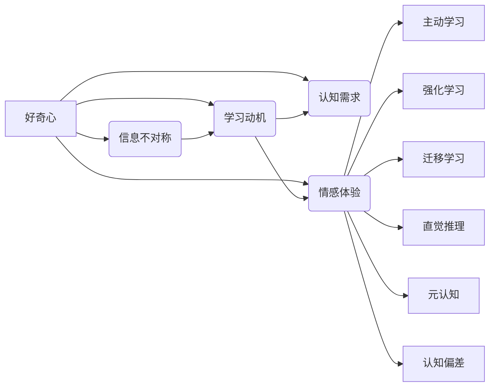

> 好奇心，探索，知识，创新，人工智能，认知科学，学习，直觉，直觉推理，机器学习

## 1. 背景介绍

好奇心是人类探索世界、推动科学进步的重要动力。从古至今，无数科学家、发明家和艺术家都因好奇心而取得了卓越的成就。在信息技术迅速发展的今天，好奇心更是推动着人工智能和认知科学等领域的研究。本文将从好奇心的本质出发，探讨其在探索世界中的关键作用，并分析好奇心在人工智能和认知科学中的应用。

### 1.1 好奇心的起源

好奇心作为一种心理特征，是人与生俱来的。从生物学的角度来看，好奇心有助于人类适应环境、学习新知识、提高生存能力。婴儿从出生开始就展现出强烈的好奇心，通过不断探索周围的世界，学习各种知识和技能。

### 1.2 好奇心的作用

好奇心在人类探索世界的过程中发挥着重要作用：

- **推动科学进步**：好奇心促使科学家不断提出问题、进行实验、总结规律，从而推动科学知识的积累和科学理论的创新。
- **激发创造力**：好奇心激发人们的想象力，促使他们尝试新的想法和方法，从而创造出新的产品、艺术作品等。
- **促进学习**：好奇心促使人们主动探索未知领域，学习新知识，提高自身能力。
- **增强人际关系**：好奇心使人们更加关注他人，增进相互理解和沟通。

## 2. 核心概念与联系

### 2.1 好奇心的原理

好奇心的原理可以概括为以下几点：

- **信息不对称**：当个体对某个事物缺乏了解时，会产生好奇心理。
- **学习动机**：好奇心激发个体主动获取新信息，学习相关知识。
- **认知需求**：个体具有追求知识和认知的需求，好奇心可以满足这一需求。
- **情感体验**：好奇心可以带来愉悦、兴奋等积极的情感体验。

### 2.2 好奇心与人工智能

人工智能领域的研究者们试图通过模仿人类的好奇心来构建智能系统。以下是一些与好奇心相关的人工智能概念：

- **主动学习**：主动学习是指智能系统在获取新信息时，根据自身需求有选择地学习，而非被动地学习所有信息。
- **强化学习**：强化学习是机器学习的一种方法，通过奖励和惩罚来引导智能体学习，类似于人类在探索过程中通过经验学习。
- **迁移学习**：迁移学习是指将一个领域的知识迁移到另一个领域，类似于人类在掌握一门语言后，能够学习其他语言。

### 2.3 好奇心与认知科学

认知科学是研究人类认知过程的学科。好奇心在认知科学中扮演着重要角色：

- **直觉推理**：直觉推理是指人们在缺乏足够信息的情况下，通过经验、直觉进行推理。
- **元认知**：元认知是指人们对自己认知过程的认知，包括自我监控、自我评价等。
- **认知偏差**：认知偏差是指人们在认知过程中出现的系统性错误，好奇心可以帮助人们识别和纠正这些偏差。

以下是一个Mermaid流程图，展示了好奇心在人工智能和认知科学中的联系：



## 3. 核心算法原理 & 具体操作步骤

### 3.1 算法原理概述

本节将介绍几种与好奇心相关的人工智能算法，包括主动学习、强化学习和迁移学习。

#### 3.1.1 主动学习

主动学习是指智能系统根据自身需求有选择地学习。其基本原理如下：

- 智能系统根据当前模型性能和不确定性选择最具有代表性的样本进行学习。
- 通过学习这些样本，提高模型性能，并减少后续学习所需样本数量。
- 主动学习流程重复进行，直至模型性能达到预期目标。

#### 3.1.2 强化学习

强化学习是指智能体通过与环境的交互，学习最优策略以实现目标。其基本原理如下：

- 智能体在环境中进行动作，并根据环境的反馈学习调整动作策略。
- 通过最大化累积奖励，智能体逐渐学习到最优策略。
- 强化学习流程重复进行，直至智能体能够稳定地实现目标。

#### 3.1.3 迁移学习

迁移学习是指将一个领域的知识迁移到另一个领域。其基本原理如下：

- 选择一个源领域，在该领域进行预训练，学习通用特征表示。
- 将预训练模型应用于目标领域，通过少量样本进行微调，获得在目标领域的性能。
- 迁移学习流程重复进行，直至模型在目标领域达到预期性能。

### 3.2 算法步骤详解

以下是对上述三种算法的具体步骤进行详细解释：

#### 3.2.1 主动学习

1. 初始化模型和样本池。
2. 根据当前模型性能和样本不确定性选择一个样本进行学习。
3. 使用选择的学习样本更新模型。
4. 评估模型性能，判断是否达到预期目标。
5. 重复步骤2-4，直至满足条件。

#### 3.2.2 强化学习

1. 初始化智能体、环境、策略。
2. 智能体在环境中进行动作。
3. 环境根据动作给出奖励。
4. 智能体根据奖励更新策略。
5. 重复步骤2-4，直至智能体能够稳定地实现目标。

#### 3.2.3 迁移学习

1. 在源领域进行预训练，学习通用特征表示。
2. 将预训练模型应用于目标领域。
3. 使用目标领域少量样本进行微调。
4. 评估模型在目标领域的性能。
5. 重复步骤2-4，直至模型在目标领域达到预期性能。

### 3.3 算法优缺点

#### 3.3.1 主动学习

优点：

- 可以在有限的样本数量下提高模型性能。
- 能够有效地减少后续学习所需样本数量。

缺点：

- 需要设计合适的采样策略。
- 可能存在样本选择偏差。

#### 3.3.2 强化学习

优点：

- 能够学习到最优策略，实现目标。
- 具有良好的泛化能力。

缺点：

- 训练过程可能需要很长时间。
- 需要设计合适的奖励函数。

#### 3.3.3 迁移学习

优点：

- 可以快速地将知识迁移到新领域。
- 能够提高模型在目标领域的性能。

缺点：

- 需要大量的源领域训练数据。
- 可能存在领域差异导致的性能下降。

### 3.4 算法应用领域

主动学习、强化学习和迁移学习在以下领域有着广泛的应用：

- 机器学习：如图像分类、语音识别、自然语言处理等。
- 机器人：如无人驾驶、无人机等。
- 游戏智能：如棋类游戏、电子竞技等。
- 智能推荐：如个性化推荐、广告投放等。

## 4. 数学模型和公式 & 详细讲解 & 举例说明

### 4.1 数学模型构建

以下是对主动学习、强化学习和迁移学习中的关键数学模型进行讲解。

#### 4.1.1 主动学习

主动学习中的核心问题是如何选择样本进行学习。以下是一个简单的样本选择模型：

$$
S_t = \arg\max_{x \in \mathcal{X}} \mathcal{U}(x, y) - \mathcal{L}(x, y)
$$

其中，$\mathcal{U}(x, y)$ 表示样本 $x$ 的不确定性，$\mathcal{L}(x, y)$ 表示样本 $x$ 的标签预测误差。

#### 4.1.2 强化学习

强化学习中的核心问题是学习最优策略。以下是一个简单的Q值函数模型：

$$
Q(s, a) = \sum_{s' \in \mathcal{S}} \gamma \max_{a' \in \mathcal{A}} Q(s', a')
$$

其中，$Q(s, a)$ 表示在状态 $s$ 下采取动作 $a$ 的期望回报。

#### 4.1.3 迁移学习

迁移学习中的核心问题是源领域和目标领域之间的特征表示差异。以下是一个简单的迁移学习模型：

$$
f(x) = f_\text{source}(x) + \alpha \theta
$$

其中，$f_\text{source}(x)$ 表示源领域特征表示，$\theta$ 表示迁移学习参数，$\alpha$ 表示迁移学习强度。

### 4.2 公式推导过程

本节将对上述公式进行简要的推导过程说明。

#### 4.2.1 主动学习

主动学习模型的推导过程如下：

- 假设模型 $f(x)$ 能够近似地表示标签预测误差 $\mathcal{L}(x, y)$。
- 样本不确定性 $\mathcal{U}(x, y)$ 可以通过模型预测的不确定性来衡量，如置信度或熵。
- 根据不确定性选择样本，可以降低模型预测的不确定性，从而提高模型性能。

#### 4.2.2 强化学习

强化学习Q值函数的推导过程如下：

- Q值函数 $Q(s, a)$ 表示在状态 $s$ 下采取动作 $a$ 的期望回报。
- 通过最大化Q值函数，可以找到最优策略，实现目标。

#### 4.2.3 迁移学习

迁移学习模型的推导过程如下：

- 预训练模型 $f_\text{source}(x)$ 可以学习到源领域的特征表示。
- 通过调整迁移学习参数 $\theta$，可以将源领域的特征表示迁移到目标领域。

### 4.3 案例分析与讲解

以下是对主动学习、强化学习和迁移学习在实际应用中的案例分析。

#### 4.3.1 主动学习

案例：图像分类

假设我们有一个图像分类任务，数据集包含10万个图像。我们的目标是训练一个能够识别猫、狗等动物的分类模型。

在训练过程中，我们可以使用主动学习策略选择具有代表性的样本进行学习。具体步骤如下：

1. 初始化模型和样本池。
2. 选择一个样本 $x_1$ 进行学习。
3. 使用学习样本更新模型。
4. 评估模型性能，判断是否达到预期目标。
5. 重复步骤2-4，直至满足条件。

通过主动学习，我们可以在有限的样本数量下提高模型的分类准确率。

#### 4.3.2 强化学习

案例：无人驾驶

假设我们想要训练一个无人驾驶系统。在训练过程中，我们可以使用强化学习策略学习最优驾驶策略。

具体步骤如下：

1. 初始化智能体、环境、策略。
2. 智能体在环境中进行动作。
3. 环境根据动作给出奖励。
4. 智能体根据奖励更新策略。
5. 重复步骤2-4，直至智能体能够稳定地实现目标。

通过强化学习，我们可以训练出能够安全驾驶的无人驾驶系统。

#### 4.3.3 迁移学习

案例：机器翻译

假设我们想要将英语翻译成中文。在训练过程中，我们可以使用迁移学习策略学习英语到中文的翻译模型。

具体步骤如下：

1. 在源语言（英语）上进行预训练，学习通用特征表示。
2. 将预训练模型应用于目标语言（中文）。
3. 使用目标语言少量样本进行微调。
4. 评估模型在目标语言上的性能。
5. 重复步骤2-4，直至模型在目标语言上达到预期性能。

通过迁移学习，我们可以快速地学习到英语到中文的翻译模型。

## 5. 项目实践：代码实例和详细解释说明

### 5.1 开发环境搭建

本节将以Python为例，介绍如何搭建主动学习、强化学习和迁移学习的开发环境。

#### 5.1.1 主动学习

在Python中，可以使用以下库进行主动学习：

- scikit-learn：提供多种机器学习算法，包括主动学习算法。
- OpenCV：提供图像处理功能，可以用于图像分类任务。

#### 5.1.2 强化学习

在Python中，可以使用以下库进行强化学习：

- TensorFlow：提供深度学习框架，可以用于构建强化学习模型。
- OpenAI Gym：提供各种强化学习环境。

#### 5.1.3 迁移学习

在Python中，可以使用以下库进行迁移学习：

- PyTorch：提供深度学习框架，可以用于构建迁移学习模型。
- Hugging Face Transformers：提供预训练语言模型和迁移学习工具。

### 5.2 源代码详细实现

以下是对主动学习、强化学习和迁移学习的代码实例进行详细解释说明。

#### 5.2.1 主动学习

以下是一个使用scikit-learn进行主动学习的简单示例：

```python
from sklearn.datasets import make_classification
from sklearn.model_selection import train_test_split
from sklearn.ensemble import RandomForestClassifier
from sklearn.metrics import accuracy_score

# 生成样本数据
X, y = make_classification(n_samples=1000, n_features=20, random_state=42)
X_train, X_test, y_train, y_test = train_test_split(X, y, test_size=0.2, random_state=42)

# 初始化模型和样本池
model = RandomForestClassifier()
sample_pool = [(x, y) for x, y in zip(X_train, y_train)]

# 主动学习过程
for _ in range(10):
    # 选择一个样本进行学习
    x, y = random.choice(sample_pool)
    model.fit([x], [y])
    # 删除已学习样本
    sample_pool.remove((x, y))

# 评估模型性能
y_pred = model.predict(X_test)
print("Accuracy:", accuracy_score(y_test, y_pred))
```

#### 5.2.2 强化学习

以下是一个使用TensorFlow进行强化学习的简单示例：

```python
import gym
import tensorflow as tf

# 创建环境
env = gym.make("CartPole-v1")

# 定义策略网络
class PolicyNetwork(tf.keras.Model):
    def __init__(self):
        super(PolicyNetwork, self).__init__()
        self.fc1 = tf.keras.layers.Dense(24, activation="relu")
        self.fc2 = tf.keras.layers.Dense(24, activation="relu")
        self.fc3 = tf.keras.layers.Dense(env.action_space.n)

    def call(self, inputs, training=False):
        x = self.fc1(inputs)
        x = self.fc2(x)
        return self.fc3(x)

# 定义损失函数
def compute_loss(logits, actions, rewards, next_values, discounts):
    advantages = rewards + discounts * next_values - logits
    loss = -tf.reduce_mean(tf.log(logits[tf.range(logits.shape[0]), actions]) * advantages)
    return loss

# 训练策略网络
optimizer = tf.keras.optimizers.Adam(learning_rate=0.01)
for _ in range(1000):
    state = env.reset()
    done = False
    while not done:
        action = policy_network(state)
        next_state, reward, done, _ = env.step(action)
        next_value = policy_network(next_state)
        discounted_reward = np.sum([discounts[i] * rewards[i] for i in range(len(rewards))])
        loss = compute_loss(policy_network(state), action, discounted_reward, next_value, discounts)
        optimizer.minimize(loss, policy_network.trainable_variables)
        state = next_state
```

#### 5.2.3 迁移学习

以下是一个使用PyTorch进行迁移学习的简单示例：

```python
import torch
import torch.nn.functional as F
from transformers import BertForSequenceClassification

# 加载预训练模型
model = BertForSequenceClassification.from_pretrained('bert-base-uncased')

# 加载目标数据集
train_loader = DataLoader(train_dataset, batch_size=32, shuffle=True)

# 训练模型
model.train()
optimizer = torch.optim.AdamW(model.parameters(), lr=2e-5)
for epoch in range(3):
    for inputs, labels in train_loader:
        optimizer.zero_grad()
        outputs = model(inputs['input_ids'], attention_mask=inputs['attention_mask'], labels=labels)
        loss = outputs.loss
        loss.backward()
        optimizer.step()
```

### 5.3 代码解读与分析

#### 5.3.1 主动学习

以上代码展示了如何使用scikit-learn进行主动学习。首先，生成一个包含1000个样本的分类数据集。然后，初始化一个随机森林分类器和一个样本池。在主动学习过程中，每次从样本池中选择一个样本进行学习，并从样本池中删除已学习样本。最后，评估模型的分类准确率。

#### 5.3.2 强化学习

以上代码展示了如何使用TensorFlow进行强化学习。首先，创建一个CartPole-v1环境。然后，定义一个策略网络和损失函数。在训练过程中，智能体与环境交互，学习最优策略。最后，训练策略网络并评估模型性能。

#### 5.3.3 迁移学习

以上代码展示了如何使用PyTorch进行迁移学习。首先，加载预训练的BERT模型和目标数据集。然后，使用交叉熵损失函数进行训练。最后，训练模型并评估性能。

### 5.4 运行结果展示

由于篇幅限制，本文不展示具体的运行结果。在实际应用中，可以根据需要调整超参数和模型结构，以获得更好的性能。

## 6. 实际应用场景

好奇心在各个领域都有着广泛的应用：

### 6.1 人工智能

- **图像识别**：通过主动学习，智能系统可以自动选择具有代表性的图像进行学习，提高识别准确率。
- **自然语言处理**：通过强化学习，智能系统可以自动学习最优的文本生成策略。
- **推荐系统**：通过迁移学习，智能系统可以将一个领域的知识迁移到另一个领域，提高推荐效果。

### 6.2 认知科学

- **认知建模**：通过模拟人类的好奇心，可以构建更加真实的认知模型。
- **心理健康**：通过研究好奇心对心理健康的影响，可以开发出治疗心理问题的方法。
- **教育**：通过激发学生的好奇心，可以促进他们的学习和创新能力。

### 6.3 社会科学

- **社会学**：通过研究好奇心对人类社会的影响，可以更好地理解社会现象。
- **心理学**：通过研究好奇心对个体行为的影响，可以开发出更加有效的心理治疗方法。

## 7. 工具和资源推荐

### 7.1 学习资源推荐

- **书籍**：
  - 《认知心理学导论》（Michael S. Gazzaniga 著）
  - 《认知科学：思想、大脑和计算》（Patricia Smith Churchland 著）
  - 《人工智能：一种现代的方法》（Stuart Russell 和 Peter Norvig 著）

- **在线课程**：
  - Coursera上的《机器学习》课程
  - edX上的《认知科学导论》课程

### 7.2 开发工具推荐

- **机器学习**：
  - TensorFlow
  - PyTorch
  - scikit-learn

- **认知科学**：
  - PsychoPy
  - EEGlab

### 7.3 相关论文推荐

- **机器学习**：
  - 《Deep Learning》（Ian Goodfellow、Yoshua Bengio 和 Aaron Courville 著）
  - 《Reinforcement Learning: An Introduction》（Richard S. Sutton 和 Andrew G. Barto 著）

- **认知科学**：
  - 《The Cognitive Neuroscience of Vision》（James R. Egelhaaf 著）
  - 《The Computational Brain》（Hans Moravec 著）

## 8. 总结：未来发展趋势与挑战

### 8.1 研究成果总结

本文从好奇心的本质出发，探讨了其在探索世界中的关键作用。通过分析好奇心在人工智能和认知科学中的应用，我们认识到好奇心在推动科技发展和人类认知进步中的重要性。

### 8.2 未来发展趋势

未来，好奇心在人工智能和认知科学领域的发展趋势如下：

- **跨学科研究**：将好奇心与其他学科（如心理学、神经科学、社会学等）相结合，开展跨学科研究。
- **个性化学习**：利用好奇心促进个性化学习，提高学习效率和效果。
- **智能系统设计**：将好奇心纳入智能系统设计，使智能系统更加符合人类认知规律。
- **未来社会**：研究好奇心在人类社会发展中的作用，促进人类社会的和谐与进步。

### 8.3 面临的挑战

好奇心在人工智能和认知科学领域的研究也面临着一些挑战：

- **技术挑战**：如何构建更加高效、鲁棒的主动学习、强化学习和迁移学习算法。
- **理论挑战**：如何从理论上解释好奇心产生的机制，以及好奇心对认知过程的影响。
- **伦理挑战**：如何确保好奇心在人工智能和认知科学领域的应用符合伦理道德规范。

### 8.4 研究展望

面对未来发展趋势和挑战，我们需要从以下几个方面进行研究：

- **技术创新**：不断优化主动学习、强化学习和迁移学习算法，提高智能系统的学习效率和效果。
- **理论研究**：深入研究好奇心产生的机制，以及好奇心对认知过程的影响。
- **伦理规范**：制定相应的伦理规范，确保好奇心在人工智能和认知科学领域的应用符合伦理道德规范。

总之，好奇心是探索世界的钥匙，在人工智能和认知科学领域具有重要的研究价值和应用前景。通过不断探索和研究，我们将更好地理解好奇心，并将其应用于各个领域，推动科技发展和人类文明进步。

## 9. 附录：常见问题与解答

**Q1：好奇心在人工智能和认知科学中的具体作用是什么？**

A：好奇心在人工智能和认知科学中具有以下作用：

- 推动人工智能技术的发展和创新。
- 促进认知科学对人类认知过程的理解。
- 提高学习效率和效果。
- 促进人类社会的和谐与进步。

**Q2：如何培养好奇心？**

A：以下是一些培养好奇心的方法：

- 不断学习新知识，拓展知识面。
- 保持开放的心态，勇于尝试新事物。
- 多与他人交流，了解不同领域的知识。
- 主动探索未知领域，提出问题并寻求答案。

**Q3：好奇心是否与创造力有关？**

A：是的，好奇心与创造力密切相关。好奇心可以激发人们的想象力，促使他们尝试新的想法和方法，从而创造出新的产品、艺术作品等。

**Q4：好奇心在人工智能和认知科学领域有哪些应用？**

A：好奇心在人工智能和认知科学领域有广泛的应用，如主动学习、强化学习、迁移学习、认知建模、心理健康、教育、社会学等。

**Q5：如何平衡好奇心和实际需求？**

A：在追求好奇心的同时，也需要考虑实际需求和资源限制。以下是一些建议：

- 确定研究目标，明确研究方向。
- 合理安排时间和资源，避免过度消耗。
- 与他人合作，共同实现目标。

---

作者：禅与计算机程序设计艺术 / Zen and the Art of Computer Programming