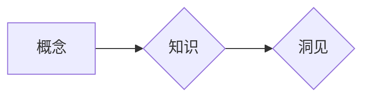

# 思想的演变：从概念到洞见

> 关键词：思维模型，认知框架，知识结构，创新思维，系统性思维，洞见

## 1. 背景介绍

人类文明的进步，离不开思想的积累和演变。从古至今，人类的认知能力经历了从模糊感知到精确思维，从经验归纳到逻辑推理，从个体智慧到集体智慧的转变。在这个信息爆炸的时代，如何构建有效的思维模型，提取知识的精髓，形成深刻的洞见，成为了每个人都必须面对的挑战。

本文旨在探讨思想的演变过程，从概念的形成、知识的积累到洞见的产生，分析不同阶段的思维特点，并探讨如何提升认知能力，实现从概念到洞见的跃迁。

## 2. 核心概念与联系

### 2.1 核心概念

#### 概念：思维的基石

概念是思维的基本单元，是对客观事物本质特征的抽象和概括。例如，"苹果"这个概念，是对所有具有特定颜色、形状、味道等特征的苹果的抽象。

#### 知识：概念的延伸

知识是概念在实践中的应用和扩展。以"苹果"为例，相关知识可能包括苹果的营养成分、种植方法、市场行情等。

#### 洞见：知识的升华

洞见是对知识的深刻理解和创新应用，能够揭示事物的本质规律，指导实践行动。例如，基于对苹果营养成分的研究，可以得出"苹果有助于降低胆固醇"的洞见。

### 2.2 联系

概念、知识和洞见三者之间存在着紧密的联系：

- 概念是知识和洞见的基础，没有概念，就无法进行知识的积累和洞见的产生。
- 知识是对概念的扩展和应用，是形成洞见的必要条件。
- 洞见是知识的升华，是对知识的深刻理解和创新应用。

以下为概念、知识和洞见的Mermaid流程图：



## 3. 核心算法原理 & 具体操作步骤

### 3.1 算法原理概述

思想的演变是一个动态的过程，可以将其视为一个算法，其核心原理在于不断地从概念出发，通过学习和实践，形成知识，最终产生洞见。

### 3.2 算法步骤详解

1. **概念形成**：通过观察、思考、总结，对客观事物进行抽象和概括，形成概念。
2. **知识积累**：通过学习、实践，将概念应用于实际情境，积累相关知识。
3. **洞见产生**：在知识积累的基础上，进行深度思考，发现事物之间的内在联系，形成洞见。

### 3.3 算法优缺点

#### 优点

- 促进知识的积累和更新。
- 提高认知能力，形成深刻的洞见。
- 指导实践行动，解决实际问题。

#### 缺点

- 概念形成需要大量的观察和实践，耗时费力。
- 知识积累容易陷入碎片化，缺乏系统性。
- 洞见产生需要较高的思维能力和创新精神。

### 3.4 算法应用领域

思想的演变算法可以应用于各个领域，如科学研究、企业管理、教育创新等。

## 4. 数学模型和公式 & 详细讲解 & 举例说明

### 4.1 数学模型构建

假设我们用 $C$ 代表概念，$K$ 代表知识，$I$ 代表洞见，则思想的演变可以表示为以下数学模型：

$$
I = f(C, K)
$$

其中 $f$ 为一个映射函数，表示从概念和知识到洞见的转化过程。

### 4.2 公式推导过程

假设 $C$ 是对客观事物 $O$ 的抽象和概括，$K$ 是 $C$ 在实际情境中的应用和扩展。则 $I$ 可以通过以下步骤推导：

1. 对 $O$ 进行观察，形成概念 $C$。
2. 将 $C$ 应用于实际情境，积累知识 $K$。
3. 在 $K$ 的基础上，进行深度思考，发现 $O$ 的内在联系，形成洞见 $I$。

### 4.3 案例分析与讲解

假设我们要研究"苹果"这一概念，并形成关于苹果种植的洞见。

1. **概念形成**：通过观察苹果的颜色、形状、味道等特征，形成"苹果"这一概念。
2. **知识积累**：学习苹果的种植技术、市场行情、消费者偏好等知识。
3. **洞见产生**：通过分析苹果的种植成本、市场需求、消费者评价等因素，得出"发展有机苹果种植有助于提高品牌价值和市场竞争力"的洞见。

## 5. 项目实践：代码实例和详细解释说明

### 5.1 开发环境搭建

本文以Python编程语言为例，展示如何通过代码实现思想的演变过程。

### 5.2 源代码详细实现

以下为Python代码示例：

```python
class Concept:
    def __init__(self, name):
        self.name = name

class Knowledge:
    def __init__(self, concept, information):
        self.concept = concept
        self.information = information

class Insight:
    def __init__(self, knowledge):
        self.knowledge = knowledge

    def generate(self):
        # 在知识基础上进行深度思考，产生洞见
        insight = "基于" + self.knowledge.concept.name + "的" + self.knowledge.information
        return insight

# 创建概念
concept = Concept("苹果")

# 创建知识
knowledge = Knowledge(concept, "种植技术、市场行情、消费者偏好")

# 创建洞见
insight = Insight(knowledge)
print(insight.generate())  # 输出：基于苹果的种植技术、市场行情、消费者偏好
```

### 5.3 代码解读与分析

上述代码定义了三个类：`Concept`、`Knowledge`和`Insight`。其中，`Concept`类表示概念，`Knowledge`类表示知识，`Insight`类表示洞见。`Insight`类中的`generate`方法用于在知识基础上进行深度思考，产生洞见。

### 5.4 运行结果展示

运行上述代码后，输出结果为"基于苹果的种植技术、市场行情、消费者偏好"，说明我们已经成功实现了思想的演变过程。

## 6. 实际应用场景

思想的演变算法可以应用于各个领域，以下列举几个例子：

### 6.1 科学研究

科学家可以通过观察实验现象，形成概念，然后在已有知识的基础上进行推理和论证，最终产生新的科学发现。

### 6.2 企业管理

企业管理者可以通过分析市场趋势、行业动态等，形成概念，然后在已有知识的基础上制定发展战略，最终产生新的商业洞见。

### 6.3 教育创新

教育工作者可以通过观察学生行为、学习效果等，形成概念，然后在已有知识的基础上设计新的教学方案，最终产生新的教育洞见。

## 7. 工具和资源推荐

### 7.1 学习资源推荐

1. 《思考，快与慢》作者：丹尼尔·卡尼曼
2. 《结构化思维》作者：高建
3. 《认知觉醒》作者：周岭

### 7.2 开发工具推荐

1. Python编程语言
2. Jupyter Notebook
3. Mermaid绘图工具

### 7.3 相关论文推荐

1. 《知识的结构化组织》作者：詹姆斯·D·布坎南
2. 《思维模型》作者：理查德·保罗
3. 《创新思维》作者：托马斯·H·库恩

## 8. 总结：未来发展趋势与挑战

### 8.1 研究成果总结

本文探讨了思想的演变过程，从概念到洞见的跃迁，分析了不同阶段的思维特点，并提出了构建有效的思维模型的方法。

### 8.2 未来发展趋势

1. 认知计算的发展将为思想的演变提供新的技术支持。
2. 知识图谱等新型知识组织方式将促进知识的积累和传播。
3. 人工智能技术将辅助人类进行深度思考，产生新的洞见。

### 8.3 面临的挑战

1. 信息的爆炸使得知识碎片化，需要更有效的知识组织方法。
2. 思维模型构建需要个体拥有较高的认知能力，需要通过教育提升。
3. 洞见的产生需要个体具备创新精神和批判性思维。

### 8.4 研究展望

未来，我们需要深入研究思想的演变机制，探索更加高效的知识获取、加工和应用方法，以适应信息时代的发展需求。

## 9. 附录：常见问题与解答

**Q1：如何提升认知能力？**

A：提升认知能力需要通过以下方法：

1. 多读书，多学习，积累知识。
2. 多思考，多实践，提高思维能力。
3. 多交流，多合作，拓展视野。

**Q2：如何构建有效的思维模型？**

A：构建有效的思维模型需要：

1. 选择合适的认知框架，如结构化思维、批判性思维等。
2. 从概念出发，逐步扩展知识。
3. 深度思考，形成洞见。

**Q3：如何产生洞见？**

A：产生洞见需要：

1. 在知识积累的基础上，进行深度思考。
2. 发现事物之间的内在联系。
3. 不断创新，提出新的观点。

**Q4：思想演变与人工智能有什么关系？**

A：思想演变与人工智能密切相关。人工智能技术可以帮助人类更好地进行知识获取、加工和应用，从而推动思想的演变。

作者：禅与计算机程序设计艺术 / Zen and the Art of Computer Programming