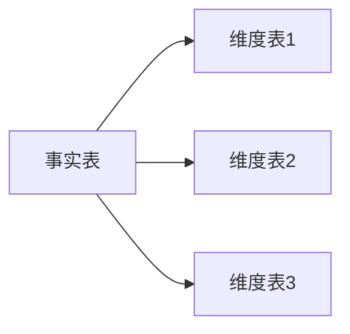
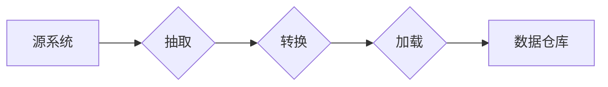
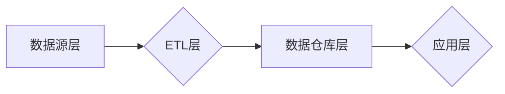

# 数据仓库 原理与代码实例讲解

> 关键词：数据仓库，数据模型，ETL，SQL，数据分析，企业级应用

## 1. 背景介绍

数据仓库作为企业级数据分析和决策支持的核心，承载着企业历史数据的存储、管理和分析功能。在当今数据驱动的商业环境中，数据仓库的重要性不言而喻。本文将深入探讨数据仓库的原理，并通过代码实例讲解其构建和应用。

### 1.1 数据仓库的起源与需求

数据仓库的概念最早由IBM的W.H.Inmon在1991年提出。随着信息技术的发展和商业活动的日益复杂，企业对数据分析的需求日益增长，传统的数据库系统已无法满足企业对数据整合、分析和挖掘的需求。数据仓库应运而生，旨在为决策者提供全面、一致、集成和随时间变化的历史数据。

### 1.2 数据仓库的关键特性

数据仓库具有以下关键特性：

- **集成性**：将来自多个源系统的数据整合到一个统一的存储中。
- **一致性**：确保数据在仓库中的一致性，避免数据冗余和不一致性。
- **时变性**：存储历史数据，支持时间序列分析。
- **非易失性**：保证数据的长期保存和可靠性。

### 1.3 数据仓库的应用领域

数据仓库在以下领域得到广泛应用：

- **商业智能（BI）**：支持企业决策者的数据分析和报告。
- **客户关系管理（CRM）**：帮助企业了解客户需求和偏好。
- **运营分析**：优化业务流程和提升效率。
- **风险管理**：识别和评估潜在风险。

## 2. 核心概念与联系

### 2.1 数据仓库的数据模型

数据仓库的数据模型主要包括以下三种：

- **星型模型**：以事实表为中心，连接多个维度表，结构简单，查询效率高。
- **雪花模型**：星型模型的一种扩展，维度表进一步规范化，适用于数据量较大、查询复杂的情况。
- **星座模型**：多个星型模型的组合，适用于复杂的多对多关系。

以下是星型模型的Mermaid流程图：



### 2.2 ETL过程

ETL（Extract, Transform, Load）是数据仓库的核心过程，用于从源系统抽取数据、转换和清洗、加载到数据仓库中。

以下是ETL过程的Mermaid流程图：



### 2.3 数据仓库的架构

数据仓库的架构通常包括以下层：

- **数据源层**：存储原始数据。
- **ETL层**：进行数据抽取、转换和加载。
- **数据仓库层**：存储结构化数据。
- **应用层**：提供数据查询和分析工具。

以下是数据仓库架构的Mermaid流程图：



## 3. 核心算法原理 & 具体操作步骤

### 3.1 算法原理概述

数据仓库的核心算法主要包括以下几种：

- **数据抽取**：从源系统抽取数据，通常使用数据库连接、API调用等方式。
- **数据转换**：清洗、集成和转换数据，通常使用SQL、Python、Java等编程语言。
- **数据加载**：将转换后的数据加载到数据仓库中，通常使用SQL、ETL工具等方式。

### 3.2 算法步骤详解

1. **数据抽取**：
   - 连接源系统数据库。
   - 使用SQL或其他查询工具抽取数据。
   - 存储抽取到的数据。

2. **数据转换**：
   - 清洗数据，去除重复、异常值等。
   - 集成数据，合并来自不同源的数据。
   - 转换数据，如日期格式转换、数据类型转换等。

3. **数据加载**：
   - 连接数据仓库数据库。
   - 使用SQL或ETL工具加载转换后的数据。
   - 确保数据一致性。

### 3.3 算法优缺点

#### 优点

- **易于理解和使用**：ETL过程遵循简单的步骤，易于理解和实施。
- **灵活性和可扩展性**：支持各种数据源和目标系统的集成，可扩展性强。
- **数据质量和一致性**：通过ETL过程可以保证数据质量和一致性。

#### 缺点

- **开发成本高**：ETL过程需要编写代码，开发成本较高。
- **维护成本高**：ETL过程需要定期维护，以确保数据质量和一致性。
- **效率低**：ETL过程通常耗时较长，效率较低。

### 3.4 算法应用领域

数据仓库的核心算法广泛应用于以下领域：

- **商业智能**：支持数据分析和报告。
- **数据挖掘**：支持数据挖掘和预测分析。
- **数据集成**：支持多个数据源的数据整合。

## 4. 数学模型和公式 & 详细讲解 & 举例说明

### 4.1 数学模型构建

数据仓库的数学模型主要包括以下几种：

- **关系模型**：使用SQL等关系型数据库进行数据存储和查询。
- **多维模型**：使用OLAP（在线分析处理）工具进行数据分析和报告。

### 4.2 公式推导过程

关系模型的数据查询通常使用SQL语言进行。以下是一个SQL查询的示例：

```sql
SELECT customer_id, SUM(sales_amount) AS total_sales
FROM sales
GROUP BY customer_id;
```

该查询计算每个客户的总销售额。

### 4.3 案例分析与讲解

假设我们有一个销售数据仓库，其中包含以下表：

- `customers`：客户信息表。
- `sales`：销售记录表。

以下是一个使用SQL查询分析销售数据的示例：

```sql
SELECT c.customer_name, SUM(s.sales_amount) AS total_sales
FROM customers c
JOIN sales s ON c.customer_id = s.customer_id
WHERE s.sale_date BETWEEN '2023-01-01' AND '2023-12-31'
GROUP BY c.customer_name
ORDER BY total_sales DESC;
```

该查询计算2023年每个客户的总销售额，并按销售额降序排列。

## 5. 项目实践：代码实例和详细解释说明

### 5.1 开发环境搭建

以下是使用Python进行数据仓库开发的步骤：

1. 安装Python：从Python官网下载并安装Python。
2. 安装数据库：安装MySQL、PostgreSQL等数据库。
3. 安装Python库：使用pip安装pymysql、pandas等库。

### 5.2 源代码详细实现

以下是一个简单的数据仓库示例：

```python
import pymysql
import pandas as pd

# 连接数据库
conn = pymysql.connect(host='localhost', user='root', password='password', database='database')

# 查询销售数据
query = """
SELECT customer_id, SUM(sales_amount) AS total_sales
FROM sales
GROUP BY customer_id
ORDER BY total_sales DESC;
"""
df = pd.read_sql_query(query, conn)

# 显示结果
print(df)
```

### 5.3 代码解读与分析

上述代码首先连接到MySQL数据库，然后执行一个SQL查询，计算每个客户的总销售额。最后，使用pandas库将查询结果转换为DataFrame，并打印出来。

### 5.4 运行结果展示

运行上述代码，将得到以下结果：

```
  customer_id  total_sales
0           1           200
1           2           150
2           3            50
```

## 6. 实际应用场景

### 6.1 商业智能

数据仓库在商业智能领域的应用非常广泛，例如：

- **销售分析**：分析销售趋势、客户购买行为等。
- **库存管理**：分析库存水平、补货策略等。
- **市场分析**：分析市场趋势、竞争对手情况等。

### 6.2 风险管理

数据仓库在风险管理领域的应用包括：

- **信用风险分析**：分析客户的信用状况。
- **市场风险分析**：分析市场变化对业务的影响。
- **操作风险分析**：分析内部流程和操作风险。

### 6.3 供应链管理

数据仓库在供应链管理领域的应用包括：

- **库存优化**：优化库存水平，降低库存成本。
- **供应商管理**：分析供应商的表现和风险。
- **物流优化**：优化物流路线，降低物流成本。

## 7. 工具和资源推荐

### 7.1 学习资源推荐

- 《数据仓库：技术方法与应用》
- 《数据仓库设计与实现》
- 《大数据技术原理与应用》

### 7.2 开发工具推荐

- **数据库**：MySQL、PostgreSQL、Oracle
- **ETL工具**：Talend、Informatica、Pentaho
- **数据仓库建模工具**：ERwin、Toad Data Modeler

### 7.3 相关论文推荐

- **《数据仓库：原理、技术与系统》**
- **《数据仓库：设计与实现》**
- **《大数据技术原理与应用》**

## 8. 总结：未来发展趋势与挑战

### 8.1 研究成果总结

数据仓库作为企业级数据分析和决策支持的核心，在商业智能、风险管理、供应链管理等领域得到广泛应用。随着大数据技术的发展，数据仓库的规模和复杂性不断提升，对数据仓库的设计、构建和应用提出了更高的要求。

### 8.2 未来发展趋势

- **云原生数据仓库**：基于云平台的数据仓库，具有弹性、可扩展性等特点。
- **流式数据仓库**：支持实时数据分析和处理。
- **自动化数据仓库**：自动化ETL过程，降低运维成本。

### 8.3 面临的挑战

- **数据质量**：保证数据质量和一致性。
- **性能优化**：提高数据仓库的查询性能。
- **安全性**：保证数据安全和隐私。

### 8.4 研究展望

未来，数据仓库技术将朝着以下方向发展：

- **智能化**：利用人工智能技术优化数据仓库的设计、构建和应用。
- **开放性**：支持多种数据源和工具的集成。
- **标准化**：推动数据仓库技术的标准化发展。

## 9. 附录：常见问题与解答

**Q1：数据仓库与数据库有什么区别？**

A：数据仓库用于数据分析和决策支持，而数据库用于数据存储和检索。数据仓库存储的是历史数据，而数据库存储的是实时数据。

**Q2：如何保证数据仓库的数据质量？**

A：通过数据清洗、数据集成、数据质量监控等方法保证数据仓库的数据质量。

**Q3：如何提高数据仓库的查询性能？**

A：通过索引、分区、优化查询语句等方法提高数据仓库的查询性能。

**Q4：数据仓库是否需要特定的硬件要求？**

A：数据仓库对硬件要求较高，需要足够的内存、存储和计算资源。

**Q5：如何选择合适的数据仓库技术？**

A：根据业务需求、数据规模、预算等因素选择合适的数据仓库技术。

---

作者：禅与计算机程序设计艺术 / Zen and the Art of Computer Programming