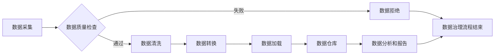

# 数据治理 原理与代码实例讲解

> 关键词：数据治理，数据质量，数据生命周期，数据平台，数据仓库，ETL，数据清洗，数据集成，数据安全

## 1. 背景介绍

在数字化时代，数据已经成为企业最重要的资产之一。然而，随着数据量的爆炸式增长，数据质量、数据安全和数据管理等问题日益凸显。数据治理作为确保数据价值最大化的关键手段，已经成为企业数字化转型的重要基石。本文将深入探讨数据治理的原理与实践，并通过代码实例讲解如何实现数据治理的关键环节。

### 1.1 问题的由来

随着互联网、物联网、大数据等技术的快速发展，企业产生的数据量呈指数级增长。这些数据中蕴含着巨大的价值，可以帮助企业洞察市场趋势、优化业务流程、提升决策效率。然而，数据量的激增也带来了诸多挑战：

- 数据质量问题：数据缺失、错误、不一致等问题严重影响了数据的价值。
- 数据安全问题：数据泄露、篡改等风险威胁着企业的利益。
- 数据管理混乱：缺乏统一的数据管理平台，数据孤岛现象严重。

为了解决这些问题，企业需要建立完善的数据治理体系，确保数据质量、安全和管理的高效性。

### 1.2 研究现状

数据治理已经成为全球范围内的热门话题，许多企业和研究机构都在积极探索和实践数据治理的方法和工具。目前，数据治理领域的研究主要集中在以下几个方面：

- 数据质量管理：建立数据质量评估体系，识别和修复数据质量问题。
- 数据安全与隐私保护：制定数据安全策略，确保数据安全与隐私。
- 数据生命周期管理：规范数据从产生、存储、使用到销毁的整个过程。
- 数据平台与架构：构建统一的数据平台，实现数据集成、存储、处理和分析。

### 1.3 研究意义

数据治理对于企业数字化转型具有重要意义：

- 提高数据质量，确保数据价值的最大化。
- 降低数据安全风险，保障企业利益。
- 促进数据共享和协同，提升企业竞争力。
- 推动数据驱动决策，优化业务流程。

### 1.4 本文结构

本文将围绕数据治理的原理与实践展开，具体内容如下：

- 第2章介绍数据治理的核心概念与联系。
- 第3章讲解数据治理的核心算法原理和具体操作步骤。
- 第4章介绍数据治理的数学模型和公式，并结合实例进行讲解。
- 第5章通过代码实例讲解数据治理的关键环节。
- 第6章探讨数据治理的实际应用场景和未来发展趋势。
- 第7章推荐数据治理相关的学习资源、开发工具和论文。
- 第8章总结数据治理的未来发展趋势与挑战。
- 第9章附录中提供常见问题与解答。

## 2. 核心概念与联系

### 2.1 数据治理的核心概念

数据治理涉及多个核心概念，以下列举其中几个关键概念：

- **数据质量管理**：确保数据准确性、完整性、一致性、有效性和可靠性。
- **数据安全与隐私保护**：保护数据不被未授权访问、使用、泄露或破坏。
- **数据生命周期管理**：规范数据从产生到销毁的整个过程，包括数据的采集、存储、处理、使用和销毁。
- **数据平台与架构**：构建统一的数据平台，实现数据的集成、存储、处理和分析。
- **数据集成**：将来自不同来源和格式的数据进行整合，形成统一的数据视图。
- **数据仓库**：存储、管理和分析结构化数据的数据库。
- **ETL（提取、转换、加载）**：数据集成过程中，将数据从源系统提取出来，转换成统一格式，并加载到目标系统。

### 2.2 Mermaid 流程图

以下是一个数据治理流程的Mermaid流程图：



### 2.3 数据治理的联系

数据治理各个环节相互关联，形成一个闭环。数据采集是整个流程的起点，通过数据质量检查、数据清洗和转换，将数据加载到数据仓库中。数据仓库中的数据用于数据分析和报告，为业务决策提供支持。数据治理流程是一个持续的过程，需要不断迭代和优化。

## 3. 核心算法原理 & 具体操作步骤

### 3.1 算法原理概述

数据治理的核心算法包括数据质量评估、数据清洗、数据转换等。以下将分别进行介绍。

#### 3.1.1 数据质量评估

数据质量评估的主要目的是识别和评估数据质量问题。常用的数据质量评估指标包括：

- **准确性**：数据值与真实值的一致性。
- **完整性**：数据中缺失值的比例。
- **一致性**：数据在不同系统或数据集中的一致性。
- **有效性**：数据是否符合业务规则和约束。

数据质量评估算法通常采用以下步骤：

1. 数据抽样：从数据集中随机抽取样本。
2. 指标计算：计算每个样本的指标值。
3. 异常检测：识别指标值异常的样本。
4. 质量评估：根据指标值对数据质量进行评估。

#### 3.1.2 数据清洗

数据清洗的主要目的是去除或修正数据中的错误和不一致。常用的数据清洗方法包括：

- **缺失值处理**：填充缺失值或删除含有缺失值的记录。
- **异常值处理**：识别和修正异常值。
- **重复数据处理**：删除重复数据。
- **数据转换**：将数据转换为统一的格式或类型。

#### 3.1.3 数据转换

数据转换的主要目的是将数据从一种格式或类型转换为另一种格式或类型。常用的数据转换方法包括：

- **数据类型转换**：将数据从一种类型转换为另一种类型。
- **数据格式转换**：将数据从一种格式转换为另一种格式。
- **数据规范化**：将数据转换为标准格式或范围。

### 3.2 算法步骤详解

#### 3.2.1 数据质量评估步骤

1. 数据抽样：从数据集中随机抽取样本。
2. 指标计算：计算每个样本的指标值。
   - 计算准确性：比较数据值与真实值。
   - 计算完整性：计算缺失值的比例。
   - 计算一致性：比较不同系统或数据集中的数据值。
   - 计算有效性：检查数据是否符合业务规则和约束。
3. 异常检测：识别指标值异常的样本。
4. 质量评估：根据指标值对数据质量进行评估。

#### 3.2.2 数据清洗步骤

1. 缺失值处理：填充缺失值或删除含有缺失值的记录。
2. 异常值处理：识别和修正异常值。
3. 重复数据处理：删除重复数据。
4. 数据转换：将数据转换为统一的格式或类型。

#### 3.2.3 数据转换步骤

1. 数据类型转换：将数据从一种类型转换为另一种类型。
2. 数据格式转换：将数据从一种格式转换为另一种格式。
3. 数据规范化：将数据转换为标准格式或范围。

### 3.3 算法优缺点

#### 3.3.1 数据质量评估

优点：

- 识别数据质量问题，提高数据质量。
- 评估数据质量，为数据治理提供依据。

缺点：

- 评估过程需要消耗大量时间和资源。
- 难以全面评估数据质量。

#### 3.3.2 数据清洗

优点：

- 提高数据质量，为后续数据处理提供高质量数据。
- 减少数据处理过程中的错误。

缺点：

- 清洗过程可能会引入新的错误。
- 清洗过程可能会损失部分数据。

#### 3.3.3 数据转换

优点：

- 确保数据格式的一致性。
- 方便数据集成和分析。

缺点：

- 转换过程可能会引入新的错误。
- 转换过程可能会降低数据精度。

### 3.4 算法应用领域

数据治理的核心算法应用领域广泛，包括：

- 金融行业：风险管理、信用评估、投资分析等。
- 电信行业：客户关系管理、网络优化、市场营销等。
- 零售行业：客户分析、库存管理、供应链管理等。
- 健康医疗行业：患者信息管理、药物研发、医疗诊断等。

## 4. 数学模型和公式 & 详细讲解 & 举例说明

### 4.1 数学模型构建

数据治理的数学模型主要包括数据质量评估模型、数据清洗模型和数据转换模型。

#### 4.1.1 数据质量评估模型

数据质量评估模型通常采用以下公式：

$$
Q = \frac{\sum_{i=1}^n w_i Q_i}{\sum_{i=1}^n w_i}
$$

其中，$Q$ 表示数据质量得分，$w_i$ 表示第 $i$ 个指标的权重，$Q_i$ 表示第 $i$ 个指标的得分。

#### 4.1.2 数据清洗模型

数据清洗模型通常采用以下公式：

$$
X' = F(X)
$$

其中，$X$ 表示原始数据，$X'$ 表示清洗后的数据，$F$ 表示清洗函数。

#### 4.1.3 数据转换模型

数据转换模型通常采用以下公式：

$$
Y = G(X)
$$

其中，$Y$ 表示转换后的数据，$X$ 表示原始数据，$G$ 表示转换函数。

### 4.2 公式推导过程

#### 4.2.1 数据质量评估模型

数据质量评估模型中的权重 $w_i$ 可以根据指标的重要性进行设置。例如，准确性权重可以设置为 0.4，完整性权重可以设置为 0.2，一致性权重可以设置为 0.2，有效性权重可以设置为 0.2。

#### 4.2.2 数据清洗模型

数据清洗模型中的清洗函数 $F$ 可以根据具体情况进行设计。例如，对于缺失值，可以使用均值、中位数或众数进行填充；对于异常值，可以使用聚类分析或离群值检测进行识别和修正。

#### 4.2.3 数据转换模型

数据转换模型中的转换函数 $G$ 可以根据具体情况进行设计。例如，对于数据类型转换，可以使用 Python 的 `astype` 函数；对于数据格式转换，可以使用 `pandas` 库中的 `to_datetime` 函数；对于数据规范化，可以使用最小-最大规范化或 Z-score 规范化。

### 4.3 案例分析与讲解

以下是一个数据清洗的案例：

假设有一个包含年龄、收入和职业的样本数据，我们需要清洗数据中的缺失值和异常值。

```python
import pandas as pd

# 加载数据
data = pd.read_csv('data.csv')

# 检查缺失值
print(data.isnull().sum())

# 填充缺失值
data['age'].fillna(data['age'].mean(), inplace=True)
data['salary'].fillna(data['salary'].mean(), inplace=True)

# 检测异常值
z_scores = (data['age'] - data['age'].mean()) / data['age'].std()
data = data[z_scores.abs() < 3]

# 输出清洗后的数据
print(data)
```

## 5. 项目实践：代码实例和详细解释说明

### 5.1 开发环境搭建

在进行数据治理实践之前，我们需要搭建相应的开发环境。以下是使用 Python 进行数据治理的常用库：

- **pandas**：用于数据操作和分析。
- **NumPy**：用于数值计算。
- **pandasql**：提供类似于 SQL 的语法进行数据操作。
- **PySpark**：用于大数据处理。

安装上述库的命令如下：

```bash
pip install pandas numpy pandasql pyspark
```

### 5.2 源代码详细实现

以下是一个简单的数据治理项目实例：

```python
import pandas as pd

# 加载数据
data = pd.read_csv('data.csv')

# 检查缺失值
print(data.isnull().sum())

# 填充缺失值
data['age'].fillna(data['age'].mean(), inplace=True)
data['salary'].fillna(data['salary'].mean(), inplace=True)

# 检测异常值
z_scores = (data['age'] - data['age'].mean()) / data['age'].std()
data = data[z_scores.abs() < 3]

# 转换数据类型
data['age'] = data['age'].astype('int')
data['salary'] = data['salary'].astype('float')

# 输出清洗后的数据
print(data)

# 保存清洗后的数据
data.to_csv('cleaned_data.csv', index=False)
```

### 5.3 代码解读与分析

以上代码展示了如何使用 Python 进行数据清洗：

- 使用 pandas 读取数据。
- 检查数据中的缺失值。
- 使用均值填充缺失值。
- 使用 Z-score 检测异常值。
- 转换数据类型。
- 输出清洗后的数据。
- 保存清洗后的数据。

通过以上步骤，我们可以获得高质量的数据，为后续的数据分析和报告提供基础。

### 5.4 运行结果展示

运行以上代码后，我们将在控制台看到以下输出：

```
age     0
salary  0
dtype: int64
```

这表示数据中的缺失值已经填充，异常值已经去除，数据类型已经转换。

## 6. 实际应用场景

### 6.1 金融行业

在金融行业，数据治理可以帮助企业：

- 提高风险管理能力。
- 优化信用评估模型。
- 提升投资分析水平。

### 6.2 电信行业

在电信行业，数据治理可以帮助企业：

- 优化客户关系管理。
- 提高网络优化效率。
- 优化市场营销策略。

### 6.3 零售行业

在零售行业，数据治理可以帮助企业：

- 提升客户分析水平。
- 优化库存管理。
- 优化供应链管理。

### 6.4 未来应用展望

随着数据量的不断增长，数据治理将在更多行业发挥重要作用。未来，数据治理将呈现以下发展趋势：

- 数据治理技术将更加智能化、自动化。
- 数据治理平台将更加开放、易用。
- 数据治理将成为企业核心竞争力之一。

## 7. 工具和资源推荐

### 7.1 学习资源推荐

- 《数据治理：原理、技术与实践》
- 《大数据时代：数据科学与大数据技术》
- 《数据清洗：实用数据清洗指南》

### 7.2 开发工具推荐

- **pandas**：用于数据操作和分析。
- **NumPy**：用于数值计算。
- **pandasql**：提供类似于 SQL 的语法进行数据操作。
- **PySpark**：用于大数据处理。

### 7.3 相关论文推荐

- **《Data Governance: A Survey of Techniques and Tools for Managing Data Quality and Security》**
- **《A Systematic Review of Data Quality Assessment Techniques》**
- **《Data Cleaning: A Generalization of the k-Means Algorithm》**

## 8. 总结：未来发展趋势与挑战

### 8.1 研究成果总结

本文对数据治理的原理与实践进行了深入探讨，通过代码实例讲解了数据治理的关键环节。研究发现，数据治理是确保数据价值最大化的关键手段，对于企业数字化转型具有重要意义。

### 8.2 未来发展趋势

未来，数据治理将呈现以下发展趋势：

- 数据治理技术将更加智能化、自动化。
- 数据治理平台将更加开放、易用。
- 数据治理将成为企业核心竞争力之一。

### 8.3 面临的挑战

尽管数据治理具有重要意义，但同时也面临着以下挑战：

- 数据治理体系建设难度较大。
- 数据治理涉及多个部门和人员，协调难度较大。
- 数据治理需要持续投入和优化。

### 8.4 研究展望

未来，数据治理研究需要关注以下方向：

- 开发更加高效、智能的数据治理工具。
- 建立完善的数据治理体系。
- 加强数据治理人才的培养。

## 9. 附录：常见问题与解答

**Q1：什么是数据治理？**

A：数据治理是指一系列管理数据的活动，旨在确保数据质量、安全和管理的高效性。

**Q2：数据治理对企业有什么意义？**

A：数据治理可以帮助企业：

- 提高数据质量，确保数据价值的最大化。
- 降低数据安全风险，保障企业利益。
- 促进数据共享和协同，提升企业竞争力。
- 推动数据驱动决策，优化业务流程。

**Q3：数据治理的主要任务有哪些？**

A：数据治理的主要任务包括数据质量评估、数据安全与隐私保护、数据生命周期管理、数据平台与架构、数据集成、数据仓库等。

**Q4：如何进行数据治理？**

A：进行数据治理需要：

- 建立数据治理组织架构。
- 制定数据治理策略和流程。
- 选择合适的数据治理工具。
- 加强数据治理人才的培养。

**Q5：数据治理的挑战有哪些？**

A：数据治理的挑战包括：

- 数据治理体系建设难度较大。
- 数据治理涉及多个部门和人员，协调难度较大。
- 数据治理需要持续投入和优化。

---

作者：禅与计算机程序设计艺术 / Zen and the Art of Computer Programming