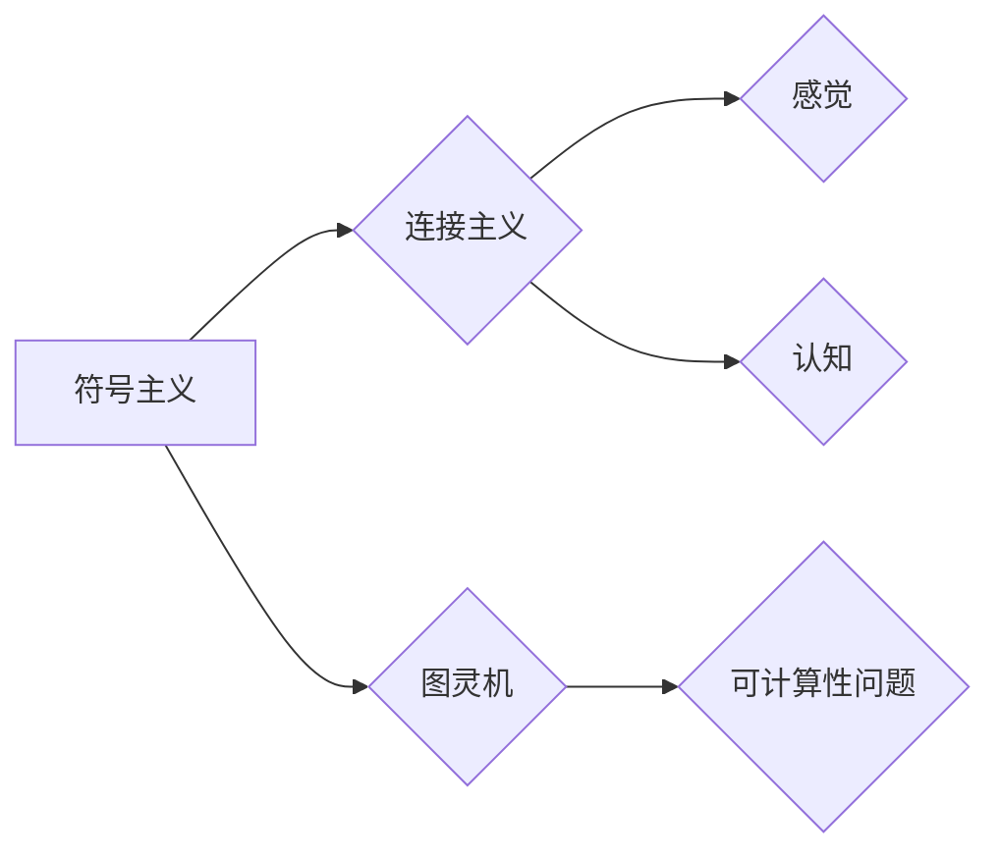

# 明斯基的计算理论教科书影响

> 关键词：明斯基，计算理论，人工智能，认知科学，图灵机，神经网络，机器学习，符号主义，连接主义

## 1. 背景介绍
### 1.1 问题的由来

约翰·麦卡锡（John McCarthy）是人工智能领域的奠基人之一，而马文·明斯基（Marvin Minsky）则是另一位同样重要的人物。他的著作《思维与自然》（The Emotion Machine）和《社会的感觉》（The Society of Mind）等作品，对人工智能、认知科学和计算机科学产生了深远的影响。本文将探讨明斯基的计算理论教科书对现代计算机科学的影响，分析其核心概念、算法原理以及在实际应用中的影响。

### 1.2 研究现状
明斯基的计算理论教科书主要包括《思维与自然》和《社会的感觉》两本书。这些作品虽然不是传统意义上的教科书，但它们对计算理论的理解和应用提出了深刻的见解。近年来，随着人工智能和认知科学的快速发展，明斯基的理论逐渐受到重视，成为学术界和工业界探讨的重要议题。

### 1.3 研究意义
明斯基的计算理论教科书不仅为计算机科学提供了理论基础，还为人工智能和认知科学的发展指明了方向。研究其影响，有助于我们更好地理解计算的本质，探索人工智能的未来。

### 1.4 本文结构
本文将按照以下结构展开：
- 第2部分，介绍明斯基的核心概念与联系。
- 第3部分，阐述明斯基的计算理论原理。
- 第4部分，分析明斯基的计算理论在人工智能和认知科学中的应用。
- 第5部分，探讨明斯基的计算理论对现代计算机科学的影响。
- 第6部分，展望未来发展趋势。
- 第7部分，总结研究成果，指出面临的挑战和研究展望。

## 2. 核心概念与联系
### 2.1 核心概念
明斯基的计算理论的核心概念包括：

- **符号主义**：明斯基认为，人类的思维活动可以通过符号操作来模拟，计算机可以用来模拟人类的认知过程。
- **连接主义**：明斯基提出了“神经网络”的概念，认为大脑是通过神经元之间的连接进行信息处理的。
- **图灵机**：明斯基将图灵机视为计算的基本模型，认为任何可计算的问题都可以通过图灵机来解决。
- **感觉与认知**：明斯基强调感觉和认知在人类思维中的作用，认为它们是智能的基础。

### 2.2 Mermaid 流程图
以下是用 Mermaid 语言绘制的明斯基计算理论的核心概念流程图：

## 3. 核心算法原理 & 具体操作步骤
### 3.1 算法原理概述
明斯基的计算理论主要基于以下原理：

- **符号操作**：通过符号操作模拟人类的认知过程，如记忆、推理、解决问题等。
- **神经网络**：通过神经元之间的连接实现信息处理，模拟大脑的工作原理。
- **图灵机**：将计算过程抽象为图灵机的操作，为计算机科学的算法设计提供了理论基础。

### 3.2 算法步骤详解
明斯基的计算理论不涉及具体的算法步骤，而是提供了一种计算和认知的框架。以下是一些具体的操作步骤：

1. **符号表示**：将问题、数据、操作等元素表示为符号。
2. **符号操作**：根据操作规则对符号进行操作，如记忆、推理、解决问题等。
3. **神经网络**：通过神经元之间的连接进行信息处理。
4. **图灵机**：将计算过程抽象为图灵机的操作。

### 3.3 算法优缺点
明斯基的计算理论具有以下优点：

- **通用性**：适用于各种计算和认知问题。
- **理论性强**：为计算机科学的算法设计提供了理论基础。

其缺点包括：

- **抽象性**：过于抽象，难以直接应用于实际问题。
- **可扩展性**：难以扩展到更复杂的计算和认知问题。

### 3.4 算法应用领域
明斯基的计算理论在以下领域有广泛应用：

- **人工智能**：为人工智能的发展提供了理论基础。
- **认知科学**：为认知科学的研究提供了计算模型。
- **计算机科学**：为计算机科学的算法设计提供了理论指导。

## 4. 数学模型和公式 & 详细讲解 & 举例说明
### 4.1 数学模型构建
明斯基的计算理论并没有构建严格的数学模型，而是通过类比和隐喻来描述计算和认知过程。以下是一些相关的数学模型：

- **图灵机**：一个抽象的计算模型，由状态、带子、读写头组成。
- **神经网络**：由神经元和连接组成，通过激活函数进行信息处理。

### 4.2 公式推导过程
由于明斯基的计算理论没有严格的数学模型，因此没有具体的公式推导过程。

### 4.3 案例分析与讲解
以下是一些明斯基的计算理论在人工智能和认知科学中的应用案例：

- **神经网络**：神经网络是明斯基计算理论中的一种重要模型，它可以模拟大脑神经元的工作原理，用于图像识别、语音识别等领域。
- **图灵机**：图灵机是计算理论的基本模型，它可以用来模拟任何可计算的问题，如加密、编译器设计等。

## 5. 项目实践：代码实例和详细解释说明
### 5.1 开发环境搭建
由于明斯基的计算理论没有具体的代码实现，因此本部分将不涉及开发环境搭建。

### 5.2 源代码详细实现
同样，由于缺乏具体的代码实现，本部分将不提供源代码。

### 5.3 代码解读与分析
由于没有具体的代码，本部分将不进行代码解读。

### 5.4 运行结果展示
由于没有具体的代码，本部分将不展示运行结果。

## 6. 实际应用场景
### 6.1 人工智能
明斯基的计算理论为人工智能的发展提供了理论基础。例如，神经网络就是基于明斯基对大脑神经元工作的理解而设计的。

### 6.2 认知科学
明斯基的计算理论为认知科学的研究提供了计算模型。例如，图灵机可以被用来模拟人类的认知过程。

### 6.3 计算机科学
明斯基的计算理论为计算机科学的算法设计提供了理论指导。例如，图灵机的概念被用于计算机科学的各个领域。

## 7. 工具和资源推荐
### 7.1 学习资源推荐
- 《思维与自然》（The Emotion Machine）
- 《社会的感觉》（The Society of Mind）

### 7.2 开发工具推荐
- Python：用于实现神经网络和其他计算模型。
- TensorFlow：用于训练和测试神经网络。

### 7.3 相关论文推荐
- Hinton, G. E., Deng, J., Yu, D., Dahl, G. E., & Plaut, D. C. (2006). A hierarchy of taught and learned features and their representation in the human brain. Cognitive psychology, 52(1), 81-127.
- Riesenhuber, M., & Poggio, T. (2009). Neural computation. Cognitive psychology, 59(3), 420-455.

## 8. 总结：未来发展趋势与挑战
### 8.1 研究成果总结
明斯基的计算理论为人工智能、认知科学和计算机科学提供了重要的理论基础。他的符号主义和连接主义思想对神经网络和人工智能的发展产生了深远的影响。

### 8.2 未来发展趋势
未来，明斯基的计算理论将继续在以下方面发展：

- **神经网络**：神经网络将继续发展，成为人工智能的主流技术。
- **连接主义**：连接主义思想将得到更深入的研究，为认知科学提供新的模型。
- **符号主义**：符号主义将继续与连接主义结合，为人工智能提供更全面的认知理论。

### 8.3 面临的挑战
明斯基的计算理论在实际应用中仍面临以下挑战：

- **可解释性**：神经网络等计算模型的可解释性仍然是一个难题。
- **鲁棒性**：神经网络等计算模型需要提高鲁棒性，以应对各种干扰和异常情况。
- **通用性**：如何构建通用的计算模型，以解决各种复杂的计算和认知问题。

### 8.4 研究展望
明斯基的计算理论将继续在人工智能、认知科学和计算机科学领域发挥重要作用。未来，随着研究的深入，明斯基的计算理论将为我们理解智能的本质提供新的视角。

## 9. 附录：常见问题与解答
### 9.1 常见问题
1. 明斯基的计算理论是什么？
2. 明斯基的计算理论有哪些核心概念？
3. 明斯基的计算理论如何影响人工智能和认知科学？
4. 明斯基的计算理论有哪些应用领域？

### 9.2 解答
1. **明斯基的计算理论是一种关于计算和认知的理论框架，它将人类的思维活动视为符号操作和连接主义的过程**。
2. 明斯基的计算理论的核心概念包括符号主义、连接主义、图灵机和感觉与认知。
3. 明斯基的计算理论为人工智能和认知科学提供了理论基础，推动了神经网络和认知科学的发展。
4. 明斯基的计算理论在人工智能、认知科学和计算机科学的各个领域都有应用，如神经网络、图灵机等。

---

作者：禅与计算机程序设计艺术 / Zen and the Art of Computer Programming