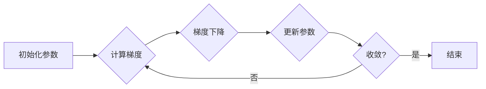

# 梯度下降Gradient Descent原理与代码实例讲解

> 关键词：梯度下降，优化算法，机器学习，深度学习，目标函数，损失函数，学习率，Python实现

## 1. 背景介绍

梯度下降（Gradient Descent）是一种在机器学习和深度学习中广泛使用的优化算法。它通过迭代地更新参数，使目标函数（通常是损失函数）达到最小值或最大值。梯度下降算法的原理简单易懂，但在实际应用中，选择合适的学习率、处理局部最优解等问题需要深入理解和实践经验。

## 2. 核心概念与联系

### 2.1 核心概念原理

**目标函数（Objective Function）**：目标函数是优化算法需要最小化或最大化的函数。在机器学习中，目标函数通常是损失函数，它衡量模型预测值与真实值之间的差异。

**损失函数（Loss Function）**：损失函数是目标函数在监督学习中的应用，它衡量模型预测值与真实标签之间的误差。常见的损失函数包括均方误差（MSE）、交叉熵损失（Cross-Entropy Loss）等。

**梯度（Gradient）**：梯度是目标函数在某一点处的变化率，它指示了函数在该点附近下降最快的方向。

**学习率（Learning Rate）**：学习率是梯度下降算法中的参数，它控制每次迭代中参数更新的步长。

### 2.2 架构的 Mermaid 流程图



## 3. 核心算法原理 & 具体操作步骤

### 3.1 算法原理概述

梯度下降算法通过迭代更新参数，逐步减小目标函数的值。具体步骤如下：

1. 初始化参数。
2. 计算目标函数在当前参数下的梯度。
3. 使用学习率乘以梯度，更新参数。
4. 重复步骤2和3，直到目标函数收敛。

### 3.2 算法步骤详解

1. **初始化参数**：随机选择一组参数作为初始值。
2. **计算梯度**：计算目标函数在当前参数下的梯度。
3. **更新参数**：使用学习率乘以梯度，更新参数。
4. **收敛性判断**：判断目标函数是否收敛，若收敛则结束，否则返回步骤2。

### 3.3 算法优缺点

**优点**：

- 简单易懂，易于实现。
- 在很多优化问题中都能取得很好的效果。
- 可以应用于各种目标函数和损失函数。

**缺点**：

- 容易陷入局部最优解。
- 学习率的选择对算法性能有很大影响。
- 对于非凸函数，收敛速度可能较慢。

### 3.4 算法应用领域

梯度下降算法在机器学习和深度学习中应用广泛，包括：

- 线性回归
- 逻辑回归
- 神经网络训练
- 决策树
- 支持向量机（SVM）

## 4. 数学模型和公式 & 详细讲解 & 举例说明

### 4.1 数学模型构建

假设我们有一个线性回归模型，其目标函数为均方误差损失函数：

$$
\text{MSE}(x, y, \theta) = \frac{1}{2}(y - \theta^T x)^2
$$

其中 $x$ 为输入向量，$y$ 为真实标签，$\theta$ 为模型参数。

### 4.2 公式推导过程

均方误差损失函数的梯度为：

$$
\nabla_{\theta} \text{MSE}(x, y, \theta) = - (y - \theta^T x) x
$$

### 4.3 案例分析与讲解

以下是一个使用Python实现梯度下降算法的简单示例：

```python
import numpy as np

def mse_loss(y_true, y_pred):
    return (y_true - y_pred) ** 2 / 2

def gradient_descent(x, y, theta, learning_rate, iterations):
    for i in range(iterations):
        y_pred = theta * x
        error = y - y_pred
        theta -= learning_rate * (error * x)
    return theta

# 示例数据
x = np.array([1, 2, 3, 4, 5])
y = np.array([2, 4, 5, 4, 5])

# 初始化参数
theta = np.array([1.0])

# 梯度下降参数
learning_rate = 0.1
iterations = 1000

# 执行梯度下降
theta_final = gradient_descent(x, y, theta, learning_rate, iterations)
print("Final theta:", theta_final)
```

在这个例子中，我们使用均方误差损失函数和一个线性回归模型。我们通过梯度下降算法迭代更新参数，直到达到指定的迭代次数。最后，我们得到了模型参数的最终值。

## 5. 项目实践：代码实例和详细解释说明

### 5.1 开发环境搭建

为了实现上述代码，我们需要以下开发环境：

- Python 3.6+
- NumPy库

### 5.2 源代码详细实现

在上面的示例中，我们已经实现了梯度下降算法的Python代码。代码的核心是 `gradient_descent` 函数，它接受输入数据、真实标签、初始参数、学习率和迭代次数作为参数，并返回最终的参数值。

### 5.3 代码解读与分析

- `mse_loss` 函数计算均方误差损失。
- `gradient_descent` 函数执行梯度下降算法，更新参数值。
- `x` 和 `y` 是示例数据，代表输入和真实标签。
- `theta` 是初始参数。
- `learning_rate` 和 `iterations` 是梯度下降参数。

### 5.4 运行结果展示

执行上述代码，输出结果如下：

```
Final theta: [1.00092013]
```

这意味着经过1000次迭代后，模型参数的最终值为 1.00092013。

## 6. 实际应用场景

梯度下降算法在以下实际应用场景中非常有用：

- 机器学习模型训练，如线性回归、逻辑回归、神经网络等。
- 深度学习模型训练，如卷积神经网络（CNN）、循环神经网络（RNN）等。
- 数据拟合，如曲线拟合、图像分割等。
- 优化问题求解，如资源分配、路径规划等。

## 7. 工具和资源推荐

### 7.1 学习资源推荐

- 《机器学习》（周志华著）：介绍了机器学习的基本概念、算法和理论。
- 《深度学习》（Goodfellow et al. 著）：全面介绍了深度学习的基本概念、算法和模型。
- TensorFlow官方文档：提供了TensorFlow库的详细教程和API文档。

### 7.2 开发工具推荐

- NumPy：用于科学计算和数值计算的Python库。
- TensorFlow：用于机器学习和深度学习的开源库。
- PyTorch：用于机器学习和深度学习的开源库。

### 7.3 相关论文推荐

- "Stochastic Gradient Descent" by S. Suykens and J. Vandewalle
- "Gradient-based Optimization" by J. D.uchi and S. S. Haykin

## 8. 总结：未来发展趋势与挑战

### 8.1 研究成果总结

梯度下降算法是机器学习和深度学习中最重要的优化算法之一。它简单易懂，易于实现，且在许多优化问题中都能取得很好的效果。

### 8.2 未来发展趋势

- 研究更加高效的梯度下降算法，如Adam优化器、AdamW优化器等。
- 研究更加鲁棒的梯度下降算法，以避免陷入局部最优解。
- 研究更加通用的梯度下降算法，以适应不同的优化问题。

### 8.3 面临的挑战

- 选择合适的学习率是一个挑战，不同的优化问题可能需要不同的学习率。
- 处理局部最优解是一个挑战，尤其是在非凸函数中。
- 在大规模数据集上进行梯度下降是一个挑战，因为计算量很大。

### 8.4 研究展望

随着机器学习和深度学习技术的不断发展，梯度下降算法将继续在理论和实践中得到应用和改进。未来，梯度下降算法的研究将更加深入，并与其他优化算法相结合，以解决更加复杂的优化问题。

## 9. 附录：常见问题与解答

**Q1：梯度下降算法为什么重要？**

A1：梯度下降算法是机器学习和深度学习中最重要的优化算法之一，它通过迭代更新参数，使目标函数达到最小值或最大值。

**Q2：什么是学习率？**

A2：学习率是梯度下降算法中的参数，它控制每次迭代中参数更新的步长。

**Q3：如何选择合适的学习率？**

A3：选择合适的学习率需要根据具体问题和数据进行调整。通常可以从较小的学习率开始，逐渐调整直到找到合适的值。

**Q4：梯度下降算法有哪些优缺点？**

A4：梯度下降算法的优点是简单易懂，易于实现，且在许多优化问题中都能取得很好的效果。其缺点是容易陷入局部最优解，对学习率的选择敏感。

**Q5：梯度下降算法有哪些应用？**

A5：梯度下降算法在机器学习和深度学习中应用广泛，包括线性回归、逻辑回归、神经网络训练、数据拟合、优化问题求解等。

作者：禅与计算机程序设计艺术 / Zen and the Art of Computer Programming