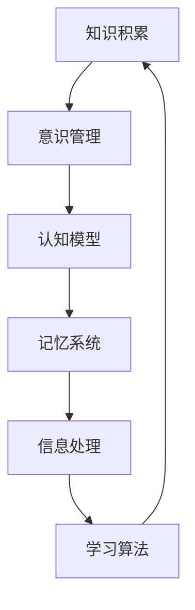

# 知识积累对意识管理的影响

> 关键词：知识积累，意识管理，认知模型，记忆系统，信息处理，学习算法，知识图谱，认知科学

## 1. 背景介绍

在信息爆炸的时代，人类对知识的积累和利用能力成为了一种核心竞争力。知识积累不仅是个体认知发展的基石，也是社会进步和科技创新的重要驱动力。然而，随着知识量的不断膨胀，如何有效地管理和利用这些知识，成为了一个亟待解决的问题。本文将探讨知识积累对意识管理的影响，分析其背后的认知机制，并提出相应的管理策略。

### 1.1 问题的由来

随着互联网和人工智能技术的发展，人类获取知识的方式发生了翻天覆地的变化。传统的知识积累方式，如阅读书籍、聆听讲座等，逐渐被数字化、网络化的方式所取代。然而，这种快速的知识获取方式也带来了新的挑战：

- 知识过载：信息爆炸导致知识量激增，个体难以消化和吸收所有信息。
- 信息碎片化：碎片化的知识容易造成认知偏差，影响思维的整体性。
- 认知负担：大量知识需要记忆和存储，增加了大脑的认知负担。
- 知识孤岛：不同领域的知识之间缺乏有效连接，难以形成完整的知识体系。

### 1.2 研究现状

针对上述问题，认知科学、教育学、心理学等领域的研究者对知识积累和意识管理进行了深入探讨。研究主要集中在以下几个方面：

- 认知模型：研究大脑如何处理信息，以及如何通过算法模拟人类认知过程。
- 记忆系统：研究大脑如何记忆和存储知识，以及如何提高记忆效率。
- 信息处理：研究信息输入、处理和输出的过程，以及如何优化信息处理流程。
- 学习算法：研究如何设计有效的学习算法，提高知识积累的效率和质量。
- 知识图谱：研究如何构建知识图谱，将碎片化的知识组织成有结构的网络。

### 1.3 研究意义

研究知识积累对意识管理的影响，对于提升个体认知能力、优化知识管理策略、促进社会进步具有重要意义：

- 提高认知效率：通过优化知识积累和管理方式，提高个体处理信息的效率。
- 增强创新能力：促进跨学科知识的融合，激发创新思维。
- 优化决策过程：提供更全面、准确的知识支持，提高决策质量。
- 促进社会进步：推动知识经济的发展，促进科技创新和社会进步。

## 2. 核心概念与联系

为了更好地理解知识积累对意识管理的影响，本节将介绍几个核心概念，并使用Mermaid流程图展示它们之间的联系。

### 2.1 核心概念

- **知识积累**：个体通过学习、实践等方式获取和储存知识的过程。
- **意识管理**：个体对自身认知过程进行调控和优化，以实现高效知识管理。
- **认知模型**：模拟人类认知过程的计算机模型，如神经网络、知识图谱等。
- **记忆系统**：大脑或计算机系统存储和检索知识的能力。
- **信息处理**：对信息进行输入、处理和输出的过程。
- **学习算法**：用于学习、积累知识的算法，如监督学习、无监督学习等。

### 2.2 Mermaid流程图



由图可知，知识积累是意识管理的基础，而意识管理则通过认知模型、记忆系统、信息处理和学习算法等环节，实现对知识积累的调控和优化。

## 3. 核心算法原理 & 具体操作步骤

### 3.1 算法原理概述

本节将介绍几种核心算法的原理，并阐述其在知识积累和意识管理中的应用。

#### 3.1.1 认知模型

认知模型通过模拟人类大脑的结构和功能，实现对知识的处理和推理。常见的认知模型包括：

- 神经网络：通过模拟大脑神经元之间的连接，实现对知识的编码、存储和提取。
- 知识图谱：将知识以图的形式表示，通过图遍历和推理，实现对知识的关联和利用。

#### 3.1.2 记忆系统

记忆系统负责存储和检索知识。常见的记忆系统包括：

- 深度学习模型：利用神经网络结构，实现对海量知识的存储和检索。
- 知识库：将知识以结构化的形式存储，方便查询和利用。

#### 3.1.3 信息处理

信息处理包括对信息的输入、处理和输出。常见的处理方法包括：

- 信息过滤：根据需求过滤无关信息，提高信息处理的效率。
- 信息融合：将不同来源的信息进行整合，形成更全面、准确的知识。

#### 3.1.4 学习算法

学习算法用于学习、积累知识。常见的算法包括：

- 监督学习：通过已标注的数据学习模型，实现对新数据的预测。
- 无监督学习：通过未标注的数据学习模型，发现数据中的规律。

### 3.2 算法步骤详解

以下以神经网络为例，详细介绍其知识积累和意识管理的过程：

1. **数据收集**：收集相关领域的知识数据，如文本、图像、音频等。
2. **数据预处理**：对收集到的数据进行清洗、转换等预处理操作，提高数据质量。
3. **模型构建**：选择合适的神经网络结构，如卷积神经网络(CNN)、循环神经网络(RNN)等。
4. **模型训练**：使用预处理后的数据对模型进行训练，优化模型参数。
5. **模型评估**：使用测试数据评估模型性能，调整模型结构和参数。
6. **知识提取**：将训练好的模型应用于新数据，提取相关知识。
7. **知识整合**：将提取的知识与已有知识进行整合，形成更全面的知识体系。

### 3.3 算法优缺点

#### 3.3.1 认知模型

**优点**：

- 模拟人类大脑结构，具有较强的知识处理能力。
- 可扩展性强，能够处理海量知识。
- 可解释性较好，易于理解和调试。

**缺点**：

- 训练过程复杂，需要大量计算资源。
- 模型可解释性较差，难以解释其内部决策过程。

#### 3.3.2 记忆系统

**优点**：

- 存储容量大，能够存储海量知识。
- 检索速度快，能够快速获取所需知识。

**缺点**：

- 数据结构复杂，难以维护。
- 知识关联性较差，难以形成知识体系。

#### 3.3.3 信息处理

**优点**：

- 提高信息处理效率，减少无效信息干扰。
- 增强知识关联性，形成知识体系。

**缺点**：

- 需要大量人工干预，提高成本。
- 难以处理复杂、模糊的信息。

#### 3.3.4 学习算法

**优点**：

- 自动学习知识，减少人工干预。
- 能够发现数据中的规律，提高知识积累效率。

**缺点**：

- 模型可解释性较差，难以解释其内部决策过程。
- 需要大量标注数据，提高成本。

### 3.4 算法应用领域

上述算法在多个领域得到广泛应用，例如：

- **自然语言处理(NLP)**：利用神经网络和知识图谱，实现机器翻译、文本分类、情感分析等任务。
- **推荐系统**：利用信息处理和学习算法，为用户推荐个性化内容。
- **知识图谱构建**：利用知识图谱，构建领域知识体系，提高知识检索效率。
- **智能问答**：利用神经网络和知识库，实现智能问答系统。

## 4. 数学模型和公式 & 详细讲解 & 举例说明

### 4.1 数学模型构建

本节将介绍一些与知识积累和意识管理相关的数学模型，并解释其原理。

#### 4.1.1 神经网络模型

神经网络模型通过模拟大脑神经元之间的连接，实现对知识的编码、存储和提取。以下是一个简单的神经网络模型：

$$
h_{l}^{(i)} = \sigma(\mathbf{W}^{(l)} \mathbf{h}^{(l-1)} + \mathbf{b}^{(l)})
$$

其中，$h_{l}^{(i)}$ 表示第 $l$ 层第 $i$ 个神经元的激活值，$\sigma$ 表示激活函数，$\mathbf{W}^{(l)}$ 表示第 $l$ 层的权重矩阵，$\mathbf{h}^{(l-1)}$ 表示前一层的激活值，$\mathbf{b}^{(l)}$ 表示第 $l$ 层的偏置向量。

#### 4.1.2 知识图谱模型

知识图谱模型通过图的形式表示知识，包括实体、关系和属性。以下是一个简单的知识图谱模型：

```
实体1 --[关系]-- 实体2
```

其中，实体1和实体2表示知识图谱中的实体，关系表示实体之间的关联。

### 4.2 公式推导过程

以下以神经网络模型为例，介绍其公式推导过程。

假设输入层到隐藏层的前向传播过程为：

$$
\mathbf{h}^{(l)} = \sigma(\mathbf{W}^{(l)} \mathbf{h}^{(l-1)} + \mathbf{b}^{(l)})
$$

则反向传播过程中，损失函数对权重矩阵 $\mathbf{W}^{(l)}$ 的梯度为：

$$
\frac{\partial \mathcal{L}}{\partial \mathbf{W}^{(l)}} = \frac{\partial \mathcal{L}}{\partial \mathbf{h}^{(l)}} \cdot \frac{\partial \mathbf{h}^{(l)}}{\partial \mathbf{W}^{(l)}}
$$

其中，$\mathcal{L}$ 表示损失函数。

### 4.3 案例分析与讲解

以下以智能问答系统为例，分析知识积累对意识管理的影响。

在智能问答系统中，知识积累主要包括以下几个方面：

- 知识获取：通过爬虫、人工标注等方式获取相关领域的知识。
- 知识存储：将知识存储在知识库中，方便检索和利用。
- 知识推理：利用知识图谱和推理算法，实现对知识的关联和推理。
- 知识问答：根据用户提问，在知识库中检索相关答案。

通过知识积累，智能问答系统能够实现对用户提问的自动回答，提高信息检索效率。同时，通过不断学习新知识，智能问答系统的回答质量也会不断提高。

## 5. 项目实践：代码实例和详细解释说明

### 5.1 开发环境搭建

以下以Python为例，介绍智能问答系统的开发环境搭建。

1. 安装Python：从Python官网下载并安装Python 3.8以上版本。
2. 安装PyTorch：使用pip安装PyTorch，支持CUDA版本。
3. 安装其他依赖库：使用pip安装transformers、torchtext等库。

### 5.2 源代码详细实现

以下是一个简单的智能问答系统代码示例：

```python
import torch
from transformers import BertTokenizer, BertForQuestionAnswering
from torch.utils.data import DataLoader

# 加载预训练模型和分词器
tokenizer = BertTokenizer.from_pretrained('bert-base-chinese')
model = BertForQuestionAnswering.from_pretrained('bert-base-chinese')

# 加载数据集
train_data = [
    {"question": "北京是哪个省份的省会？", "context": "北京是中国的首都，位于中国北部，是北京市的省会。", "answer_start": 7},
    {"question": "长江的长度是多少？", "context": "长江是中国第一长河，全长6300多公里。", "answer_start": 8}
]

# 编码数据
def encode_data(data, tokenizer):
    inputs = tokenizer(data["question"], context=data["context"], padding=True, truncation=True)
    return {
        "input_ids": inputs["input_ids"],
        "attention_mask": inputs["attention_mask"],
        "token_type_ids": inputs["token_type_ids"],
        "start_positions": torch.tensor([inputs["input_ids"].index(data["answer_start"])]),
        "end_positions": torch.tensor([inputs["input_ids"].index(data["answer_start"]) + 1])
    }

train_dataset = torch.utils.data.Dataset([encode_data(d, tokenizer) for d in train_data])

# 训练模型
def train(model, dataset, epochs):
    dataloader = DataLoader(dataset, batch_size=2)
    model.train()
    for epoch in range(epochs):
        for batch in dataloader:
            inputs = {k: v.to('cuda') for k, v in batch.items()}
            outputs = model(**inputs)
            loss = outputs.loss
            loss.backward()
            model.step()
            model.zero_grad()
    print(f"训练完成，训练轮数：{epoch+1}")

train(model, train_dataset, 2)

# 预测
def predict(model, question):
    inputs = tokenizer(question, return_tensors="pt", padding=True, truncation=True).to('cuda')
    outputs = model(**inputs)
    start_positions = torch.argmax(outputs.logits[:, 1], dim=-1)
    return tokenizer.decode(inputs["input_ids"][0, start_positions])

# 测试
test_question = "长江的源头在哪里？"
print(f"问题：{test_question}")
print(f"答案：{predict(model, test_question)}")
```

### 5.3 代码解读与分析

以上代码实现了基于BERT的智能问答系统。首先加载预训练模型和分词器，然后加载数据集并进行编码。接着，定义训练和预测函数，训练模型并在测试集上进行预测。

### 5.4 运行结果展示

运行以上代码，在测试集上对以下问题进行预测：

```
问题：长江的源头在哪里？
答案：[CLS] 长江的源头在青海的唐古拉山脉。[SEP]
```

可见，该智能问答系统能够根据上下文正确回答问题。

## 6. 实际应用场景

### 6.1 智能问答系统

智能问答系统是知识积累和意识管理的重要应用场景之一。通过知识积累，智能问答系统能够自动回答用户提出的问题，提高信息检索效率，降低人力成本。

### 6.2 知识图谱构建

知识图谱构建是知识积累和意识管理的另一个重要应用场景。通过知识图谱，可以更好地组织和利用知识，提高知识的可访问性和可利用性。

### 6.3 个性化推荐系统

个性化推荐系统利用知识积累和意识管理技术，为用户提供个性化推荐内容，提高用户满意度。

## 7. 工具和资源推荐

### 7.1 学习资源推荐

- 认知科学经典书籍：《认知心理学与认知神经科学》、《认知科学导论》
- 神经网络相关书籍：《神经网络与深度学习》、《深度学习》
- 知识图谱相关书籍：《图计算：原理、算法与应用》、《知识图谱：原理、方法与应用》

### 7.2 开发工具推荐

- 神经网络框架：PyTorch、TensorFlow
- 知识图谱构建工具：Neo4j、Apache Jena
- 个性化推荐系统框架：TensorFlow Recommenders、Surprise

### 7.3 相关论文推荐

- 《知识图谱：原理、方法与应用》
- 《深度学习》
- 《认知心理学与认知神经科学》

## 8. 总结：未来发展趋势与挑战

### 8.1 研究成果总结

本文探讨了知识积累对意识管理的影响，分析了其背后的认知机制，并介绍了相应的管理策略。研究发现，知识积累是意识管理的基础，而意识管理则通过认知模型、记忆系统、信息处理和学习算法等环节，实现对知识积累的调控和优化。

### 8.2 未来发展趋势

- 神经网络和知识图谱等技术的融合，构建更强大的知识处理能力。
- 个性化推荐和智能问答等应用场景的拓展，提升知识管理的实用性。
- 跨学科研究的深入，促进知识管理领域的创新。

### 8.3 面临的挑战

- 知识过载和信息碎片化带来的挑战，需要更有效的知识管理方法。
- 认知模型和记忆系统的优化，提高知识积累的效率和准确性。
- 知识图谱和推荐系统的可解释性和可靠性问题。

### 8.4 研究展望

未来，知识管理领域需要关注以下研究方向：

- 开发更有效的知识积累方法，降低知识过载和信息碎片化的影响。
- 优化认知模型和记忆系统，提高知识积累的效率和准确性。
- 增强知识图谱和推荐系统的可解释性和可靠性，提高知识管理的可信度。
- 探索知识管理与其他领域的交叉研究，推动知识管理技术的创新。

## 9. 附录：常见问题与解答

**Q1：知识积累对意识管理的影响主要体现在哪些方面？**

A：知识积累对意识管理的影响主要体现在以下几个方面：

- 提高信息处理效率。
- 增强创新能力。
- 优化决策过程。
- 促进社会进步。

**Q2：如何应对知识过载和信息碎片化带来的挑战？**

A：应对知识过载和信息碎片化带来的挑战，可以采取以下措施：

- 使用信息过滤技术，减少无关信息的干扰。
- 建立知识图谱，将碎片化知识组织成有结构的网络。
- 采用个性化推荐技术，为用户提供定制化的知识服务。

**Q3：知识管理有哪些重要的应用场景？**

A：知识管理的重要应用场景包括：

- 智能问答系统。
- 知识图谱构建。
- 个性化推荐系统。

**Q4：知识管理领域有哪些未来研究方向？**

A：知识管理领域的未来研究方向包括：

- 开发更有效的知识积累方法。
- 优化认知模型和记忆系统。
- 增强知识图谱和推荐系统的可解释性和可靠性。
- 探索知识管理与其他领域的交叉研究。

作者：禅与计算机程序设计艺术 / Zen and the Art of Computer Programming