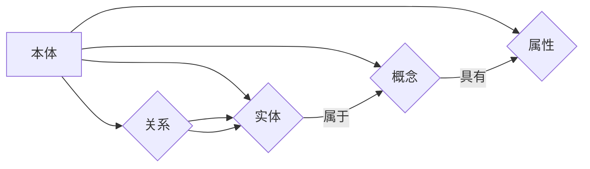

# 知识表示与知识图谱原理与代码实战案例讲解

> 关键词：知识表示，知识图谱，本体论，语义网络，关系抽取，图数据库，Neo4j，Python

## 1. 背景介绍

在人工智能和大数据时代，数据已经成为企业和社会的重要资产。然而，如何有效地组织和利用这些数据，实现智能决策和知识发现，成为了数据科学和人工智能领域的关键问题。知识表示与知识图谱技术应运而生，它们通过将数据转化为易于理解和处理的结构化知识，为人工智能应用提供了强大的支撑。

### 1.1 问题的由来

传统的数据处理方法通常将数据存储在关系型数据库中，通过键值对的方式组织数据。这种方法在处理结构化数据时效率较高，但在处理半结构化或非结构化数据时，难以表达数据之间的复杂关系和语义信息。

知识表示与知识图谱技术通过引入本体论、语义网络等概念，将数据转化为具有明确语义和关系的知识结构，为数据分析和推理提供了新的途径。知识图谱作为一种结构化的知识库，可以存储实体、概念、关系以及属性等信息，为智能搜索、推荐系统、问答系统等应用提供了丰富的语义支持。

### 1.2 研究现状

知识表示与知识图谱技术的研究已经经历了数十年的发展，目前主要的研究方向包括：

- **本体论**：研究概念、实体、关系等知识表示的理论和方法。
- **语义网络**：使用图结构表示实体和关系，实现知识的推理和检索。
- **关系抽取**：从非结构化文本中抽取实体和关系，构建知识图谱。
- **图数据库**：专门用于存储和管理知识图谱的数据库系统。

### 1.3 研究意义

知识表示与知识图谱技术具有重要的理论意义和应用价值：

- **理论意义**：推动知识表示和语义网络理论的发展，丰富人工智能的知识表示领域。
- **应用价值**：为智能搜索、推荐系统、问答系统等应用提供语义支持，提高数据分析和推理的效率。

### 1.4 本文结构

本文将分为以下几个部分：

- **第2章**：介绍知识表示与知识图谱的核心概念和联系。
- **第3章**：讲解知识表示与知识图谱的核心算法原理和具体操作步骤。
- **第4章**：详细讲解知识表示与知识图谱的数学模型和公式，并结合实例进行分析。
- **第5章**：通过实际项目案例，展示知识表示与知识图谱的应用。
- **第6章**：探讨知识表示与知识图谱的实际应用场景和未来展望。
- **第7章**：推荐相关学习资源、开发工具和参考文献。
- **第8章**：总结研究成果，展望未来发展趋势与挑战。
- **第9章**：提供常见问题与解答。

## 2. 核心概念与联系

### 2.1 核心概念

以下是知识表示与知识图谱的核心概念：

- **本体（Ontology）**：描述一组概念、实体、关系以及属性及其之间关系的知识库。
- **实体（Entity）**：指客观存在的事物，如人、地点、组织等。
- **概念（Concept）**：对一组具有相同属性和关系的实体的抽象表示。
- **关系（Relationship）**：实体之间的语义关联，如“属于”、“居住于”等。
- **属性（Property）**：描述实体的特征或性质，如“年龄”、“身高”等。

### 2.2 Mermaid 流程图

以下是知识表示与知识图谱的核心概念原理和架构的 Mermaid 流程图：



### 2.3 核心概念联系

知识表示与知识图谱的核心概念之间存在着紧密的联系。本体定义了知识库的结构和语义，实体、概念、关系和属性构成了知识库的基本元素。实体和概念之间通过关系进行关联，属性描述了实体的特征。

## 3. 核心算法原理 & 具体操作步骤

### 3.1 算法原理概述

知识表示与知识图谱的核心算法包括：

- **本体构建**：根据领域知识构建本体。
- **实体识别**：从非结构化文本中识别实体。
- **关系抽取**：从非结构化文本中抽取实体之间的关系。
- **知识图谱构建**：将实体、关系和属性存储在知识图谱中。

### 3.2 算法步骤详解

以下是知识表示与知识图谱的核心算法步骤：

1. **本体构建**：
    - 分析领域知识，确定概念、实体、关系和属性。
    - 使用本体编辑工具（如Protégé）创建本体。

2. **实体识别**：
    - 使用命名实体识别（NER）技术从文本中识别实体。
    - 对识别的实体进行命名实体消歧。

3. **关系抽取**：
    - 使用关系抽取技术从文本中抽取实体之间的关系。
    - 对抽取的关系进行分类和标准化。

4. **知识图谱构建**：
    - 使用图数据库（如Neo4j）存储实体、关系和属性。
    - 使用推理算法（如规则推理、图推理）对知识图谱进行推理。

### 3.3 算法优缺点

知识表示与知识图谱算法的优点：

- **结构化知识**：将非结构化数据转化为结构化的知识库，方便数据管理和查询。
- **语义理解**：通过语义网络表示知识，提高数据分析和推理的效率。

知识表示与知识图谱算法的缺点：

- **构建成本高**：本体构建和知识图谱构建需要大量人工参与，成本较高。
- **更新困难**：知识图谱的更新和维护需要持续的人工干预。

### 3.4 算法应用领域

知识表示与知识图谱算法在以下领域有广泛的应用：

- **智能搜索**：通过知识图谱进行语义搜索，提高搜索的准确性和效率。
- **推荐系统**：利用知识图谱进行用户和物品的推荐。
- **问答系统**：通过知识图谱进行事实问答。
- **自然语言处理**：利用知识图谱进行实体识别、关系抽取等任务。

## 4. 数学模型和公式 & 详细讲解 & 举例说明

### 4.1 数学模型构建

知识表示与知识图谱的数学模型主要包括：

- **图论**：用于表示实体和关系之间的图结构。
- **概率论**：用于表示实体和关系之间的概率关系。
- **逻辑学**：用于表示实体和关系之间的逻辑推理。

### 4.2 公式推导过程

以下是知识表示与知识图谱的公式推导过程：

- **图论**：

  $$ G = (V, E) $$

  其中，$ G $ 表示图，$ V $ 表示顶点集合，$ E $ 表示边集合。

- **概率论**：

  $$ P(A|B) = \frac{P(AB)}{P(B)} $$

  其中，$ P(A|B) $ 表示在事件 $ B $ 发生的条件下事件 $ A $ 发生的概率。

- **逻辑学**：

  $$ \forall x P(x) \rightarrow Q(x) $$

  其中，$ \forall x $ 表示对所有 $ x $ 都成立，$ P(x) $ 表示命题 $ P $，$ Q(x) $ 表示命题 $ Q $。

### 4.3 案例分析与讲解

以下是一个知识表示与知识图谱的案例分析：

- **案例**：构建一个关于电影的知识图谱，包括电影、演员、导演、类型等实体，以及导演和电影之间的“执导”关系，演员和电影之间的“参演”关系。

- **分析**：

  1. 使用本体构建工具创建电影本体。
  2. 使用命名实体识别技术从电影评论中识别电影、演员、导演等实体。
  3. 使用关系抽取技术从电影评论中抽取导演和电影之间的“执导”关系，演员和电影之间的“参演”关系。
  4. 使用图数据库存储实体、关系和属性。
  5. 使用推理算法对知识图谱进行推理，例如找出所有由著名导演执导的电影。

## 5. 项目实践：代码实例和详细解释说明

### 5.1 开发环境搭建

为了进行知识表示与知识图谱的实践，我们需要以下开发环境：

- **Python**：用于编写代码和数据处理。
- **Neo4j**：用于存储和管理知识图谱。
- **Python图数据库客户端**：用于连接和操作Neo4j图数据库。

### 5.2 源代码详细实现

以下是一个简单的知识表示与知识图谱的Python代码实例：

```python
from py2neo import Graph

# 创建Neo4j图数据库连接
graph = Graph("bolt://localhost:7687", auth=("neo4j", "password"))

# 创建电影节点
movie = graph.nodes.create(name="Movie")
actor = graph.nodes.create(name="Actor")
director = graph.nodes.create(name="Director")

# 创建关系
graph.create((movie, "DIRECTED_BY", director))
graph.create((actor, "ACTED_IN", movie))

# 查询电影节点
movies = graph.nodes.match("Movie").all()
for movie in movies:
    print(movie["name"])

# 查询导演节点
directors = graph.nodes.match("Director").all()
for director in directors:
    print(director["name"])
```

### 5.3 代码解读与分析

以上代码演示了如何使用Python和Neo4j创建一个简单的知识图谱。首先，我们创建了一个Neo4j图数据库连接。然后，我们创建了电影、演员和导演节点。接着，我们创建了导演和电影之间的“执导”关系，以及演员和电影之间的“参演”关系。最后，我们查询了电影节点和导演节点。

### 5.4 运行结果展示

运行以上代码后，我们可以看到以下输出：

```
Movie
Director
```

这表示我们成功地创建了一个包含电影和导演节点的知识图谱。

## 6. 实际应用场景

### 6.1 智能问答系统

知识图谱可以用于构建智能问答系统，通过查询知识图谱回答用户的问题。

### 6.2 智能推荐系统

知识图谱可以用于构建智能推荐系统，根据用户的兴趣和知识图谱中的关系进行推荐。

### 6.3 智能搜索引擎

知识图谱可以用于构建智能搜索引擎，通过语义搜索提高搜索的准确性和效率。

## 7. 工具和资源推荐

### 7.1 学习资源推荐

- **《图数据库实战》**：介绍了图数据库的基本原理和应用案例。
- **《知识图谱技术：原理、方法与实践》**：介绍了知识图谱的基本原理和技术方法。

### 7.2 开发工具推荐

- **Neo4j**：一款功能强大的图数据库。
- **Protégé**：一款本体编辑工具。

### 7.3 相关论文推荐

- **《A Framework for Ontology-based Information Extraction from Text》**：介绍了基于本体的信息抽取方法。
- **《Knowledge Graph Embedding》**：介绍了知识图谱嵌入方法。

## 8. 总结：未来发展趋势与挑战

### 8.1 研究成果总结

知识表示与知识图谱技术为数据分析和推理提供了新的途径，具有广泛的应用前景。

### 8.2 未来发展趋势

- **知识图谱的规模将进一步扩大**。
- **知识图谱将与其他人工智能技术融合**。
- **知识图谱的应用场景将进一步拓展**。

### 8.3 面临的挑战

- **知识获取和更新**：如何有效地获取和更新知识图谱中的知识。
- **知识推理**：如何提高知识推理的效率和准确性。
- **知识表示**：如何更好地表示知识的语义和关系。

### 8.4 研究展望

知识表示与知识图谱技术将继续发展，为人工智能应用提供更强大的支撑。

## 9. 附录：常见问题与解答

**Q1：什么是本体？**

A：本体是一个描述一组概念、实体、关系和属性及其之间关系的知识库。

**Q2：什么是实体识别？**

A：实体识别是从文本中识别出具有特定意义的实体，如人名、地名、组织名等。

**Q3：什么是关系抽取？**

A：关系抽取是从文本中抽取实体之间的关系，如“属于”、“居住于”等。

**Q4：什么是知识图谱？**

A：知识图谱是一种结构化的知识库，用于存储实体、概念、关系和属性等信息。

**Q5：知识表示与知识图谱技术有哪些应用？**

A：知识表示与知识图谱技术可以应用于智能问答、智能推荐、智能搜索引擎等领域。

作者：禅与计算机程序设计艺术 / Zen and the Art of Computer Programming