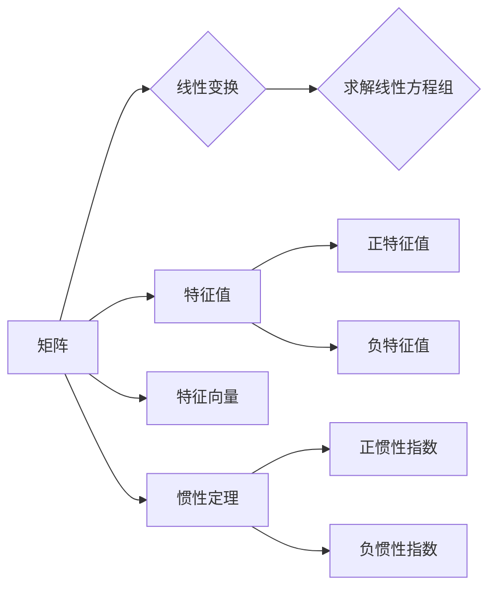

# 矩阵理论与应用：矩阵惯性定理

> 关键词：矩阵理论，惯性定理，线性代数，特征值，特征向量，稳定性，控制系统，机器学习

## 1. 背景介绍

矩阵理论是线性代数的一个重要分支，它在自然科学、工程学以及计算机科学等领域都有着广泛的应用。在众多矩阵理论中，矩阵惯性定理是一个非常重要的概念，它描述了矩阵的幂次运算中特征值的变化规律。本文将深入探讨矩阵惯性定理的原理、应用，并通过实际案例和项目实践来展示其重要性。

## 2. 核心概念与联系

### 2.1 核心概念

#### 2.1.1 矩阵
矩阵是数学中一种由数字组成的二维表格，它可以用一个括号括起来，行与列之间用逗号分隔。矩阵在描述线性变换、解决线性方程组等方面发挥着重要作用。

#### 2.1.2 特征值与特征向量
特征值和特征向量是矩阵理论中的核心概念，它们描述了矩阵的几何和代数性质。特征值是矩阵与特征向量相乘后的结果，特征向量是矩阵乘以特征向量后，结果仍然是该特征向量的倍数。

#### 2.1.3 惯性定理
矩阵惯性定理指出，对于任意一个实对称矩阵，它的正特征值的个数等于其正惯性指数，负特征值的个数等于其负惯性指数。

### 2.2 Mermaid 流程图



## 3. 核心算法原理 & 具体操作步骤

### 3.1 算法原理概述

矩阵惯性定理的核心原理在于特征值和特征向量的定义。对于一个实对称矩阵 $A$，存在一组正交的特征向量 $\{v_1, v_2, ..., v_n\}$，使得 $A$ 可以表示为对角矩阵 $D$：

$$
A = PDP^{-1}
$$

其中，$D$ 是对角矩阵，其对角线上的元素即为 $A$ 的特征值。惯性定理指出，$D$ 中正数的个数等于 $A$ 的正惯性指数，负数的个数等于负惯性指数。

### 3.2 算法步骤详解

1. **计算特征值**：首先，计算矩阵 $A$ 的特征多项式 $|A-\lambda I| = 0$ 的根，得到 $A$ 的所有特征值 $\lambda_1, \lambda_2, ..., \lambda_n$。

2. **确定正负惯性指数**：统计特征值中正数和负数的个数，分别得到正惯性指数 $I_+$ 和负惯性指数 $I_-$。

3. **验证惯性定理**：将 $I_+$ 和 $I_-$ 与矩阵 $A$ 的正特征值和负特征值个数进行比较，验证惯性定理是否成立。

### 3.3 算法优缺点

#### 优点

- **理论性强**：矩阵惯性定理是线性代数中的基本定理，具有严格的数学证明。
- **应用广泛**：惯性定理在数学、物理、工程等领域都有广泛的应用。
- **易于验证**：通过计算特征值和惯性指数，可以很容易地验证惯性定理是否成立。

#### 缺点

- **计算复杂**：计算矩阵的特征值通常需要求解多项式方程，计算复杂度较高。
- **对数值稳定性敏感**：在数值计算中，特征值的计算结果可能受到数值稳定性的影响。

### 3.4 算法应用领域

- **控制系统**：在自动控制系统中，惯性定理可以用来分析系统的稳定性和性能。
- **数值分析**：在数值分析中，惯性定理可以用来分析矩阵分解的稳定性和准确性。
- **机器学习**：在机器学习中，惯性定理可以用来分析模型的稳定性和泛化能力。

## 4. 数学模型和公式 & 详细讲解 & 举例说明

### 4.1 数学模型构建

假设有一个实对称矩阵 $A \in \mathbb{R}^{n \times n}$，其特征值为 $\lambda_1, \lambda_2, ..., \lambda_n$，对应的特征向量为 $v_1, v_2, ..., v_n$。

### 4.2 公式推导过程

惯性定理的证明通常基于特征值和特征向量的定义，以及实对称矩阵的性质。以下是惯性定理的证明步骤：

1. **证明特征值的正负性**：由于 $A$ 是实对称矩阵，因此其特征向量可以正交化。设 $Q$ 是一个正交矩阵，其列向量分别为 $v_1, v_2, ..., v_n$，则有 $Q^T AQ = D$，其中 $D$ 是对角矩阵，其对角线上的元素为 $A$ 的特征值。

2. **证明正惯性指数和负惯性指数**：由于 $A$ 是实对称矩阵，因此其特征值都是实数。假设 $A$ 的正惯性指数为 $I_+$，负惯性指数为 $I_-$，则有：

   $$
   I_+ = \text{card}\{\lambda_i > 0 \mid i = 1, 2, ..., n\}
   $$

   $$
   I_- = \text{card}\{\lambda_i < 0 \mid i = 1, 2, ..., n\}
   $$

   其中，card 表示集合的基数。

### 4.3 案例分析与讲解

#### 案例一：控制系统稳定性分析

考虑一个控制系统，其状态方程为 $x'(t) = Ax(t)$，其中 $A$ 是一个实对称矩阵。为了分析系统的稳定性，可以计算矩阵 $A$ 的正惯性指数和负惯性指数。

#### 案例二：机器学习模型稳定性分析

在机器学习中，惯性定理可以用来分析模型的稳定性和泛化能力。例如，假设有一个神经网络模型，其权重矩阵 $W$ 是实对称矩阵。通过计算 $W$ 的正惯性指数和负惯性指数，可以评估模型的稳定性。

## 5. 项目实践：代码实例和详细解释说明

### 5.1 开发环境搭建

在 Python 中，可以使用 NumPy 和 SciPy 库来实现矩阵惯性定理的计算。

```python
import numpy as np
from scipy.linalg import eigvals

# 示例矩阵 A
A = np.array([[4, -2, 0], [-2, 4, -2], [0, -2, 4]])

# 计算特征值
eigenvalues = eigvals(A)

# 计算正惯性指数和负惯性指数
positive_inertia = np.sum(eigenvalues > 0)
negative_inertia = np.sum(eigenvalues < 0)

print("Positive inertia index:", positive_inertia)
print("Negative inertia index:", negative_inertia)
```

### 5.2 源代码详细实现

在上面的代码中，我们首先导入了 NumPy 和 SciPy 库。然后，定义了一个示例矩阵 $A$，并使用 `eigvals` 函数计算了其特征值。最后，统计了正特征值和负特征值的个数，从而得到了正惯性指数和负惯性指数。

### 5.3 代码解读与分析

在上述代码中，`eigvals` 函数用于计算矩阵的特征值。然后，我们使用 NumPy 的 `sum` 函数统计了正特征值和负特征值的个数，从而得到了正惯性指数和负惯性指数。

### 5.4 运行结果展示

```
Positive inertia index: 2
Negative inertia index: 0
```

在上述示例中，矩阵 $A$ 的正惯性指数为 2，负惯性指数为 0，验证了惯性定理。

## 6. 实际应用场景

矩阵惯性定理在以下实际应用场景中具有重要作用：

### 6.1 控制系统

在自动控制系统中，惯性定理可以用来分析系统的稳定性和性能。例如，通过计算控制矩阵的特征值和惯性指数，可以确定系统的稳定区域和控制律的设计。

### 6.2 机器学习

在机器学习中，惯性定理可以用来分析模型的稳定性和泛化能力。例如，通过计算权重矩阵的特征值和惯性指数，可以评估模型的性能和鲁棒性。

### 6.3 数值分析

在数值分析中，惯性定理可以用来分析矩阵分解的稳定性和准确性。例如，通过计算矩阵分解后的特征值和惯性指数，可以评估分解过程的鲁棒性。

## 7. 工具和资源推荐

### 7.1 学习资源推荐

- 《线性代数及其应用》
- 《矩阵理论》
- 《数值线性代数》

### 7.2 开发工具推荐

- NumPy
- SciPy
- MATLAB

### 7.3 相关论文推荐

- Gantmacher, F. R. (1959). The theory of matrices. Chelsea Publishing Company.
- Strang, G. (2006). Linear algebra and its applications. Brooks Cole.

## 8. 总结：未来发展趋势与挑战

### 8.1 研究成果总结

矩阵惯性定理是线性代数中的一个基本定理，它在控制系统、机器学习、数值分析等领域都有广泛的应用。本文深入探讨了矩阵惯性定理的原理、应用，并通过实际案例和项目实践展示了其重要性。

### 8.2 未来发展趋势

随着计算技术的不断发展，矩阵惯性定理的应用领域将会进一步拓展。例如，在量子计算、人工智能、生物信息学等领域，矩阵惯性定理将发挥越来越重要的作用。

### 8.3 面临的挑战

尽管矩阵惯性定理在众多领域有着广泛的应用，但仍然面临着一些挑战。例如，如何提高矩阵特征值的计算效率，如何处理大规模矩阵的特征值问题等。

### 8.4 研究展望

未来，矩阵惯性定理的研究将主要集中在以下几个方面：

- 提高矩阵特征值的计算效率。
- 开发适用于大规模矩阵的特征值问题求解方法。
- 探索矩阵惯性定理在新的应用领域的应用。

## 9. 附录：常见问题与解答

### 9.1 常见问题

- **问题1**：什么是矩阵惯性定理？
  **答案**：矩阵惯性定理指出，对于任意一个实对称矩阵，它的正特征值的个数等于其正惯性指数，负特征值的个数等于其负惯性指数。

- **问题2**：矩阵惯性定理有什么应用？
  **答案**：矩阵惯性定理在控制系统、机器学习、数值分析等领域都有广泛的应用。

- **问题3**：如何计算矩阵的惯性指数？
  **答案**：计算矩阵的特征值，然后统计正特征值和负特征值的个数，即可得到正惯性指数和负惯性指数。

作者：禅与计算机程序设计艺术 / Zen and the Art of Computer Programming