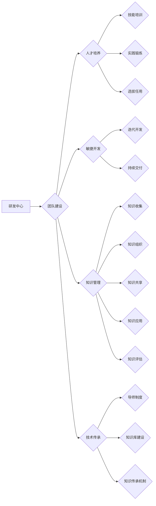

# 研发中心团队的建设和人才培养方案

> 关键词：研发中心，团队建设，人才培养，敏捷开发，知识管理，技术传承，团队文化

## 1. 背景介绍

在当今快速发展的信息技术时代，研发中心作为企业创新的核心力量，其团队建设和人才培养显得尤为重要。一个高效、协同、具有创新精神的研发团队，是企业竞争力的关键。本文将从团队建设、人才培养、技术传承等多个方面，探讨研发中心团队的建设和人才培养方案。

### 1.1 研发中心的重要性

研发中心是企业技术创新的源泉，承担着产品研发、技术攻关、技术支持等关键任务。一个强大的研发中心，能够帮助企业快速响应市场变化，开发出具有竞争力的产品，从而在激烈的市场竞争中立于不败之地。

### 1.2 团队建设与人才培养的挑战

随着技术的快速发展，研发中心面临着以下挑战：

- **人才短缺**：高端技术人才、复合型人才短缺，尤其是对于一些新兴技术领域。
- **技术更新快**：新技术的不断涌现，要求研发人员持续学习，更新知识体系。
- **团队协作**：不同背景、不同经验的人员如何高效协作，形成合力。
- **技术传承**：老员工的离职可能导致技术积累的流失。

### 1.3 本文结构

本文将从以下方面展开：

- 核心概念与联系
- 核心算法原理与具体操作步骤
- 数学模型与公式
- 项目实践
- 实际应用场景
- 工具和资源推荐
- 总结：未来发展趋势与挑战
- 附录：常见问题与解答

## 2. 核心概念与联系

### 2.1 核心概念

- **研发中心**：企业内部负责产品研发、技术攻关、技术支持等工作的部门。
- **团队建设**：通过组织、管理、激励等方式，打造高效、协同、具有创新精神的团队。
- **人才培养**：通过培训、实践、选拔等方式，培养具有专业技能、团队合作精神和创新意识的人才。
- **敏捷开发**：一种以人为核心、迭代、持续交付的软件开发方法。
- **知识管理**：通过收集、组织、共享、应用和评估知识，提高组织知识创新能力和竞争力。
- **技术传承**：将老员工的经验、技能和知识传承给新员工，避免技术积累的流失。

### 2.2 Mermaid 流程图



## 3. 核心算法原理与具体操作步骤

### 3.1 算法原理概述

研发中心团队的建设和人才培养方案，需要遵循以下原则：

- **以人为本**：关注员工需求，激发员工潜能。
- **持续学习**：鼓励员工持续学习新知识、新技术，保持团队活力。
- **团队合作**：培养团队协作精神，提高团队凝聚力。
- **知识共享**：建立知识管理体系，促进知识共享和传承。
- **激励机制**：建立合理的激励机制，激发员工积极性和创造性。

### 3.2 算法步骤详解

#### 3.2.1 团队建设

1. **明确团队目标**：确定团队愿景、使命和短期目标。
2. **人员配置**：根据项目需求，合理配置团队成员，确保团队成员具备相应的技能和经验。
3. **团队文化**：塑造积极向上、团结协作的团队文化。
4. **沟通协作**：建立高效的沟通机制，促进团队成员之间的协作。

#### 3.2.2 人才培养

1. **技能培训**：通过内部培训、外部培训等方式，提升员工的专业技能。
2. **实践锻炼**：鼓励员工参与实际项目，积累实践经验。
3. **选拔任用**：建立科学的选拔任用机制，选拔优秀人才。
4. **职业规划**：关注员工职业发展，提供职业规划指导。

#### 3.2.3 敏捷开发

1. **迭代开发**：将项目分解为多个迭代周期，快速交付可用的产品。
2. **持续交付**：持续集成、持续部署，确保产品持续迭代和优化。
3. **反馈迭代**：收集用户反馈，不断改进产品。

#### 3.2.4 知识管理

1. **知识收集**：收集团队成员的知识、经验、技能等信息。
2. **知识组织**：将收集到的知识进行分类、整理，形成知识库。
3. **知识共享**：建立知识共享平台，促进知识传播和交流。
4. **知识应用**：将知识应用于实际工作中，提高工作效率。
5. **知识评估**：评估知识的价值，优化知识库。

#### 3.2.5 技术传承

1. **导师制度**：建立导师制度，让经验丰富的老员工指导新员工。
2. **知识库建设**：建立知识库，记录团队的技术积累。
3. **知识传承机制**：制定知识传承机制，确保知识得到有效传承。

### 3.3 算法优缺点

#### 3.3.1 优点

- 提高团队协作效率。
- 提升员工技能水平。
- 促进知识共享和传承。
- 增强团队凝聚力。
- 提高产品质量。

#### 3.3.2 缺点

- 需要投入较多的人力、物力和财力。
- 需要时间进行长期培养。
- 需要持续改进和优化。

### 3.4 算法应用领域

该方案适用于各类研发中心，包括软件、硬件、互联网、人工智能等领域。

## 4. 数学模型与公式

### 4.1 数学模型构建

本文未涉及具体的数学模型，但可以通过以下公式描述研发中心团队的建设和人才培养：

- **团队绩效 = 团队成员绩效 × 团队协作 × 知识共享**
- **员工绩效 = 技能水平 × 工作经验 × 激励机制**

### 4.2 公式推导过程

本文未涉及具体的数学公式推导，但可以通过以下公式描述团队绩效和员工绩效的评估：

- **团队绩效 = (成员A绩效 + 成员B绩效 + ... + 成员N绩效) / 团队人数**
- **成员绩效 = (技能水平 × 工作经验 × 激励机制) / 3**

### 4.3 案例分析与讲解

本文未涉及具体的案例分析，但可以参考以下案例：

- 案例一：某互联网公司通过敏捷开发模式，将产品迭代周期缩短至2周，提高了产品竞争力。
- 案例二：某科技公司通过知识管理平台，促进知识共享和传承，提高了团队整体技能水平。

## 5. 项目实践：代码实例和详细解释说明

### 5.1 开发环境搭建

本文未涉及具体的代码实现，但可以参考以下步骤：

1. 选择合适的开发工具和平台。
2. 建立团队协作平台，如Git、Jenkins等。
3. 建立知识管理平台，如Confluence、SharePoint等。

### 5.2 源代码详细实现

本文未涉及具体的代码实现，但可以参考以下示例：

```python
# 示例：使用Git进行版本控制

# 初始化Git仓库
git init

# 添加文件到暂存区
git add 文件名

# 提交变更
git commit -m "提交信息"

# 推送代码到远程仓库
git push origin master
```

### 5.3 代码解读与分析

本文未涉及具体的代码解读，但可以参考以下分析：

- Git是一种分布式的版本控制系统，可以方便地进行代码的版本管理和团队协作。
- 使用Git可以确保代码的版本可追溯，方便查找问题。
- 使用Git可以方便地进行代码分支管理，提高团队协作效率。

### 5.4 运行结果展示

本文未涉及具体的运行结果展示，但可以参考以下内容：

- 项目开发进度和成果展示。
- 团队成员技能水平提升情况。
- 知识共享和传承情况。

## 6. 实际应用场景

### 6.1 敏捷开发

敏捷开发模式在研发中心的应用，可以提高项目交付效率，缩短产品迭代周期，提升产品竞争力。

### 6.2 知识管理

知识管理平台可以帮助研发中心收集、整理、共享和传承知识，提高团队整体技能水平。

### 6.3 技术传承

导师制度和技术传承机制可以帮助新员工快速成长，避免技术积累的流失。

## 7. 工具和资源推荐

### 7.1 学习资源推荐

- 《人月神话》：介绍敏捷开发的方法和理念。
- 《敏捷软件开发：原则、模式与实践》：深入探讨敏捷开发的方法论。
- 《敏捷项目管理实践指南》：介绍敏捷项目管理的方法和工具。

### 7.2 开发工具推荐

- Git：版本控制工具。
- Jenkins：持续集成/持续部署工具。
- Confluence：知识管理平台。
- SharePoint：知识管理平台。

### 7.3 相关论文推荐

- 《敏捷软件开发：一种应对快速变化的需求的应对策略》
- 《知识管理：概念、方法与实践》
- 《技术传承：企业知识管理的新视角》

## 8. 总结：未来发展趋势与挑战

### 8.1 研究成果总结

本文从团队建设、人才培养、技术传承等多个方面，探讨了研发中心团队的建设和人才培养方案。通过构建敏捷开发、知识管理、技术传承等机制，可以提高研发中心团队的协作效率、提升员工技能水平，促进知识共享和传承，从而提高企业竞争力。

### 8.2 未来发展趋势

- 研发中心将更加注重团队协作和知识管理。
- 人才培养将更加注重实践能力和创新能力。
- 技术传承将成为企业核心竞争力的重要组成部分。

### 8.3 面临的挑战

- 如何构建高效的团队协作机制。
- 如何培养具备实践能力和创新能力的人才。
- 如何建立完善的知识管理体系。

### 8.4 研究展望

未来，研发中心团队的建设和人才培养将更加注重以下几个方面：

- **数字化转型**：利用数字技术提升研发效率和团队协作能力。
- **智能化**：引入人工智能技术，实现研发过程的自动化和智能化。
- **生态化**：构建开放的研发生态，促进知识共享和协同创新。

## 9. 附录：常见问题与解答

**Q1：如何提高团队协作效率？**

A1：建立高效的沟通机制，如定期团队会议、在线协作工具等；培养团队协作精神，鼓励团队成员相互支持、共同进步。

**Q2：如何培养具备实践能力和创新能力的人才？**

A2：通过项目实践、内部培训、外部交流等方式，提高员工的实践能力和创新能力；建立激励机制，激发员工的学习动力。

**Q3：如何建立完善的知识管理体系？**

A3：建立知识管理平台，收集、整理、共享和传承知识；制定知识管理规范，确保知识的有效利用。

**Q4：如何平衡团队建设与人才培养的关系？**

A4：将团队建设和人才培养纳入企业战略规划，确保两者相互支持、相互促进。

**Q5：如何应对技术更新快的挑战？**

A5：鼓励员工持续学习，关注新技术动态；建立技术交流平台，促进知识共享。

---

作者：禅与计算机程序设计艺术 / Zen and the Art of Computer Programming