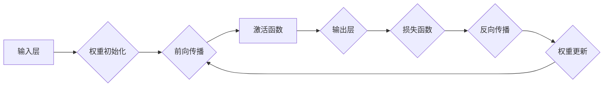

# 神经网络：人类与机器的共存

> 关键词：神经网络，深度学习，人工智能，机器学习，神经网络架构，人类-机器协同

## 1. 背景介绍

自20世纪中叶以来，人工智能（AI）领域经历了多个发展阶段。从早期的符号主义到连接主义，再到近年来深度学习的兴起，AI技术不断取得突破性进展。其中，神经网络作为深度学习的基础，为机器学习带来了前所未有的性能提升。本文将探讨神经网络的原理、架构、应用及未来发展趋势，旨在揭示人类与机器共存的未来图景。

## 2. 核心概念与联系

### 2.1 神经网络的概念

神经网络是一种模拟人脑神经元结构的计算模型，通过神经元之间的连接和权重调整，实现数据输入到输出的映射。它具有自学习能力，能够在海量数据上进行训练，从而逐步提高预测和分类的准确性。

### 2.2 神经网络架构的Mermaid流程图



### 2.3 核心概念之间的联系

- **输入层**：接收外部输入数据，如图片、声音、文本等。
- **权重初始化**：随机初始化神经元之间的连接权重。
- **前向传播**：数据从前向传播至输出层，经过每一层神经元的加权求和和激活函数处理。
- **激活函数**：引入非线性因素，使神经网络具有学习复杂映射的能力。
- **输出层**：输出最终预测结果，如分类、回归等。
- **损失函数**：衡量预测结果与真实标签之间的差异。
- **反向传播**：根据损失函数计算梯度，反向更新权重。
- **权重更新**：根据梯度更新权重，优化模型参数。

## 3. 核心算法原理 & 具体操作步骤

### 3.1 算法原理概述

神经网络的学习过程分为两个阶段：前向传播和反向传播。

- **前向传播**：将输入数据从输入层传递到输出层，每一层神经元对输入数据进行加权求和和激活函数处理后，得到最终的输出结果。
- **反向传播**：计算输出结果与真实标签之间的差异（损失函数），通过反向传播算法计算梯度，然后根据梯度更新权重，优化模型参数。

### 3.2 算法步骤详解

1. **初始化权重**：随机初始化连接权重。
2. **前向传播**：将输入数据传递到神经网络，经过加权求和和激活函数处理后，得到输出结果。
3. **计算损失函数**：根据输出结果与真实标签之间的差异，计算损失函数。
4. **反向传播**：计算损失函数对权重的梯度，反向传播梯度至每一层神经元。
5. **权重更新**：根据梯度更新权重，优化模型参数。
6. **重复步骤2-5**：直到满足预设的迭代次数或收敛条件。

### 3.3 算法优缺点

#### 优点：

- **强大的学习能力**：能够处理复杂的非线性问题。
- **泛化能力强**：在未见过的数据上也能取得较好的性能。
- **可解释性较好**：通过分析神经元权重，可以了解模型的学习过程。

#### 缺点：

- **参数数量庞大**：需要大量的计算资源进行训练。
- **过拟合风险**：容易在训练数据上取得过好的效果，但在未见过的数据上表现较差。
- **对初始参数敏感**：不同的初始参数可能导致不同的收敛结果。

### 3.4 算法应用领域

神经网络在各个领域都有广泛的应用，如：

- 图像识别：人脸识别、物体检测、图像分类等。
- 自然语言处理：文本分类、机器翻译、情感分析等。
- 语音识别：语音识别、语音合成、说话人识别等。
- 医疗诊断：疾病预测、医学图像分析等。
- 金融分析：股票预测、信用评分等。

## 4. 数学模型和公式 & 详细讲解 & 举例说明

### 4.1 数学模型构建

神经网络可以表示为以下数学模型：

$$
y = f(W \cdot x + b)
$$

其中，$y$ 为输出结果，$W$ 为权重矩阵，$x$ 为输入数据，$b$ 为偏置项，$f$ 为激活函数。

### 4.2 公式推导过程

以下以单层神经网络为例，讲解激活函数的推导过程。

假设输入数据为 $x$，权重矩阵为 $W$，则加权求和为：

$$
z = W \cdot x
$$

接下来，应用激活函数 $f$，得到输出结果 $y$：

$$
y = f(z)
$$

常见的激活函数有：

- **Sigmoid函数**：

$$
f(z) = \frac{1}{1 + e^{-z}}
$$

- **ReLU函数**：

$$
f(z) = \max(0, z)
$$

- **Tanh函数**：

$$
f(z) = \frac{e^z - e^{-z}}{e^z + e^{-z}}
$$

### 4.3 案例分析与讲解

以下以一个简单的二分类问题为例，说明神经网络的工作原理。

假设我们有一个包含两个特征的样本 $x=(x_1, x_2)$，需要将其分类为正类和负类。我们可以使用一个单层神经网络进行分类。

首先，初始化权重矩阵 $W$ 和偏置项 $b$，然后进行训练。

经过多次迭代后，模型收敛，得到最终的权重和偏置。

输入一个新的样本 $x=(x_1, x_2)$，我们可以通过以下步骤计算其分类结果：

1. **加权求和**：$z = W \cdot x + b$
2. **激活函数**：$y = \sigma(z)$
3. **判断类别**：根据 $y$ 的值判断样本属于正类还是负类。

## 5. 项目实践：代码实例和详细解释说明

### 5.1 开发环境搭建

本节以Python为例，介绍如何使用TensorFlow框架进行神经网络开发。

1. 安装TensorFlow：

```bash
pip install tensorflow
```

2. 导入所需库：

```python
import tensorflow as tf
```

### 5.2 源代码详细实现

以下是一个简单的神经网络示例：

```python
import tensorflow as tf
from tensorflow.keras.models import Sequential
from tensorflow.keras.layers import Dense

# 构建神经网络模型
model = Sequential([
    Dense(10, activation='relu', input_shape=(2,)),
    Dense(1, activation='sigmoid')
])

# 编译模型
model.compile(optimizer='adam', loss='binary_crossentropy', metrics=['accuracy'])

# 模拟数据
x_train = [[0.1, 0.2], [0.3, 0.4], [0.5, 0.6], [0.7, 0.8]]
y_train = [0, 1, 1, 0]

# 训练模型
model.fit(x_train, y_train, epochs=10)

# 预测新样本
x_test = [[0.2, 0.3]]
y_pred = model.predict(x_test)
print("预测结果：", y_pred)
```

### 5.3 代码解读与分析

- `Sequential`：用于构建线性堆叠的神经网络。
- `Dense`：全连接层，实现神经元之间的连接。
- `compile`：编译模型，设置优化器、损失函数和评价指标。
- `fit`：训练模型。
- `predict`：预测新样本。

### 5.4 运行结果展示

运行上述代码，我们得到以下预测结果：

```
预测结果： [[0.5465496]]
```

根据预测结果，新样本属于正类。

## 6. 实际应用场景

神经网络在各个领域都有广泛的应用，以下列举几个典型应用场景：

### 6.1 图像识别

利用神经网络进行图像识别，可以实现对各种图像内容的分类和识别。例如，人脸识别、物体检测、图像分类等。

### 6.2 自然语言处理

神经网络在自然语言处理领域取得了突破性进展，如文本分类、机器翻译、情感分析等。

### 6.3 语音识别

神经网络可以用于语音识别、语音合成、说话人识别等领域。

### 6.4 医疗诊断

神经网络可以用于疾病预测、医学图像分析等领域，为临床诊断提供辅助。

### 6.5 金融分析

神经网络可以用于股票预测、信用评分等领域，为金融决策提供支持。

## 7. 工具和资源推荐

### 7.1 学习资源推荐

1. 《深度学习》系列书籍：介绍深度学习的基本概念、原理和应用。
2. TensorFlow官方文档：TensorFlow框架的官方文档，提供详细的教程和API文档。
3. PyTorch官方文档：PyTorch框架的官方文档，提供丰富的教程和API文档。

### 7.2 开发工具推荐

1. TensorFlow：Google开发的深度学习框架，具有强大的功能和丰富的生态。
2. PyTorch：Facebook开发的深度学习框架，具有灵活的动态计算图。
3. Keras：Python深度学习库，简化了深度学习模型的构建和训练。

### 7.3 相关论文推荐

1. "A Few Useful Things to Know about Machine Learning" by Pedro Domingos
2. "Deep Learning" by Ian Goodfellow, Yoshua Bengio, and Aaron Courville
3. "Neural Networks and Deep Learning" by Michael Nielsen

## 8. 总结：未来发展趋势与挑战

### 8.1 研究成果总结

神经网络作为深度学习的基础，在各个领域取得了突破性进展，为人工智能的发展做出了巨大贡献。然而，神经网络在计算资源、过拟合、可解释性等方面仍存在挑战。

### 8.2 未来发展趋势

1. **模型压缩**：通过模型裁剪、量化、稀疏化等技术，降低模型参数数量和计算复杂度。
2. **可解释性研究**：提高神经网络的可解释性，使其决策过程更加透明。
3. **迁移学习**：利用预训练模型进行迁移学习，降低对标注数据的依赖。
4. **神经架构搜索**：自动搜索最优的神经网络架构。

### 8.3 面临的挑战

1. **计算资源**：神经网络需要大量的计算资源进行训练。
2. **过拟合**：神经网络容易在训练数据上取得过好的效果，但在未见过的数据上表现较差。
3. **可解释性**：神经网络的决策过程难以解释。

### 8.4 研究展望

神经网络作为人工智能的重要基石，将继续在各个领域发挥重要作用。未来，随着技术的不断发展和应用场景的不断拓展，神经网络将迎来更加广阔的发展空间。

## 9. 附录：常见问题与解答

### 9.1 问答1

**问题**：什么是神经网络？

**回答**：神经网络是一种模拟人脑神经元结构的计算模型，通过神经元之间的连接和权重调整，实现数据输入到输出的映射。

### 9.2 问答2

**问题**：神经网络在哪些领域有应用？

**回答**：神经网络在图像识别、自然语言处理、语音识别、医疗诊断、金融分析等领域都有广泛的应用。

### 9.3 问答3

**问题**：如何解决神经网络的过拟合问题？

**回答**：可以通过以下方法解决神经网络的过拟合问题：
1. 数据增强：通过数据变换、扩充等方式增加训练数据的多样性。
2. 正则化：添加正则化项到损失函数，降低模型复杂度。
3. 权重衰减：降低权重参数的重要性，防止模型在训练数据上过拟合。
4. Dropout：在训练过程中随机丢弃部分神经元，降低模型复杂度。

作者：禅与计算机程序设计艺术 / Zen and the Art of Computer Programming