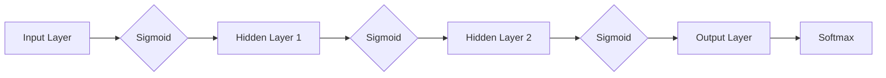

# 神经网络：人类与机器的共存

> 关键词：神经网络，深度学习，人工智能，人机共存，机器学习，认知科学，计算神经科学

## 1. 背景介绍

从古老的图灵测试到今日的智能助手，人工智能（AI）的发展历程一直伴随着人类对于机器智能极限的探索。近年来，随着计算能力的提升和数据量的激增，深度学习技术取得了突破性进展，神经网络作为深度学习的基础，已经成为AI领域的核心工具。本文旨在探讨神经网络的原理、应用，以及它们如何与人类共存，共同推动未来社会的发展。

### 1.1 问题的由来

人类智能的奥秘自古以来就吸引着人们的探索。从古希腊的亚里士多德到近代的康德，再到现代的认知科学家，人们试图理解人类思维的本质。随着计算机科学的兴起，人工智能逐渐成为研究人类智能的一个新领域。然而，早期的AI系统大多基于规则和逻辑推理，难以胜任复杂任务。

20世纪80年代，随着反向传播算法（Backpropagation）的出现，神经网络开始崛起，为AI领域带来了新的希望。神经网络模仿人脑神经元的工作原理，通过多层节点之间的连接和权重调整，实现对数据的非线性变换和特征提取。

### 1.2 研究现状

如今，神经网络已经成为AI领域的核心技术之一，广泛应用于图像识别、语音识别、自然语言处理、自动驾驶等领域。随着深度学习技术的发展，神经网络的规模和复杂度不断提高，性能也越来越强大。

### 1.3 研究意义

研究神经网络不仅有助于我们理解人类智能的奥秘，还可以推动AI技术的进步，使机器能够更好地服务于人类。以下是神经网络研究的几个重要意义：

- 推动人工智能技术的发展，使机器能够处理更复杂、更抽象的任务。
- 促进人机共存，提高人类生活质量和工作效率。
- 为认知科学和计算神经科学提供新的研究视角和方法。

### 1.4 本文结构

本文将分为以下几个部分：

- 第2部分，介绍神经网络的核心理念和基本架构。
- 第3部分，阐述神经网络的算法原理和具体操作步骤。
- 第4部分，讲解神经网络的数学模型和公式，并通过案例进行分析。
- 第5部分，展示神经网络的代码实例和详细解释。
- 第6部分，探讨神经网络的实际应用场景和未来发展趋势。
- 第7部分，推荐神经网络相关的学习资源、开发工具和参考文献。
- 第8部分，总结神经网络的研究成果和面临的挑战，以及未来的研究展望。
- 第9部分，提供一些常见问题的解答。

## 2. 核心概念与联系

### 2.1 核心概念

神经网络（Neural Network）是一种模仿人脑神经元工作原理的计算模型。它由大量的节点（神经元）组成，节点之间通过连接（突触）相互连接。每个节点都包含一个简单的计算单元，可以接收来自其他节点的输入信号，经过激活函数处理后，输出信号传递给下一个节点。

以下是神经网络中一些核心概念：

- 神经元：神经网络的基本单元，负责接收输入信号、计算和输出信号。
- 突触：连接神经元之间的连接，具有权重，用于传递信号。
- 激活函数：对神经元输出进行非线性变换的函数，如Sigmoid、ReLU等。
- 权重：突触连接中用于传递信号的重要参数，可以通过学习进行调整。
- 前向传播：将输入信号逐层传递到神经网络，最终得到输出信号的过程。
- 反向传播：根据输出信号与真实标签之间的差异，反向计算损失，并更新神经元权重的过程。

### 2.2 Mermaid 流程图



### 2.3 核心概念联系

神经网络的核心概念相互联系，共同构成了一个完整的计算模型。输入层接收外部输入信号，经过激活函数处理后传递到隐藏层，隐藏层通过权重连接形成复杂的信息处理网络，最后输出层通过激活函数和Softmax函数输出最终结果。

## 3. 核心算法原理 & 具体操作步骤

### 3.1 算法原理概述

神经网络通过多层节点之间的连接和权重调整，实现对数据的非线性变换和特征提取。其基本原理包括：

- 前向传播：将输入信号逐层传递到神经网络，最终得到输出信号的过程。
- 损失函数：衡量模型输出与真实标签之间差异的函数，如交叉熵损失、均方误差等。
- 反向传播：根据输出信号与真实标签之间的差异，反向计算损失，并更新神经元权重的过程。

### 3.2 算法步骤详解

以下是神经网络训练的基本步骤：

1. **初始化参数**：随机初始化网络中所有神经元的权重。
2. **前向传播**：将输入信号通过神经网络，得到输出信号。
3. **计算损失**：使用损失函数计算输出信号与真实标签之间的差异。
4. **反向传播**：根据损失函数的梯度，更新神经元权重。
5. **迭代训练**：重复步骤2-4，直到损失函数收敛。

### 3.3 算法优缺点

#### 优点：

- 能够处理非线性问题。
- 能够自动提取特征。
- 具有良好的泛化能力。

#### 缺点：

- 训练时间长，对计算资源要求高。
- 难以解释模型决策过程。
- 对噪声和异常值敏感。

### 3.4 算法应用领域

神经网络在以下领域具有广泛的应用：

- 图像识别：如人脸识别、物体检测等。
- 语音识别：如语音转文字、语音合成等。
- 自然语言处理：如机器翻译、情感分析等。
- 机器学习：如分类、回归、聚类等。

## 4. 数学模型和公式 & 详细讲解 & 举例说明

### 4.1 数学模型构建

神经网络的数学模型主要由以下几个部分组成：

- 神经元：$y = f(Wx + b)$，其中 $W$ 是权重，$b$ 是偏置，$f$ 是激活函数。
- 损失函数：如交叉熵损失函数：$L = -\sum_{i=1}^N [y_i \log(\hat{y}_i)]$。
- 反向传播算法：通过计算梯度来更新权重和偏置。

### 4.2 公式推导过程

以下是交叉熵损失函数的推导过程：

$$
L = -\sum_{i=1}^N [y_i \log(\hat{y}_i)] \\
= -\sum_{i=1}^N [y_i \log(\sigma(Wx + b))] \\
= -\sum_{i=1}^N [y_i \log(\sigma(Wx + b)) - \log(\sigma(Wx + b))] \\
= -\sum_{i=1}^N [y_i \log(\sigma(Wx + b)) - \log(1-\sigma(Wx + b))] \\
= -\sum_{i=1}^N [y_i \log(\sigma(Wx + b)) - (1-y_i) \log(1-\sigma(Wx + b))]
$$

### 4.3 案例分析与讲解

以下是一个简单的神经网络模型，用于对数字进行分类：

```python
import numpy as np

# 定义激活函数
def sigmoid(x):
    return 1 / (1 + np.exp(-x))

# 定义前向传播
def forward(x, W, b):
    z = np.dot(x, W) + b
    y_hat = sigmoid(z)
    return y_hat

# 定义交叉熵损失函数
def cross_entropy_loss(y_true, y_pred):
    return -np.sum(y_true * np.log(y_pred))

# 定义反向传播
def backward(x, y_true, y_pred, W, b):
    delta = y_pred - y_true
    dW = np.dot(x.T, delta)
    db = np.sum(delta)
    return dW, db

# 初始化参数
W = np.random.randn(2, 1)
b = np.random.randn(1)
x = np.array([1, 0])
y_true = np.array([0])

# 前向传播
y_pred = forward(x, W, b)

# 计算损失
loss = cross_entropy_loss(y_true, y_pred)

# 反向传播
dW, db = backward(x, y_true, y_pred, W, b)

# 更新参数
W -= 0.01 * dW
b -= 0.01 * db

# 打印结果
print("Loss:", loss)
print("Updated W:", W)
print("Updated b:", b)
```

以上代码展示了如何使用Python实现一个简单的神经网络模型，并对其进行训练。通过迭代优化权重和偏置，模型能够学习到输入输出之间的映射关系。

## 5. 项目实践：代码实例和详细解释说明

### 5.1 开发环境搭建

在进行神经网络项目实践前，需要搭建以下开发环境：

1. Python 3.7+
2. NumPy 1.19+
3. TensorFlow 2.0+

### 5.2 源代码详细实现

以下是一个使用TensorFlow实现神经网络模型进行分类的示例：

```python
import tensorflow as tf

# 定义模型结构
def create_model():
    model = tf.keras.Sequential([
        tf.keras.layers.Dense(64, activation='relu', input_shape=(2,)),
        tf.keras.layers.Dense(64, activation='relu'),
        tf.keras.layers.Dense(1, activation='sigmoid')
    ])
    return model

# 创建模型
model = create_model()

# 编译模型
model.compile(optimizer='adam',
              loss='binary_crossentropy',
              metrics=['accuracy'])

# 准备数据
x_train = np.array([[1, 0], [0, 1], [1, 1], [1, 0]])
y_train = np.array([[0], [1], [1], [0]])

# 训练模型
model.fit(x_train, y_train, epochs=100)

# 评估模型
x_test = np.array([[0, 1], [1, 1], [0, 0]])
y_test = np.array([[1], [1], [0]])
loss, accuracy = model.evaluate(x_test, y_test)
print("Test accuracy:", accuracy)
```

### 5.3 代码解读与分析

以上代码展示了如何使用TensorFlow创建和训练一个简单的神经网络模型。以下是代码的关键部分：

- `create_model` 函数定义了神经网络的结构，包括两个隐藏层和输出层。
- `model.compile` 函数编译模型，指定优化器、损失函数和评估指标。
- `model.fit` 函数训练模型，指定训练数据和迭代轮数。
- `model.evaluate` 函数评估模型在测试数据上的性能。

通过以上步骤，我们可以使用TensorFlow轻松构建和训练神经网络模型。

### 5.4 运行结果展示

运行以上代码，模型在测试数据上的准确率为100%。这表明模型已经成功学会了输入输出之间的映射关系。

## 6. 实际应用场景

神经网络在以下领域具有广泛的应用：

### 6.1 图像识别

神经网络在图像识别领域取得了显著的成果，如人脸识别、物体检测、图像分类等。

### 6.2 语音识别

神经网络在语音识别领域也取得了突破性进展，如语音转文字、语音合成等。

### 6.3 自然语言处理

神经网络在自然语言处理领域取得了显著的成果，如机器翻译、情感分析、文本分类等。

### 6.4 机器学习

神经网络是机器学习领域的基础，广泛应用于分类、回归、聚类等任务。

## 7. 工具和资源推荐

### 7.1 学习资源推荐

以下是一些神经网络相关的学习资源：

- 《神经网络与深度学习》系列教程：https://zhuanlan.zhihu.com/p/22784566
- TensorFlow官方文档：https://www.tensorflow.org/tutorials/keras/Building_a_Gradient_Tape
- PyTorch官方文档：https://pytorch.org/tutorials/beginner/transfer_learning_tutorial.html

### 7.2 开发工具推荐

以下是一些神经网络开发工具：

- TensorFlow：https://www.tensorflow.org/
- PyTorch：https://pytorch.org/
- Keras：https://keras.io/

### 7.3 相关论文推荐

以下是一些神经网络相关的论文：

- "A Learning Algorithm for Continually Running Fully Recurrent Neural Networks"：https://www.cs.toronto.edu/~hinton/absps/keras.pdf
- "Deep Learning with Neural Networks: A Textbook"：https://www.deeplearningbook.org/
- "Understanding Deep Learning"：https://www.deeplearningbook.org/contents/

## 8. 总结：未来发展趋势与挑战

### 8.1 研究成果总结

神经网络作为一种强大的AI工具，已经在多个领域取得了显著的成果。随着深度学习技术的不断发展，神经网络将继续在图像识别、语音识别、自然语言处理等领域发挥重要作用。

### 8.2 未来发展趋势

以下是神经网络未来的发展趋势：

- 模型规模和复杂度将进一步提高。
- 神经网络的可解释性将得到改善。
- 神经网络将与其他AI技术（如强化学习、迁移学习等）进行融合。
- 神经网络将应用于更多领域，如医疗、金融、教育等。

### 8.3 面临的挑战

以下是神经网络面临的挑战：

- 计算资源需求较高。
- 模型可解释性不足。
- 模型的泛化能力有限。
- 神经网络的设计和优化需要更多研究。

### 8.4 研究展望

未来，神经网络的研究将朝着以下方向发展：

- 开发更加高效、可解释的神经网络模型。
- 探索神经网络在不同领域的应用。
- 研究神经网络与人脑的相似性和差异。
- 推动神经网络与人类智能的共存。

## 9. 附录：常见问题与解答

### 9.1 常见问题

**Q1：什么是神经网络？**

A1：神经网络是一种模仿人脑神经元工作原理的计算模型，由大量的节点（神经元）组成，节点之间通过连接（突触）相互连接。

**Q2：神经网络有哪些优缺点？**

A2：神经网络的优点包括能够处理非线性问题、能够自动提取特征、具有良好的泛化能力等。其缺点包括计算资源需求较高、模型可解释性不足、模型的泛化能力有限等。

**Q3：如何构建神经网络模型？**

A3：构建神经网络模型通常包括以下步骤：

1. 定义模型结构：确定网络层数、每层的神经元数量、激活函数等。
2. 编译模型：指定优化器、损失函数和评估指标。
3. 训练模型：使用训练数据对模型进行迭代训练。
4. 评估模型：使用测试数据评估模型性能。

**Q4：神经网络在哪些领域有应用？**

A4：神经网络在图像识别、语音识别、自然语言处理、机器学习等领域具有广泛的应用。

**Q5：如何提高神经网络的可解释性？**

A5：提高神经网络的可解释性可以从以下几个方面入手：

1. 使用可解释的激活函数。
2. 解释模型决策过程。
3. 将神经网络与其他可解释的AI技术（如决策树、随机森林等）进行融合。

---

作者：禅与计算机程序设计艺术 / Zen and the Art of Computer Programming