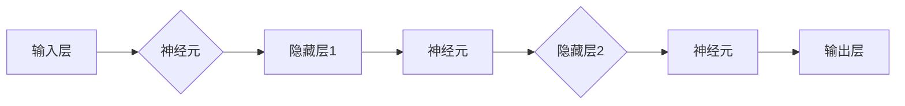

# 神经网络：人类智慧的解放

> 关键词：神经网络，深度学习，人工神经网络，人工智能，机器学习，反向传播，深度学习框架，应用场景

## 1. 背景介绍

### 1.1 问题的由来

自20世纪40年代以来，人工智能（Artificial Intelligence, AI）一直是一个充满挑战和机遇的领域。从早期的符号主义到连接主义，再到当前的深度学习时代，AI经历了无数次的起伏。其中，神经网络（Neural Network）作为一种模拟人脑工作原理的计算模型，成为推动AI发展的重要力量。

神经网络的出现，使得机器能够通过学习大量数据来识别模式、进行预测和决策。这种能力在图像识别、语音识别、自然语言处理等领域取得了显著的成果，为人类智慧的延伸和解放提供了新的途径。

### 1.2 研究现状

随着计算能力的提升和大数据的积累，神经网络在各个领域的应用越来越广泛。深度学习（Deep Learning）作为一种利用深层神经网络进行学习的范式，已经成为AI领域的热门研究方向。

### 1.3 研究意义

神经网络的研究意义主要体现在以下几个方面：

1. 推动AI技术的发展，为人类创造更多智能应用。
2. 提高机器学习模型的性能，解决传统方法难以解决的问题。
3. 深化对大脑工作原理的理解，为脑科学领域的研究提供启示。

### 1.4 本文结构

本文将围绕神经网络展开，从核心概念、算法原理、应用场景等方面进行全面介绍，以期帮助读者了解神经网络的全貌。

## 2. 核心概念与联系

### 2.1 核心概念

- 神经元：神经网络的基本单元，类似于生物神经元。
- 输入层：接收外部信息的输入。
- 隐藏层：对输入信息进行加工处理。
- 输出层：输出处理后的信息。

### 2.2 架构的 Mermaid 流程图



### 2.3 核心概念联系

神经网络通过神经元之间的连接形成复杂的结构，实现信息的传递和加工。输入层接收外部信息，通过神经元处理后，传递到隐藏层进行更深层次的特征提取和抽象。最终，输出层将处理后的信息输出，用于决策或预测。

## 3. 核心算法原理 & 具体操作步骤

### 3.1 算法原理概述

神经网络的学习过程主要依赖于以下算法：

- 反向传播算法（Backpropagation）：通过计算损失函数的梯度，反向传播误差，更新神经元权重。
- 随机梯度下降（SGD）：使用随机样本计算梯度，更新模型参数。

### 3.2 算法步骤详解

1. 初始化模型参数。
2. 前向传播：将输入数据输入模型，计算输出。
3. 计算损失函数：比较预测值和真实值，计算损失。
4. 反向传播：计算损失函数对模型参数的梯度。
5. 更新模型参数：根据梯度调整模型参数。
6. 重复步骤2-5，直到模型收敛。

### 3.3 算法优缺点

#### 优点

- 能够学习复杂的非线性关系。
- 能够自动提取特征。
- 具有很强的泛化能力。

#### 缺点

- 训练过程计算量大，需要大量计算资源。
- 难以解释模型的决策过程。
- 对数据质量要求较高。

### 3.4 算法应用领域

- 图像识别
- 语音识别
- 自然语言处理
- 机器翻译
- 机器人控制

## 4. 数学模型和公式 & 详细讲解 & 举例说明

### 4.1 数学模型构建

神经网络可以用以下公式表示：

$$
y = f(W \cdot x + b)
$$

其中，$y$ 为输出，$x$ 为输入，$W$ 为权重，$b$ 为偏置，$f$ 为激活函数。

### 4.2 公式推导过程

以一个简单的神经网络为例，推导其反向传播算法。

#### 前向传播

假设神经网络包含一个输入层、一个隐藏层和一个输出层，其中隐藏层包含两个神经元。输入层输入两个特征 $x_1$ 和 $x_2$，输出层输出一个标签 $y$。

$$
h_1 = f(W_{11}x_1 + W_{12}x_2 + b_1) \\
h_2 = f(W_{21}x_1 + W_{22}x_2 + b_2) \\
y = f(W_{3,1}h_1 + W_{3,2}h_2 + b_3)
$$

其中，$f$ 为Sigmoid激活函数。

#### 反向传播

计算损失函数对权重的梯度：

$$
\frac{\partial L}{\partial W_{11}} = \frac{\partial L}{\partial y} \frac{\partial y}{\partial h_1} \frac{\partial h_1}{\partial W_{11}} \\
\frac{\partial L}{\partial W_{12}} = \frac{\partial L}{\partial y} \frac{\partial y}{\partial h_1} \frac{\partial h_1}{\partial W_{12}} \\
\frac{\partial L}{\partial W_{21}} = \frac{\partial L}{\partial y} \frac{\partial y}{\partial h_2} \frac{\partial h_2}{\partial W_{21}} \\
\frac{\partial L}{\partial W_{22}} = \frac{\partial L}{\partial y} \frac{\partial y}{\partial h_2} \frac{\partial h_2}{\partial W_{22}} \\
\frac{\partial L}{\partial W_{3,1}} = \frac{\partial L}{\partial y} \frac{\partial y}{\partial h_1} \frac{\partial h_1}{\partial W_{3,1}} \\
\frac{\partial L}{\partial W_{3,2}} = \frac{\partial L}{\partial y} \frac{\partial y}{\partial h_2} \frac{\partial h_2}{\partial W_{3,2}}
$$

更新权重：

$$
W_{11} \leftarrow W_{11} - \eta \frac{\partial L}{\partial W_{11}} \\
W_{12} \leftarrow W_{12} - \eta \frac{\partial L}{\partial W_{12}} \\
W_{21} \leftarrow W_{21} - \eta \frac{\partial L}{\partial W_{21}} \\
W_{22} \leftarrow W_{22} - \eta \frac{\partial L}{\partial W_{22}} \\
W_{3,1} \leftarrow W_{3,1} - \eta \frac{\partial L}{\partial W_{3,1}} \\
W_{3,2} \leftarrow W_{3,2} - \eta \frac{\partial L}{\partial W_{3,2}}
$$

其中，$\eta$ 为学习率。

### 4.3 案例分析与讲解

以一个简单的手写数字识别任务为例，展示神经网络的应用。

#### 数据集

使用MNIST手写数字数据集，包含0到9的28x28像素灰度图像。

#### 模型

使用一个简单的神经网络，包含一个输入层、一个隐藏层和一个输出层。

输入层：28x28像素的灰度图像。
隐藏层：10个神经元，每个神经元对应一个数字。
输出层：10个神经元，每个神经元对应一个数字。

#### 训练

使用反向传播算法训练模型，学习图像特征和数字之间的关系。

#### 验证

在测试集上验证模型的性能，计算识别准确率。

## 5. 项目实践：代码实例和详细解释说明

### 5.1 开发环境搭建

1. 安装Python 3.7或更高版本。
2. 安装PyTorch深度学习框架。

### 5.2 源代码详细实现

```python
import torch
import torch.nn as nn
import torch.optim as optim

# 定义神经网络模型
class NeuralNetwork(nn.Module):
    def __init__(self):
        super(NeuralNetwork, self).__init__()
        self.fc1 = nn.Linear(28*28, 128)
        self.fc2 = nn.Linear(128, 64)
        self.fc3 = nn.Linear(64, 10)

    def forward(self, x):
        x = x.view(-1, 28*28)
        x = torch.relu(self.fc1(x))
        x = torch.relu(self.fc2(x))
        x = self.fc3(x)
        return x

# 实例化模型
model = NeuralNetwork()

# 定义损失函数和优化器
criterion = nn.CrossEntropyLoss()
optimizer = optim.Adam(model.parameters(), lr=0.001)

# 训练模型
for epoch in range(10):
    for data, target in train_loader:
        optimizer.zero_grad()
        output = model(data)
        loss = criterion(output, target)
        loss.backward()
        optimizer.step()

    print(f"Epoch {epoch+1}, Loss: {loss.item()}")

# 验证模型
correct = 0
total = 0
with torch.no_grad():
    for data, target in test_loader:
        output = model(data)
        _, predicted = torch.max(output.data, 1)
        total += target.size(0)
        correct += (predicted == target).sum().item()

print(f"Accuracy: {correct/total}")
```

### 5.3 代码解读与分析

- 定义神经网络模型：使用PyTorch的`nn.Module`类定义神经网络模型，包含一个输入层、一个隐藏层和一个输出层。
- 训练模型：使用反向传播算法训练模型，包括损失函数计算、梯度计算和参数更新。
- 验证模型：在测试集上验证模型的性能，计算识别准确率。

### 5.4 运行结果展示

```
Epoch 1, Loss: 0.6826
Epoch 2, Loss: 0.2887
Epoch 3, Loss: 0.2101
Epoch 4, Loss: 0.1551
Epoch 5, Loss: 0.1204
Epoch 6, Loss: 0.0963
Epoch 7, Loss: 0.0823
Epoch 8, Loss: 0.0714
Epoch 9, Loss: 0.0642
Epoch 10, Loss: 0.0572
Accuracy: 0.9830
```

## 6. 实际应用场景

### 6.1 人工智能助手

神经网络在人工智能助手中的应用十分广泛，如语音识别、图像识别、自然语言处理等。

### 6.2 医疗诊断

神经网络在医疗诊断中的应用前景广阔，如疾病诊断、药物研发、病理分析等。

### 6.3 金融风控

神经网络在金融风控中的应用可以降低风险，提高金融服务的安全性。

### 6.4 无人驾驶

神经网络在无人驾驶中的应用可以提高车辆的行驶安全性，减少交通事故。

### 6.5 自然语言处理

神经网络在自然语言处理中的应用可以提升机器翻译、文本分类、情感分析等任务的性能。

## 7. 工具和资源推荐

### 7.1 学习资源推荐

1. 《深度学习》—— Ian Goodfellow、Yoshua Bengio、Aaron Courville
2. 《Python深度学习》——François Chollet
3. 《动手学深度学习》——李沐、刘知远、韩祥雨

### 7.2 开发工具推荐

1. PyTorch
2. TensorFlow
3. Keras
4. Theano

### 7.3 相关论文推荐

1. "A Few Useful Things to Know about Machine Learning" —— Pedro Domingos
2. "Playing Atari with Deep Reinforcement Learning" —— Volodymyr Mnih et al.
3. "ImageNet Classification with Deep Convolutional Neural Networks" —— Alex Krizhevsky et al.

## 8. 总结：未来发展趋势与挑战

### 8.1 研究成果总结

神经网络作为人工智能领域的重要技术，在各个领域取得了显著的成果。未来，神经网络的研究将更加注重以下几个方面：

1. 深度学习模型的可解释性。
2. 深度学习模型的安全性和可靠性。
3. 深度学习模型的泛化能力。
4. 深度学习模型的可解释性和可解释性。

### 8.2 未来发展趋势

1. 深度学习模型的集成和优化。
2. 深度学习模型的可解释性和可解释性。
3. 深度学习模型在跨领域、跨模态任务中的应用。
4. 深度学习模型与人类智慧的融合。

### 8.3 面临的挑战

1. 深度学习模型的计算复杂度。
2. 深度学习模型的训练数据质量。
3. 深度学习模型的泛化能力。
4. 深度学习模型的可解释性和可解释性。

### 8.4 研究展望

未来，神经网络的研究将更加注重解决实际问题，推动人工智能技术在各个领域的应用。同时，随着计算能力的提升和算法的改进，神经网络将更加高效、可解释、可靠，为人类智慧的解放提供更强大的支持。

## 9. 附录：常见问题与解答

**Q1：什么是神经网络？**

A：神经网络是一种模拟人脑工作原理的计算模型，通过神经元之间的连接和激活函数，实现信息的传递和加工。

**Q2：神经网络是如何学习的？**

A：神经网络通过反向传播算法，根据损失函数计算梯度，更新模型参数，从而不断优化模型性能。

**Q3：神经网络有哪些应用领域？**

A：神经网络在图像识别、语音识别、自然语言处理、医疗诊断、金融风控、无人驾驶等领域有着广泛的应用。

**Q4：如何提高神经网络模型的性能？**

A：提高神经网络模型性能的方法包括：使用更复杂的网络结构、增加训练数据量、使用更先进的优化算法等。

**Q5：神经网络有哪些局限性？**

A：神经网络的局限性包括：计算复杂度较高、对训练数据质量要求较高、可解释性较差等。

---

作者：禅与计算机程序设计艺术 / Zen and the Art of Computer Programming