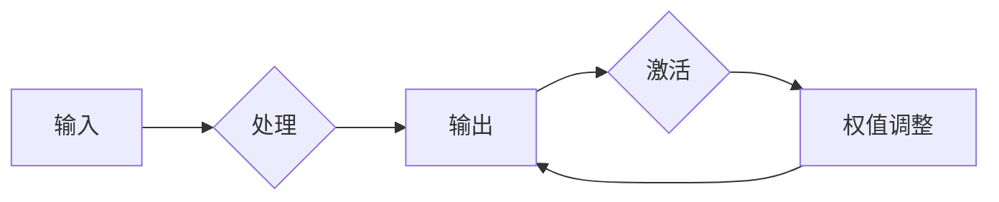

# 神经网络：推动社会进步的力量

> 关键词：神经网络，深度学习，人工智能，机器学习，数据驱动，社会进步

## 1. 背景介绍

自20世纪50年代以来，人工智能（AI）领域一直致力于实现机器的智能。从早期的符号主义到连接主义，再到如今的深度学习，人工智能的发展历程充满了挑战与突破。其中，神经网络作为深度学习的基础，已经成为推动社会进步的重要力量。

### 1.1 问题的由来

人工智能的终极目标是实现机器的智能，即让机器能够像人类一样感知、思考、学习、决策。而神经网络作为一种模拟人脑神经元连接结构的计算模型，被认为是实现这一目标的关键。

### 1.2 研究现状

近年来，随着计算能力的提升和大数据的积累，神经网络在图像识别、语音识别、自然语言处理等领域取得了显著的成果。这些成果不仅推动了人工智能技术的发展，也为各个行业带来了深刻的变革。

### 1.3 研究意义

神经网络的研究意义在于：
- 推动人工智能技术的发展，实现机器的智能。
- 解决人类面临的复杂问题，如医疗诊断、交通管理、能源管理等。
- 提高生产效率，降低人力成本。
- 改善人们的生活质量，创造新的就业机会。

### 1.4 本文结构

本文将从以下方面对神经网络进行探讨：
- 核心概念与联系
- 核心算法原理与具体操作步骤
- 数学模型与公式
- 项目实践
- 实际应用场景
- 未来应用展望
- 工具和资源推荐
- 总结与展望

## 2. 核心概念与联系

神经网络是一种模拟人脑神经元连接结构的计算模型，其核心概念包括：

- 神经元：神经网络的基本单元，负责接收输入、处理信息并产生输出。
- 神经层：由多个神经元组成，负责将输入信息传递到下一层。
- 激活函数：对神经元输出进行非线性变换，增加模型的表达能力。
- 权值：连接神经元之间的强度，用于调节信息传递的强度。
- 学习率：调整权值的步长，影响模型的收敛速度。

神经网络的核心概念原理和架构的Mermaid流程图如下：



## 3. 核心算法原理 & 具体操作步骤

### 3.1 算法原理概述

神经网络通过学习输入与输出之间的关系，实现从数据中提取特征、分类、回归等任务。其基本原理如下：

1. 前向传播：将输入数据传递到网络，逐层计算神经元的输出。
2. 反向传播：根据误差，反向计算梯度，更新网络权值和偏置。

### 3.2 算法步骤详解

神经网络训练过程主要包括以下步骤：

1. 数据预处理：对输入数据进行规范化、标准化等处理。
2. 初始化网络：随机初始化网络权值和偏置。
3. 前向传播：将输入数据传递到网络，计算输出结果。
4. 计算损失：根据输出结果与真实标签之间的差异，计算损失函数。
5. 反向传播：计算梯度，更新网络权值和偏置。
6. 梯度下降：使用梯度下降算法更新网络参数。
7. 评估模型：在测试集上评估模型性能。

### 3.3 算法优缺点

神经网络的优点包括：

- 强大的非线性拟合能力，能够处理复杂的非线性关系。
- 能够自动提取特征，减轻人工特征工程负担。
- 具有较好的泛化能力，能够适应新的数据。

神经网络的缺点包括：

- 计算复杂度高，需要大量计算资源。
- 模型参数较多，容易过拟合。
- 模型可解释性差，难以理解模型的决策过程。

### 3.4 算法应用领域

神经网络在各个领域都有广泛的应用，包括：

- 图像识别：如人脸识别、图像分类、目标检测等。
- 语音识别：如语音识别、语音合成等。
- 自然语言处理：如机器翻译、文本分类、情感分析等。
- 医疗诊断：如疾病预测、影像分析等。
- 金融领域：如信用评估、风险评估等。

## 4. 数学模型和公式 & 详细讲解 & 举例说明

### 4.1 数学模型构建

神经网络可以表示为以下数学模型：

$$
y = f(W \cdot x + b)
$$

其中，$x$ 为输入向量，$W$ 为权值矩阵，$b$ 为偏置向量，$f$ 为激活函数。

### 4.2 公式推导过程

以下以多层感知机（MLP）为例，讲解神经网络公式的推导过程。

假设输入层有 $n$ 个神经元，隐藏层有 $m$ 个神经元，输出层有 $k$ 个神经元。则网络的结构可以表示为：

```
输入层 --(W1)--> 隐藏层 --(W2)--> 输出层
```

其中，$W1$ 和 $W2$ 分别为输入层到隐藏层和隐藏层到输出层的权值矩阵。

假设激活函数为Sigmoid函数，则：

$$
h_i = \sigma(W1_{ij} \cdot x_j + b_i)
$$

$$
y_k = \sigma(W2_{ik} \cdot h_i + b_k)
$$

其中，$h_i$ 为隐藏层第 $i$ 个神经元的输出，$y_k$ 为输出层第 $k$ 个神经元的输出。

### 4.3 案例分析与讲解

以下以图像识别任务为例，讲解神经网络的应用。

假设我们要对一幅图像进行分类，将其分为猫、狗、鸟三类。我们可以构建一个三层神经网络，输入层有784个神经元（对应图像的像素值），隐藏层有1024个神经元，输出层有3个神经元（对应三个类别）。

在前向传播过程中，我们将图像的像素值作为输入，经过输入层和隐藏层处理后，得到输出层的结果。通过比较输出层的概率分布，我们可以判断图像属于哪个类别。

## 5. 项目实践：代码实例和详细解释说明

### 5.1 开发环境搭建

为了进行神经网络项目实践，我们需要以下开发环境：

- Python编程语言
- TensorFlow或PyTorch深度学习框架
- OpenCV图像处理库
- Numpy科学计算库

### 5.2 源代码详细实现

以下是一个简单的图像识别项目示例，使用PyTorch框架实现：

```python
import torch
import torchvision
import torchvision.transforms as transforms
from torch.utils.data import DataLoader
import torch.nn as nn
import torch.optim as optim

# 加载和预处理数据
transform = transforms.Compose([
    transforms.Resize((32, 32)),
    transforms.ToTensor()
])

train_dataset = torchvision.datasets.CIFAR10(root='./data', train=True, transform=transform, download=True)
train_loader = DataLoader(train_dataset, batch_size=64, shuffle=True)

# 构建神经网络模型
class Net(nn.Module):
    def __init__(self):
        super(Net, self).__init__()
        self.conv1 = nn.Conv2d(3, 6, 5)
        self.pool = nn.MaxPool2d(2, 2)
        self.conv2 = nn.Conv2d(6, 16, 5)
        self.fc1 = nn.Linear(16 * 5 * 5, 120)
        self.fc2 = nn.Linear(120, 84)
        self.fc3 = nn.Linear(84, 10)

    def forward(self, x):
        x = self.pool(torch.nn.functional.relu(self.conv1(x)))
        x = self.pool(torch.nn.functional.relu(self.conv2(x)))
        x = x.view(-1, 16 * 5 * 5)
        x = torch.nn.functional.relu(self.fc1(x))
        x = torch.nn.functional.relu(self.fc2(x))
        x = self.fc3(x)
        return x

net = Net()
criterion = nn.CrossEntropyLoss()
optimizer = optim.SGD(net.parameters(), lr=0.001, momentum=0.9)

# 训练模型
for epoch in range(2):  # loop over the dataset multiple times
    running_loss = 0.0
    for i, data in enumerate(train_loader, 0):
        inputs, labels = data
        optimizer.zero_grad()
        outputs = net(inputs)
        loss = criterion(outputs, labels)
        loss.backward()
        optimizer.step()
        running_loss += loss.item()
        if i % 2000 == 1999:    # print every 2000 mini-batches
            print(f'[{epoch + 1}, {i + 1:5d}] loss: {running_loss / 2000:.3f}')
            running_loss = 0.0

print('Finished Training')
```

### 5.3 代码解读与分析

以上代码展示了使用PyTorch框架构建一个简单的卷积神经网络（CNN）进行图像识别的完整流程。

1. 首先导入了必要的库，包括PyTorch、torchvision、torchvision.transforms等。
2. 然后定义了一个数据预处理函数，用于将图像数据加载并转换为PyTorch张量。
3. 接着定义了一个Net类，继承自nn.Module，构建了网络结构。该网络由两个卷积层、两个全连接层和一个softmax输出层组成。
4. 在训练循环中，使用SGD优化器和交叉熵损失函数进行模型训练。每2000个mini-batch打印一次训练损失。

### 5.4 运行结果展示

运行以上代码后，训练过程将在控制台输出训练损失。在训练结束后，我们可以使用测试集评估模型的性能。

## 6. 实际应用场景

神经网络在各个领域都有广泛的应用，以下列举一些典型应用场景：

- **图像识别**：人脸识别、目标检测、图像分类等。
- **语音识别**：语音识别、语音合成、语音翻译等。
- **自然语言处理**：机器翻译、文本分类、情感分析等。
- **医疗诊断**：疾病预测、影像分析、药物发现等。
- **金融领域**：信用评估、风险评估、投资策略等。

## 7. 未来应用展望

随着深度学习技术的不断发展，神经网络的应用前景更加广阔。以下是一些未来可能的应用方向：

- **增强现实与虚拟现实**：通过神经网络实现更逼真的虚拟环境，提供沉浸式体验。
- **自动驾驶**：利用神经网络实现自动驾驶汽车的安全、高效行驶。
- **智能机器人**：赋予机器人更强的感知、决策和执行能力。
- **智慧城市**：利用神经网络优化城市资源分配、交通管理、环境监测等。

## 8. 工具和资源推荐

### 8.1 学习资源推荐

- 《深度学习》（Goodfellow, Bengio, Courville著）：深度学习领域的经典教材，适合初学者和进阶者。
- 《Python深度学习》（François Chollet著）：使用Python进行深度学习开发的实战指南。
- 《神经网络与深度学习》（邱锡鹏著）：系统介绍神经网络和深度学习理论，适合有一定数学基础的学习者。

### 8.2 开发工具推荐

- TensorFlow：Google开源的深度学习框架，功能强大，适合大型项目。
- PyTorch：Facebook开源的深度学习框架，易于使用，社区活跃。
- Keras：Python深度学习库，基于TensorFlow和Theano，提供了丰富的API。

### 8.3 相关论文推荐

- “A Few Useful Things to Know about Machine Learning” by Pedro Domingos
- “Understanding Deep Learning” by Yoshua Bengio
- “The Unreasonable Effectiveness of Deep Learning” by Ian Goodfellow

## 9. 总结：未来发展趋势与挑战

### 9.1 研究成果总结

神经网络作为一种强大的机器学习模型，在各个领域都取得了显著的成果。随着深度学习技术的不断发展，神经网络的应用将越来越广泛，为人类社会带来更多福祉。

### 9.2 未来发展趋势

- 模型轻量化：降低模型的计算复杂度，使其能够在移动设备、嵌入式设备等资源受限的设备上运行。
- 可解释性：提高模型的可解释性，使模型决策过程更加透明。
- 多模态融合：将不同模态的信息进行融合，如文本、图像、视频等，实现更全面的智能。
- 生成式模型：利用生成式模型生成新的数据，如图像、文本等，推动数据增强技术的发展。

### 9.3 面临的挑战

- 算力资源：深度学习模型需要大量的计算资源，如何高效利用算力资源是一个重要挑战。
- 数据标注：深度学习模型的训练需要大量标注数据，如何高效获取标注数据是一个挑战。
- 模型可解释性：深度学习模型的可解释性较差，如何提高模型的可解释性是一个挑战。

### 9.4 研究展望

随着深度学习技术的不断发展，神经网络将在各个领域发挥越来越重要的作用。未来，我们需要关注以下研究方向：

- 开发更高效、更轻量级的深度学习模型。
- 研究如何利用无监督和半监督学习技术，降低对标注数据的依赖。
- 提高模型的可解释性，使模型决策过程更加透明。
- 探索深度学习在更多领域的应用，推动社会进步。

作者：禅与计算机程序设计艺术 / Zen and the Art of Computer Programming