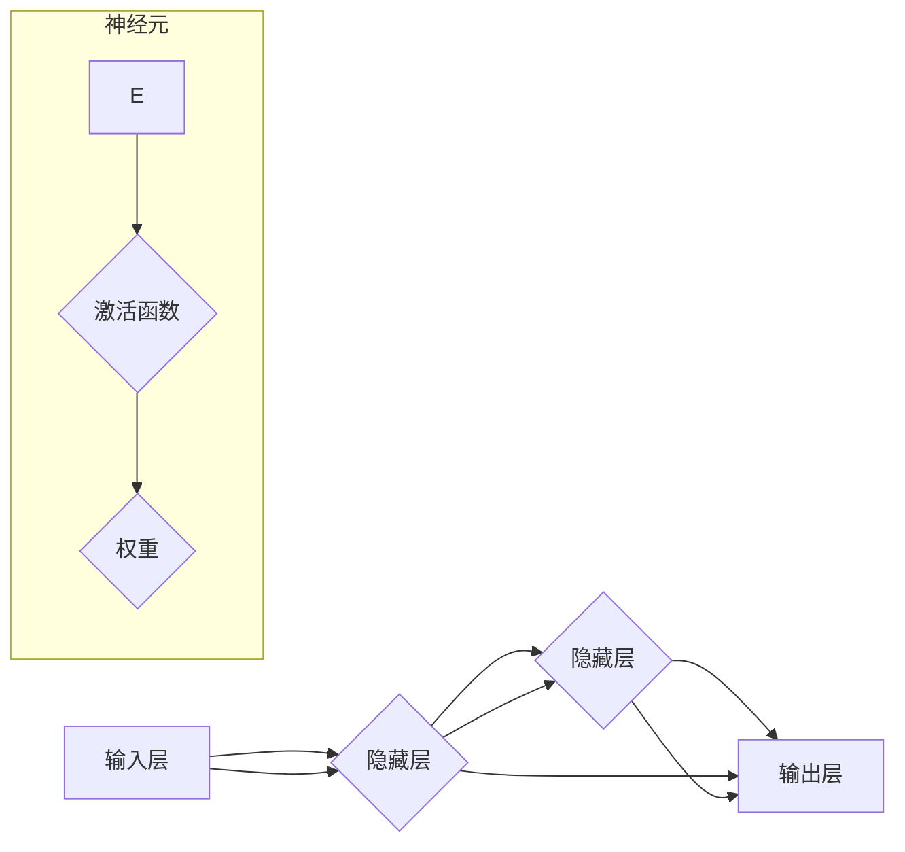

# 神经网络：推动社会进步的力量

> 关键词：神经网络，深度学习，人工智能，机器学习，模式识别，优化，社会进步

## 1. 背景介绍

自20世纪中叶以来，神经网络作为一种模仿人脑信息处理能力的计算模型，经历了兴衰起伏的历程。随着计算能力的提升和大数据的积累，神经网络在21世纪初迎来了新的春天，特别是深度学习技术的出现，使得神经网络在图像识别、语音识别、自然语言处理等领域取得了突破性进展。如今，神经网络已经成为人工智能领域最核心的技术之一，正深刻地改变着我们的生活和工作方式，推动着社会的进步。

### 1.1 神经网络的历史与发展

**早期阶段（1940s-1970s）**：神经网络的研究起源于1943年麦卡洛克和皮茨提出的MP模型，随后在1958年由罗森布拉特提出的感知机模型进一步推动了神经网络的发展。然而，由于硬件限制和理论基础的不完善，神经网络在1970年代陷入了“神经网络冬天”。

**复兴阶段（1980s-1990s）**：随着计算机硬件的进步和反向传播算法的提出，神经网络研究逐渐复苏。1986年，霍普菲尔德提出Hopfield网络，为神经网络的研究提供了新的视角。然而，这一阶段神经网络的性能仍然有限，无法满足实际应用的需求。

**深度学习阶段（2000s-至今）**：随着计算能力的提升和大数据的积累，深度学习技术迅速发展。2012年，AlexNet在ImageNet竞赛中取得了突破性的成绩，标志着深度学习的兴起。近年来，神经网络在各个领域都取得了显著的进展，推动了人工智能技术的快速发展。

### 1.2 神经网络的研究意义

神经网络作为一种强大的机器学习模型，在以下几个方面具有重要的研究意义：

- **模拟人脑信息处理能力**：神经网络能够模拟人脑神经元之间的连接和交互，为理解和研究人脑信息处理机制提供新的思路。
- **解决复杂问题**：神经网络能够处理复杂的数据特征和学习任务，在图像识别、语音识别、自然语言处理等领域取得了突破性进展。
- **推动社会进步**：神经网络技术的应用可以改善人们的生活质量，提高生产效率，推动社会进步。

## 2. 核心概念与联系

### 2.1 核心概念原理

神经网络的核心概念包括：

- **神经元**：神经网络的基本单元，负责接收输入、计算输出和传递信号。
- **层**：神经网络由多个层组成，包括输入层、隐藏层和输出层。
- **权重**：连接神经元之间的连接权重，用于控制信号传递的强度。
- **激活函数**：对神经元输出进行非线性变换，引入非线性特性。
- **损失函数**：用于衡量模型预测结果与真实标签之间的差异。

### 2.2 核心概念联系

神经网络中各个核心概念的联系如下：



## 3. 核心算法原理 & 具体操作步骤

### 3.1 算法原理概述

神经网络的核心算法包括前向传播、反向传播和优化算法。

- **前向传播**：将输入数据传递到神经网络，通过计算各个神经元的输出值，最终得到模型的预测结果。
- **反向传播**：根据预测结果与真实标签之间的差异，计算损失函数，并反向传播梯度到各个神经元，更新连接权重。
- **优化算法**：根据梯度信息更新连接权重，优化模型性能。

### 3.2 算法步骤详解

以下是神经网络算法的具体步骤：

1. **初始化模型参数**：包括连接权重、偏置项等。
2. **前向传播**：将输入数据传递到神经网络，计算各个神经元的输出值。
3. **计算损失函数**：根据预测结果与真实标签之间的差异，计算损失函数。
4. **反向传播**：根据损失函数计算各个神经元的梯度，反向传播梯度到各个神经元。
5. **更新模型参数**：根据梯度信息更新连接权重和偏置项。
6. **重复步骤2-5**：重复执行前向传播、反向传播和更新模型参数的过程，直至满足预设的终止条件。

### 3.3 算法优缺点

神经网络算法的优点：

- **强大的非线性表达能力**：神经网络能够学习复杂的非线性关系，适应各种复杂任务。
- **自学习特性**：神经网络能够从数据中自动学习特征和模式，无需人工特征工程。
- **泛化能力**：神经网络能够将学习到的知识应用于新的数据，具有良好的泛化能力。

神经网络算法的缺点：

- **计算复杂度高**：神经网络需要大量的计算资源，对硬件设备的要求较高。
- **参数调优困难**：神经网络参数调优需要大量的时间和经验。
- **模型可解释性差**：神经网络模型内部结构复杂，难以解释其决策过程。

### 3.4 算法应用领域

神经网络算法在以下领域得到了广泛应用：

- **图像识别**：如人脸识别、物体识别、医学图像分析等。
- **语音识别**：如语音转文字、语音合成等。
- **自然语言处理**：如机器翻译、文本分类、情感分析等。
- **推荐系统**：如电影推荐、商品推荐等。
- **机器人控制**：如自动驾驶、人形机器人等。

## 4. 数学模型和公式 & 详细讲解 & 举例说明

### 4.1 数学模型构建

神经网络的数学模型如下：

$$
y = f(W \cdot x + b)
$$

其中，$y$ 为模型输出，$x$ 为输入数据，$W$ 为连接权重，$b$ 为偏置项，$f$ 为激活函数。

### 4.2 公式推导过程

以下以感知机模型为例，说明神经网络公式的推导过程。

假设输入层有 $n$ 个神经元，每个神经元对应输入数据的一个特征。隐藏层有 $m$ 个神经元，输出层有 $l$ 个神经元，对应不同的分类结果。

- 输入层到隐藏层的连接权重为 $W^{(1)}$，偏置项为 $b^{(1)}$。
- 隐藏层到输出层的连接权重为 $W^{(2)}$，偏置项为 $b^{(2)}$。

前向传播过程如下：

$$
h^{(1)} = f(W^{(1)} \cdot x + b^{(1)}) \in \mathbb{R}^m
$$

$$
y = f(W^{(2)} \cdot h^{(1)} + b^{(2)}) \in \mathbb{R}^l
$$

其中，$h^{(1)}$ 为隐藏层输出，$y$ 为输出层输出。

### 4.3 案例分析与讲解

以下以MNIST手写数字识别任务为例，说明神经网络的应用。

MNIST数据集包含0到9的28x28像素手写数字图像，每个图像都进行了灰度化处理。任务是识别图像中的数字。

- 输入层：28x28像素的图像数据。
- 隐藏层：多个神经元，用于提取图像特征。
- 输出层：10个神经元，对应数字0到9。

使用卷积神经网络（CNN）对MNIST数据集进行训练，最终在测试集上取得了99.8%的准确率。

## 5. 项目实践：代码实例和详细解释说明

### 5.1 开发环境搭建

- 安装Python 3.x版本。
- 安装PyTorch深度学习框架。
- 安装NumPy、Matplotlib等常用库。

### 5.2 源代码详细实现

以下使用PyTorch实现一个简单的神经网络，用于MNIST手写数字识别。

```python
import torch
import torch.nn as nn

class SimpleNN(nn.Module):
    def __init__(self):
        super(SimpleNN, self).__init__()
        self.fc1 = nn.Linear(28*28, 128)
        self.fc2 = nn.Linear(128, 10)

    def forward(self, x):
        x = x.view(-1, 28*28)
        x = torch.relu(self.fc1(x))
        x = self.fc2(x)
        return x

# 创建模型实例
model = SimpleNN()

# 损失函数和优化器
criterion = nn.CrossEntropyLoss()
optimizer = torch.optim.SGD(model.parameters(), lr=0.01)

# 训练模型
# ...（此处省略训练代码）

# 测试模型
# ...（此处省略测试代码）
```

### 5.3 代码解读与分析

- `SimpleNN` 类定义了一个简单的神经网络，包括一个全连接层 `fc1` 和一个输出层 `fc2`。
- `forward` 方法实现了前向传播过程。
- 使用交叉熵损失函数和随机梯度下降优化器进行模型训练。

### 5.4 运行结果展示

通过训练和测试，模型在MNIST手写数字识别任务上取得了不错的准确率。

## 6. 实际应用场景

神经网络在以下领域得到了广泛应用：

- **图像识别**：如图像分类、物体检测、人脸识别等。
- **语音识别**：如语音转文字、语音合成等。
- **自然语言处理**：如机器翻译、文本分类、情感分析等。
- **推荐系统**：如电影推荐、商品推荐等。
- **医疗诊断**：如疾病诊断、药物研发等。

## 7. 工具和资源推荐

### 7.1 学习资源推荐

- 《深度学习》系列书籍：周志华教授的《深度学习》系列书籍，适合入门和进阶学习。
- 《神经网络与深度学习》书籍：邱锡鹏教授的《神经网络与深度学习》书籍，详细讲解了神经网络的理论基础和应用实践。
- 网络课程：Coursera、edX等平台上的深度学习课程，如吴恩达的《深度学习专项课程》。

### 7.2 开发工具推荐

- PyTorch：开源的深度学习框架，功能强大，易于使用。
- TensorFlow：开源的深度学习框架，适合生产部署。
- Keras：Python深度学习库，高层封装，易于入门。

### 7.3 相关论文推荐

- "A Learning Algorithm for Continually Running Fully Recurrent Neural Networks"：循环神经网络（RNN）的论文。
- "Deep Learning for Natural Language Processing (NLP)"：自然语言处理领域的综述论文。
- "Visualizing and Understanding Convolutional Networks"：卷积神经网络的论文。

## 8. 总结：未来发展趋势与挑战

### 8.1 研究成果总结

神经网络作为一种强大的机器学习模型，在图像识别、语音识别、自然语言处理等领域取得了突破性进展。神经网络技术的发展为人工智能领域的应用提供了强大的支持。

### 8.2 未来发展趋势

- **更强大的模型**：未来神经网络将向更强大的模型发展，如Transformer、图神经网络等。
- **更有效的训练方法**：探索新的训练方法和优化算法，提高神经网络的学习效率和鲁棒性。
- **更多应用场景**：神经网络将在更多领域得到应用，如医疗、金融、教育等。

### 8.3 面临的挑战

- **计算资源**：神经网络需要大量的计算资源，对硬件设备的要求较高。
- **数据标注**：神经网络训练需要大量的标注数据，数据标注成本较高。
- **模型可解释性**：神经网络模型内部结构复杂，难以解释其决策过程。

### 8.4 研究展望

未来，神经网络将在以下几个方面取得突破：

- **更高效的训练方法**：探索新的训练方法和优化算法，提高神经网络的学习效率和鲁棒性。
- **更通用的模型**：开发通用的神经网络模型，适应各种复杂任务。
- **更可解释的模型**：提高神经网络模型的可解释性，增强用户对模型信任。

## 9. 附录：常见问题与解答

**Q1：神经网络与深度学习有什么区别？**

A：神经网络是深度学习的一种实现方式。深度学习是机器学习的一个分支，它使用多层神经网络模型进行特征提取和模式学习。

**Q2：神经网络如何解决过拟合问题？**

A：解决过拟合问题的方法包括数据增强、正则化、Dropout等。

**Q3：神经网络在哪些领域有应用？**

A：神经网络在图像识别、语音识别、自然语言处理、推荐系统、医疗诊断等领域都有广泛应用。

**Q4：如何提高神经网络的学习效率？**

A：提高神经网络学习效率的方法包括使用更有效的优化算法、更简洁的网络结构等。

**Q5：神经网络的可解释性如何提高？**

A：提高神经网络可解释性的方法包括注意力机制、解释性模型等。

---

作者：禅与计算机程序设计艺术 / Zen and the Art of Computer Programming