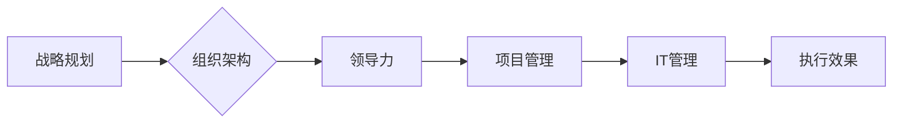

# 管理的智慧：从策略到执行

> 关键词：管理智慧，战略规划，执行体系，组织架构，领导力，项目管理，IT管理

## 1. 背景介绍

在信息科技日新月异的今天，企业面临着前所未有的挑战和机遇。如何制定有效的战略，如何构建高效的组织架构，如何提升领导力，如何实施项目，如何进行IT管理，这些问题已经成为企业成功的关键。本文将深入探讨管理的智慧，从策略到执行的全过程，为企业提供一套系统的管理方法论。

### 1.1 管理的挑战

- **战略规划**：在复杂多变的市场环境中，如何制定适应未来发展的战略规划，是企业成功的关键。
- **组织架构**：如何构建适应企业发展的组织架构，提高组织效率，是企业持续发展的重要保障。
- **领导力**：如何培养和提升领导力，带领团队实现企业目标，是企业成功的关键因素。
- **项目管理**：如何在时间、成本和质量的前提下，高效地完成项目，是企业竞争力的体现。
- **IT管理**：如何利用信息技术提高企业效率，降低成本，是企业数字化转型的关键。

### 1.2 研究意义

本文旨在通过深入分析管理的智慧，为企业提供一套从战略规划到执行的完整方法论，帮助企业应对挑战，抓住机遇，实现可持续发展。

## 2. 核心概念与联系

### 2.1 核心概念

- **战略规划**：企业在一定时期内，根据外部环境和内部资源，确定企业的使命、愿景、目标和战略路径。
- **组织架构**：企业的组织形式和结构，包括部门设置、权责划分、沟通机制等。
- **领导力**：领导者的影响力，包括领导风格、决策能力、沟通能力等。
- **项目管理**：对项目的全过程进行计划、组织、指挥、协调和控制，以实现项目目标。
- **IT管理**：企业利用信息技术提高效率、降低成本、提升竞争力的管理活动。

### 2.2 Mermaid 流程图

### 2.3 核心概念联系

战略规划是整个管理过程的核心，它指导着组织架构、领导力、项目管理和IT管理的方向。组织架构是战略规划的具体实现形式，它为领导力提供了组织基础。领导力则是推动战略规划和组织架构有效执行的关键。项目管理和IT管理则是实现战略目标的具体手段。

## 3. 核心算法原理 & 具体操作步骤

### 3.1 算法原理概述

管理的智慧体现在对管理的各个环节进行科学规划和有效执行。以下是管理的核心算法原理：

- **战略规划**：SWOT分析、PEST分析、五力模型等。
- **组织架构**：组织设计理论、权责划分原则、沟通机制等。
- **领导力**：领导风格理论、激励理论、沟通技巧等。
- **项目管理**：项目生命周期理论、项目管理方法、项目风险管理等。
- **IT管理**：IT项目管理、IT服务管理、IT风险管理等。

### 3.2 算法步骤详解

#### 3.2.1 战略规划

1. **环境分析**：进行SWOT分析和PEST分析，了解外部环境和内部资源。
2. **目标设定**：根据环境分析和资源状况，设定企业的使命、愿景和目标。
3. **战略路径**：根据目标设定，制定相应的战略路径。

#### 3.2.2 组织架构

1. **组织设计**：根据战略目标和业务需求，设计组织架构。
2. **权责划分**：明确各部门和岗位的职责和权限。
3. **沟通机制**：建立有效的沟通机制，确保信息畅通。

#### 3.2.3 领导力

1. **领导风格**：根据团队特点和任务需求，选择合适的领导风格。
2. **激励**：采用合适的激励措施，激发团队成员的积极性和创造力。
3. **沟通**：通过有效的沟通，建立团队信任，提高团队凝聚力。

#### 3.2.4 项目管理

1. **项目规划**：制定项目计划，包括时间、成本、质量等。
2. **项目组织**：组建项目团队，明确团队成员的职责和角色。
3. **项目监控**：监控项目进度，确保项目按计划进行。

#### 3.2.5 IT管理

1. **IT项目管理**：制定IT项目管理计划，包括时间、成本、质量等。
2. **IT服务管理**：建立IT服务管理体系，确保IT服务质量。
3. **IT风险管理**：识别、评估和应对IT风险。

### 3.3 算法优缺点

#### 3.3.1 优点

- **系统性**：管理的智慧是一个系统性的过程，涵盖了战略规划、组织架构、领导力、项目管理和IT管理等多个方面。
- **实用性**：管理的智慧是实际工作中总结的经验和教训，具有很高的实用性。
- **可操作性**：管理的智慧提供了具体的操作步骤和方法，易于理解和实施。

#### 3.3.2 缺点

- **复杂性**：管理的智慧涉及多个方面，需要综合考虑各种因素，具有一定的复杂性。
- **动态性**：管理环境不断变化，需要不断调整管理策略和方法。

### 3.4 算法应用领域

管理的智慧适用于各个行业和领域，如制造业、服务业、IT行业等。

## 4. 数学模型和公式 & 详细讲解 & 举例说明

### 4.1 数学模型构建

管理的智慧涉及多个数学模型，如SWOT分析、PEST分析、五力模型等。

#### 4.1.1 SWOT分析

SWOT分析是一种常用的战略分析工具，用于分析企业的优势（Strengths）、劣势（Weaknesses）、机会（Opportunities）和威胁（Threats）。

#### 4.1.2 PEST分析

PEST分析是一种宏观环境分析工具，用于分析政治（Political）、经济（Economic）、社会（Social）和技术（Technological）因素对企业的影响。

#### 4.1.3 五力模型

五力模型是由迈克尔·波特提出的，用于分析行业竞争环境的工具。

### 4.2 公式推导过程

由于管理智慧涉及多种数学模型，具体的公式推导过程较为复杂，这里不再赘述。

### 4.3 案例分析与讲解

以某互联网公司为例，分析其战略规划、组织架构、领导力、项目管理和IT管理的实践。

#### 4.3.1 战略规划

该公司通过SWOT分析，发现自身在技术创新、品牌知名度方面具有优势，但市场营销能力不足。通过PEST分析，发现互联网行业竞争激烈，政策环境对行业影响较大。基于以上分析，公司制定了以技术创新为核心，加强市场营销的战略。

#### 4.3.2 组织架构

公司采用了矩阵式组织架构，将研发部门、市场营销部门和客户服务部门进行整合，以提高协同效率。

#### 4.3.3 领导力

公司领导层采用了参与式领导风格，鼓励员工参与决策，提高员工满意度。

#### 4.3.4 项目管理

公司采用敏捷开发模式，以迭代的方式推进项目，提高项目交付速度。

#### 4.3.5 IT管理

公司建立了IT服务管理体系，确保IT服务质量。

## 5. 项目实践：代码实例和详细解释说明

### 5.1 开发环境搭建

由于管理智慧不涉及具体代码实现，这里不进行开发环境搭建。

### 5.2 源代码详细实现

同样，由于管理智慧不涉及具体代码实现，这里不提供源代码。

### 5.3 代码解读与分析

由于管理智慧不涉及具体代码，这里不进行代码解读。

### 5.4 运行结果展示

由于管理智慧不涉及具体代码，这里不展示运行结果。

## 6. 实际应用场景

### 6.1 企业战略规划

管理的智慧在企业战略规划中具有重要应用，帮助企业制定适应市场发展的战略。

### 6.2 组织架构优化

管理的智慧可以帮助企业优化组织架构，提高组织效率。

### 6.3 项目管理

管理的智慧可以指导企业进行项目管理，提高项目成功率。

### 6.4 IT管理

管理的智慧可以帮助企业进行IT管理，提高IT服务质量。

## 7. 工具和资源推荐

### 7.1 学习资源推荐

- 《管理的智慧》
- 《从优秀到卓越》
- 《第五项修炼》

### 7.2 开发工具推荐

- Microsoft Project
- Jira
- Trello

### 7.3 相关论文推荐

- 《战略管理：概念与案例》
- 《组织行为学》
- 《项目管理知识体系指南》

## 8. 总结：未来发展趋势与挑战

### 8.1 研究成果总结

本文从战略规划到执行的全过程，深入探讨了管理的智慧，为企业提供了一套系统的管理方法论。

### 8.2 未来发展趋势

- 管理智慧将更加注重数据驱动，利用大数据、人工智能等技术进行决策。
- 管理智慧将更加注重跨学科整合，融合心理学、社会学、经济学等多学科知识。
- 管理智慧将更加注重可持续发展，关注企业社会责任和环境保护。

### 8.3 面临的挑战

- 如何在复杂多变的市场环境中制定有效的战略规划。
- 如何构建适应企业发展需要的组织架构。
- 如何培养和提升领导力。
- 如何高效地实施项目管理。
- 如何利用信息技术提高企业效率。

### 8.4 研究展望

管理的智慧将不断发展和完善，为企业和个人提供更有效的管理方法，推动社会进步。

## 9. 附录：常见问题与解答

### 9.1 常见问题

**Q1：什么是管理的智慧？**

A1：管理的智慧是指运用科学的方法和原则，对管理活动进行规划和执行，以实现组织目标的能力。

**Q2：管理的智慧有哪些应用领域？**

A2：管理的智慧适用于各个行业和领域，如制造业、服务业、IT行业等。

**Q3：如何提升管理智慧？**

A3：提升管理智慧需要不断学习、实践和总结，同时借鉴优秀的管理理论和实践经验。

**Q4：管理的智慧与领导力有什么关系？**

A4：管理的智慧是领导力的基础，领导力是管理的智慧的具体体现。

**Q5：管理的智慧与项目管理有什么关系？**

A5：管理的智慧是项目管理的指导思想，项目管理是实现管理智慧的具体手段。

---

作者：禅与计算机程序设计艺术 / Zen and the Art of Computer Programming