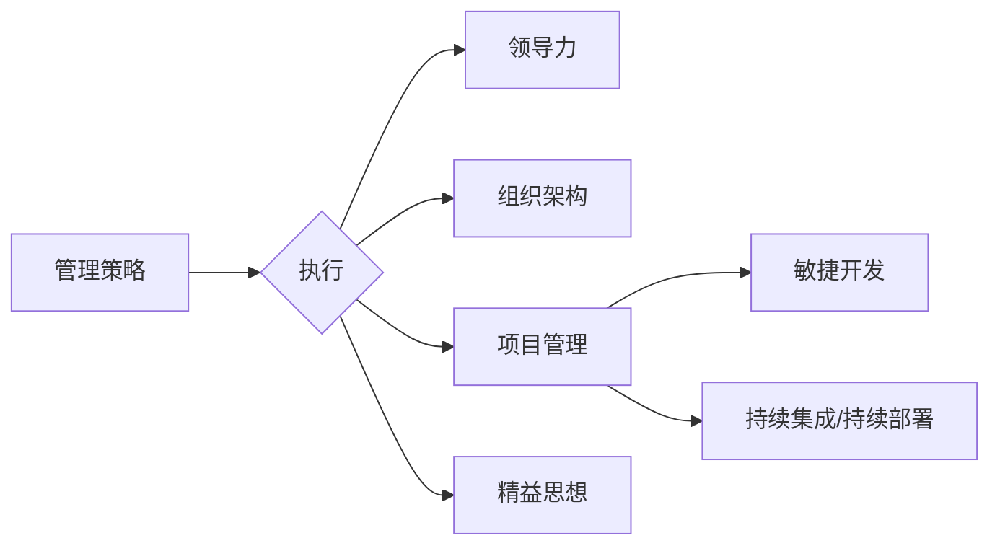

# 管理艺术：从策略到执行

> 关键词：管理策略，执行，领导力，组织架构，项目管理，敏捷开发，持续集成，持续部署，精益思想，组织文化

## 1. 背景介绍

在当今快速变化的企业环境中，管理艺术成为了企业成功的关键因素之一。从制定有效的策略到高效执行，管理不仅仅是技术问题，更是一门艺术。本文将探讨管理艺术的核心概念，分析其与执行之间的联系，并提供实用的方法和工具，以帮助读者提升管理能力，实现组织目标。

### 1.1 管理的挑战

随着市场竞争的加剧和技术的飞速发展，管理面临以下挑战：

- **变化速度加快**：市场和技术变革的速度越来越快，管理者需要快速适应和响应。
- **复杂性增加**：组织结构越来越复杂，管理层次增多，协调难度加大。
- **人才竞争激烈**：优秀人才的短缺使得人才管理成为管理者面临的一大挑战。
- **客户需求多变**：客户需求更加个性化和多样化，要求管理者提供更加灵活的服务。

### 1.2 研究意义

本文旨在：

- 分析管理策略与执行之间的关系。
- 提供有效的管理工具和方法。
- 探讨组织文化对执行的影响。
- 展望未来管理艺术的发展趋势。

## 2. 核心概念与联系

### 2.1 核心概念

- **管理策略**：指组织为实现其目标而制定的行动计划。
- **执行**：指将管理策略转化为实际行动的过程。
- **领导力**：指影响和激励他人实现目标的能力。
- **组织架构**：指组织内部的权力结构、部门设置和人员配置。
- **项目管理**：指对项目进行规划、执行、监控和收尾的过程。
- **敏捷开发**：一种以人为核心、迭代、灵活响应变化的软件开发方法。
- **持续集成/持续部署（CI/CD）**：一种自动化软件交付流程。
- **精益思想**：一种以客户价值为核心，消除浪费，提高效率的管理理念。

### 2.2 Mermaid 流程图

### 2.3 核心概念联系

管理策略是执行的基础，领导力、组织架构、项目管理和精益思想等都是执行过程中的关键因素。它们相互联系，共同影响着组织的效率和效果。

## 3. 核心算法原理 & 具体操作步骤

### 3.1 算法原理概述

管理艺术的核心是制定有效的策略和确保其有效执行。以下是一些关键步骤：

1. **需求分析**：了解组织目标和外部环境。
2. **战略规划**：制定实现目标的具体行动计划。
3. **资源分配**：合理分配人力、物力和财力资源。
4. **执行监控**：跟踪执行进度，确保策略落实。
5. **持续改进**：根据执行结果调整策略和行动计划。

### 3.2 算法步骤详解

#### 3.2.1 需求分析

- **市场调研**：了解市场需求和竞争对手。
- **内部评估**：评估组织的优势和劣势。
- **目标设定**：明确组织的目标和愿景。

#### 3.2.2 战略规划

- **战略选择**：选择合适的战略路径。
- **战略分解**：将战略分解为具体的行动计划。
- **资源规划**：规划所需的资源。

#### 3.2.3 资源分配

- **人力配置**：根据任务需求分配人力。
- **资金预算**：制定合理的资金预算。
- **物资采购**：采购所需的物资。

#### 3.2.4 执行监控

- **进度跟踪**：跟踪项目进度。
- **风险评估**：识别和评估风险。
- **沟通协调**：确保信息畅通和协调一致。

#### 3.2.5 持续改进

- **反馈收集**：收集执行过程中的反馈。
- **问题分析**：分析存在的问题。
- **改进措施**：制定改进措施。

### 3.3 算法优缺点

#### 3.3.1 优点

- **提高效率**：确保资源得到有效利用，提高工作效率。
- **降低风险**：通过风险评估和监控，降低执行过程中的风险。
- **增强适应性**：根据反馈及时调整策略和行动计划。

#### 3.3.2 缺点

- **复杂度高**：管理艺术涉及多个方面，需要综合考虑。
- **成本高**：实施管理艺术可能需要较高的成本投入。

### 3.4 算法应用领域

管理艺术适用于所有行业和组织，无论是初创公司还是大型企业，无论是项目团队还是整个组织，都需要运用管理艺术来确保目标的实现。

## 4. 数学模型和公式 & 详细讲解 & 举例说明

### 4.1 数学模型构建

管理艺术的数学模型可以基于以下公式：

- **效率 = 输出 / 输入**
- **风险 = 概率 x 损失**

### 4.2 公式推导过程

#### 4.2.1 效率

效率是衡量管理艺术效果的重要指标。效率可以通过输出与输入的比值来衡量。

#### 4.2.2 风险

风险可以通过概率和损失的乘积来衡量。概率表示风险事件发生的可能性，损失表示风险事件发生时造成的损失。

### 4.3 案例分析与讲解

假设一个公司希望提高销售效率，其输入为人力和资金，输出为销售额。通过优化销售策略、提高销售人员的能力和效率，该公司可以将销售额从100万元提高到150万元，同时人力和资金投入不变。此时，效率从1提高到1.5，即提高了50%。

### 4.4 常见问题解答

**Q1：如何提高管理艺术的效率？**

A：提高管理艺术的效率可以通过以下方法实现：

- 优化流程，减少不必要的环节。
- 增强团队协作，提高工作效率。
- 引入自动化工具，提高工作效率。

**Q2：如何降低管理艺术的风险？**

A：降低管理艺术的风险可以通过以下方法实现：

- 识别和评估风险，制定风险应对计划。
- 加强监控，及时发现和解决问题。
- 增强团队的风险意识。

## 5. 项目实践：代码实例和详细解释说明

### 5.1 开发环境搭建

本节将以敏捷开发为例，介绍如何搭建敏捷开发环境。

#### 5.1.1 开发工具

- **版本控制工具**：Git
- **项目管理工具**：Jira
- **代码质量工具**：SonarQube
- **自动化构建工具**：Jenkins

#### 5.1.2 环境配置

1. 安装Git，配置SSH密钥。
2. 创建Jira项目和迭代计划。
3. 安装SonarQube，配置代码质量规则。
4. 配置Jenkins，实现自动化构建和测试。

### 5.2 源代码详细实现

本节将介绍如何使用Git进行版本控制，并使用Jenkins实现自动化构建和测试。

#### 5.2.1 Git版本控制

1. 初始化Git仓库。
2. 将代码提交到仓库。
3. 创建分支进行开发。
4. 合并分支到主分支。

#### 5.2.2 Jenkins自动化构建和测试

1. 配置Jenkins任务，触发自动化构建。
2. 编写测试脚本，进行单元测试和集成测试。
3. 根据测试结果决定是否部署到生产环境。

### 5.3 代码解读与分析

本节将分析敏捷开发过程中的关键步骤和工具，以及如何使用这些工具提高开发效率。

#### 5.3.1 敏捷开发流程

- 确定需求。
- 优先级排序。
- 分解任务。
- 短期迭代开发。
- 测试和反馈。

#### 5.3.2 Jenkins自动化构建和测试

- Jenkins可以自动执行构建和测试任务，提高开发效率。
- 自动化测试可以保证代码质量，减少缺陷。

### 5.4 运行结果展示

通过Jenkins自动化构建和测试，可以快速发现代码中的问题，并确保代码质量。

## 6. 实际应用场景

### 6.1 企业管理

企业管理是管理艺术的重要应用场景，包括战略规划、组织架构设计、人力资源管理、财务管理等。

### 6.2 项目管理

项目管理是管理艺术在项目实施过程中的应用，包括需求分析、项目计划、执行监控、项目收尾等。

### 6.3 团队管理

团队管理是管理艺术在团队协作过程中的应用，包括团队建设、沟通协调、冲突解决等。

### 6.4 未来应用展望

随着人工智能、大数据等技术的发展，管理艺术将在以下方面得到进一步应用：

- **智能决策支持**：利用人工智能技术，为管理者提供更加精准的决策支持。
- **个性化管理**：根据员工的特点和需求，实施个性化的管理方案。
- **实时监控**：利用大数据技术，实时监控组织运营状况，及时发现问题。

## 7. 工具和资源推荐

### 7.1 学习资源推荐

- 《精益创业》
- 《敏捷软件开发》
- 《敏捷项目管理》
- 《管理者的十项修炼》

### 7.2 开发工具推荐

- Jira
- Jenkins
- SonarQube
- Git

### 7.3 相关论文推荐

- 《敏捷开发：原理、实践与案例》
- 《敏捷项目管理：原则、模式与实践》
- 《精益创业：新创企业的成长思维》

## 8. 总结：未来发展趋势与挑战

### 8.1 研究成果总结

本文从管理策略、执行、领导力、组织架构、项目管理、敏捷开发、持续集成/持续部署、精益思想等方面，探讨了管理艺术的核心概念和原理，并提供了实用的方法和工具。

### 8.2 未来发展趋势

- 管理艺术将更加注重人工智能和大数据技术的应用。
- 管理者的角色将从执行者转变为推动者。
- 管理将更加注重团队合作和知识共享。

### 8.3 面临的挑战

- 管理者需要不断学习新技术和新理念。
- 组织文化变革需要时间和耐心。
- 管理者需要平衡效率和效果。

### 8.4 研究展望

未来，管理艺术的研究将更加注重跨学科交叉融合，将心理学、社会学、经济学等领域的知识应用于管理实践，为组织发展提供更加全面和深入的理论支持。

## 9. 附录：常见问题与解答

**Q1：如何成为一名优秀的管理者？**

A：成为一名优秀的管理者需要具备以下素质：

- **领导力**：能够激励和引导团队实现目标。
- **沟通能力**：能够有效地与团队成员、客户和合作伙伴沟通。
- **决策能力**：能够在复杂情况下做出正确的决策。
- **学习能力**：能够不断学习新知识和新技能。

**Q2：如何提高组织的执行力？**

A：提高组织的执行力可以通过以下方法实现：

- 制定明确的目标和计划。
- 建立有效的沟通机制。
- 培养团队合作精神。
- 建立激励机制。

**Q3：如何应对组织文化变革的阻力？**

A：应对组织文化变革的阻力可以通过以下方法实现：

- 明确变革的目标和意义。
- 与员工进行沟通，争取他们的支持。
- 建立变革的里程碑，逐步推进。
- 奖励变革的积极分子。

**Q4：如何平衡效率和效果？**

A：平衡效率和效果可以通过以下方法实现：

- 优化流程，提高效率。
- 关注关键指标，确保效果。
- 培养员工的责任感，提高执行力度。

**Q5：如何应用精益思想？**

A：应用精益思想可以通过以下方法实现：

- 精简流程，消除浪费。
- 提高效率，降低成本。
- 注重客户价值，提升服务质量。

作者：禅与计算机程序设计艺术 / Zen and the Art of Computer Programming