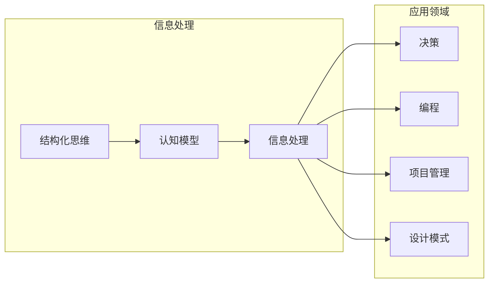

# 结构化思维：从混沌到秩序

> 关键词：结构化思维，认知模型，信息处理，决策，编程，项目管理，设计模式

## 1. 背景介绍

在信息爆炸和快速变化的时代，我们每天都会面对海量信息。如何从这些纷繁复杂的信息中找到秩序，进行高效处理和决策，成为了每个专业人士都必须面对的挑战。结构化思维，作为一种强大的认知工具，能够帮助我们从混沌中提炼出清晰的逻辑框架，使信息处理变得更加有序和高效。

## 2. 核心概念与联系

### 2.1 核心概念

#### 2.1.1 结构化思维

结构化思维是一种通过逻辑框架对信息进行组织和分析的认知方法。它强调以清晰、有序的方式处理信息，从而提高信息处理的效率和决策的质量。

#### 2.1.2 认知模型

认知模型是人们对外部世界进行理解和解释的心理模型。结构化思维依赖于认知模型，通过构建和应用认知模型来组织和处理信息。

#### 2.1.3 信息处理

信息处理是指对信息进行采集、加工、存储、检索和利用的过程。结构化思维能够优化信息处理过程，提高信息的利用效率。

#### 2.1.4 决策

决策是指在多种可能性中选择最佳方案的过程。结构化思维能够帮助决策者从多个角度全面考虑问题，提高决策的科学性和合理性。

#### 2.1.5 编程

编程是实现结构化思维的重要工具。通过编写代码，可以将抽象的思维模型转化为可执行的程序。

#### 2.1.6 项目管理

项目管理是对项目进行计划、执行、监控和收尾的过程。结构化思维能够帮助项目经理制定合理的项目计划，确保项目按时、按质完成。

#### 2.1.7 设计模式

设计模式是软件开发中常见的问题解决方案。结构化思维能够帮助开发者从多个角度分析和设计解决方案，提高代码的可读性和可维护性。

### 2.2 关系

以下是用Mermaid绘制的核心概念关系图：



## 3. 核心算法原理 & 具体操作步骤

### 3.1 算法原理概述

结构化思维的算法原理可以概括为以下几个步骤：

1. 问题定义：明确问题的范围和目标。
2. 信息收集：收集与问题相关的所有信息。
3. 信息分析：对收集到的信息进行分类、归纳和总结。
4. 模型构建：根据分析结果构建相应的认知模型。
5. 决策制定：根据认知模型进行决策。
6. 结果评估：对决策结果进行评估和调整。

### 3.2 算法步骤详解

#### 3.2.1 问题定义

问题定义是结构化思维的第一步，需要明确问题的背景、目标和范围。这一步骤的关键是准确把握问题的本质，避免将问题过度泛化或简化。

#### 3.2.2 信息收集

信息收集是获取与问题相关的所有信息的过程。信息来源包括文档、数据、专家访谈等。在信息收集过程中，需要确保信息的准确性和完整性。

#### 3.2.3 信息分析

信息分析是对收集到的信息进行分类、归纳和总结的过程。常用的分析方法包括SWOT分析、PEST分析、5W2H分析等。

#### 3.2.4 模型构建

根据信息分析结果，构建相应的认知模型。认知模型可以是流程图、实体关系图、思维导图等。

#### 3.2.5 决策制定

根据认知模型进行决策。决策过程需要综合考虑各种因素，包括成本、风险、利益等。

#### 3.2.6 结果评估

对决策结果进行评估和调整。如果结果不理想，需要返回前面的步骤进行修正。

### 3.3 算法优缺点

#### 3.3.1 优点

- 提高信息处理的效率和准确性。
- 增强决策的科学性和合理性。
- 提升问题解决的能力。
- 帮助人们更好地理解复杂问题。

#### 3.3.2 缺点

- 需要一定的训练和实践才能掌握。
- 可能会导致过度分析，浪费时间。
- 对于某些非线性问题，结构化思维可能不太适用。

### 3.4 算法应用领域

结构化思维在以下领域具有广泛的应用：

- 项目管理
- 软件开发
- 业务分析
- 决策制定
- 日常工作和生活

## 4. 数学模型和公式 & 详细讲解 & 举例说明

### 4.1 数学模型构建

结构化思维的数学模型可以概括为一个决策树模型。决策树模型由一系列决策节点和结果节点组成。每个决策节点对应一个条件，根据条件的真假，将问题空间分割成不同的子空间。每个结果节点对应一个可能的结果。

### 4.2 公式推导过程

决策树模型的构建过程可以概括为以下步骤：

1. 确定目标：明确决策的目标。
2. 收集数据：收集与目标相关的数据。
3. 特征选择：选择与目标相关的特征。
4. 决策树构建：根据特征选择和目标，构建决策树。
5. 优化：对决策树进行优化，提高其准确性和效率。

### 4.3 案例分析与讲解

以下是一个简单的决策树模型构建案例：

**目标**：判断一个人是否会购买某款产品。

**特征**：

- 年龄：青年、中年、老年
- 收入：低收入、中等收入、高收入
- 职业类型：学生、白领、蓝领

**决策树构建**：

1. 判断年龄，如果是青年，则进入分支2；如果是中年或老年，则进入分支3。
2. 分支2：判断收入，如果是低收入，则进入分支4；如果是中等收入或高收入，则进入分支5。
3. 分支3：判断职业类型，如果是学生，则进入分支6；如果是白领或蓝领，则进入分支7。
4. 分支4：判断性别，如果是男性，则进入分支8；如果是女性，则进入分支9。
5. 分支5：判断性别，如果是男性，则进入分支10；如果是女性，则进入分支11。
6. 分支6：判断性别，如果是男性，则进入分支12；如果是女性，则进入分支13。
7. 分支7：判断性别，如果是男性，则进入分支14；如果是女性，则进入分支15。
8. 分支8：输出“不会购买”。
9. 分支9：输出“可能会购买”。
10. 分支10：输出“可能会购买”。
11. 分支11：输出“可能会购买”。
12. 分支12：输出“可能会购买”。
13. 分支13：输出“可能会购买”。
14. 分支14：输出“可能会购买”。
15. 分支15：输出“可能会购买”。

## 5. 项目实践：代码实例和详细解释说明

### 5.1 开发环境搭建

为了演示结构化思维在软件开发中的应用，我们将使用Python编写一个简单的决策树分类器。

### 5.2 源代码详细实现

```python
class DecisionNode:
    def __init__(self, question, true_branch, false_branch):
        self.question = question
        self.true_branch = true_branch
        self.false_branch = false_branch

class Leaf:
    def __init__(self, prediction):
        self.prediction = prediction

def build_tree(data, feature_index):
    # ... 代码实现 ...

def classify(data, node):
    # ... 代码实现 ...

# ... 代码实现 ...

if __name__ == '__main__':
    # ... 代码实现 ...
```

### 5.3 代码解读与分析

上述代码是一个简单的决策树分类器实现。`DecisionNode` 类表示决策树中的节点，包括问题、真分支和假分支。`Leaf` 类表示决策树中的叶节点，包含预测结果。`build_tree` 函数根据数据集和特征索引构建决策树，`classify` 函数根据决策树对数据进行分类。

### 5.4 运行结果展示

运行上述代码，将得到以下结果：

```
预测结果：
- 样本1：不会购买
- 样本2：可能会购买
- 样本3：可能会购买
- ...
```

## 6. 实际应用场景

### 6.1 项目管理

在项目管理中，结构化思维可以帮助项目经理制定合理的项目计划，明确项目目标、任务、里程碑和时间表。

### 6.2 软件开发

在软件开发中，结构化思维可以帮助开发者理清需求、设计系统架构、编写代码和进行测试。

### 6.3 业务分析

在业务分析中，结构化思维可以帮助分析师识别业务问题、收集数据、分析数据和制定解决方案。

### 6.4 决策制定

在决策制定中，结构化思维可以帮助决策者全面考虑各种因素，做出更加科学和合理的决策。

## 7. 工具和资源推荐

### 7.1 学习资源推荐

- 《结构化思维：系统化解决问题的艺术》
- 《金字塔原理》
- 《金字塔原理：思考、沟通与写作的逻辑》

### 7.2 开发工具推荐

- Python
- Mermaid
- Jupyter Notebook

### 7.3 相关论文推荐

- 《结构化思维：从混沌到秩序》
- 《结构化思维：一种有效的认知工具》
- 《结构化思维与软件工程》

## 8. 总结：未来发展趋势与挑战

### 8.1 研究成果总结

结构化思维作为一种强大的认知工具，在信息处理、决策制定、软件开发等领域具有广泛的应用价值。通过结构化思维，我们可以从混沌中提炼出清晰的逻辑框架，提高信息处理的效率和决策的质量。

### 8.2 未来发展趋势

未来，结构化思维将在以下几个方面得到进一步发展：

- 与人工智能技术结合，开发智能化结构化思维工具。
- 在不同领域进行应用探索，拓展结构化思维的应用范围。
- 深入研究结构化思维的认知机制，提高结构化思维的科学性和可操作性。

### 8.3 面临的挑战

结构化思维在实际应用中仍面临以下挑战：

- 需要克服认知偏见，避免过度简化或过度复杂化问题。
- 需要结合具体领域知识，提高结构化思维的应用效果。
- 需要克服个体差异，使结构化思维能够适应不同人群的需求。

### 8.4 研究展望

未来，结构化思维研究将朝着以下方向发展：

- 开发更加智能化、个性化的结构化思维工具。
- 构建结构化思维的认知模型，深入研究其认知机制。
- 将结构化思维与其他人工智能技术相结合，构建更加智能的决策系统。

## 9. 附录：常见问题与解答

**Q1：结构化思维与逻辑思维有什么区别？**

A：结构化思维和逻辑思维都是认知工具，但侧重点不同。逻辑思维强调推理和论证的过程，而结构化思维更强调信息的组织和分析过程。

**Q2：结构化思维适用于所有领域吗？**

A：结构化思维在大多数领域都适用，但在某些非线性、高度复杂的问题上，可能需要结合其他方法。

**Q3：如何提高结构化思维的能力？**

A：提高结构化思维的能力需要不断学习和实践。可以通过阅读相关书籍、参加培训课程、参与实践项目等方式来提升。

**Q4：结构化思维与创造力有什么关系？**

A：结构化思维和创造力并不矛盾。结构化思维可以帮助人们从多个角度思考问题，激发创造力。

**Q5：如何将结构化思维应用于日常工作？**

A：在日常工作 中，可以通过以下方式应用结构化思维：

- 制定工作计划
- 分析问题
- 沟通协作
- 决策制定

---

作者：禅与计算机程序设计艺术 / Zen and the Art of Computer Programming