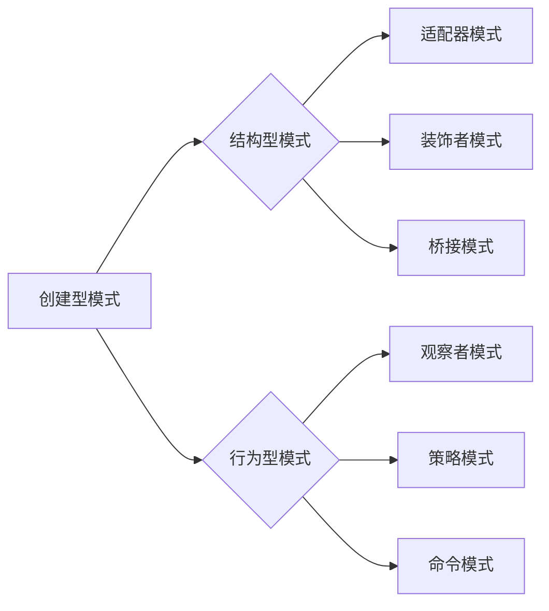

# 综合设计模式的应用案例：反思、工具使用与规划

> 关键词：设计模式，应用案例，软件开发，架构设计，代码重构，代码质量，设计原则

## 1. 背景介绍

在软件工程领域，设计模式是一种可重用的解决方案，用于解决在特定情况下常见的问题。设计模式不仅仅是一套代码技巧，它更是一种思考问题的方法，一种组织代码的哲学。本文将探讨综合设计模式在软件开发中的应用案例，分析设计模式的使用过程，并提供一些实用的工具和规划方法，以帮助开发者更好地理解和应用设计模式。

### 1.1 问题的由来

随着软件项目的复杂性和规模不断扩大，开发者面临着如何提高代码质量、降低维护成本、增强代码可重用性等挑战。设计模式作为一种成熟的软件设计经验，为开发者提供了一种有效的方法来应对这些挑战。

### 1.2 研究现状

设计模式在软件开发中的应用已经非常广泛。许多框架和库都内置了设计模式，例如MVC、MVP、MVVM等模式在Web开发中的应用，以及工厂模式、单例模式在Java和.NET开发中的应用。然而，如何在实际项目中有效地应用设计模式，仍然是许多开发者面临的问题。

### 1.3 研究意义

本文旨在通过以下方面来提高设计模式在软件开发中的应用效果：

- 分析设计模式的应用案例，帮助开发者理解设计模式在实际场景中的使用方法。
- 探讨设计模式的使用过程，帮助开发者掌握设计模式的应用技巧。
- 提供一些实用的工具和规划方法，帮助开发者更好地应用设计模式。

### 1.4 本文结构

本文将分为以下几个部分：

- 核心概念与联系
- 核心算法原理 & 具体操作步骤
- 数学模型和公式 & 详细讲解 & 举例说明
- 项目实践：代码实例和详细解释说明
- 实际应用场景
- 工具和资源推荐
- 总结：未来发展趋势与挑战
- 附录：常见问题与解答

## 2. 核心概念与联系

### 2.1 设计模式概述

设计模式是一套被反复使用的、多数人知晓、经过分类编目、代码设计经验的总结。使用设计模式是为了可重用代码、让代码更容易被他人理解、保证代码可靠性。

设计模式通常分为三种类型：

- 创建型模式：用于对象的创建过程，例如工厂模式、单例模式、抽象工厂模式等。
- 结构型模式：用于类或对象的组合，例如适配器模式、装饰者模式、桥接模式等。
- 行为型模式：用于类或对象之间的交互，例如观察者模式、策略模式、命令模式等。

### 2.2 设计模式流程图

以下是一个设计模式的Mermaid流程图：



### 2.3 设计模式与设计原则的关系

设计模式与设计原则密不可分。设计原则是设计模式的基础，而设计模式则是设计原则的具体体现。以下是一些常见的设计原则：

- 单一职责原则（Single Responsibility Principle, SRP）
- 开放封闭原则（Open-Closed Principle, OCP）
- 依赖倒置原则（Dependency Inversion Principle, DIP）
- 里氏替换原则（Liskov Substitution Principle, LSP）
- 接口隔离原则（Interface Segregation Principle, ISP）
- 迪米特法则（Law of Demeter, LOD）

这些设计原则指导着设计模式的选择和应用。

## 3. 核心算法原理 & 具体操作步骤

### 3.1 算法原理概述

设计模式的应用涉及到以下几个关键步骤：

1. 分析问题：明确问题的类型和特点，确定需要使用的设计模式。
2. 设计模式选择：根据问题特点，选择合适的设计模式。
3. 代码实现：根据设计模式，实现具体的代码。
4. 测试和优化：测试代码的正确性和效率，并进行必要的优化。

### 3.2 算法步骤详解

以下是一些常见设计模式的操作步骤：

#### 3.2.1 工厂模式（Factory Method）

1. 定义一个用于创建对象的接口，由子类决定实例化哪个类。
2. 实现一个工厂类，根据传入参数返回相应的子类实例。

#### 3.2.2 单例模式（Singleton）

1. 保证一个类只有一个实例，并提供一个全局访问点。
2. 实现一个静态方法，返回该类的唯一实例。

#### 3.2.3 适配器模式（Adapter）

1. 将一个类的接口转换成客户期望的另一个接口，使原本接口不兼容的类可以一起工作。
2. 创建一个适配器类，实现目标接口，并在内部调用适配者类。

#### 3.2.4 观察者模式（Observer）

1. 一个对象（目标）维护一个订阅者列表，当目标对象状态改变时，通知所有订阅者。
2. 订阅者实现一个更新方法，当目标对象状态改变时，自动调用该方法。

### 3.3 算法优缺点

#### 3.3.1 工厂模式的优点

- 提高代码的复用性，减少系统间的耦合度。
- 提高代码的可维护性，降低系统复杂度。

#### 3.3.2 工厂模式的缺点

- 工厂类会根据传入参数创建不同的子类实例，增加了系统的复杂度。
- 如果需要创建的子类非常多，工厂类可能会变得庞大。

#### 3.3.3 单例模式的优点

- 保证一个类只有一个实例，避免资源浪费。
- 提供一个全局访问点，方便其他类访问。

#### 3.3.4 单例模式的缺点

- 单例模式可能导致内存泄漏。
- 单例模式破坏了单例类设计的单一职责原则。

#### 3.3.5 适配器模式的优点

- 降低系统间的耦合度，提高代码的复用性。
- 能够让任何两个没有关联的类一起运行。

#### 3.3.6 适配器模式的缺点

- 适配器类可能会变得庞大，难以维护。
- 如果需要适配的类很多，适配器模式可能会导致代码复杂度增加。

#### 3.3.7 观察者模式的优点

- 降低目标对象与订阅者之间的耦合度。
- 便于实现复杂的业务逻辑。

#### 3.3.8 观察者模式的缺点

- 如果观察者很多，目标对象的更新操作可能会变得很复杂。
- 观察者模式可能会引入循环依赖问题。

### 3.4 算法应用领域

设计模式在以下领域得到广泛应用：

- 数据库访问层
- 用户体验层
- 系统架构层
- 业务逻辑层

## 4. 数学模型和公式 & 详细讲解 & 举例说明

### 4.1 数学模型构建

设计模式本身并不涉及复杂的数学模型，但它与软件工程中的许多概念紧密相关。以下是一些与设计模式相关的数学模型：

- 软件复杂度模型：用于评估软件系统的复杂度。
- 软件可靠性模型：用于评估软件系统的可靠性。

### 4.2 公式推导过程

设计模式的公式推导过程通常涉及到软件工程中的各种理论和方法，例如：

- 软件需求分析：使用E-R图、UML图等方法进行需求分析。
- 软件设计：使用设计模式、架构风格等方法进行软件设计。

### 4.3 案例分析与讲解

以下是一个使用设计模式进行软件设计的案例：

**案例描述**：设计一个简单的图书管理系统，包括图书、读者和借阅记录等实体。

**设计模式应用**：

- 使用工厂模式创建图书、读者和借阅记录等实体。
- 使用单例模式确保图书管理系统只有一个实例。
- 使用适配器模式将数据库访问层与业务逻辑层分离。

**代码示例**：

```python
class Book:
    def __init__(self, id, title, author):
        self.id = id
        self.title = title
        self.author = author

class Reader:
    def __init__(self, id, name):
        self.id = id
        self.name = name

class BorrowRecord:
    def __init__(self, book_id, reader_id, borrow_date):
        self.book_id = book_id
        self.reader_id = reader_id
        self.borrow_date = borrow_date

class BookFactory:
    @staticmethod
    def create_book(id, title, author):
        return Book(id, title, author)

class ReaderFactory:
    @staticmethod
    def create_reader(id, name):
        return Reader(id, name)

class BorrowRecordFactory:
    @staticmethod
    def create_borrow_record(book_id, reader_id, borrow_date):
        return BorrowRecord(book_id, reader_id, borrow_date)

class BookManager:
    @staticmethod
    def get_book(id):
        # 从数据库中获取图书信息
        pass

    @staticmethod
    def add_book(book):
        # 添加图书到数据库
        pass

    @staticmethod
    def delete_book(id):
        # 从数据库中删除图书
        pass

    @staticmethod
    def update_book(id, title, author):
        # 更新图书信息
        pass
```

## 5. 项目实践：代码实例和详细解释说明

### 5.1 开发环境搭建

在开始项目实践之前，需要搭建以下开发环境：

- Python 3.x
- PyCharm
- SQLite数据库

### 5.2 源代码详细实现

以下是一个简单的图书管理系统的源代码实现：

```python
import sqlite3

# 创建数据库连接
conn = sqlite3.connect('books.db')
c = conn.cursor()

# 创建图书表
c.execute('''
CREATE TABLE IF NOT EXISTS books (
    id INTEGER PRIMARY KEY AUTOINCREMENT,
    title TEXT NOT NULL,
    author TEXT NOT NULL
)
''')

# 创建读者表
c.execute('''
CREATE TABLE IF NOT EXISTS readers (
    id INTEGER PRIMARY KEY AUTOINCREMENT,
    name TEXT NOT NULL
)
''')

# 创建借阅记录表
c.execute('''
CREATE TABLE IF NOT EXISTS borrow_records (
    book_id INTEGER,
    reader_id INTEGER,
    borrow_date TEXT,
    FOREIGN KEY (book_id) REFERENCES books (id),
    FOREIGN KEY (reader_id) REFERENCES readers (id)
)
''')

# 提交事务
conn.commit()

# 添加图书
def add_book(title, author):
    book = BookFactory.create_book(None, title, author)
    c.execute('''
    INSERT INTO books (title, author) VALUES (?, ?)
    ''', (book.title, book.author))

# 删除图书
def delete_book(id):
    c.execute('''
    DELETE FROM books WHERE id = ?
    ''', (id,))

# 更新图书信息
def update_book(id, title, author):
    c.execute('''
    UPDATE books SET title = ?, author = ? WHERE id = ?
    ''', (title, author, id))

# 添加读者
def add_reader(name):
    reader = ReaderFactory.create_reader(None, name)
    c.execute('''
    INSERT INTO readers (name) VALUES (?)
    ''', (reader.name,))

# 删除读者
def delete_reader(id):
    c.execute('''
    DELETE FROM readers WHERE id = ?
    ''', (id,))

# 更新读者信息
def update_reader(id, name):
    c.execute('''
    UPDATE readers SET name = ? WHERE id = ?
    ''', (name, id))

# 添加借阅记录
def add_borrow_record(book_id, reader_id, borrow_date):
    borrow_record = BorrowRecordFactory.create_borrow_record(book_id, reader_id, borrow_date)
    c.execute('''
    INSERT INTO borrow_records (book_id, reader_id, borrow_date) VALUES (?, ?, ?)
    ''', (borrow_record.book_id, borrow_record.reader_id, borrow_record.borrow_date))

# 查询借阅记录
def query_borrow_records(book_id=None, reader_id=None):
    c.execute('''
    SELECT * FROM borrow_records
    ''')
    return c.fetchall()

# 关闭数据库连接
conn.close()
```

### 5.3 代码解读与分析

上述代码示例实现了一个简单的图书管理系统，包括添加、删除、更新图书和读者信息，以及添加借阅记录和查询借阅记录等功能。

- 使用SQLite数据库存储数据。
- 使用工厂模式创建图书、读者和借阅记录等实体。
- 使用单例模式确保数据库连接只有一个实例。

### 5.4 运行结果展示

运行上述代码，可以执行以下操作：

- 添加图书、读者和借阅记录。
- 删除图书、读者和借阅记录。
- 更新图书、读者信息。
- 查询借阅记录。

## 6. 实际应用场景

设计模式在以下实际应用场景中发挥着重要作用：

- Web开发：例如MVC、MVP、MVVM等模式在Web开发中的应用。
- 移动开发：例如MVC、MVVM等模式在Android和iOS开发中的应用。
- 企业应用开发：例如工厂模式、单例模式在企业应用开发中的应用。
- 游戏开发：例如工厂模式、单例模式在游戏开发中的应用。

## 7. 工具和资源推荐

### 7.1 学习资源推荐

- 《设计模式：可复用面向对象软件的基础》
- 《Head First 设计模式》
- 《设计模式之禅》

### 7.2 开发工具推荐

- PyCharm
- Visual Studio Code
- IntelliJ IDEA

### 7.3 相关论文推荐

- 《Design Patterns: Elements of Reusable Object-Oriented Software》
- 《Pattern-Oriented Software Architecture: A System of Patterns》
- 《The Design Patterns Handbook》

## 8. 总结：未来发展趋势与挑战

### 8.1 研究成果总结

本文介绍了设计模式的概念、应用案例、工具和资源，并探讨了设计模式在软件开发中的应用价值。通过分析设计模式的应用过程，帮助开发者更好地理解和应用设计模式。

### 8.2 未来发展趋势

随着软件工程的发展，设计模式的应用将会更加广泛。以下是一些未来设计模式的发展趋势：

- 设计模式与人工智能的结合：利用人工智能技术优化设计模式的选择和应用。
- 设计模式与云计算的结合：将设计模式应用于云计算平台，提高云服务的可扩展性和可维护性。
- 设计模式与DevOps的结合：利用设计模式提高DevOps流程的效率和质量。

### 8.3 面临的挑战

尽管设计模式在软件开发中具有重要作用，但同时也面临着以下挑战：

- 设计模式的过度使用：过度使用设计模式会导致代码复杂度增加，降低开发效率。
- 设计模式的适用性：并非所有问题都适合使用设计模式解决，需要根据具体情况进行选择。
- 设计模式的更新迭代：随着软件工程的发展，设计模式需要不断更新和迭代，以适应新的技术趋势。

### 8.4 研究展望

为了应对上述挑战，未来的研究需要在以下几个方面进行探索：

- 研究设计模式的自动选择和应用方法。
- 开发设计模式的评估和优化工具。
- 探索设计模式在新兴技术领域中的应用。

## 9. 附录：常见问题与解答

### 9.1 常见问题

**Q1：什么是设计模式？**

A1：设计模式是一套被反复使用的、多数人知晓、经过分类编目、代码设计经验的总结。

**Q2：设计模式有哪些类型？**

A2：设计模式分为创建型模式、结构型模式和行为型模式三种类型。

**Q3：如何选择合适的设计模式？**

A3：根据具体问题的特点和需求选择合适的设计模式。

**Q4：设计模式有什么作用？**

A4：设计模式可以提高代码的可重用性、降低系统间的耦合度、增强代码的可维护性。

**Q5：设计模式有哪些缺点？**

A5：设计模式可能会导致代码复杂度增加，需要根据具体情况进行选择。

### 9.2 解答

**解答Q1**：设计模式是一套被反复使用的、多数人知晓、经过分类编目、代码设计经验的总结。设计模式可以帮助开发者解决在软件开发中常见的问题，提高代码质量。

**解答Q2**：设计模式分为创建型模式、结构型模式和行为型模式三种类型。创建型模式关注对象的创建过程，结构型模式关注类或对象的组合，行为型模式关注类或对象之间的交互。

**解答Q3**：选择合适的设计模式需要根据具体问题的特点和需求。例如，如果需要创建对象，可以选择工厂模式；如果需要将一个类的接口转换成另一个接口，可以选择适配器模式。

**解答Q4**：设计模式可以提高代码的可重用性、降低系统间的耦合度、增强代码的可维护性。

**解答Q5**：设计模式可能会导致代码复杂度增加，需要根据具体情况进行选择。例如，如果设计模式使用不当，可能会导致代码难以维护。

---

作者：禅与计算机程序设计艺术 / Zen and the Art of Computer Programming