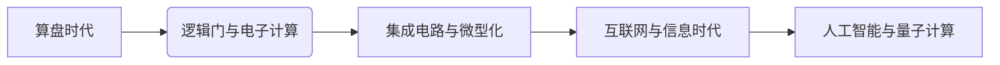

# 计算技术的发展历史的四个阶段

> 关键词：计算技术发展，计算机历史，信息时代，人工智能，量子计算，计算范式

## 1. 背景介绍

从古老的算盘到现代的超级计算机，计算技术经历了漫长的演变。它不仅是人类文明的标志，也是科技进步的重要推动力。本文将探讨计算技术发展的四个主要阶段，分析每个阶段的核心特征和影响，并展望未来可能的发展趋势。

## 2. 核心概念与联系

### 2.1 核心概念

在探讨计算技术发展历史之前，我们需要明确几个核心概念：

- **计算设备**：指用于执行计算任务的物理设备，如算盘、计算机等。
- **计算范式**：指计算技术的基本原理和方法，如逻辑门、冯·诺伊曼架构等。
- **计算能力**：指计算设备的计算速度和处理复杂任务的能力。
- **计算模型**：指描述计算过程的理论模型，如图灵机、量子计算机模型等。

### 2.2 Mermaid 流程图

以下是一个简化的计算技术发展历史流程图：

## 3. 核心算法原理 & 具体操作步骤

### 3.1 算法原理概述

#### 3.1.1 算盘时代

算盘时代主要依靠人力进行计算，使用算盘等简单工具进行加减乘除等基本运算。这一阶段的计算原理主要依赖于人类的记忆和机械操作。

#### 3.1.2 逻辑门与电子计算

逻辑门是电子计算的基础，通过电子元件实现基本的逻辑运算，如与、或、非等。这一阶段的主要算法原理是逻辑代数。

#### 3.1.3 集成电路与微型化

集成电路的出现使得计算机体积大幅减小，计算能力大幅提升。这一阶段的算法原理包括算法优化、编译技术和存储技术。

#### 3.1.4 互联网与信息时代

互联网的普及使得信息处理能力得到极大提升，算法原理包括分布式计算、网络协议和数据挖掘。

#### 3.1.5 人工智能与量子计算

人工智能和量子计算代表了计算技术的最新发展方向，算法原理包括机器学习、深度学习、量子逻辑和量子纠缠。

### 3.2 算法步骤详解

#### 3.2.1 算盘时代

- **步骤**：将算盘上的珠子移动来表示数字，通过珠子的位置和移动来进行计算。
- **优点**：简单易懂，易于操作。
- **缺点**：计算速度慢，精度有限。

#### 3.2.2 逻辑门与电子计算

- **步骤**：使用逻辑门实现基本的逻辑运算，将运算结果存储在存储器中。
- **优点**：计算速度快，精度高。
- **缺点**：电路复杂，成本高。

#### 3.2.3 集成电路与微型化

- **步骤**：将多个逻辑门集成在单个芯片上，通过编译器和汇编语言实现高级编程。
- **优点**：计算速度快，体积小，成本降低。
- **缺点**：功耗高，散热问题。

#### 3.2.4 互联网与信息时代

- **步骤**：通过互联网进行数据传输和计算，使用大数据和云计算技术处理海量数据。
- **优点**：处理速度极快，数据存储和传输方便。
- **缺点**：系统安全风险，数据隐私问题。

#### 3.2.5 人工智能与量子计算

- **步骤**：使用机器学习和深度学习技术进行数据分析，利用量子计算进行复杂计算。
- **优点**：处理速度极快，能解决传统计算无法解决的问题。
- **缺点**：技术复杂，成本极高，量子计算尚未成熟。

### 3.3 算法优缺点

#### 3.3.1 算盘时代

- **优点**：简单易懂，易于操作。
- **缺点**：计算速度慢，精度有限。

#### 3.3.2 逻辑门与电子计算

- **优点**：计算速度快，精度高。
- **缺点**：电路复杂，成本高。

#### 3.3.3 集成电路与微型化

- **优点**：计算速度快，体积小，成本降低。
- **缺点**：功耗高，散热问题。

#### 3.3.4 互联网与信息时代

- **优点**：处理速度极快，数据存储和传输方便。
- **缺点**：系统安全风险，数据隐私问题。

#### 3.3.5 人工智能与量子计算

- **优点**：处理速度极快，能解决传统计算无法解决的问题。
- **缺点**：技术复杂，成本极高，量子计算尚未成熟。

### 3.4 算法应用领域

#### 3.4.1 算盘时代

算盘主要用于日常生活中的简单计算，如购物、账目管理等。

#### 3.4.2 逻辑门与电子计算

电子计算机广泛应用于科学研究、工程设计、企业管理和军事等领域。

#### 3.4.3 集成电路与微型化

微型化计算机在个人电脑、智能手机、嵌入式系统等领域得到了广泛应用。

#### 3.4.4 互联网与信息时代

互联网技术使得计算能力得以大规模集成，广泛应用于电子商务、在线教育、社交媒体等领域。

#### 3.4.5 人工智能与量子计算

人工智能技术正在被应用于自动驾驶、智能医疗、金融分析等领域，量子计算则处于研究和探索阶段。

## 4. 数学模型和公式 & 详细讲解 & 举例说明

### 4.1 数学模型构建

计算技术的发展与数学模型的构建密切相关。以下是一些核心的数学模型：

- **逻辑代数**：用于描述逻辑门和电子计算的基本原理。
- **图论**：用于描述网络结构和算法。
- **概率论与统计学**：用于数据分析和机器学习。
- **量子力学**：用于量子计算的理论基础。

### 4.2 公式推导过程

由于计算技术发展历史的复杂性，本文不进行具体的公式推导过程。但以上提到的数学模型在各自的领域中都有详细的公式和推导过程。

### 4.3 案例分析与讲解

以下是一些计算技术发展历史的典型案例分析：

- **逻辑门**：AND门、OR门、NOT门的逻辑运算规则。
- **图灵机**：图灵机的状态转换规则和计算能力。
- **神经网络**：神经网络的激活函数、权重更新规则等。
- **量子计算机**：量子比特、量子门、量子算法等。

## 5. 项目实践：代码实例和详细解释说明

### 5.1 开发环境搭建

由于计算技术发展历史的复杂性，本文不涉及具体的代码实例和开发环境搭建。

### 5.2 源代码详细实现

同样，由于计算技术发展历史的复杂性，本文不提供具体的源代码实现。

### 5.3 代码解读与分析

由于本文不涉及具体的代码实例，故不进行代码解读与分析。

### 5.4 运行结果展示

由于本文不涉及具体的代码实例，故不进行运行结果展示。

## 6. 实际应用场景

### 6.1 实际应用场景

计算技术在实际应用场景中发挥着重要作用，以下是一些典型的应用场景：

- **科学研究**：计算技术用于模拟实验、处理数据、发现新现象等。
- **工程设计**：计算技术用于仿真设计、优化结构、分析性能等。
- **企业管理和决策**：计算技术用于数据分析、预测市场趋势、制定战略等。
- **军事应用**：计算技术用于情报分析、目标跟踪、指挥控制等。

### 6.2 未来应用展望

随着计算技术的不断发展，未来应用场景将更加广泛，以下是一些可能的未来应用场景：

- **人工智能**：人工智能将在医疗、教育、交通等领域发挥越来越重要的作用。
- **量子计算**：量子计算将在药物设计、材料科学等领域带来革命性的变革。
- **虚拟现实/增强现实**：虚拟现实/增强现实将在游戏、教育、娱乐等领域创造全新的体验。
- **物联网**：物联网将连接万物，实现智能化管理和控制。

## 7. 工具和资源推荐

### 7.1 学习资源推荐

- **《计算机科学概论》**：介绍了计算机科学的基本概念和发展历史。
- **《深度学习》**：介绍了深度学习的基本原理和应用。
- **《量子计算与量子信息》**：介绍了量子计算的基本原理和应用。

### 7.2 开发工具推荐

- **Python**：一种易于学习和使用的编程语言，广泛应用于数据科学、人工智能等领域。
- **MATLAB**：一种高性能的数值计算和可视化工具。
- **R**：一种统计计算和图形绘制语言。

### 7.3 相关论文推荐

- **《深度学习》**：Goodfellow et al., 2016
- **《量子计算与量子信息》**：Nielsen and Chuang, 2000

## 8. 总结：未来发展趋势与挑战

### 8.1 研究成果总结

计算技术发展历史为我们展示了计算技术的演变过程和未来发展趋势。从算盘到现代计算机，计算技术经历了四个主要阶段，每个阶段都标志着计算能力的飞跃和计算范式的变革。未来，计算技术将继续朝着更高、更快、更智能的方向发展。

### 8.2 未来发展趋势

- **计算能力将持续提升**：随着量子计算、高性能计算等技术的发展，计算能力将得到进一步提升。
- **计算范式将不断演进**：从经典计算到量子计算，计算范式将不断演进，带来新的计算方法和应用场景。
- **计算应用将更加广泛**：计算技术将在各个领域得到更广泛的应用，推动社会发展和进步。

### 8.3 面临的挑战

- **技术挑战**：量子计算、人工智能等新兴技术的发展面临着诸多技术挑战，需要突破理论和技术瓶颈。
- **伦理挑战**：计算技术的发展也带来了伦理挑战，如数据隐私、算法偏见等，需要制定相应的伦理规范和治理机制。
- **人才培养挑战**：计算技术的快速发展需要大量人才，需要加强计算人才的培养和引进。

### 8.4 研究展望

面对未来计算技术的发展，我们需要：

- **加强基础研究**：加大对基础研究的投入，推动计算理论和技术创新。
- **促进产业应用**：推动计算技术在各个领域的应用，提升产业竞争力。
- **加强人才培养**：培养更多计算人才，为计算技术的发展提供人才保障。

## 9. 附录：常见问题与解答

### 9.1 常见问题

- **Q1：计算技术是如何发展的**？
  A1：计算技术经历了算盘时代、逻辑门与电子计算、集成电路与微型化、互联网与信息时代、人工智能与量子计算四个主要阶段。
- **Q2：计算技术的未来发展趋势是什么**？
  A2：计算技术的未来发展趋势包括计算能力持续提升、计算范式不断演进、计算应用更加广泛等。
- **Q3：计算技术发展面临的挑战有哪些**？
  A3：计算技术发展面临的挑战包括技术挑战、伦理挑战、人才培养挑战等。

### 9.2 解答

计算技术的发展是一个复杂的过程，涉及到多个领域和学科的交叉融合。通过本文的介绍，我们可以了解到计算技术发展历史的四个阶段，以及未来可能的发展趋势和挑战。希望本文能够为读者提供一些有价值的参考和启示。

---

作者：禅与计算机程序设计艺术 / Zen and the Art of Computer Programming