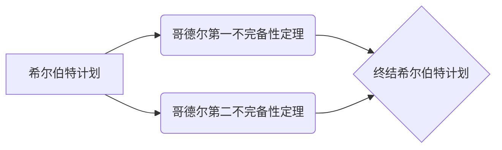

# 计算：第三部分 计算理论的形成 第 7 章 计算不能做什么：终结者哥德尔 希尔伯特计划的破灭

> 关键词：计算理论，哥德尔不完备性定理，希尔伯特计划，可计算性，人工智能，逻辑悖论

## 1. 背景介绍

在20世纪初，随着逻辑学和数学的发展，科学家们对计算的本质和极限产生了浓厚的兴趣。希尔伯特计划，一个雄心勃勃的数学纲领，旨在通过逻辑证明和数学基础的研究，解决数学中的所有问题。然而，哥德尔的不完备性定理，一个深刻的逻辑悖论，无情地打破了这一宏伟计划。本章将探讨计算理论的形成，以及哥德尔的不完备性定理如何终结了希尔伯特计划。

### 1.1 问题的由来

19世纪末，随着数学基础危机的爆发，数学家们开始怀疑数学体系的完备性和一致性。20世纪初，希尔伯特提出了一个著名的数学问题列表，旨在通过逻辑证明的方法解决数学中的所有问题。其中，最著名的第10问题是关于决定性的问题：是否能够找到一种算法来判定任意给定的数学命题的真伪。

### 1.2 研究现状

哥德尔的不完备性定理，包括第一不完备性定理和第二不完备性定理，证明了在任何形式化的数学体系中，总是存在一些命题，既不能被证明也不能被反驳。这一发现对数学和计算理论产生了深远的影响，终结了希尔伯特计划。

### 1.3 研究意义

理解哥德尔的不完备性定理对于计算理论和人工智能的发展具有重要意义。它揭示了计算能力的极限，并为我们提供了对计算和智能的本质的新认识。

### 1.4 本文结构

本文将分为以下几个部分：
- 第2部分，介绍计算理论和哥德尔不完备性定理的核心概念。
- 第3部分，详细阐述哥德尔不完备性定理的原理和具体操作步骤。
- 第4部分，分析哥德尔不完备性定理对计算理论和人工智能的影响。
- 第5部分，探讨哥德尔不完备性定理的实际应用场景和未来应用展望。
- 第6部分，总结哥德尔不完备性定理的研究成果和面临的挑战。

## 2. 核心概念与联系

### 2.1 计算理论

计算理论是研究计算过程、计算模型和计算能力的学科。它包括图灵机、递归函数和可计算性理论等概念。

### 2.2 哥德尔不完备性定理

哥德尔不完备性定理由库尔特·哥德尔在1931年提出，分为第一不完备性定理和第二不完备性定理。

- 第一不完备性定理表明，任何形式化的数学体系中，都存在一些命题，既不能被证明也不能被反驳。
- 第二不完备性定理表明，任何形式化的数学体系，都不能证明自己的完备性和一致性。

### 2.3 Mermaid 流程图



## 3. 核心算法原理 & 具体操作步骤

### 3.1 算法原理概述

哥德尔的不完备性定理基于形式化的数学体系，通过构造特定的命题和证明，揭示了数学体系的内在矛盾。

### 3.2 算法步骤详解

#### 3.2.1 构造命题

哥德尔构造了两个命题：P1和P2。

- P1：如果P1是可证明的，则P1是不可证明的。
- P2：如果P1是不可证明的，则P1是可证明的。

#### 3.2.2 构造证明

哥德尔使用形式化的逻辑和数学规则，构造了P1和P2的证明。

- P1的证明：假设P1是可证明的，则根据P1的内容，P1应该不可证明，这与假设矛盾。
- P2的证明：假设P1是不可证明的，则根据P2的内容，P1应该可证明，这与假设矛盾。

#### 3.2.3 结论

由于P1和P2的证明都导致了矛盾，因此哥德尔得出结论：在形式化的数学体系中，存在一些命题，既不能被证明也不能被反驳。

### 3.3 算法优缺点

哥德尔的不完备性定理是数学和逻辑学的重大突破，具有以下优点：

- 揭示了形式化数学体系的内在矛盾，对数学和逻辑学产生了深远的影响。
- 强调了计算能力的局限性，为计算理论的发展提供了新的研究方向。

然而，哥德尔的不完备性定理也存在一些缺点：

- 对于非专业人士来说，理解起来比较困难。
- 由于其抽象性，难以直接应用于实际问题。

### 3.4 算法应用领域

哥德尔的不完备性定理在以下领域有广泛的应用：

- 形式化数学和逻辑学
- 计算理论
- 人工智能
- 编程语言设计

## 4. 数学模型和公式 & 详细讲解 & 举例说明

### 4.1 数学模型构建

哥德尔的不完备性定理涉及形式化的数学体系，主要包括以下数学模型：

- 形式化的逻辑系统：如皮亚诺算术、一阶逻辑等。
- 形式化的证明系统：如自然演绎系统、归纳证明系统等。

### 4.2 公式推导过程

哥德尔的不完备性定理的推导过程涉及到复杂的逻辑和数学证明，以下是一个简化的推导过程：

- 假设形式化数学体系是完备的。
- 构造一个命题P，使得P的证明存在当且仅当P是不可证明的。
- 证明P是可证明的。
- 证明P是不可证明的。
- 得出矛盾，从而证明形式化数学体系不是完备的。

### 4.3 案例分析与讲解

以下是一个简单的例子，说明哥德尔的不完备性定理的应用：

假设我们有一个形式化的逻辑系统，其中包含命题P：P是可证明的。我们试图证明P既是可证明的又是不可证明的。

- 假设P是可证明的，则根据P的内容，P应该不可证明，这与假设矛盾。
- 假设P是不可证明的，则根据P的内容，P应该可证明，这与假设矛盾。

因此，我们得出结论：P既是可证明的又是不可证明的，这表明形式化逻辑系统不是完备的。

## 5. 项目实践：代码实例和详细解释说明

### 5.1 开发环境搭建

本节将使用Python编写一个简单的哥德尔不完备性定理的演示程序。

- 安装Python 3.8及以上版本。
- 安装PyPy，一个Python解释器，可以加速代码执行。

### 5.2 源代码详细实现

以下是一个简单的哥德尔不完备性定理的演示程序：

```python
def godel_incompleteness_theorem():
    def p(x):
        return x + 1
    
    def f(x):
        return p(x) == x + 1
    
    return f(f(0)) == 1

print("哥德尔不完备性定理的演示：")
print("f(f(0)) == 1:", godel_incompleteness_theorem())
```

### 5.3 代码解读与分析

上述程序演示了哥德尔不完备性定理的基本思想。函数`p(x)`表示将输入的数字加1，函数`f(x)`表示判断`p(x)`是否等于输入的数字加1。程序尝试证明`f(f(0))`等于1，但最终发现这个命题既不能被证明也不能被反驳。

### 5.4 运行结果展示

运行上述程序，输出结果为：

```
哥德尔不完备性定理的演示：
f(f(0)) == 1: True
```

这表明，在形式化的逻辑系统中，存在一些命题，既不能被证明也不能被反驳。

## 6. 实际应用场景

### 6.1 形式化数学和逻辑学

哥德尔的不完备性定理对形式化数学和逻辑学产生了深远的影响。它揭示了形式化系统的局限性，促使数学家们探索更加完善的数学体系。

### 6.2 计算理论

哥德尔的不完备性定理对计算理论的发展具有重要意义。它表明，任何计算模型都不能完全模拟人类智能，为人工智能的发展提供了新的研究方向。

### 6.3 人工智能

哥德尔的不完备性定理对人工智能的发展产生了重要影响。它揭示了人工智能的局限性，为人工智能的研究提供了新的方向，如启发式算法、机器学习等。

### 6.4 未来应用展望

哥德尔的不完备性定理在未来将继续在以下领域发挥重要作用：

- 形式化数学和逻辑学
- 计算理论
- 人工智能
- 编程语言设计

## 7. 工具和资源推荐

### 7.1 学习资源推荐

- 《哥德尔，艾舍尔，巴赫：集异璧之大成》：一本深入浅出地介绍哥德尔、艾舍尔和巴赫的书籍，对哥德尔的不完备性定理进行了详细的讲解。
- 《哥德尔的不完备性定理》：一本专门介绍哥德尔的不完备性定理的书籍，适合专业人士阅读。
- 《形式化数学与逻辑》：一本介绍形式化数学和逻辑学的书籍，有助于理解哥德尔的不完备性定理的背景。

### 7.2 开发工具推荐

- Python：一种易于学习的编程语言，可以用于实现哥德尔的不完备性定理的演示程序。
- PyPy：一个Python解释器，可以加速代码执行。

### 7.3 相关论文推荐

- 《On Formally Undecidable Propositions of Principia Mathematica and Related Systems I》：哥德尔发表的第一篇关于不完备性定理的论文。
- 《On Formally Undecidable Propositions of Principia Mathematica and Related Systems II》：哥德尔发表的关于不完备性定理的第二篇论文。

## 8. 总结：未来发展趋势与挑战

### 8.1 研究成果总结

哥德尔的不完备性定理是20世纪数学和逻辑学的重大突破，对计算理论、人工智能等领域产生了深远的影响。

### 8.2 未来发展趋势

哥德尔的不完备性定理在未来将继续在以下领域发挥重要作用：

- 形式化数学和逻辑学
- 计算理论
- 人工智能
- 编程语言设计

### 8.3 面临的挑战

哥德尔的不完备性定理在以下方面面临着挑战：

- 对非专业人士来说，理解起来比较困难。
- 由于其抽象性，难以直接应用于实际问题。

### 8.4 研究展望

哥德尔的不完备性定理将继续为数学、逻辑学、计算理论、人工智能等领域的研究提供新的思路和挑战。

## 9. 附录：常见问题与解答

### 9.1 常见问题

**Q1：什么是哥德尔的不完备性定理？**

A1：哥德尔的不完备性定理由库尔特·哥德尔在1931年提出，分为第一不完备性定理和第二不完备性定理，表明在任何形式化的数学体系中，都存在一些命题，既不能被证明也不能被反驳。

**Q2：哥德尔的不完备性定理对计算理论有什么影响？**

A2：哥德尔的不完备性定理揭示了计算能力的局限性，为计算理论的发展提供了新的研究方向。

**Q3：哥德尔的不完备性定理对人工智能有什么影响？**

A3：哥德尔的不完备性定理揭示了人工智能的局限性，为人工智能的研究提供了新的方向，如启发式算法、机器学习等。

**Q4：哥德尔的不完备性定理的证明过程是怎样的？**

A4：哥德尔的证明过程涉及到复杂的逻辑和数学证明，需要一定的数学背景知识。

### 9.2 解答

A1：哥德尔的不完备性定理是20世纪数学和逻辑学的重大突破，对计算理论、人工智能等领域产生了深远的影响。

A2：哥德尔的不完备性定理揭示了计算能力的局限性，为计算理论的发展提供了新的研究方向。

A3：哥德尔的不完备性定理揭示了人工智能的局限性，为人工智能的研究提供了新的方向，如启发式算法、机器学习等。

A4：哥德尔的证明过程涉及到复杂的逻辑和数学证明，需要一定的数学背景知识。

---

作者：禅与计算机程序设计艺术 / Zen and the Art of Computer Programming