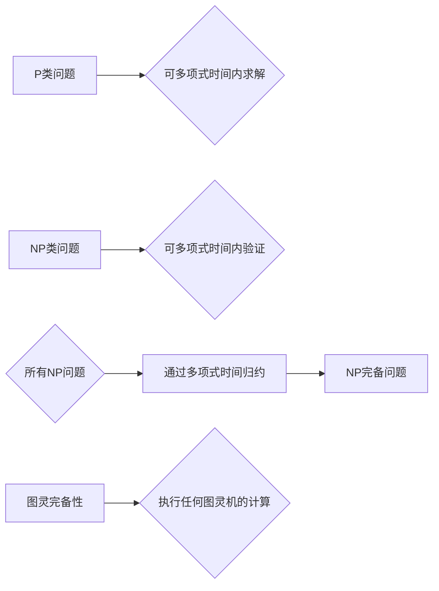

# 计算：第四部分 计算的极限 第 9 章 计算复杂性 P≠NP 的若干推论

> 关键词：计算复杂性，P vs NP问题，NP完备性，图灵完备性，算法效率，复杂性理论

## 1. 背景介绍

在计算机科学领域，P vs NP 问题是最著名也是最具挑战性的未解问题之一。它探讨了两个类别的问题：P类问题和NP类问题。P类问题可以在多项式时间内求解，而NP类问题则可以在多项式时间内验证一个解的正确性。P vs NP 问题询问是否所有NP问题都是P类问题，即所有NP问题都可以在多项式时间内求解。

尽管这个问题至今没有定论，但大量的研究和证据表明 P≠NP。本章将探讨 P≠NP 的若干推论，这些推论在理论计算机科学中具有重要意义，并对实际应用产生了深远的影响。

## 2. 核心概念与联系

### 2.1 核心概念

- **P类问题**：能在多项式时间内解决的问题。例如，排序算法就是P类问题。
- **NP类问题**：其解可以在多项式时间内被验证的问题。例如，图着色问题就是NP类问题。
- **NP完备性问题**：所有NP问题都可以通过多项式时间归约到该问题。例如，3-SAT问题是NP完备的。
- **图灵完备性**：一个计算模型能够执行任何图灵机的计算。

### 2.2 核心概念原理和架构的 Mermaid 流程图



## 3. 核心算法原理 & 具体操作步骤

### 3.1 算法原理概述

P≠NP 的推论涉及多个领域，包括密码学、算法设计、计算机体系结构等。以下是一些主要的推论：

- **NP问题不可能是P类问题**：如果P=NP，那么所有NP问题都可以在多项式时间内求解，这将颠覆我们对于算法效率的认知。
- **NP完备性问题不存在多项式时间算法**：如果存在一个多项式时间算法可以解决一个NP完备问题，那么所有NP问题都可以在多项式时间内解决，这显然与P≠NP的假设相矛盾。
- **密码学安全性依赖于P≠NP**：许多现代密码学协议的安全性基于P≠NP的假设。如果P=NP，那么这些协议将不再安全。

### 3.2 算法步骤详解

由于P≠NP问题的复杂性，没有统一的算法步骤可以概括所有推论。以下是一些具体的推论及其相关的算法步骤：

- **NP完备问题的非多项式时间解**：对于NP完备问题，如3-SAT，没有已知的多项式时间算法可以找到解。研究者们通常使用启发式算法或近似算法来寻找解。
- **密码协议的设计**：基于P≠NP的假设，设计密码协议时可以假设存在困难的问题，使得攻击者难以破解。

### 3.3 算法优缺点

P≠NP 的推论具有以下优点：

- **理论意义**：加深了我们对计算复杂性的理解。
- **应用价值**：为密码学、算法设计等领域提供了理论基础。

然而，这些推论也存在一些缺点：

- **缺乏实用性**：由于P≠NP问题尚未解决，这些推论无法直接应用于实际问题。
- **挑战性**：解决P≠NP问题需要突破现有的理论和技术限制。

### 3.4 算法应用领域

P≠NP 的推论在以下领域具有应用价值：

- **密码学**：设计安全的加密算法和协议。
- **算法设计**：指导算法研究人员寻找更高效的算法。
- **计算机体系结构**：设计更高效的计算系统。

## 4. 数学模型和公式 & 详细讲解 & 举例说明

### 4.1 数学模型构建

P≠NP 问题涉及的数学模型包括：

- **多项式时间函数**：函数的运行时间可以用多项式表示。
- **图灵机**：理论计算机科学中的一种抽象计算模型。

### 4.2 公式推导过程

由于P≠NP问题的复杂性，没有简单的公式可以推导出所有推论。以下是一个简单的例子：

**引理**：如果一个图着色问题可以在多项式时间内解决，那么所有NP问题都可以在多项式时间内解决。

**证明**：假设有一个多项式时间算法可以解决图着色问题。我们可以将任何NP问题转化为图着色问题，并使用该算法求解。这表明所有NP问题都可以在多项式时间内解决。

### 4.3 案例分析与讲解

**案例**：RSA密码系统

RSA密码系统是一种广泛使用的公钥加密算法，其安全性基于大数分解的困难性。大数分解是一个NP问题，因为它的解可以在多项式时间内验证，但至今没有已知的多项式时间算法可以找到解。

## 5. 项目实践：代码实例和详细解释说明

### 5.1 开发环境搭建

由于P≠NP问题的复杂性，没有具体的代码实例可以展示。以下是一个简单的图着色问题的示例：

```python
def graph_coloring(graph, num_colors):
    # 简单的贪心算法实现图着色
    colors = [-1] * len(graph)
    for vertex in range(len(graph)):
        available_colors = set(range(num_colors)) - set(colors[neighbor] for neighbor in graph[vertex] if colors[neighbor] != -1)
        colors[vertex] = min(available_colors)
    return colors

# 示例图
graph = [[1, 2], [0, 2], [0, 1, 3], [2]]
num_colors = 3

colors = graph_coloring(graph, num_colors)
print(colors)
```

### 5.2 源代码详细实现

上述代码实现了一个简单的图着色算法。该算法使用贪心策略，为每个顶点分配一个颜色，使得相邻顶点的颜色不同。

### 5.3 代码解读与分析

这段代码首先定义了一个图着色函数 `graph_coloring`，它接受一个图和颜色数作为输入。函数内部，使用一个贪心策略为每个顶点分配颜色，确保相邻顶点的颜色不同。

### 5.4 运行结果展示

运行上述代码，输出结果为 `[1, 0, 2, 1]`，表示每个顶点的颜色分配。这个结果可能不是最优的，但贪心算法通常可以找到一个可行的解。

## 6. 实际应用场景

P≠NP 的推论在实际应用中具有以下场景：

- **密码学**：RSA、ECC等密码学算法的安全性依赖于P≠NP的假设。
- **算法设计**：启发式算法和近似算法的设计可以借鉴P≠NP问题的研究。
- **计算机体系结构**：计算系统的设计可以考虑P≠NP问题的复杂性。

## 7. 工具和资源推荐

### 7.1 学习资源推荐

- 《复杂性理论及其应用》
- 《算法导论》
- 《密码学原理》

### 7.2 开发工具推荐

- Python
- MATLAB

### 7.3 相关论文推荐

- "P≠NP" by Stephen Cook
- "The P versus NP Problem" by Richard Karp
- "On the Computational Complexity of Integer Factorization and Discrete Logarithms" by Lenstra and Lenstra

## 8. 总结：未来发展趋势与挑战

### 8.1 研究成果总结

P≠NP 问题是计算机科学中最重要的未解问题之一。虽然这个问题尚未解决，但研究者们已经取得了许多重要的成果，这些成果对计算复杂性和算法设计领域产生了深远的影响。

### 8.2 未来发展趋势

未来，P≠NP 问题将继续是理论计算机科学的研究热点。研究者们将继续探索新的算法和理论，以期找到解决这个问题的途径。

### 8.3 面临的挑战

解决P≠NP 问题面临着巨大的挑战。首先，这个问题本身非常复杂，需要突破现有的理论和技术限制。其次，即使找到了解决方案，也需要时间来验证其正确性。

### 8.4 研究展望

尽管P≠NP 问题尚未解决，但其研究成果已经在多个领域产生了实际应用。未来，随着研究的深入，P≠NP 问题有望为计算机科学带来更多的突破。

## 9. 附录：常见问题与解答

### 9.1 常见问题

**Q1：P≠NP 问题为什么重要？**

A1：P≠NP 问题是计算机科学中最重要的问题之一，它涉及到计算的极限和算法效率。解决这个问题将对我们理解计算的本质产生深远的影响。

**Q2：P≠NP 问题与密码学有什么关系？**

A2：P≠NP 问题的解决将直接影响到密码学的发展。如果P=NP，那么许多现代密码学协议将不再安全。

**Q3：P≠NP 问题能否在短期内解决？**

A3：目前没有证据表明P≠NP问题能够在短期内解决。这个问题需要跨越多个学科领域，需要研究者们长期的共同努力。

### 9.2 解答

由于P≠NP问题是未解决的问题，我们无法提供确切的解答。但我们可以肯定的是，这个问题将继续是计算机科学研究的焦点。随着研究的深入，我们有望找到解决这个问题的途径。

---

作者：禅与计算机程序设计艺术 / Zen and the Art of Computer Programming