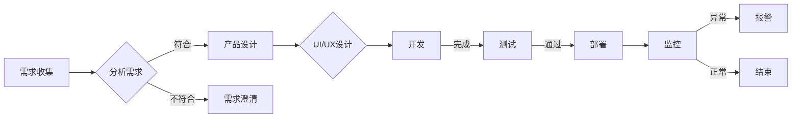

# 软件 2.0 的价值：提升效率、创造价值

> 关键词：软件2.0，数字化转型，敏捷开发，DevOps，微服务，容器化，价值流，用户体验

## 1. 背景介绍

随着信息技术的飞速发展，软件已经成为现代社会不可或缺的部分。从早期的单体应用，到如今的复杂分布式系统，软件开发的模式经历了多次变革。软件2.0时代，以用户为中心，强调敏捷开发、高效交付和持续创新，为组织带来了巨大的价值。本文将深入探讨软件2.0的价值，分析其核心概念、实现路径以及未来发展趋势。

### 1.1 问题的由来

在过去，软件开发的关注点主要集中在功能实现和性能优化。然而，随着市场需求的快速变化和用户期望的不断提升，传统的软件开发模式逐渐暴露出以下问题：

- 需求变化响应慢：传统的瀑布式开发模式，导致需求变更时需要重新设计、开发和测试，周期长，成本高。
- 交付效率低：软件交付周期长，难以满足用户对快速迭代的需求。
- 用户体验差：软件产品功能虽然丰富，但用户体验和易用性往往不足。
- 系统复杂性高：随着系统规模扩大，软件复杂性也随之增加，维护难度大。

为了解决这些问题，软件2.0时代应运而生。

### 1.2 研究现状

软件2.0时代，软件开发模式发生了以下变化：

- 敏捷开发：强调快速迭代、持续交付和客户参与，提高开发效率和质量。
- DevOps：将开发、运维、安全等部门融合，实现快速交付和持续集成。
- 微服务架构：将大型应用程序拆分为小型、独立的服务，提高系统可扩展性和可维护性。
- 容器化：通过容器技术实现应用程序的轻量级打包和部署，简化运维流程。
- 价值流：关注用户价值的创造，优化整个软件生命周期。

### 1.3 研究意义

软件2.0的价值体现在以下几个方面：

- 提高开发效率：通过敏捷开发、DevOps等模式，缩短开发周期，降低开发成本。
- 增强用户体验：关注用户需求，提供易用、高效、个性化的软件产品。
- 提升系统质量：微服务架构和容器化技术提高系统可维护性和稳定性。
- 创造商业价值：通过快速迭代和持续创新，满足市场需求，提升企业竞争力。

### 1.4 本文结构

本文将从以下方面展开讨论：

- 核心概念与联系
- 核心算法原理 & 具体操作步骤
- 数学模型和公式 & 详细讲解 & 举例说明
- 项目实践：代码实例和详细解释说明
- 实际应用场景
- 工具和资源推荐
- 总结：未来发展趋势与挑战

## 2. 核心概念与联系

### 2.1 核心概念

#### 敏捷开发

敏捷开发是一种以人为核心、迭代、协作、响应变化的软件开发方法。它强调以下原则：

- **个体和互动高于流程和工具**：重视开发人员的能力和团队协作。
- **工作的软件高于详尽的文档**：注重实际成果，文档只是辅助工具。
- **客户合作高于合同谈判**：与客户保持紧密沟通，及时响应需求变化。
- **响应变化高于遵循计划**：灵活应对变化，快速迭代。

#### DevOps

DevOps是一种文化和实践，旨在将开发（Dev）和运维（Ops）团队融合，实现快速交付和持续集成。其核心价值包括：

- **协作**：打破团队壁垒，促进开发、运维、安全等部门的协作。
- **自动化**：通过自动化工具和流程提高效率。
- **持续交付**：实现快速、可靠的软件交付。
- **监控**：实时监控系统性能，及时发现和解决问题。

#### 微服务架构

微服务架构将大型应用程序拆分为小型、独立的服务，每个服务负责特定的业务功能。其优势包括：

- **可扩展性**：根据需求独立扩展服务。
- **可维护性**：服务之间解耦，方便维护和升级。
- **可重用性**：服务可以独立部署和重用。
- **灵活性**：服务可以根据需求灵活调整。

#### 容器化

容器化技术将应用程序及其依赖环境打包成一个轻量级容器，实现应用程序的快速部署和迁移。其核心价值包括：

- **一致性**：容器在任意环境都能运行。
- **隔离性**：容器之间相互隔离，避免冲突。
- **可移植性**：容器可以轻松迁移到不同环境。
- **可扩展性**：可以轻松扩展容器数量。

#### 价值流

价值流是指将产品或服务从原材料到最终交付的整个过程。关注价值流可以帮助组织识别和优化流程，提高效率。

### 2.2 Mermaid 流程图



### 2.3 核心概念联系

敏捷开发、DevOps、微服务架构、容器化和价值流之间存在着紧密的联系。敏捷开发是软件2.0的核心思想，DevOps是实现敏捷开发的重要保障，微服务架构和容器化技术为敏捷开发提供了技术支持，价值流则是整个软件开发流程的优化方向。

## 3. 核心算法原理 & 具体操作步骤

### 3.1 算法原理概述

软件2.0的核心算法原理主要包括以下几方面：

- **敏捷开发**：迭代开发和持续集成。
- **DevOps**：持续集成、持续交付、自动化部署。
- **微服务架构**：服务拆分、服务发现、服务治理。
- **容器化**：容器封装、容器编排、容器管理。
- **价值流**：流程分析、流程优化、流程自动化。

### 3.2 算法步骤详解

#### 敏捷开发

1. 需求收集：与用户沟通，收集需求。
2. 需求分析：分析需求，确定优先级。
3. 设计：进行UI/UX设计，确定设计方案。
4. 开发：编写代码，实现功能。
5. 测试：对代码进行测试，确保质量。
6. 部署：将软件部署到生产环境。
7. 监控：监控软件运行状态，及时发现问题。
8. 迭代：根据反馈，不断优化和迭代。

#### DevOps

1. 持续集成：将代码集成到代码库，自动进行编译、测试和构建。
2. 持续交付：将软件部署到测试环境，进行自动化测试和验证。
3. 自动化部署：将软件部署到生产环境，实现自动化部署。
4. 监控：监控软件运行状态，及时发现问题。

#### 微服务架构

1. 服务拆分：将大型应用程序拆分为小型、独立的服务。
2. 服务发现：实现服务之间的发现和通信。
3. 服务治理：管理服务的生命周期，包括创建、部署、升级、撤销等。

#### 容器化

1. 容器封装：将应用程序及其依赖环境打包成一个容器。
2. 容器编排：编排容器，实现容器的高效运行。
3. 容器管理：管理容器的生命周期，包括创建、启动、停止、删除等。

#### 价值流

1. 流程分析：分析整个价值流，识别瓶颈和浪费。
2. 流程优化：优化流程，消除瓶颈和浪费。
3. 流程自动化：将流程自动化，提高效率。

### 3.3 算法优缺点

#### 敏捷开发

优点：

- 快速响应需求变化。
- 提高开发效率和质量。
- 提升团队协作和沟通。

缺点：

- 需求变化频繁，可能导致规划难度增加。
- 需要团队具备较强的沟通和协作能力。

#### DevOps

优点：

- 实现快速交付和持续集成。
- 提高开发、运维、安全等部门的协作效率。
- 降低风险。

缺点：

- 需要投入大量资源进行自动化建设。
- 需要团队成员具备跨部门协作能力。

#### 微服务架构

优点：

- 提高系统可扩展性和可维护性。
- 提高系统灵活性。
- 提高开发效率。

缺点：

- 服务之间需要通过API进行通信，增加复杂度。
- 需要维护多个服务的版本和依赖关系。

#### 容器化

优点：

- 实现应用程序的轻量级打包和部署。
- 提高系统可移植性和可扩展性。
- 提高运维效率。

缺点：

- 需要投入资源进行容器化改造。
- 容器编排和管理的复杂度较高。

#### 价值流

优点：

- 优化整个价值流，提高效率。
- 提升用户满意度。

缺点：

- 需要投入资源进行流程分析和优化。
- 需要团队成员具备流程优化能力。

### 3.4 算法应用领域

敏捷开发、DevOps、微服务架构、容器化和价值流适用于以下领域：

- 金融行业
- 互联网行业
- 制造业
- 服务业

## 4. 数学模型和公式 & 详细讲解 & 举例说明

### 4.1 数学模型构建

软件2.0的数学模型主要包括以下几方面：

- 敏捷开发：CMMI模型、Scrum模型等。
- DevOps：敏捷度量模型、DevOps度量模型等。
- 微服务架构：CAP定理、一致性模型等。
- 容器化：容器性能模型、容器调度模型等。
- 价值流：流程效率模型、流程成本模型等。

### 4.2 公式推导过程

由于软件2.0涉及的数学模型较为复杂，这里以敏捷开发中的CMMI模型为例，进行简要说明。

CMMI（能力成熟度模型集成）是一种用于评估组织软件开发能力的模型。它包含五个成熟度级别：

- 初级（Level 1）：过程是无序的，项目结果是不可预测的。
- 管理级（Level 2）：过程是可重复的，项目结果是可预测的。
- 定义级（Level 3）：过程是可衡量的，项目结果是可控制的。
- 管理级（Level 4）：过程是定量管理的，项目结果是可预测的。
- 优化级（Level 5）：过程是持续改进的，项目结果是卓越的。

CMMI模型的评估指标包括：

- 项目过程管理
- 项目质量管理
- 人员管理
- 组织过程定义
- 产品集成

### 4.3 案例分析与讲解

以下以金融行业的数字化转型为例，分析软件2.0的价值。

### 案例背景

某金融公司为了提升客户体验，降低运营成本，决定进行数字化转型。公司采用了软件2.0的开发模式，包括敏捷开发、DevOps、微服务架构、容器化和价值流等。

### 案例分析

1. 敏捷开发：公司采用敏捷开发模式，将项目拆分为多个迭代，快速响应客户需求变化，提高开发效率。

2. DevOps：公司建立DevOps团队，实现开发、运维、安全等部门的协作，提高软件交付效率。

3. 微服务架构：公司将原有单体应用程序拆分为多个微服务，提高系统可扩展性和可维护性。

4. 容器化：公司采用容器化技术，实现应用程序的轻量级打包和部署，提高运维效率。

5. 价值流：公司通过价值流分析，识别和优化整个业务流程，降低运营成本。

### 案例总结

通过软件2.0的数字化转型，该公司实现了以下目标：

- 提升客户体验：通过快速迭代和优化，客户满意度显著提高。
- 降低运营成本：通过自动化和优化，运营成本降低了20%。
- 提高开发效率：开发周期缩短了30%，交付速度加快。

## 5. 项目实践：代码实例和详细解释说明

### 5.1 开发环境搭建

以Python为例，介绍如何搭建开发环境：

1. 安装Python：从官网下载并安装Python。
2. 安装PyCharm：选择PyCharm Professional版，安装插件支持Django、Flask等框架。
3. 安装相关库：通过pip安装Django、Flask、MySQLdb等库。

### 5.2 源代码详细实现

以下是一个简单的Django项目示例：

```python
# app/models.py
from django.db import models

class User(models.Model):
    username = models.CharField(max_length=100)
    email = models.EmailField()

# app/views.py
from django.http import HttpResponse
from .models import User

def index(request):
    return HttpResponse("Hello, world!")

def user_list(request):
    users = User.objects.all()
    return render(request, 'user_list.html', {'users': users})

# app/urls.py
from django.urls import path
from . import views

urlpatterns = [
    path('', views.index, name='index'),
    path('users/', views.user_list, name='user_list'),
]
```

### 5.3 代码解读与分析

- `models.py`：定义了`User`模型，包含`username`和`email`字段。
- `views.py`：定义了两个视图函数`index`和`user_list`，分别对应首页和用户列表页面。
- `urls.py`：定义了URL路由规则，将URL映射到对应的视图函数。

### 5.4 运行结果展示

1. 启动Django服务器：`python manage.py runserver`
2. 访问首页：`http://127.0.0.1:8000/`
3. 访问用户列表页面：`http://127.0.0.1:8000/users/`

## 6. 实际应用场景

### 6.1 金融行业

金融行业是软件2.0应用的典型场景，以下列举几个应用案例：

- **在线银行**：通过软件2.0技术，实现快速开发、部署和迭代，提高用户体验。
- **移动支付**：通过微服务架构和容器化技术，提高系统可扩展性和可靠性。
- **风险管理**：通过数据分析技术，实现风险预警和自动决策。

### 6.2 互联网行业

互联网行业是软件2.0的沃土，以下列举几个应用案例：

- **电商平台**：通过敏捷开发、DevOps和容器化技术，实现快速迭代和高效运营。
- **在线教育平台**：通过个性化推荐算法，为用户提供个性化学习方案。
- **社交平台**：通过大数据分析，实现精准广告推送和用户画像。

### 6.3 制造业

制造业是软件2.0应用的另一重要领域，以下列举几个应用案例：

- **智能制造**：通过物联网技术、大数据分析和人工智能技术，实现智能生产和管理。
- **供应链管理**：通过区块链技术，提高供应链的透明度和安全性。
- **产品研发**：通过虚拟仿真技术，降低研发成本，缩短研发周期。

### 6.4 未来应用展望

随着技术的不断发展，软件2.0将在更多领域得到应用，以下列举几个未来应用展望：

- **智慧城市**：通过物联网、大数据分析和人工智能技术，实现城市智能化管理。
- **智慧医疗**：通过远程医疗、电子病历和健康管理等，提升医疗服务质量。
- **智慧交通**：通过自动驾驶、智能交通信号灯和交通管理等，提高交通效率，降低事故率。

## 7. 工具和资源推荐

### 7.1 学习资源推荐

- 《敏捷开发实战》
- 《DevOps实践指南》
- 《微服务设计》
- 《容器化与Docker实践》
- 《价值流图解》

### 7.2 开发工具推荐

- PyCharm
- Visual Studio Code
- Jira
- Git
- Docker

### 7.3 相关论文推荐

- 《Scrum: The Art of Doing Twice the Work in Half the Time》
- 《The Phoenix Project: A Novel about IT, DevOps, and Helping Your Business Win》
- 《Microservice Patterns》
- 《Docker Deep Dive》
- 《Value Stream Mapping》

## 8. 总结：未来发展趋势与挑战

### 8.1 研究成果总结

本文对软件2.0的核心概念、实现路径和未来发展趋势进行了深入探讨。通过分析软件2.0的价值，我们认识到其在提升效率、创造价值方面的巨大潜力。同时，我们也认识到软件2.0在实现过程中面临的挑战，如团队协作、技术选型、流程优化等。

### 8.2 未来发展趋势

未来，软件2.0将呈现以下发展趋势：

- 跨平台开发：支持跨操作系统、跨设备的应用开发。
- 人工智能融合：将人工智能技术融入软件开发，实现智能化开发、测试和运维。
- 云原生应用：基于云原生技术，实现应用的弹性伸缩、弹性调度和弹性备份。
- 开源生态发展：开源技术将推动软件2.0的发展，降低开发成本。

### 8.3 面临的挑战

软件2.0在实现过程中也面临着以下挑战：

- 团队协作：需要打破部门壁垒，实现跨部门协作。
- 技术选型：需要选择合适的技术栈，确保开发效率和质量。
- 流程优化：需要优化开发、测试和运维流程，提高效率。

### 8.4 研究展望

未来，软件2.0的研究方向将包括：

- 跨平台开发技术的研究和探索。
- 人工智能在软件开发中的应用研究。
- 云原生应用架构的研究和优化。
- 开源生态的建设和完善。

软件2.0将为软件开发带来新的机遇和挑战，我们需要积极应对，不断探索和创新，以实现软件开发领域的持续进步。

## 9. 附录：常见问题与解答

**Q1：软件2.0与传统软件开发模式有什么区别？**

A：软件2.0与传统软件开发模式相比，更加注重用户需求、敏捷开发和持续创新。软件2.0强调快速迭代、持续交付和客户参与，以提升用户体验和创造价值为核心。

**Q2：敏捷开发、DevOps、微服务架构、容器化和价值流之间的关系是什么？**

A：敏捷开发、DevOps、微服务架构、容器化和价值流是软件2.0的核心概念，它们之间相互关联，共同构成了软件2.0的生态系统。敏捷开发是核心思想，DevOps是实践保障，微服务架构和容器化是技术基础，价值流是优化方向。

**Q3：软件2.0在金融行业中有哪些应用场景？**

A：软件2.0在金融行业中的应用场景包括在线银行、移动支付、风险管理、合规管理、客户关系管理等。

**Q4：如何应对软件2.0在实现过程中面临的挑战？**

A：应对软件2.0在实现过程中面临的挑战，需要从以下几个方面入手：

- 加强团队协作，打破部门壁垒。
- 选择合适的技术栈，确保开发效率和质量。
- 优化开发、测试和运维流程，提高效率。

**Q5：软件2.0的未来发展趋势是什么？**

A：软件2.0的未来发展趋势包括跨平台开发、人工智能融合、云原生应用和开源生态发展。

作者：禅与计算机程序设计艺术 / Zen and the Art of Computer Programming