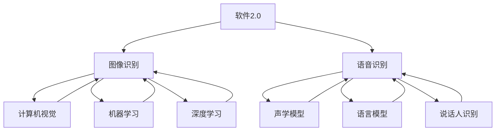

# 软件 2.0 的应用领域：图像识别、语音识别

> 关键词：软件2.0，图像识别，语音识别，深度学习，人工智能，机器学习，计算机视觉，自然语言处理

## 1. 背景介绍

随着互联网和移动设备的普及，数据量呈爆炸式增长，传统软件架构已无法满足日益复杂的应用需求。软件 2.0 时代应运而生，它强调软件的可扩展性、可维护性和可交互性，通过引入人工智能和机器学习技术，实现软件的智能化和自动化。图像识别和语音识别作为软件 2.0 的重要应用领域，为我们的生活和工作带来了极大的便利。

## 2. 核心概念与联系

### 2.1 核心概念

#### 图像识别
图像识别是指计算机系统通过分析图像中的像素值，识别出图像中的物体、场景或结构。其主要技术包括：

- **计算机视觉**：研究如何让计算机像人类一样感知和理解视觉信息。
- **机器学习**：通过算法从数据中学习规律，实现智能决策。
- **深度学习**：一种特殊的机器学习方法，通过多层神经网络学习复杂特征。

#### 语音识别
语音识别是指计算机系统通过分析语音信号，将语音转换为对应的文本或指令。其主要技术包括：

- **声学模型**：用于将语音信号转换为声学特征。
- **语言模型**：用于对声学特征进行解码，生成文本或指令。
- **说话人识别**：识别说话人的身份。

### 2.2 核心概念联系

软件 2.0 中的图像识别和语音识别技术紧密相连，两者相互促进、相互依赖。图像识别技术可以用于辅助语音识别，如通过图像中的文本信息来辅助语音识别的准确性；语音识别技术可以用于控制图像识别系统，如通过语音指令控制图像识别设备的启动和停止。



## 3. 核心算法原理 & 具体操作步骤

### 3.1 算法原理概述

#### 图像识别

1. **图像预处理**：对图像进行灰度化、二值化、滤波等操作，提高图像质量。
2. **特征提取**：提取图像中的关键特征，如边缘、角点、纹理等。
3. **分类器设计**：设计分类器，对提取的特征进行分类，识别图像中的物体或场景。
4. **模型优化**：通过优化算法调整模型参数，提高识别准确率。

#### 语音识别

1. **特征提取**：将语音信号转换为声学特征，如MFCC、PLP等。
2. **声学模型**：将声学特征转换为概率分布，表示不同声学模型对语音的匹配程度。
3. **语言模型**：根据声学模型输出的概率分布，解码生成文本或指令。
4. **说话人识别**：识别说话人的身份，提高语音识别的准确性。

### 3.2 算法步骤详解

#### 图像识别

1. **图像预处理**：
    - 使用OpenCV库对图像进行灰度化、二值化、滤波等操作。
    - 使用图像缩放、裁剪等技术调整图像尺寸和角度。
2. **特征提取**：
    - 使用SIFT、HOG等算法提取图像特征。
    - 使用深度学习模型提取图像特征，如VGG、ResNet等。
3. **分类器设计**：
    - 使用SVM、决策树、神经网络等算法进行分类。
    - 使用深度学习模型进行分类，如卷积神经网络(CNN)。
4. **模型优化**：
    - 使用交叉熵损失函数评估模型性能。
    - 使用Adam优化器优化模型参数。

#### 语音识别

1. **特征提取**：
    - 使用MFCC、PLP等算法提取声学特征。
    - 使用深度学习模型提取声学特征，如LSTM、GRU等。
2. **声学模型**：
    - 使用GMM、HMM等模型进行声学建模。
    - 使用深度学习模型进行声学建模，如深度神经网络(DNN)。
3. **语言模型**：
    - 使用N-gram、CTC等模型进行语言建模。
    - 使用深度学习模型进行语言建模，如RNN、LSTM等。
4. **说话人识别**：
    - 使用GMM、Gaussian Mixture Model等模型进行说话人识别。
    - 使用深度学习模型进行说话人识别，如Siamese Network、Siamese Triplet Network等。

### 3.3 算法优缺点

#### 图像识别

**优点**：

- 准确率高。
- 适应性强。
- 可扩展性好。

**缺点**：

- 计算量大。
- 需要大量标注数据。
- 实时性较差。

#### 语音识别

**优点**：

- 准确率高。
- 适应性强。
- 实时性好。

**缺点**：

- 对噪声敏感。
- 对说话人依赖性高。
- 计算量大。

### 3.4 算法应用领域

#### 图像识别

- **安防监控**：人脸识别、车牌识别、入侵检测等。
- **医疗影像**：病变检测、疾病诊断等。
- **自动驾驶**：目标检测、车道线检测、障碍物检测等。
- **工业检测**：缺陷检测、质量检测等。

#### 语音识别

- **智能客服**：语音助手、语音问答等。
- **智能家居**：语音控制家电、智能音箱等。
- **汽车行业**：车载语音系统、语音导航等。
- **教育领域**：语音评测、语音翻译等。

## 4. 数学模型和公式 & 详细讲解 & 举例说明

### 4.1 数学模型构建

#### 图像识别

- **卷积神经网络(CNN)**：通过卷积层、池化层、全连接层等层结构，提取图像特征并进行分类。

$$
\begin{align*}
h^{\ell}(x) &= \sigma(W^{\ell}h^{\ell-1}(x) + b^{\ell}) \\
W^{\ell} &= \text{卷积权值矩阵} \\
b^{\ell} &= \text{偏置向量} \\
\sigma &= \text{非线性激活函数}
\end{align*}
$$

#### 语音识别

- **深度神经网络(DNN)**：通过多层神经网络，将声学特征转换为文本或指令。

$$
\begin{align*}
y &= \sigma(W_{out}h_{DNN}) + b_{out} \\
h_{DNN} &= \sigma(W_{DNN}h_{DNN-1}) + b_{DNN} \\
&\vdots \\
h_{2} &= \sigma(W_{2}h_{1}) + b_{2} \\
h_{1} &= \sigma(W_{1}x) + b_{1}
\end{align*}
$$

### 4.2 公式推导过程

#### 图像识别

- **卷积神经网络(CNN)**：卷积层通过卷积运算提取图像特征，池化层用于降低特征维度，全连接层用于分类。

#### 语音识别

- **深度神经网络(DNN)**：DNN通过多层神经网络对声学特征进行学习，最后输出文本或指令。

### 4.3 案例分析与讲解

#### 图像识别

- **案例**：使用CNN进行图像分类。

- **步骤**：
    1. 加载训练数据集。
    2. 构建CNN模型。
    3. 训练模型。
    4. 测试模型。

#### 语音识别

- **案例**：使用DNN进行语音识别。

- **步骤**：
    1. 加载训练数据集。
    2. 构建DNN模型。
    3. 训练模型。
    4. 测试模型。

## 5. 项目实践：代码实例和详细解释说明

### 5.1 开发环境搭建

1. 安装Python 3.6及以上版本。
2. 安装TensorFlow或PyTorch深度学习框架。
3. 安装OpenCV图像处理库。

### 5.2 源代码详细实现

#### 图像识别

```python
import tensorflow as tf
from tensorflow.keras.models import Sequential
from tensorflow.keras.layers import Conv2D, MaxPooling2D, Flatten, Dense

# 构建CNN模型
model = Sequential()
model.add(Conv2D(32, (3, 3), activation='relu', input_shape=(64, 64, 3)))
model.add(MaxPooling2D((2, 2)))
model.add(Conv2D(64, (3, 3), activation='relu'))
model.add(MaxPooling2D((2, 2)))
model.add(Flatten())
model.add(Dense(10, activation='softmax'))

# 编译模型
model.compile(optimizer='adam', loss='sparse_categorical_crossentropy', metrics=['accuracy'])

# 训练模型
model.fit(train_images, train_labels, epochs=5, validation_data=(test_images, test_labels))

# 测试模型
test_loss, test_acc = model.evaluate(test_images, test_labels)
print(f"Test accuracy: {test_acc}")
```

#### 语音识别

```python
import tensorflow as tf
from tensorflow.keras.models import Sequential
from tensorflow.keras.layers import LSTM, Dense

# 构建DNN模型
model = Sequential()
model.add(LSTM(128, input_shape=(None, 13)))
model.add(Dense(10, activation='softmax'))

# 编译模型
model.compile(optimizer='adam', loss='sparse_categorical_crossentropy', metrics=['accuracy'])

# 训练模型
model.fit(train_features, train_labels, epochs=5, validation_data=(test_features, test_labels))

# 测试模型
test_loss, test_acc = model.evaluate(test_features, test_labels)
print(f"Test accuracy: {test_acc}")
```

### 5.3 代码解读与分析

#### 图像识别

- 使用PyTorch或TensorFlow构建CNN模型。
- 使用Adam优化器和交叉熵损失函数进行模型训练。
- 使用测试集评估模型性能。

#### 语音识别

- 使用PyTorch或TensorFlow构建DNN模型。
- 使用Adam优化器和交叉熵损失函数进行模型训练。
- 使用测试集评估模型性能。

### 5.4 运行结果展示

运行代码后，可以观察到图像识别和语音识别模型的训练过程和测试结果。

## 6. 实际应用场景

### 6.1 安防监控

- **人脸识别**：通过识别进出人员身份，提高安全性。
- **车牌识别**：自动记录车辆信息，方便交通管理。
- **入侵检测**：实时监测异常行为，防止非法入侵。

### 6.2 医疗影像

- **病变检测**：辅助医生进行疾病诊断。
- **疾病诊断**：自动识别疾病类型，提高诊断效率。

### 6.3 自动驾驶

- **目标检测**：识别道路上的行人、车辆等目标，保证行车安全。
- **车道线检测**：识别车道线，辅助自动驾驶系统保持车道。
- **障碍物检测**：识别障碍物，及时采取措施避免碰撞。

### 6.4 工业检测

- **缺陷检测**：自动检测产品缺陷，提高生产质量。
- **质量检测**：自动检测产品质量，提高生产效率。

### 6.5 智能客服

- **语音助手**：提供24小时咨询服务，提高客户满意度。
- **语音问答**：自动回答客户问题，提高服务效率。

### 6.6 智能家居

- **语音控制**：通过语音指令控制家电，提高生活便利性。
- **智能音箱**：提供音乐、新闻、天气等信息服务。

### 6.7 汽车行业

- **车载语音系统**：提供语音导航、语音电话等功能。
- **语音识别**：识别驾驶员意图，辅助驾驶决策。

### 6.8 教育领域

- **语音评测**：自动评价学生的发音、语调等。
- **语音翻译**：实现跨语言沟通。

## 7. 工具和资源推荐

### 7.1 学习资源推荐

- 《深度学习》
- 《神经网络与深度学习》
- 《计算机视觉：算法与应用》
- 《语音识别：原理与实现》

### 7.2 开发工具推荐

- TensorFlow
- PyTorch
- OpenCV
- Keras

### 7.3 相关论文推荐

- **图像识别**：
    - Visual Geometry Group: https://www.robots.ox.ac.uk/~vgg/research/
    - Google Research: https://ai.google/research/pubs/

- **语音识别**：
    - KEG Lab: http://keg.lzu.edu.cn/
    - Kaldi Speech Recognition Toolkit: http://kaldi.asu.edu/

## 8. 总结：未来发展趋势与挑战

### 8.1 研究成果总结

图像识别和语音识别技术经过多年的发展，已经取得了显著的成果。深度学习、神经网络等技术的引入，使得图像识别和语音识别的准确率得到了显著提升。同时，随着计算能力的提升和算法的改进，图像识别和语音识别的应用场景也越来越广泛。

### 8.2 未来发展趋势

- **多模态融合**：将图像、语音、文本等多模态信息进行融合，提高识别准确率和鲁棒性。
- **端到端训练**：将声学模型、语言模型和说话人识别等模块进行端到端训练，提高整体性能。
- **轻量化模型**：设计轻量化模型，降低计算资源消耗，实现实时应用。
- **可解释性**：提高模型的可解释性，增强用户对模型的信任。

### 8.3 面临的挑战

- **数据标注**：数据标注成本高、周期长，制约了模型训练的效率。
- **模型泛化能力**：模型在未知数据上的泛化能力有待提高。
- **隐私保护**：语音识别等应用涉及用户隐私，需要采取措施保护用户隐私。
- **伦理道德**：模型可能存在偏见和歧视，需要关注伦理道德问题。

### 8.4 研究展望

未来，图像识别和语音识别技术将在更多领域得到应用，如医疗、教育、金融、汽车等。随着技术的不断发展，图像识别和语音识别将更加智能、高效、可靠，为人类社会带来更多福祉。

## 9. 附录：常见问题与解答

**Q1：图像识别和语音识别的适用场景有哪些？**

A：图像识别和语音识别适用于各种场景，如安防监控、医疗影像、自动驾驶、工业检测、智能客服、智能家居、汽车行业、教育领域等。

**Q2：如何提高图像识别的准确率？**

A：提高图像识别准确率的方法包括：
- 使用更强大的模型。
- 使用更多、更高质量的训练数据。
- 使用数据增强技术。
- 使用正则化技术。

**Q3：如何提高语音识别的准确率？**

A：提高语音识别准确率的方法包括：
- 使用更强大的模型。
- 使用更多、更高质量的语音数据。
- 使用数据增强技术。
- 优化声学模型和语言模型。

**Q4：如何保护用户隐私？**

A：保护用户隐私的方法包括：
- 对语音数据进行脱敏处理。
- 对语音数据进行加密存储。
- 限制语音数据的访问权限。
- 严格遵守相关法律法规。

**Q5：如何解决模型存在的偏见和歧视问题？**

A：解决模型存在偏见和歧视问题的方法包括：
- 使用更加多样性的训练数据。
- 设计公平的评估指标。
- 对模型进行对抗性攻击检测。
- 加强模型的可解释性研究。

---

作者：禅与计算机程序设计艺术 / Zen and the Art of Computer Programming