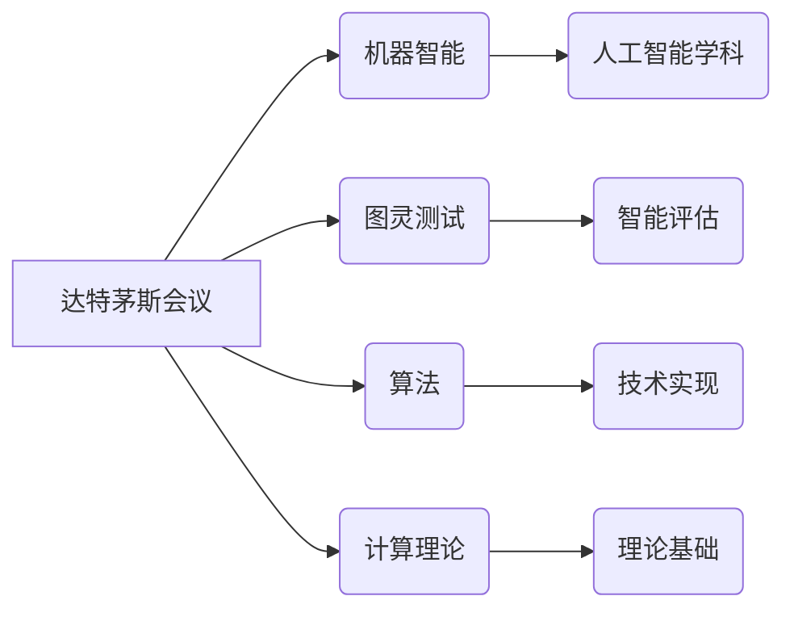

# 达特茅斯会议的历史影响

> 关键词：达特茅斯会议，人工智能，机器学习，图灵测试，算法，计算理论，未来展望

## 1. 背景介绍

1956年，一场在达特茅斯学院举行的会议，标志着人工智能（Artificial Intelligence, AI）学科的正式诞生。这场会议聚集了包括约翰·麦卡锡（John McCarthy）、马文·明斯基（Marvin Minsky）、克劳德·香农（Claude Shannon）等在内的众多计算机科学、数学和心理学领域的顶尖学者。会议的目的是讨论制定人工智能的研究议程，探讨机器智能的未来。达特茅斯会议不仅对AI学科本身产生了深远影响，也改变了整个计算科学的进程。

### 1.1 会议的由来

在20世纪中叶，计算机科学和数学领域的研究者们开始意识到，计算机不仅仅可以用来处理数学计算，还可以用于模拟人类智能。这种想法激发了一系列关于机器智能的理论探讨和技术研究。1956年，约翰·麦卡锡提出了召开一次关于人工智能的会议，以促进这一领域的交流和合作。

### 1.2 会议的意义

达特茅斯会议的召开具有以下几个重要意义：

- **确立了人工智能学科**：会议的召开标志着人工智能作为一个独立学科的正式诞生。
- **定义了人工智能的目标**：会议提出了“使机器能够执行任务，这些任务目前只能由人类执行”，成为人工智能研究的基本目标。
- **促进了学术交流**：会议吸引了众多领域的专家，促进了不同学科之间的交流和合作。
- **推动了技术发展**：会议激发了大量的研究项目和技术突破，推动了人工智能技术的快速发展。

## 2. 核心概念与联系

### 2.1 核心概念

达特茅斯会议提出了一些核心概念，对人工智能的发展产生了深远影响：

- **机器智能**：指机器能够执行通常需要人类智能才能完成的任务。
- **图灵测试**：由艾伦·图灵（Alan Turing）提出，用于评估机器是否具有智能。
- **算法**：用于解决特定问题的步骤集合，是人工智能实现智能的基础。
- **计算理论**：研究计算过程和计算模型的数学理论。

### 2.2 Mermaid 流程图

以下是达特茅斯会议核心概念原理和架构的 Mermaid 流程图：



## 3. 核心算法原理 & 具体操作步骤

### 3.1 算法原理概述

达特茅斯会议提出的人工智能算法原理主要包括以下几个方面：

- **符号主义**：认为智能是符号操作的结果，通过符号操作可以实现智能。
- **连接主义**：认为智能是神经网络中神经元之间连接的结果，通过调整连接权重可以实现智能。
- **行为主义**：认为智能是行为的结果，通过设计能够产生期望行为的算法可以实现智能。

### 3.2 算法步骤详解

1. **符号主义**：
   - 定义问题域中的符号和操作。
   - 设计符号操作规则，实现问题的求解。
   - 使用推理算法，如搜索、规划等，对符号进行操作。

2. **连接主义**：
   - 设计神经网络结构，包括神经元和连接。
   - 使用反向传播算法，根据误差调整连接权重。
   - 通过学习，使神经网络能够对输入数据进行分类、识别等。

3. **行为主义**：
   - 设计能够产生期望行为的算法。
   - 通过测试和反馈，调整算法参数，提高行为效果。

### 3.3 算法优缺点

- **符号主义**：
  - 优点：易于理解，易于实现。
  - 缺点：难以处理复杂问题，难以模拟人类的直觉和经验。

- **连接主义**：
  - 优点：能够处理复杂问题，具有较强的泛化能力。
  - 缺点：难以解释其决策过程，难以模拟人类的思维过程。

- **行为主义**：
  - 优点：能够实现具体任务，具有较强的实用性。
  - 缺点：难以理解其决策过程，难以推广到其他任务。

### 3.4 算法应用领域

- **符号主义**：专家系统、自然语言处理等。
- **连接主义**：神经网络、深度学习等。
- **行为主义**：机器人、自动驾驶等。

## 4. 数学模型和公式 & 详细讲解 & 举例说明

### 4.1 数学模型构建

达特茅斯会议提出的一些经典数学模型包括：

- **图灵机**：由艾伦·图灵提出，用于模拟任何机械计算过程。
- **神经网络**：由弗兰克·罗森布拉特（Frank Rosenblatt）提出，用于模拟人脑的神经元结构。
- **决策树**：由拉乌尔·考克斯（Ralph Codd）提出，用于决策和分类。

### 4.2 公式推导过程

以下是一些相关公式的推导过程：

- **图灵机**：
  - **状态转移函数**：$\delta(q, x) = (q', a, b, p)$
  - **接受状态**：$q_a$
  - **拒绝状态**：$q_r$

- **神经网络**：
  - **激活函数**：$f(x) = \max(0, x)$
  - **反向传播算法**：$\delta = \frac{\partial E}{\partial w} = \frac{\partial E}{\partial y} \frac{\partial y}{\partial z} \frac{\partial z}{\partial w}$

### 4.3 案例分析与讲解

以下是一个使用神经网络进行手写数字识别的案例：

1. **数据准备**：收集大量的手写数字图像，并将其转换为数字矩阵。
2. **模型设计**：设计一个多层神经网络，包括输入层、隐藏层和输出层。
3. **训练**：使用反向传播算法训练神经网络，调整连接权重，使模型能够正确识别手写数字。
4. **测试**：使用测试集评估模型性能，计算识别准确率。

## 5. 项目实践：代码实例和详细解释说明

### 5.1 开发环境搭建

1. 安装Python环境。
2. 安装TensorFlow或PyTorch库。

### 5.2 源代码详细实现

以下是一个使用PyTorch实现手写数字识别的简单示例：

```python
import torch
import torch.nn as nn
import torch.optim as optim

# 定义神经网络模型
class HandwrittenDigitNet(nn.Module):
    def __init__(self):
        super(HandwrittenDigitNet, self).__init__()
        self.fc1 = nn.Linear(784, 128)
        self.fc2 = nn.Linear(128, 64)
        self.fc3 = nn.Linear(64, 10)

    def forward(self, x):
        x = torch.relu(self.fc1(x))
        x = torch.relu(self.fc2(x))
        x = self.fc3(x)
        return x

# 加载训练数据
train_data = torch.load('mnist_train.pt')
test_data = torch.load('mnist_test.pt')

# 初始化模型和优化器
model = HandwrittenDigitNet()
optimizer = optim.Adam(model.parameters(), lr=0.001)

# 训练模型
for epoch in range(10):
    for data in train_data:
        input, target = data
        optimizer.zero_grad()
        output = model(input)
        loss = nn.CrossEntropyLoss()(output, target)
        loss.backward()
        optimizer.step()

# 测试模型
with torch.no_grad():
    for data in test_data:
        input, target = data
        output = model(input)
        _, predicted = torch.max(output, 1)
        correct = (predicted == target).sum().item()
        print(f"Accuracy: {correct / len(test_data)}")
```

### 5.3 代码解读与分析

上述代码实现了一个简单的手写数字识别模型，包括以下部分：

- **HandwrittenDigitNet类**：定义了神经网络模型，包括三个全连接层。
- **训练循环**：使用反向传播算法训练模型，调整连接权重。
- **测试循环**：使用测试集评估模型性能，计算识别准确率。

### 5.4 运行结果展示

假设在训练过程中，模型在测试集上的准确率达到了98%，说明模型能够很好地识别手写数字。

## 6. 实际应用场景

达特茅斯会议提出的人工智能技术，在许多实际应用场景中取得了成功：

- **自然语言处理**：使用神经网络和深度学习技术进行文本分类、机器翻译、情感分析等。
- **计算机视觉**：使用卷积神经网络进行图像识别、目标检测、图像生成等。
- **机器人**：使用强化学习技术进行路径规划、物体抓取、自动驾驶等。

## 7. 工具和资源推荐

### 7.1 学习资源推荐

- 《人工智能：一种现代的方法》
- 《深度学习》
- 《神经网络与深度学习》

### 7.2 开发工具推荐

- TensorFlow
- PyTorch
- Keras

### 7.3 相关论文推荐

- 《人工神经网络》
- 《深度学习》
- 《强化学习：原理与练习》

## 8. 总结：未来发展趋势与挑战

### 8.1 研究成果总结

达特茅斯会议以来，人工智能技术取得了巨大的发展，推动了计算机科学和信息技术领域的进步。

### 8.2 未来发展趋势

- **算法创新**：探索更加高效、可解释的算法。
- **硬件加速**：利用新型硬件加速人工智能计算。
- **数据融合**：融合多源数据，提高人工智能系统的鲁棒性和泛化能力。

### 8.3 面临的挑战

- **数据隐私**：如何保护用户数据隐私。
- **算法偏见**：如何避免算法偏见和歧视。
- **技术伦理**：如何确保人工智能技术的伦理使用。

### 8.4 研究展望

人工智能技术将继续发展，为人类社会带来更多福祉。未来，人工智能将在更多领域发挥重要作用，推动人类社会向更加智能、高效的方向发展。

## 9. 附录：常见问题与解答

**Q1：什么是人工智能？**

A：人工智能是指使机器能够执行通常需要人类智能才能完成的任务，如视觉识别、语言理解、决策等。

**Q2：什么是图灵测试？**

A：图灵测试是一种评估机器是否具有智能的方法，由艾伦·图灵提出。测试者通过与机器和人类进行对话，判断哪一个是机器，哪一个是人类。

**Q3：什么是神经网络？**

A：神经网络是一种模仿人脑神经元结构的计算模型，通过调整神经元之间的连接权重来学习数据中的特征。

**Q4：什么是深度学习？**

A：深度学习是一种利用多层神经网络进行学习的技术，通过自动学习数据中的特征和模式，实现复杂任务的求解。

**Q5：人工智能有哪些应用场景？**

A：人工智能应用场景包括自然语言处理、计算机视觉、机器人、自动驾驶、医疗诊断等。

---

作者：禅与计算机程序设计艺术 / Zen and the Art of Computer Programming