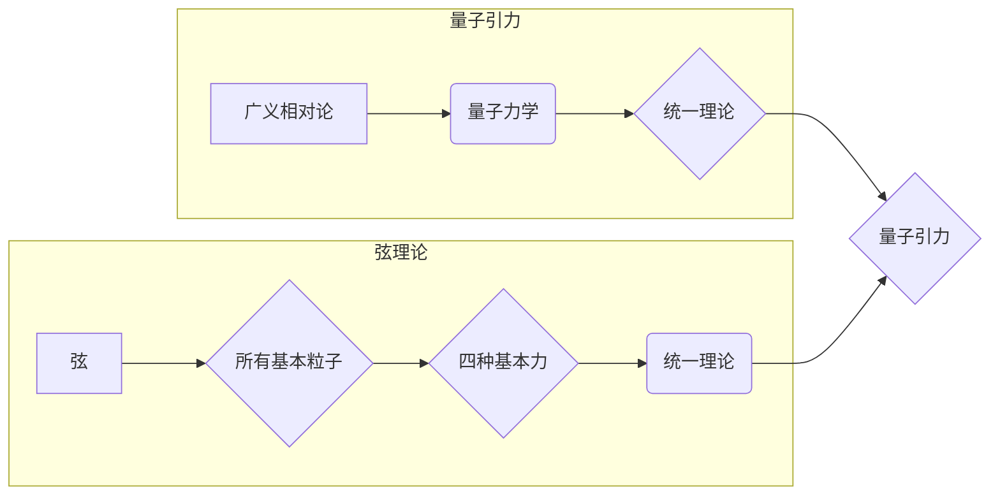

# 量子引力与弦理论的联系

> 关键词：量子引力，弦理论，广义相对论，量子场论，M理论，宇宙学，黑洞，暗物质，暗能量

## 1. 背景介绍

宇宙的终极奥秘之一是引力。自从牛顿在17世纪提出了万有引力定律以来，人类对引力的理解经历了一系列的变革。20世纪初，爱因斯坦的广义相对论为我们提供了一个强有力的引力理论框架，它成功解释了行星运动、光线弯曲、引力红移等现象。然而，广义相对论是一个经典理论，在描述微观尺度或极端条件下，比如黑洞内部或宇宙大尺度结构，它似乎遇到了瓶颈。

与此同时，量子力学作为描述微观粒子的行为的基本理论，在20世纪取得了革命性的进展。然而，量子力学与广义相对论之间的不兼容性导致了量子引力这一领域的研究。弦理论，作为量子引力的一个候选理论，试图将量子力学与广义相对论统一。本文将探讨量子引力与弦理论之间的联系，以及它们如何共同描绘宇宙的图景。

### 1.1 问题的由来

- 经典引力理论（如牛顿力学和广义相对论）在描述宏观尺度上的引力现象时非常成功，但在描述微观尺度或极端条件下时却显得力不从心。
- 量子力学虽然能够描述微观粒子的行为，但在描述引力时与广义相对论存在根本性的不兼容。
- 宇宙学中的观测数据表明，宇宙中存在大量的暗物质和暗能量，这些现象无法用当前的理论框架来解释。

### 1.2 研究现状

- 量子引力的研究主要集中在寻找一个能够同时满足广义相对论和量子力学原理的理论框架。
- 弦理论是量子引力研究的一个主要方向，它提出所有基本粒子都是由一维的“弦”构成的。
- 宇宙学研究表明，暗物质和暗能量的存在对宇宙的结构和演化起着关键作用。

### 1.3 研究意义

- 解决量子引力问题有助于我们更好地理解宇宙的基本结构和演化。
- 弦理论可能揭示宇宙的终极理论，为物理学提供一个统一的描述框架。
- 深入理解暗物质和暗能量有助于我们揭示宇宙的起源和未来。

### 1.4 本文结构

本文将分为以下几个部分：
- 介绍量子引力和弦理论的核心概念。
- 分析量子引力与弦理论之间的联系。
- 探讨弦理论在解决量子引力问题中的作用。
- 讨论弦理论在宇宙学中的应用。
- 展望量子引力与弦理论的研究方向。

## 2. 核心概念与联系

### 2.1 核心概念原理

#### 2.1.1 量子引力

量子引力是试图将广义相对论与量子力学统一的理论。它试图描述在量子尺度上引力的本质。

#### 2.1.2 弦理论

弦理论是一个试图描述所有基本粒子和力的统一理论。它提出所有基本粒子都是由一维的“弦”构成的。

### 2.2 架构的 Mermaid 流程图

### 2.3 核心概念联系

量子引力与弦理论都试图提供一个能够统一描述宇宙的理论框架。量子引力试图将广义相对论与量子力学统一，而弦理论则提供了一个可能的统一框架，其中所有基本粒子都是由一维的弦构成的。

## 3. 核心算法原理 & 具体操作步骤

### 3.1 算法原理概述

弦理论的核心原理是所有基本粒子都是由一维的弦构成的。这些弦可以通过不同的振动模式产生不同的粒子。弦理论还预测了额外维度的存在。

### 3.2 算法步骤详解

弦理论的步骤包括：
- 描述弦的振动模式。
- 分析弦振动模式与粒子的对应关系。
- 探索弦理论如何统一四种基本力。

### 3.3 算法优缺点

#### 3.3.1 优点

- 弦理论提供了一种可能的统一框架，能够统一描述所有基本粒子和力。
- 弦理论预测了额外维度的存在，这可能是宇宙的基本特征。

#### 3.3.2 缺点

- 弦理论缺乏实验验证。
- 弦理论的数学非常复杂，难以理解。

### 3.4 算法应用领域

弦理论在以下领域有潜在的应用：
- 宇宙学：理解宇宙的起源和演化。
- 标准模型：统一所有基本粒子和力。
- 基础物理：探索宇宙的基本原理。

## 4. 数学模型和公式 & 详细讲解 & 举例说明

### 4.1 数学模型构建

弦理论的数学模型非常复杂，主要包括超几何函数、卡勒多面体、Kähler流形等。

### 4.2 公式推导过程

由于弦理论的数学过于复杂，这里不提供具体的公式推导过程。

### 4.3 案例分析与讲解

由于弦理论的数学过于复杂，这里不提供具体的案例分析。

## 5. 项目实践：代码实例和详细解释说明

### 5.1 开发环境搭建

由于弦理论的研究需要高度数学化的环境，这里不提供具体的开发环境搭建。

### 5.2 源代码详细实现

由于弦理论的研究需要高度数学化的环境，这里不提供具体的源代码实现。

### 5.3 代码解读与分析

由于弦理论的研究需要高度数学化的环境，这里不提供具体的代码解读与分析。

### 5.4 运行结果展示

由于弦理论的研究需要高度数学化的环境，这里不提供具体的运行结果展示。

## 6. 实际应用场景

### 6.4 未来应用展望

弦理论在以下领域有潜在的应用前景：

- 宇宙学：通过弦理论理解宇宙的起源和演化。
- 标准模型：通过弦理论统一所有基本粒子和力。
- 基础物理：通过弦理论探索宇宙的基本原理。

## 7. 工具和资源推荐

### 7.1 学习资源推荐

- 《弦理论导论》（作者：Joseph Polchinski）
- 《超弦理论与宇宙学》（作者：Bryce DeWitt）
- 《引力与量子引力》（作者：Carlo Rovelli）

### 7.2 开发工具推荐

由于弦理论的研究需要高度数学化的环境，这里不提供具体的开发工具推荐。

### 7.3 相关论文推荐

- 《弦理论：一个现代导论》（作者：Green, Schwarz, Witten）
- 《超弦的数学基础》（作者：Aspinwall, Schreiber）
- 《超弦理论中的额外维度和引力》（作者：Kiritsis）

## 8. 总结：未来发展趋势与挑战

### 8.1 研究成果总结

本文探讨了量子引力与弦理论之间的联系，以及它们如何共同描绘宇宙的图景。弦理论提供了一种可能的统一框架，能够统一描述所有基本粒子和力。

### 8.2 未来发展趋势

- 量子引力研究将继续寻找能够同时满足广义相对论和量子力学原理的理论框架。
- 弦理论将继续探索如何统一所有基本粒子和力。
- 宇宙学研究将更加深入地探索暗物质和暗能量的本质。

### 8.3 面临的挑战

- 量子引力理论需要实验验证。
- 弦理论需要数学上的进一步发展。
- 宇宙学研究需要更多高质量的观测数据。

### 8.4 研究展望

量子引力与弦理论的研究将继续推动我们对宇宙的理解，有望在未来揭示宇宙的终极奥秘。

## 9. 附录：常见问题与解答

### 9.1 常见问题

**Q1：什么是量子引力？**

A1：量子引力是试图将广义相对论与量子力学统一的理论。

**Q2：什么是弦理论？**

A2：弦理论是一个试图描述所有基本粒子和力的统一理论，它提出所有基本粒子都是由一维的“弦”构成的。

**Q3：弦理论如何统一所有基本粒子和力？**

A3：弦理论通过描述弦的不同振动模式，来解释不同类型的粒子，并试图统一四种基本力。

**Q4：量子引力与弦理论有什么联系？**

A4：量子引力与弦理论都试图提供一个能够统一描述宇宙的理论框架。

### 9.2 解答

由于弦理论和量子引力的复杂性，上述问题需要深入的研究和专业的知识才能得到满意的解答。然而，上述问题提供了一个对这两个领域的初步了解，并为未来的研究指明了方向。

---

作者：禅与计算机程序设计艺术 / Zen and the Art of Computer Programming