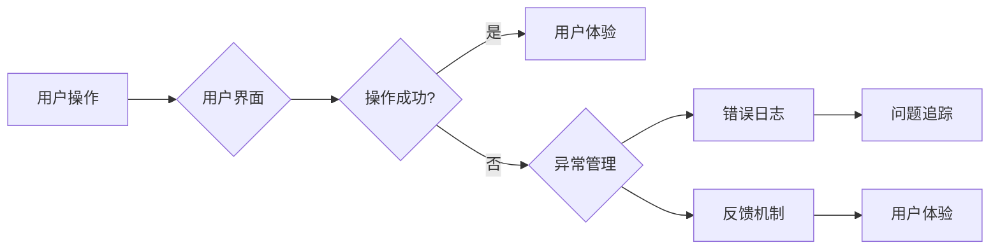

# 错误处理：提供更好的用户体验

> 关键词：错误处理，用户体验，用户界面，异常管理，错误日志，反馈机制，最佳实践

## 1. 背景介绍

在软件开发的任何阶段，错误处理都是一项至关重要的任务。良好的错误处理策略不仅能够确保系统的稳定性和可靠性，还能提升用户的体验。用户界面上的错误处理，尤其是那些能够即时反馈给用户并引导其解决问题的机制，对于提升用户满意度具有不可估量的价值。

### 1.1 问题的由来

随着软件应用的日益复杂化，用户在使用过程中遇到错误的可能性也随之增加。这些错误可能源于软件本身的bug、用户的误操作，或者是外部环境的变动。如果错误处理不当，用户可能会感到沮丧、困惑，甚至对整个软件失去信心。

### 1.2 研究现状

目前，许多软件和Web应用已经意识到错误处理的重要性，并开始采用各种策略来改善用户体验。这些策略包括：

- 提供清晰的错误信息
- 提供恢复或解决问题的步骤
- 设计友好的用户界面元素
- 利用错误日志进行问题追踪
- 实施反馈机制

### 1.3 研究意义

研究如何通过有效的错误处理提升用户体验，对于以下方面具有重要意义：

- 提高用户满意度
- 增强软件的可用性和易用性
- 提升软件的市场竞争力
- 优化软件开发和维护流程

### 1.4 本文结构

本文将围绕错误处理展开，探讨以下内容：

- 核心概念与联系
- 核心算法原理与具体操作步骤
- 数学模型与公式
- 项目实践
- 实际应用场景
- 工具和资源推荐
- 总结与展望

## 2. 核心概念与联系

### 2.1 核心概念

- **错误处理**：识别、记录、响应和处理错误的过程。
- **用户体验**：用户在使用产品或服务时的感受和体验。
- **用户界面**：用户与软件交互的界面，包括图形界面和命令行界面。
- **异常管理**：在软件运行过程中处理异常情况的机制。
- **错误日志**：记录错误信息的日志文件，用于问题追踪和调试。
- **反馈机制**：向用户提供关于错误状态的反馈。

### 2.2 Mermaid 流程图



## 3. 核心算法原理 & 具体操作步骤

### 3.1 算法原理概述

错误处理的核心是能够及时检测到错误，并以用户友好的方式反馈给用户。这通常涉及到以下几个步骤：

1. 错误检测：监控软件运行状态，识别潜在的错误。
2. 错误记录：将错误信息记录到日志文件中，以便后续分析。
3. 错误响应：根据错误类型和严重程度，采取相应的响应措施。
4. 用户反馈：以清晰、直观的方式向用户展示错误信息。

### 3.2 算法步骤详解

1. **错误检测**：通过代码中的try-catch块、操作系统提供的异常处理机制等手段，检测并捕获错误。
2. **错误记录**：使用日志库记录错误详细信息，包括时间戳、错误类型、错误代码等。
3. **错误响应**：根据错误类型和严重程度，提供相应的解决方案，例如重试操作、跳过受影响的部分、显示错误信息等。
4. **用户反馈**：在用户界面上显示错误信息，并提供恢复或解决问题的建议。

### 3.3 算法优缺点

**优点**：

- 提高系统的稳定性
- 增强用户体验
- 便于问题追踪和调试

**缺点**：

- 错误处理逻辑复杂，开发难度大
- 需要维护大量的错误信息和恢复策略

### 3.4 算法应用领域

错误处理在几乎所有软件和Web应用中都有应用，包括但不限于：

- 前端应用：网页应用、桌面应用、移动应用
- 后端应用：服务器端应用、云服务
- 系统软件：操作系统、数据库管理系统

## 4. 数学模型和公式 & 详细讲解 & 举例说明

### 4.1 数学模型构建

在错误处理中，并没有特定的数学模型，因为错误处理更多地依赖于程序逻辑和用户交互。

### 4.2 公式推导过程

同样，由于错误处理不涉及复杂的数学运算，因此没有公式推导过程。

### 4.3 案例分析与讲解

假设我们有一个Web应用，当用户尝试提交表单时，如果输入的数据格式不正确，系统应该给出相应的错误提示。

```python
def submit_form(username, email):
    try:
        # 假设我们有一个函数验证用户名和电子邮件格式
        validate_username(username)
        validate_email(email)
        # 处理表单提交逻辑
        process_submission(username, email)
        return "表单提交成功！"
    except ValueError as e:
        # 返回错误信息
        return str(e)

# 用户输入
username = "user123"
email = "user123"

# 提交表单
result = submit_form(username, email)
print(result)
```

如果用户输入的电子邮件格式不正确，`validate_email` 函数会抛出 `ValueError` 异常，系统会捕获这个异常，并返回错误信息。

## 5. 项目实践：代码实例和详细解释说明

### 5.1 开发环境搭建

由于错误处理是软件开发的通用技能，因此不需要特定的开发环境。

### 5.2 源代码详细实现

以下是一个简单的错误处理示例，展示了如何在Python中实现异常捕获和错误提示。

```python
def divide(a, b):
    try:
        result = a / b
    except ZeroDivisionError:
        print("错误：除数不能为零。")
        return None
    return result

# 测试除法
result = divide(10, 0)
if result is not None:
    print("结果是：", result)
```

### 5.3 代码解读与分析

在上面的代码中，我们定义了一个 `divide` 函数，它尝试执行除法操作。如果除数为零，将抛出 `ZeroDivisionError` 异常。我们使用 `try-except` 块捕获这个异常，并打印出错误信息。如果没有异常发生，函数将返回除法的结果。

### 5.4 运行结果展示

```
错误：除数不能为零。
```

## 6. 实际应用场景

### 6.1 Web应用

在Web应用中，错误处理通常涉及以下方面：

- 显示友好的错误信息
- 提供重试或清除输入的选项
- 记录错误日志以便开发者追踪问题

### 6.2 移动应用

在移动应用中，错误处理可能包括：

- 显示错误对话框
- 提供自动重试功能
- 将错误信息发送给开发者

### 6.3 后端服务

在后端服务中，错误处理可能包括：

- 记录详细的错误日志
- 发送错误通知给管理员
- 提供错误重试机制

## 7. 工具和资源推荐

### 7.1 学习资源推荐

- 《Python错误处理》
- 《JavaScript错误处理》
- 《现代Web错误处理》

### 7.2 开发工具推荐

- Python的logging库
- JavaScript的console.error
- 错误追踪工具，如Sentry、Bugsnag

### 7.3 相关论文推荐

- 《Error Handling in Complex Systems》
- 《Practical User Interface Design: Principles and Techniques for Effective Interaction Design》

## 8. 总结：未来发展趋势与挑战

### 8.1 研究成果总结

本文探讨了错误处理在提升用户体验方面的作用，并介绍了相关的核心概念、算法原理和应用场景。

### 8.2 未来发展趋势

- 错误处理将更加智能化，能够自动识别和修复一些简单的错误。
- 错误信息将更加个性化，根据用户的行为和偏好提供相应的反馈。
- 错误处理将与机器学习技术相结合，以预测和预防潜在的错误。

### 8.3 面临的挑战

- 在多平台和多设备环境下，错误处理策略需要更加灵活和可扩展。
- 随着人工智能技术的发展，错误处理系统需要能够处理更加复杂的错误类型。
- 保护用户隐私和数据安全是错误处理过程中需要考虑的重要问题。

### 8.4 研究展望

未来，错误处理研究将更加注重以下几个方面：

- 开发更加智能化的错误处理系统
- 提升错误处理的用户体验
- 确保错误处理过程中的数据安全

## 9. 附录：常见问题与解答

**Q1：错误处理是否只是技术问题？**

A：错误处理不仅仅是技术问题，它还涉及到用户体验、业务逻辑等多个方面。一个良好的错误处理策略需要综合考虑多种因素。

**Q2：如何设计友好的错误信息？**

A：设计友好的错误信息应该遵循以下原则：

- 简洁明了
- 实用性强
- 避免使用技术术语
- 提供解决方案或建议

**Q3：错误处理系统应该如何与用户交互？**

A：错误处理系统应该：

- 及时向用户反馈错误信息
- 提供恢复或解决问题的选项
- 尊重用户的操作习惯和偏好
- 保护用户的隐私和数据安全

**Q4：如何测试错误处理系统？**

A：测试错误处理系统可以通过以下方法：

- 编写自动化测试用例，模拟各种错误情况
- 手动测试，观察错误处理系统的响应
- 使用性能测试工具，评估错误处理系统的性能

作者：禅与计算机程序设计艺术 / Zen and the Art of Computer Programming