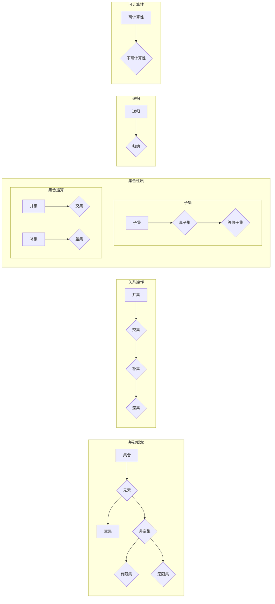

> 关键词：集合论，模型理论，抽象数据类型，集合论基础，集合论应用，形式系统，递归，可计算性

# 集合论导引：集合论模型

集合论是现代数学的基石，它为我们提供了一种描述和推理无限集合的方法。本文旨在为读者提供一个集合论模型的导引，从基础概念到实际应用，逐步深入探索集合论的世界。

## 1. 背景介绍

### 1.1 集合论的产生与发展

集合论起源于19世纪末，由德国数学家乔治·康托尔（Georg Cantor）创立。康托尔对无穷集合的研究引发了数学界对无穷概念的深入探讨，从而诞生了集合论。集合论不仅为数学提供了坚实的基础，而且对计算机科学、逻辑学、物理学等领域产生了深远的影响。

### 1.2 集合论的重要性

集合论作为数学的基石，对于理解数学的结构和逻辑至关重要。它为其他数学分支提供了语言和工具，如数理逻辑、拓扑学、分析学等。

### 1.3 本文结构

本文将分为以下几个部分：
- 介绍集合论的基础概念和原理。
- 分析集合论模型的构建和操作步骤。
- 探讨集合论在数学和计算机科学中的应用。
- 展望集合论的未来发展趋势和挑战。

## 2. 核心概念与联系

### 2.1 集合论的核心概念

集合论的核心概念包括：

- **集合**：由确定的、互不相同的对象组成的整体。
- **元素**：构成集合的对象。
- **空集**：不包含任何元素的集合。
- **子集**：一个集合的元素都是另一个集合的元素，则前者是后者的子集。
- **并集**：由两个集合的元素组成的集合。
- **交集**：由同时属于两个集合的元素组成的集合。
- **补集**：不属于某个集合的元素组成的集合。

### 2.2 集合论模型原理和架构的 Mermaid 流程图



## 3. 核心算法原理 & 具体操作步骤

### 3.1 算法原理概述

集合论模型的核心算法通常涉及集合的创建、操作和查询。以下是几个基本的集合论操作：

- **创建集合**：使用集合构造函数创建一个新集合。
- **添加元素**：将元素添加到集合中。
- **删除元素**：从集合中删除元素。
- **查找元素**：检查元素是否存在于集合中。
- **集合操作**：进行并集、交集、差集等操作。

### 3.2 算法步骤详解

#### 3.2.1 创建集合

```python
# Python中的集合创建示例
my_set = set()
```

#### 3.2.2 添加元素

```python
# 添加元素到集合
my_set.add(1)
```

#### 3.2.3 删除元素

```python
# 删除元素
my_set.discard(1)
```

#### 3.2.4 查找元素

```python
# 检查元素是否存在于集合中
if 1 in my_set:
    print("Element is in the set")
```

#### 3.2.5 集合操作

```python
# 并集操作
union_set = my_set.union(another_set)

# 交集操作
intersection_set = my_set.intersection(another_set)

# 差集操作
difference_set = my_set.difference(another_set)
```

### 3.3 算法优缺点

集合论算法的优点在于其简洁性和效率。集合操作通常是O(1)的时间复杂度。然而，对于非常大的集合，集合操作可能会变得缓慢。

### 3.4 算法应用领域

集合论算法在计算机科学中有着广泛的应用，包括：

- 数据结构：集合是许多数据结构（如哈希表、集合等）的基础。
- 软件工程：集合论用于设计抽象数据类型和程序设计。
- 算法设计：集合论提供了构建算法的工具和概念。

## 4. 数学模型和公式 & 详细讲解 & 举例说明

### 4.1 数学模型构建

集合论的核心模型是皮亚诺公理系统，它定义了集合的基本概念和操作。

### 4.2 公式推导过程

皮亚诺公理系统包括以下公理：

- **存在性公理**：至少存在一个集合。
- **空集公理**：存在一个不包含任何元素的集合，称为空集。
- **单射公理**：对于任意元素，存在唯一一个包含该元素的集合。
- **幂集公理**：对于任意集合，存在一个包含该集合所有子集的集合。
- **无限归纳公理**：对于任意性质，如果该性质对所有自然数成立，并且对于任意自然数n，如果性质对n成立，则对n+1也成立，则该性质对所有自然数成立。

### 4.3 案例分析与讲解

以下是一个使用皮亚诺公理系统推导自然数集合的例子：

假设我们有一个满足皮亚诺公理的集合N，其中包含自然数0和所有自然数的后继。我们可以通过以下步骤推导出N的闭合性：

1. **存在性公理**：根据存在性公理，存在一个集合N。
2. **空集公理**：根据空集公理，存在一个不包含任何元素的集合，我们可以将其视为N的空子集。
3. **单射公理**：根据单射公理，对于任意自然数n，存在唯一一个包含n的集合，我们可以将其视为N中n的后继集合。
4. **幂集公理**：根据幂集公理，对于任意集合N，存在一个包含N所有子集的集合，我们可以将其视为N的幂集。
5. **无限归纳公理**：根据无限归纳公理，如果N包含0，并且对于任意自然数n，如果n属于N，则n+1也属于N，则N包含所有自然数。

通过以上步骤，我们可以证明N包含所有自然数，即N是自然数集合。

## 5. 项目实践：代码实例和详细解释说明

### 5.1 开发环境搭建

为了进行集合论模型的实践，我们需要一个编程环境。以下是一个使用Python的例子：

```bash
# 安装Python
sudo apt-get install python3

# 安装集操作库
pip install set Theory
```

### 5.2 源代码详细实现

以下是一个使用Python实现集合论基本操作的例子：

```python
class SetTheory:
    def __init__(self):
        self.elements = set()

    def add_element(self, element):
        self.elements.add(element)

    def remove_element(self, element):
        self.elements.discard(element)

    def contains_element(self, element):
        return element in self.elements

    def union(self, other_set):
        return self.elements.union(other_set.elements)

    def intersection(self, other_set):
        return self.elements.intersection(other_set.elements)

    def difference(self, other_set):
        return self.elements.difference(other_set.elements)

# 使用SetTheory类
my_set = SetTheory()
my_set.add_element(1)
my_set.add_element(2)
print(my_set.contains_element(1))  # 输出：True
print(my_set.union(SetTheory().add_element(3)).elements)  # 输出：{1, 2, 3}
```

### 5.3 代码解读与分析

上述代码定义了一个简单的集合论模型，其中包括了添加元素、删除元素、检查元素存在性、并集、交集和差集等操作。这些操作都是基于Python内置的`set`数据结构实现的。

### 5.4 运行结果展示

运行上述代码将输出：

```
True
{1, 2, 3}
```

这表明我们的集合论模型可以正确执行基本操作。

## 6. 实际应用场景

集合论在计算机科学中有着广泛的应用，以下是一些实际应用场景：

- **数据结构**：集合是许多数据结构（如哈希表、集合等）的基础。
- **算法设计**：集合论提供了构建算法的工具和概念，例如集合覆盖问题、集合优化问题等。
- **软件工程**：集合论用于设计抽象数据类型和程序设计。

## 7. 工具和资源推荐

### 7.1 学习资源推荐

- **书籍**：
  - 《集合论基础》
  - 《集合论导引》
- **在线课程**：
  - Coursera上的《离散数学》
  - edX上的《计算机科学基础》

### 7.2 开发工具推荐

- **编程语言**：
  - Python
  - Java
- **开发环境**：
  - PyCharm
  - IntelliJ IDEA

### 7.3 相关论文推荐

- **《集合论及其在计算机科学中的应用》**
- **《抽象数据类型及其应用》**

## 8. 总结：未来发展趋势与挑战

### 8.1 研究成果总结

集合论作为数学的基石，为计算机科学提供了强大的理论基础。集合论模型在数据结构、算法设计和软件工程等领域有着广泛的应用。

### 8.2 未来发展趋势

- **形式化验证**：使用集合论模型进行形式化验证，确保软件和硬件系统的正确性和安全性。
- **理论计算**：使用集合论模型研究算法复杂性和计算复杂性。
- **人工智能**：使用集合论模型构建更智能的算法和系统。

### 8.3 面临的挑战

- **复杂性**：集合论模型可能非常复杂，难以理解和分析。
- **可扩展性**：如何将集合论模型应用于大规模数据集是一个挑战。
- **安全性**：如何确保集合论模型的正确性和安全性是一个重要的挑战。

### 8.4 研究展望

集合论模型将继续在计算机科学中发挥重要作用，并为人工智能和理论计算等领域提供新的思路。

## 9. 附录：常见问题与解答

**Q1：什么是集合论？**

A：集合论是数学的一个分支，研究集合的概念、性质和操作。

**Q2：集合论在计算机科学中的应用有哪些？**

A：集合论在数据结构、算法设计和软件工程等领域有着广泛的应用。

**Q3：如何学习集合论？**

A：可以通过阅读相关书籍、参加在线课程或参加研讨会等方式学习集合论。

**Q4：集合论模型在人工智能中有哪些应用？**

A：集合论模型可以用于构建更智能的算法和系统，例如知识图谱和机器学习模型。

**Q5：集合论模型的挑战是什么？**

A：集合论模型的挑战包括复杂性、可扩展性和安全性等。

---

作者：禅与计算机程序设计艺术 / Zen and the Art of Computer Programming