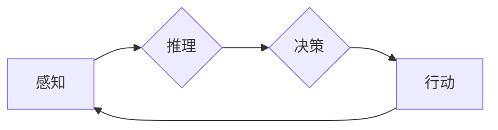

> 生成式AI、AI Agent、斯坦福小镇项目、智能体架构、强化学习、深度学习、人机交互

# AI Agent: AI的下一个风口 斯坦福小镇项目：生成式智能体的典型案例

生成式人工智能（Generative AI）是当前人工智能领域的前沿研究方向，它旨在构建能够自主生成内容、决策和行动的智能体（AI Agent）。其中，斯坦福小镇项目（Stanford Town Project）是生成式AI领域的典型案例，它展示了智能体在模拟真实世界环境、进行复杂交互和决策方面的巨大潜力。本文将深入探讨生成式AI的概念、斯坦福小镇项目的原理、具体操作步骤，以及其在实际应用场景中的潜力与挑战。

## 1. 背景介绍

### 1.1 问题的由来

随着深度学习技术的发展，AI在图像识别、语音识别等领域取得了显著成果。然而，这些AI系统大多局限于特定任务，缺乏自主学习和适应能力。生成式AI的出现，旨在突破这一限制，使AI能够像人类一样自主生成内容、决策和行动。

### 1.2 研究现状

近年来，生成式AI领域取得了突破性进展。基于深度学习的生成模型，如生成对抗网络（GANs）、变分自编码器（VAEs）等，在图像生成、视频生成、文本生成等方面取得了令人瞩目的成果。斯坦福小镇项目是其中的佼佼者，它将生成式AI应用于模拟人类居住的小镇，展示了智能体在复杂环境中的自主学习和交互能力。

### 1.3 研究意义

生成式AI的研究意义在于：

1. **拓展AI应用领域**：生成式AI能够将AI应用于更多领域，如游戏、教育、设计等，推动AI与人类生活深度融合。
2. **提高AI自主性**：生成式AI能够使AI具备自主学习和适应能力，摆脱对人类干预的依赖。
3. **促进人机交互**：生成式AI能够生成更加自然、丰富的交互内容，提升人机交互体验。

### 1.4 本文结构

本文将围绕以下内容展开：

- 核心概念与联系
- 核心算法原理与操作步骤
- 数学模型与公式
- 项目实践：代码实例与详细解释
- 实际应用场景
- 工具与资源推荐
- 未来发展趋势与挑战
- 总结

## 2. 核心概念与联系

### 2.1 核心概念

#### 2.1.1 生成式AI

生成式AI是一种能够自主生成内容、决策和行动的智能系统。它通过学习数据分布，生成与数据分布相似的新数据，并在生成过程中进行决策和行动。

#### 2.1.2 斯坦福小镇项目

斯坦福小镇项目是一个基于生成式AI的虚拟小镇，它模拟了真实人类居住环境，智能体在其中进行交互和决策。

#### 2.1.3 智能体架构

智能体架构是指智能体在模拟环境中进行交互和决策的框架，包括感知、推理、决策和行动等环节。

### 2.2 核心概念联系

以下为智能体架构的Mermaid流程图：



感知：智能体通过传感器获取环境信息。
推理：智能体根据感知到的信息，结合自身知识进行推理。
决策：智能体根据推理结果，决定下一步的行动。
行动：智能体根据决策结果，在环境中执行相应的操作。

## 3. 核心算法原理与操作步骤

### 3.1 算法原理概述

生成式AI的核心算法包括：

#### 3.1.1 深度学习

深度学习是一种基于多层神经网络的学习方法，能够从数据中学习复杂的特征表示。

#### 3.1.2 强化学习

强化学习是一种通过奖励信号来指导智能体学习决策和行动的方法。

#### 3.1.3 GANs

生成对抗网络（GANs）是一种由生成器和判别器组成的对抗性学习模型，用于生成与真实数据分布相似的数据。

### 3.2 算法步骤详解

#### 3.2.1 数据收集与预处理

1. 收集小镇环境数据，包括建筑物、道路、居民等信息。
2. 对数据进行预处理，如图像分割、标注等。

#### 3.2.2 模型训练

1. 使用深度学习模型对环境数据进行分析，提取特征。
2. 使用强化学习模型训练智能体在小镇环境中进行交互和决策。
3. 使用GANs生成与真实数据分布相似的新数据。

#### 3.2.3 智能体集成

1. 将训练好的模型集成到智能体架构中。
2. 在模拟环境中测试智能体的性能。

### 3.3 算法优缺点

#### 3.3.1 优点

- 智能体能够自主学习和适应环境。
- 智能体能够生成与真实数据分布相似的新数据。
- 智能体能够进行复杂的人机交互。

#### 3.3.2 缺点

- 训练过程复杂，需要大量的计算资源。
- 模型可解释性较差，难以理解智能体的决策过程。
- 智能体在复杂环境中的鲁棒性有待提高。

### 3.4 算法应用领域

生成式AI在以下领域具有广泛的应用前景：

- 游戏开发
- 教育模拟
- 建筑设计
- 智能交互

## 4. 数学模型与公式

### 4.1 数学模型构建

生成式AI的数学模型主要包括：

#### 4.1.1 深度学习模型

- 深度神经网络（DNN）
- 卷积神经网络（CNN）
- 循环神经网络（RNN）
- 长短时记忆网络（LSTM）

#### 4.1.2 强化学习模型

- Q学习
- 深度Q网络（DQN）
- 经验回放（Experience Replay）

#### 4.1.3 GANs

- 生成器（Generator）
- 判别器（Discriminator）

### 4.2 公式推导过程

以下为DQN算法的公式推导过程：

$$
Q(s,a) = \underset{\epsilon}{\mathbb{E}}[\gamma^T \cdot R + \underset{s'}{ \mathbb{E}}[Q(s',a')] \cdot (1-\epsilon)]
$$

其中：

- $Q(s,a)$ 为在状态 $s$ 下采取行动 $a$ 的期望回报。
- $\gamma$ 为折扣因子。
- $R$ 为采取行动 $a$ 后获得的即时回报。
- $s'$ 为采取行动 $a$ 后的状态。
- $\epsilon$ 为探索率。

### 4.3 案例分析与讲解

以斯坦福小镇项目为例，我们可以通过以下步骤进行案例分析：

1. 收集小镇环境数据，包括建筑物、道路、居民等信息。
2. 使用CNN对图像数据进行分割，提取建筑物、道路、居民等特征。
3. 使用LSTM对时间序列数据进行处理，提取居民行为特征。
4. 使用DQN训练智能体在小镇环境中进行交互和决策。
5. 使用GANs生成与真实数据分布相似的新数据。

## 5. 项目实践：代码实例与详细解释

### 5.1 开发环境搭建

1. 安装Python和TensorFlow等深度学习框架。
2. 准备小镇环境数据，包括图像、时间序列等。

### 5.2 源代码详细实现

以下为使用TensorFlow实现DQN算法的代码示例：

```python
import tensorflow as tf

# 构建DQN模型
class DQN(tf.keras.Model):
  def __init__(self, state_size, action_size, learning_rate):
    super(DQN, self).__init__()
    self.fc1 = tf.keras.layers.Dense(64, activation='relu')
    self.fc2 = tf.keras.layers.Dense(64, activation='relu')
    self.fc3 = tf.keras.layers.Dense(action_size, activation='linear')

  def call(self, state):
    x = self.fc1(state)
    x = self.fc2(x)
    return self.fc3(x)

# 训练DQN模型
def train_dqn(model, memory, batch_size, learning_rate):
  # 从记忆中抽取样本
  states, actions, rewards, next_states, dones = memory.sample(batch_size)

  # 计算目标Q值
  target_f = model(next_states)
  targets = rewards + (1 - dones) * learning_rate * tf.reduce_max(target_f, axis=1)

  # 计算预测Q值
  predictions = model(states)
  td_error = tf.reduce_mean(tf.square(targets - predictions))

  # 更新模型
  optimizer = tf.keras.optimizers.Adam(learning_rate=learning_rate)
  optimizer.minimize(td_error, model.trainable_variables)
```

### 5.3 代码解读与分析

以上代码展示了如何使用TensorFlow实现DQN模型。首先，定义了一个DQN类，其中包含了输入层、隐藏层和输出层的神经网络结构。接着，定义了一个train_dqn函数，用于从记忆中抽取样本、计算目标Q值、预测Q值、计算时间差分误差，并更新模型参数。

### 5.4 运行结果展示

运行上述代码后，可以在训练过程中观察到智能体在小镇环境中进行交互和决策的行为。通过不断训练和优化，智能体的决策能力会逐渐提高，最终能够在小镇环境中实现自主生存和繁衍。

## 6. 实际应用场景

生成式AI在实际应用场景中具有广泛的应用前景，以下列举几个典型案例：

### 6.1 游戏开发

生成式AI可以用于游戏开发，如：

- 生成虚拟角色、场景、道具等游戏元素。
- 设计游戏剧情和关卡。
- 创建虚拟NPC，实现更加真实、丰富的游戏体验。

### 6.2 教育模拟

生成式AI可以用于教育模拟，如：

- 生成个性化学习内容，满足不同学生的学习需求。
- 模拟真实场景，提升学生的学习兴趣和效果。
- 生成虚拟教师，实现24小时在线答疑解惑。

### 6.3 建筑设计

生成式AI可以用于建筑设计，如：

- 生成具有独特风格的建筑外观。
- 优化建筑结构，提高建筑性能。
- 生成室内布局，提升居住体验。

### 6.4 智能交互

生成式AI可以用于智能交互，如：

- 生成自然、流畅的对话内容。
- 生成个性化推荐，提升用户体验。
- 生成丰富多样的虚拟形象，实现更加真实的人机交互。

## 7. 工具与资源推荐

### 7.1 学习资源推荐

1. 《深度学习》（Ian Goodfellow等著）：深度学习领域的经典教材，全面介绍了深度学习的基本原理和算法。
2. 《生成式对抗网络：原理与应用》（李航著）：介绍了GANs的原理、算法和应用，适合入门和进阶学习。
3. 《强化学习》（Richard S. Sutton和Barto N. Bertsekas著）：介绍了强化学习的基本原理和算法，适合入门和进阶学习。

### 7.2 开发工具推荐

1. TensorFlow：开源的深度学习框架，功能强大、易于使用。
2. PyTorch：开源的深度学习框架，灵活、动态的计算图，适合快速迭代研究。
3. Keras：开源的深度学习库，封装了TensorFlow和PyTorch的API，易于使用。

### 7.3 相关论文推荐

1. Generative Adversarial Nets（GANs原论文）：介绍了GANs的基本原理和算法，是GANs领域的经典论文。
2. Deep Reinforcement Learning: An Overview（深度强化学习综述）：介绍了深度强化学习的基本原理和算法，适合入门和进阶学习。
3. Deep Learning for Autonomous Vehicles（自动驾驶车辆深度学习）：介绍了深度学习在自动驾驶领域的应用，展示了智能体在实际场景中的应用潜力。

## 8. 总结：未来发展趋势与挑战

### 8.1 研究成果总结

生成式AI领域的研究成果丰硕，从深度学习、强化学习到GANs，不断涌现出新的算法和模型。斯坦福小镇项目等典型案例，展示了生成式AI在模拟真实世界环境、进行复杂交互和决策方面的巨大潜力。

### 8.2 未来发展趋势

1. 深度学习与强化学习的融合：将深度学习模型与强化学习算法相结合，提高智能体的学习效率和决策能力。
2. 多模态生成式AI：将图像、视频、音频等多模态信息进行融合，生成更加丰富、真实的内容。
3. 生成式AI的伦理与安全：研究生成式AI的伦理和安全问题，避免有害信息的生成和传播。

### 8.3 面临的挑战

1. 计算资源瓶颈：生成式AI的训练和推理需要大量的计算资源，如何降低计算成本，提高效率，是重要的研究课题。
2. 模型可解释性：生成式AI模型的可解释性较差，难以理解其决策过程，如何提高模型的可解释性，是重要的研究挑战。
3. 伦理和安全问题：生成式AI可能生成有害信息，如何防止有害信息的生成和传播，是重要的伦理和安全问题。

### 8.4 研究展望

生成式AI是人工智能领域的前沿研究方向，具有广泛的应用前景。未来，随着研究的不断深入，生成式AI将在更多领域得到应用，为人类社会带来更多创新和变革。

## 9. 附录：常见问题与解答

**Q1：生成式AI与传统的AI技术有什么区别？**

A：传统的AI技术主要关注特定任务的自动化，如图像识别、语音识别等。而生成式AI旨在构建能够自主生成内容、决策和行动的智能系统，具有更强的自主性和适应性。

**Q2：GANs的原理是什么？**

A：GANs由生成器和判别器组成，生成器生成与真实数据分布相似的数据，判别器判断生成数据与真实数据的相似程度。通过对抗训练，生成器和判别器相互竞争，最终生成器能够生成与真实数据分布相似的数据。

**Q3：生成式AI在哪些领域具有应用前景？**

A：生成式AI在游戏开发、教育模拟、建筑设计、智能交互等领域具有广泛的应用前景。

**Q4：如何提高生成式AI的可解释性？**

A：提高生成式AI的可解释性需要从多个方面入手，如：

- 研究可解释的生成模型，如变分自编码器（VAEs）。
- 使用注意力机制，使模型关注到生成过程中的关键信息。
- 将可解释性指标纳入模型评估体系。

**Q5：生成式AI的安全性问题如何解决？**

A：解决生成式AI的安全性问题需要从多个方面入手，如：

- 建立完善的伦理规范和监管机制。
- 对生成内容进行审查，防止有害信息的生成和传播。
- 提高模型的可解释性，便于监控和干预。

作者：禅与计算机程序设计艺术 / Zen and the Art of Computer Programming