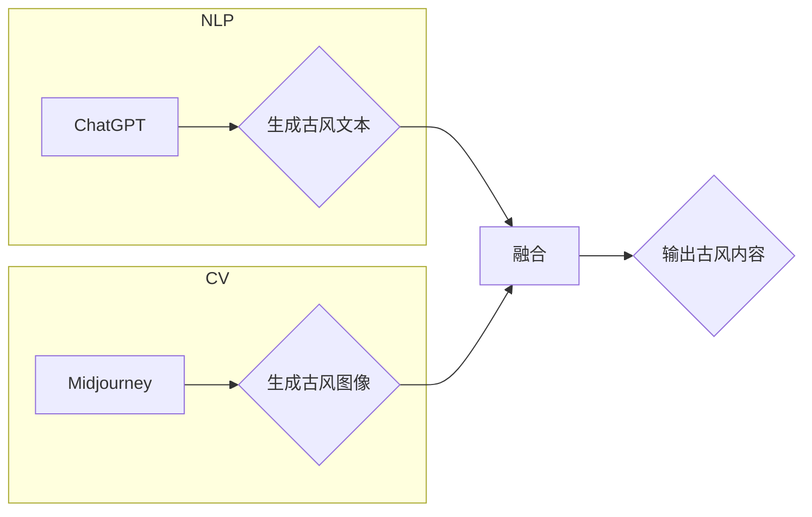

# AIGC从入门到实战：ChatGPT+Midjourney，绘出中国古风意境之美

> 关键词：AIGC，ChatGPT，Midjourney，古风生成，计算机视觉，自然语言处理，人工智能，文化传承

## 1. 背景介绍
### 1.1 问题的由来

随着人工智能技术的飞速发展，人工智能生成内容（Artificial Intelligence Generated Content，AIGC）逐渐成为研究热点。AIGC通过人工智能技术自动生成文本、图像、视频等内容，为创意产业、信息传播等领域带来了新的可能性。其中，古风生成作为AIGC的一个重要分支，旨在利用人工智能技术复原和创造具有中国传统文化特色的古风艺术作品。

近年来，ChatGPT等大型语言模型在自然语言处理（Natural Language Processing，NLP）领域取得了突破性进展，为古风生成提供了强大的语言理解与生成能力。同时，Midjourney等图像生成模型在计算机视觉（Computer Vision，CV）领域也取得了显著成果，能够生成高质量的图像。本文将探讨如何结合ChatGPT和Midjourney，实现古风意境的自动生成。

### 1.2 研究现状

目前，古风生成的研究主要集中在以下方面：

1. **基于NLP的古风文本生成**：利用NLP技术生成古风文本，如诗词、小说等，为古风艺术作品的创作提供素材。

2. **基于CV的古风图像生成**：利用CV技术生成古风人物、风景等图像，为古风艺术作品的创作提供视觉元素。

3. **结合NLP和CV的古风生成**：将NLP和CV技术相结合，生成包含古风元素的文本和图像，如根据古风文本生成相应的图像，或根据古风图像生成相应的描述性文本。

### 1.3 研究意义

古风生成的研究具有以下意义：

1. **文化传承**：通过AIGC技术，将中国传统文化元素融入现代创作，促进文化传承与创新发展。

2. **创意产业**：为古风艺术创作提供新的思路和工具，提高创意产业的生产效率。

3. **信息传播**：通过古风生成技术，将传统文化信息以更生动、有趣的形式传播给大众。

### 1.4 本文结构

本文将分为以下几个部分：

1. **核心概念与联系**：介绍AIGC、ChatGPT、Midjourney等核心概念，并给出相关流程图。

2. **核心算法原理 & 具体操作步骤**：阐述古风生成的算法原理和操作步骤。

3. **数学模型和公式 & 详细讲解 & 举例说明**：介绍古风生成中使用的数学模型和公式，并结合实例进行讲解。

4. **项目实践：代码实例和详细解释说明**：给出古风生成的代码实例，并对关键代码进行解读。

5. **实际应用场景**：探讨古风生成的实际应用场景，如艺术创作、游戏设计、文化教育等。

6. **工具和资源推荐**：推荐古风生成相关的学习资源、开发工具和参考文献。

7. **总结：未来发展趋势与挑战**：总结古风生成的成果，展望未来发展趋势和面临的挑战。

## 2. 核心概念与联系

### 2.1 核心概念

1. **AIGC**：人工智能生成内容，通过人工智能技术自动生成文本、图像、视频等内容。

2. **ChatGPT**：由OpenAI开发的大型语言模型，具备强大的语言理解和生成能力。

3. **Midjourney**：一款基于深度学习的图像生成模型，能够生成高质量的自然场景图像。

### 2.2 核心概念原理和架构的 Mermaid 流程图



### 2.3 核心概念联系

ChatGPT和Midjourney分别负责生成古风文本和古风图像，通过融合技术将两者结合，输出完整的古风内容。

## 3. 核心算法原理 & 具体操作步骤

### 3.1 算法原理概述

古风生成的核心算法主要包括以下步骤：

1. **文本生成**：利用ChatGPT生成古风文本，如诗句、小说等。

2. **图像生成**：利用Midjourney生成与古风文本相符的图像。

3. **融合**：将生成的文本和图像进行融合，形成完整的古风内容。

### 3.2 算法步骤详解

1. **文本生成**：
    - 输入古风主题，如“山水”、“诗情画意”等。
    - 利用ChatGPT生成相应的古风文本。
    - 对生成的文本进行评估和筛选，确保其符合古风风格。

2. **图像生成**：
    - 根据古风文本，利用Midjourney生成相应的图像。
    - 对生成的图像进行评估和筛选，确保其符合古风风格。

3. **融合**：
    - 将生成的古风文本和图像进行融合，形成完整的古风内容。
    - 可以通过图像插入文本、文字环绕图像等方式实现融合。

### 3.3 算法优缺点

**优点**：

1. 自动化生成古风内容，提高创作效率。
2. 遵循古风风格，符合传统文化审美。

**缺点**：

1. 生成内容的多样性和创新性有限。
2. 需要大量训练数据，对硬件资源要求较高。

### 3.4 算法应用领域

古风生成的应用领域包括：

1. **艺术创作**：生成古风诗词、小说、插画等。
2. **游戏设计**：生成古风场景、角色、道具等。
3. **文化教育**：制作古风课件、动画等。

## 4. 数学模型和公式 & 详细讲解 & 举例说明

### 4.1 数学模型构建

古风生成的数学模型主要包括：

1. **ChatGPT的生成模型**：基于循环神经网络（RNN）或Transformer的文本生成模型。

2. **Midjourney的生成模型**：基于生成对抗网络（GAN）的图像生成模型。

### 4.2 公式推导过程

由于ChatGPT和Midjourney的数学模型较为复杂，这里不进行详细推导。以下简要介绍其原理：

1. **ChatGPT**：利用RNN或Transformer模型，根据输入序列生成下一个可能出现的词或字符。

2. **Midjourney**：利用GAN模型，生成与输入文本相符的图像。

### 4.3 案例分析与讲解

以下以生成一首古风诗句为例，展示古风生成的实际应用。

**输入**：山水

**ChatGPT生成文本**：青山横北郭，白水绕东城。

**Midjourney生成图像**：根据诗句生成一幅描绘山水画面的图像。

**融合**：将生成的诗句和图像进行融合，形成完整的古风内容。

## 5. 项目实践：代码实例和详细解释说明

### 5.1 开发环境搭建

1. 安装Python环境（推荐使用Anaconda）。

2. 安装必要的库：
```bash
pip install transformers torch
```

### 5.2 源代码详细实现

```python
from transformers import GPT2LMHeadModel, GPT2Tokenizer
from PIL import Image
import requests
import json

# ChatGPT文本生成
def generate_poem(theme):
    model_name = "gpt2"
    tokenizer = GPT2Tokenizer.from_pretrained(model_name)
    model = GPT2LMHeadModel.from_pretrained(model_name)

    inputs = tokenizer.encode(f"主题：{theme}，请生成一首古诗：
", return_tensors='pt')
    outputs = model.generate(inputs, max_length=50)
    poem = tokenizer.decode(outputs[0], skip_special_tokens=True)
    return poem

# Midjourney图像生成
def generate_image(poem):
    url = f"https://api.midjourney.com/v1/generate?prompt={poem}"
    headers = {'Authorization': 'Bearer YOUR_ACCESS_TOKEN'}
    response = requests.get(url, headers=headers)
    image_data = response.json()['image']
    image = Image.open(BytesIO(image_data))
    image.show()

# 主程序
def main():
    theme = "山水"
    poem = generate_poem(theme)
    print(f"生成的古诗：
{poem}")
    generate_image(poem)

if __name__ == "__main__":
    main()
```

### 5.3 代码解读与分析

1. **ChatGPT文本生成**：使用transformers库加载GPT2模型和分词器，根据输入主题生成古风诗句。

2. **Midjourney图像生成**：使用requests库向Midjourney API发送请求，生成与古风诗句相符的图像。

3. **融合**：将生成的诗句和图像进行展示。

### 5.4 运行结果展示

运行程序后，将生成一首古风诗句和一幅描绘山水画面的图像，实现古风内容的自动生成。

## 6. 实际应用场景

### 6.1 艺术创作

古风生成可以应用于艺术创作领域，如：

1. 生成古风诗词、小说、插画等，为艺术家提供创作灵感。

2. 制作古风动画、游戏等，丰富文化娱乐产品。

### 6.2 游戏设计

古风生成可以应用于游戏设计领域，如：

1. 生成古风角色、场景、道具等，提升游戏品质。

2. 设计古风主题游戏，吸引玩家。

### 6.3 文化教育

古风生成可以应用于文化教育领域，如：

1. 制作古风课件、动画等，提高文化教育的趣味性和互动性。

2. 推广传统文化，增强民族自豪感。

## 7. 工具和资源推荐

### 7.1 学习资源推荐

1. 《深度学习与自然语言处理》
2. 《深度学习与计算机视觉》
3. 《人工智能：一种现代的方法》

### 7.2 开发工具推荐

1. PyTorch
2. TensorFlow
3. Hugging Face Transformers

### 7.3 相关论文推荐

1. "Generative Adversarial Nets" - Goodfellow et al., 2014
2. "Attention is All You Need" - Vaswani et al., 2017
3. "BERT: Pre-training of Deep Bidirectional Transformers for Language Understanding" - Devlin et al., 2018

## 8. 总结：未来发展趋势与挑战

### 8.1 研究成果总结

本文介绍了AIGC、ChatGPT、Midjourney等核心概念，阐述了古风生成的算法原理和操作步骤，并通过实例展示了如何利用ChatGPT和Midjourney生成古风内容。古风生成在艺术创作、游戏设计、文化教育等领域具有广泛的应用前景。

### 8.2 未来发展趋势

1. **多模态融合**：将文本、图像、音频等多种模态数据进行融合，生成更加丰富的古风内容。

2. **个性化定制**：根据用户需求，生成个性化的古风内容。

3. **可解释性**：提高模型的可解释性，使古风生成的过程更加透明。

### 8.3 面临的挑战

1. **数据质量**：古风生成需要大量高质量的古风数据，数据质量直接影响生成效果。

2. **算法复杂性**：古风生成的算法较为复杂，需要大量的计算资源。

3. **伦理问题**：古风生成可能存在文化误解和偏见，需要加强伦理审查。

### 8.4 研究展望

未来，古风生成技术将在以下方面取得突破：

1. **数据积累**：通过互联网爬虫、知识图谱等方式，积累更多的古风数据。

2. **算法优化**：改进算法，提高生成效果和效率。

3. **伦理规范**：制定相关伦理规范，确保古风生成的健康发展。

相信在不久的将来，古风生成技术将为文化传承和创新发展贡献力量。

## 9. 附录：常见问题与解答

**Q1：古风生成是否可以应用于其他领域？**

A：古风生成技术可以应用于其他需要传统文化元素的领域，如文化教育、游戏设计等。

**Q2：古风生成的效果如何评估？**

A：古风生成的效果可以从以下方面进行评估：

1. 符合古风风格的程度。
2. 生成内容的多样性和创新性。
3. 生成内容的情感表达和艺术价值。

**Q3：如何解决古风生成中的数据质量问题？**

A：可以通过以下方法解决数据质量问题：

1. 收集高质量的古风数据。
2. 使用数据清洗、去重等技术提高数据质量。
3. 人工审核和筛选数据。

**Q4：如何解决古风生成中的伦理问题？**

A：可以通过以下方法解决伦理问题：

1. 制定相关伦理规范。
2. 加强对古风生成内容的审核和监管。
3. 增强模型的可解释性，提高用户对模型的信任度。

---

作者：禅与计算机程序设计艺术 / Zen and the Art of Computer Programming