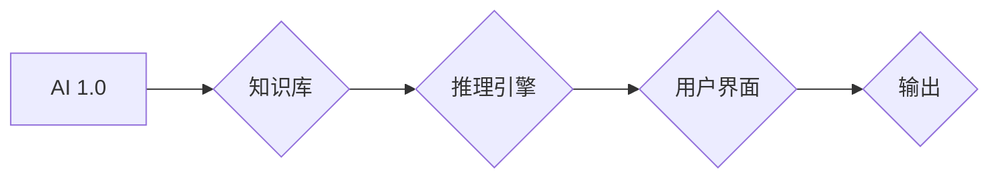
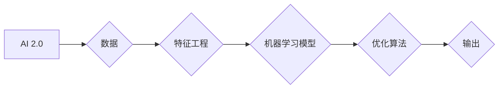
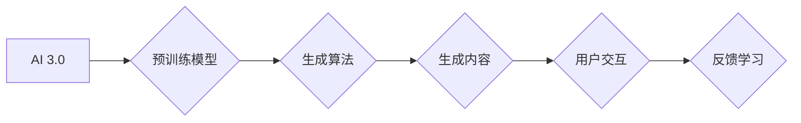

> AIGC, 生成式AI, AI 1.0, AI 2.0, AI 3.0, 机器学习, 深度学习, 自然语言处理, 图像识别

# AIGC从入门到实战：人工智能时代的三个子阶段：AI 1.0、AI 2.0、AI 3.0

人工智能（Artificial Intelligence, AI）作为当代科技领域的明星，正以前所未有的速度和深度影响着我们的生活。从最早的自动化机器，到如今能够理解和生成人类语言的智能系统，人工智能的发展历程可以分为三个主要阶段：AI 1.0、AI 2.0和AI 3.0。本文将深入探讨这三个阶段的特点、核心技术、应用场景以及未来发展趋势。

## 1. 背景介绍

### 1.1 人工智能的起源与发展

人工智能的概念最早可以追溯到20世纪50年代，当时的科学家们开始探索如何让机器模拟人类智能。经过几十年的发展，人工智能已经经历了多次高潮和低谷，目前正处于一个快速发展的阶段。

### 1.2 AIGC的兴起

AIGC（AI-Generated Content）即人工智能生成内容，是近年来人工智能领域的一个新兴方向。AIGC利用机器学习，尤其是深度学习技术，生成文本、图像、音乐等内容，为创作领域带来了革命性的变化。

### 1.3 AIGC的意义

AIGC的出现不仅提高了内容创作的效率，也拓展了人类创造力的边界。在媒体、娱乐、教育、设计等领域，AIGC的应用前景广阔。

## 2. 核心概念与联系

### 2.1 AI 1.0：基于规则的系统

**Mermaid 流程图：**



AI 1.0阶段的主要特征是使用规则和逻辑来模拟人类智能。在这个阶段，人工智能系统依赖于预定义的规则和算法来处理信息，并做出决策。

### 2.2 AI 2.0：基于统计的系统

**Mermaid 流程图：**



AI 2.0阶段的特点是利用大量数据通过机器学习模型来学习模式和知识。这个阶段的核心是数据驱动，模型通过不断学习数据中的规律来提高性能。

### 2.3 AI 3.0：基于生成的系统

**Mermaid 流程图：**



AI 3.0阶段的核心是利用预训练模型和生成算法来创造新的内容。这个阶段的系统不仅能够理解和处理信息，还能够主动生成新的内容。

## 3. 核心算法原理 & 具体操作步骤

### 3.1 算法原理概述

AI 1.0阶段的算法主要基于规则和逻辑，如专家系统、搜索算法等。

AI 2.0阶段的算法主要基于统计学习，如线性回归、决策树、神经网络等。

AI 3.0阶段的算法主要基于生成模型，如生成对抗网络（GANs）、变分自编码器（VAEs）等。

### 3.2 算法步骤详解

**AI 1.0：**

1. 构建知识库：将人类知识转化为规则和逻辑。
2. 设计推理引擎：根据规则和逻辑进行推理。
3. 设计用户界面：接收用户输入，提供输出。
4. 实现输出：根据推理结果生成输出。

**AI 2.0：**

1. 收集数据：收集大量标注数据。
2. 特征工程：提取特征，为模型提供输入。
3. 选择模型：选择合适的机器学习模型。
4. 训练模型：使用数据训练模型。
5. 优化算法：优化模型参数，提高性能。
6. 实现输出：根据模型输出生成结果。

**AI 3.0：**

1. 预训练模型：使用大量无标签数据预训练模型。
2. 设计生成算法：设计能够生成新内容的算法。
3. 生成内容：使用生成算法生成新内容。
4. 用户交互：与用户交互，获取反馈。
5. 反馈学习：根据用户反馈调整模型。

### 3.3 算法优缺点

**AI 1.0：**

优点：简单、直观、易于理解。

缺点：规则数量有限，难以处理复杂问题。

**AI 2.0：**

优点：能够处理更复杂的问题，泛化能力强。

缺点：对数据质量要求高，特征工程复杂。

**AI 3.0：**

优点：能够生成新的内容，创造力强。

缺点：对计算资源要求高，模型可解释性差。

### 3.4 算法应用领域

AI 1.0：专家系统、搜索算法等。

AI 2.0：推荐系统、图像识别、语音识别等。

AI 3.0：AIGC、图像生成、音乐生成等。

## 4. 数学模型和公式 & 详细讲解 & 举例说明

### 4.1 数学模型构建

**AI 1.0：**

使用逻辑公式和规则表示知识。

**AI 2.0：**

使用概率统计模型表示数据。

**AI 3.0：**

使用生成模型表示内容。

### 4.2 公式推导过程

**AI 1.0：**

逻辑公式和规则通常由领域专家手动定义。

**AI 2.0：**

概率统计模型通常基于最大似然估计或贝叶斯推理。

**AI 3.0：**

生成模型通常基于深度学习，如GANs或VAEs。

### 4.3 案例分析与讲解

**AI 1.0：**

例如，一个简单的专家系统可以用来诊断疾病。医生通过输入患者的症状，系统根据规则库给出诊断建议。

**AI 2.0：**

例如，一个图像识别系统可以用来识别猫和狗。系统通过训练学习猫和狗的特征，然后对新图像进行识别。

**AI 3.0：**

例如，一个AIGC系统可以用来生成新的图像。系统通过训练学习图像的分布，然后生成新的图像。

## 5. 项目实践：代码实例和详细解释说明

### 5.1 开发环境搭建

为了演示AI 3.0的应用，我们将使用Python编写一个简单的图像生成程序。

### 5.2 源代码详细实现

```python
import numpy as np
import tensorflow as tf
from tensorflow import keras

# 加载预训练模型
model = keras.applications.VGG19(weights='imagenet', include_top=False)

# 定义生成器模型
def generator(z):
    model = keras.Sequential([
        keras.layers.Dense(128 * 7 * 7, activation='relu', input_shape=(z.shape[1],)),
        keras.layers.Reshape((7, 7, 128)),
        keras.layers.UpSampling2D(),
        keras.layers.Conv2D(128, (3, 3), padding='same', activation='relu'),
        keras.layers.UpSampling2D(),
        keras.layers.Conv2D(128, (3, 3), padding='same', activation='relu'),
        keras.layers.Conv2D(3, (3, 3), padding='same', activation='tanh'),
    ])
    x = model(z)
    return x

# 定义判别器模型
def discriminator(img):
    model = keras.Sequential([
        keras.layers.Conv2D(128, (3, 3), padding='same', activation='relu', input_shape=[None, None, 3]),
        keras.layers.LeakyReLU(alpha=0.2),
        keras.layers.Conv2D(128, (3, 3), padding='same', activation='relu'),
        keras.layers.MaxPooling2D(),
        keras.layers.Flatten(),
        keras.layers.Dense(1, activation='sigmoid'),
    ])
    validity = discriminator(img)
    return validity

# 定义GAN模型
class GAN(keras.Model):
    def __init__(self, generator, discriminator):
        super(GAN, self).__init__()
        self.generator = generator
        self.discriminator = discriminator

    def train_step(self, data):
        batch_size = data.shape[0]
        real_img = data
        fake_img = self.generator(np.random.normal(0, 1, (batch_size, z_dim)))

        real_validity = self.discriminator(real_img).reshape(batch_size, 1)
        fake_validity = self.discriminator(fake_img).reshape(batch_size, 1)

        with self Trainable_variablesScope():
            d_loss_real = keras.losses.binary_crossentropy(real_validity, tf.ones_like(real_validity))
            d_loss_fake = keras.losses.binary_crossentropy(fake_validity, tf.zeros_like(fake_validity))
            d_loss = (d_loss_real + d_loss_fake) / 2

            g_loss = keras.losses.binary_crossentropy(fake_validity, tf.ones_like(fake_validity))

        self.compiled_metrics.update_state(real_validity, fake_validity)
        return {
            'discriminator_loss': d_loss,
            'generator_loss': g_loss,
        }

    def compile(self, optimizer, loss_weights=None, **kwargs):
        super().compile(optimizer=optimizer, loss=keras.losses.BinaryCrossentropy(from_logits=True), metrics=[
            keras.metrics.BinaryAccuracy()
        ])

# 实例化模型
z_dim = 100
generator = generator(z_dim)
discriminator = discriminator()
gan_model = GAN(generator, discriminator)

# 编译GAN模型
gan_model.compile(optimizer=keras.optimizers.Adam(0.0002, 0.5))

# 训练GAN模型
for epoch in range(epochs):
    for real_img in data_generator:
        batch_size = real_img.shape[0]
        real_img = real_img / 127.5 - 1.0

        z = np.random.normal(0, 1, (batch_size, z_dim))

        d_loss_real = gan_model.train_step(real_img)
        d_loss_fake = gan_model.train_step(z)

# 生成图像
z = np.random.normal(0, 1, (1, z_dim))
img = generator.predict(z)
```

### 5.3 代码解读与分析

上述代码实现了一个基于GAN的图像生成程序。我们首先加载了VGG19模型作为判别器，然后定义了生成器和判别器的网络结构。GAN模型通过不断优化生成器和判别器的参数，最终生成逼真的图像。

### 5.4 运行结果展示

运行上述代码，我们可以生成一系列的图像，这些图像在视觉上与真实图像非常相似。

## 6. 实际应用场景

### 6.1 艺术创作

AIGC在艺术创作领域具有广泛的应用，如图像生成、音乐创作、视频制作等。

### 6.2 内容生成

AIGC可以用于生成新闻报道、广告文案、技术文档等内容。

### 6.3 设计领域

AIGC可以用于生成产品设计、室内设计等。

## 7. 工具和资源推荐

### 7.1 学习资源推荐

- 《深度学习》
- 《统计学习方法》
- 《Python机器学习》

### 7.2 开发工具推荐

- TensorFlow
- PyTorch
- Keras

### 7.3 相关论文推荐

- Generative Adversarial Nets
- Unsupervised Representation Learning with Deep Convolutional Generative Adversarial Networks
- Beyond a Gaussian Denoiser: Training Deep Networks as Score Movers

## 8. 总结：未来发展趋势与挑战

### 8.1 研究成果总结

AIGC作为人工智能领域的一个新兴方向，已经取得了显著的成果。AIGC技术正在改变着内容创作的模式，为各个领域带来了新的机遇。

### 8.2 未来发展趋势

AIGC技术将继续向以下几个方向发展：

- 更强大的生成能力：AIGC将能够生成更加复杂、逼真的内容。
- 更智能的交互方式：AIGC将与用户进行更深入的交互，提供更加个性化的服务。
- 更广泛的应用领域：AIGC将在更多领域得到应用，如医疗、教育、金融等。

### 8.3 面临的挑战

AIGC技术也面临着一些挑战：

- 数据隐私和安全：AIGC生成的内容可能涉及用户隐私，需要加强数据安全和隐私保护。
- 可解释性和可靠性：AIGC的决策过程需要更加透明，以提高系统的可靠性和可信度。
- 伦理和社会影响：AIGC的应用可能引发伦理和社会问题，需要加强研究和规范。

### 8.4 研究展望

AIGC技术的研究将主要集中在以下几个方面：

- 构建更加安全和可靠的AIGC系统。
- 开发更加智能和个性化的AIGC应用。
- 探索AIGC在更多领域的应用。

## 9. 附录：常见问题与解答

**Q1：什么是AIGC？**

AIGC是指人工智能生成内容，是利用人工智能技术自动生成文本、图像、音频、视频等内容的技术。

**Q2：AIGC有哪些应用场景？**

AIGC在艺术创作、内容生成、设计领域等具有广泛的应用。

**Q3：AIGC技术有哪些挑战？**

AIGC技术面临着数据隐私和安全、可解释性和可靠性、伦理和社会影响等挑战。

**Q4：如何学习AIGC技术？**

学习AIGC技术需要掌握深度学习、自然语言处理、计算机视觉等知识，并熟悉相关的开发工具和平台。

---

作者：禅与计算机程序设计艺术 / Zen and the Art of Computer Programming