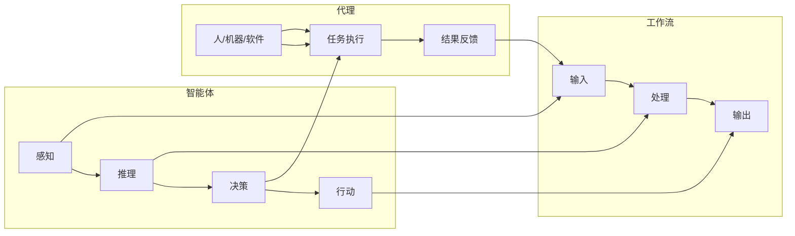

> 人工智能，智能体，工作流，代理，设计，实现，机器学习，深度学习，强化学习

# AI人工智能代理工作流 AI Agent WorkFlow：智能体的设计与实现

智能体（Agent）是人工智能领域一个核心概念，它代表着能够感知环境并采取行动以实现目标的存在。随着人工智能技术的快速发展，智能体在各个领域的应用越来越广泛。本文将深入探讨人工智能代理工作流（AI Agent WorkFlow）的设计与实现，旨在为开发者提供一套完整的智能体构建指南。

## 1. 背景介绍

### 1.1 问题的由来

随着信息技术的飞速发展，数据和计算能力的提升，人工智能技术已经渗透到各个行业。然而，单纯地开发一个个孤立的人工智能应用已经无法满足日益复杂的应用场景。因此，如何构建一个能够协同工作、互相协作的智能体生态系统，成为了当前人工智能领域的一个重要研究方向。

### 1.2 研究现状

目前，智能体工作流的研究主要集中在以下几个方面：

1. 智能体设计：如何设计一个具有感知、推理、决策、行动等能力的智能体。
2. 工作流引擎：如何构建一个能够调度、协调和管理智能体工作流运行的引擎。
3. 通信机制：如何实现智能体之间的信息交换和协同工作。
4. 机器学习与深度学习：如何利用机器学习与深度学习技术提升智能体的智能水平。

### 1.3 研究意义

智能体工作流的研究对于推动人工智能技术的发展和应用具有重要意义：

1. 提高智能体的智能化水平：通过工作流设计，可以使智能体在复杂环境中更好地完成各项任务。
2. 提升系统协同性：通过工作流引擎和通信机制，可以实现智能体之间的协同工作，提高系统的整体性能。
3. 促进人工智能技术的产业化：智能体工作流技术可以应用于各个行业，推动人工智能技术的产业化进程。

### 1.4 本文结构

本文将分为以下几个部分进行阐述：

1. 核心概念与联系：介绍智能体、工作流、代理等核心概念，并使用Mermaid流程图展示其关系。
2. 核心算法原理与具体操作步骤：详细讲解智能体工作流的设计与实现过程。
3. 数学模型与公式：介绍智能体工作流中常用的数学模型与公式，并进行案例分析。
4. 项目实践：给出智能体工作流的代码实例，并进行详细解释。
5. 实际应用场景：探讨智能体工作流在各个领域的应用场景。
6. 工具和资源推荐：推荐智能体工作流相关的学习资源、开发工具和参考文献。
7. 总结：总结研究成果，展望未来发展趋势与挑战。

## 2. 核心概念与联系

### 2.1 核心概念

#### 2.1.1 智能体

智能体是具有感知、推理、决策、行动等能力的人工智能实体。它能够根据环境信息，自主地执行任务，并不断学习和优化自己的行为。

#### 2.1.2 工作流

工作流是一系列有序执行的步骤或活动，用于描述智能体完成任务的过程。它包括输入、处理、输出等环节，以及智能体之间的协作关系。

#### 2.1.3 代理

代理是一种特殊的智能体，它代表实体（如人、组织）执行特定的任务。代理可以是人、机器或软件程序。

### 2.2 Mermaid流程图



从图中可以看出，智能体、工作流和代理三者之间存在着紧密的联系。智能体通过感知环境、推理和决策，最终执行任务并输出结果。工作流描述了智能体完成任务的过程，而代理则代表实体执行任务。

## 3. 核心算法原理与具体操作步骤

### 3.1 算法原理概述

智能体工作流的设计与实现主要涉及以下几个方面：

1. 智能体设计：包括感知器、推理器、决策器和行动器的设计。
2. 工作流引擎：包括任务调度、状态管理、错误处理等功能。
3. 通信机制：包括消息传递、事件监听等功能。
4. 机器学习与深度学习：包括数据收集、模型训练、模型评估等功能。

### 3.2 算法步骤详解

#### 3.2.1 智能体设计

1. 设计感知器：根据任务需求，选择合适的感知器，如摄像头、传感器等。
2. 设计推理器：根据感知到的信息，进行推理和决策。
3. 设计决策器：根据推理结果，选择合适的行动策略。
4. 设计行动器：执行决策器选择的行动策略。

#### 3.2.2 工作流引擎

1. 任务调度：根据工作流定义，将任务分配给相应的智能体。
2. 状态管理：跟踪智能体的执行状态，如执行中、完成、失败等。
3. 错误处理：当智能体执行失败时，进行错误处理和恢复。

#### 3.2.3 通信机制

1. 消息传递：智能体之间通过消息传递进行信息交换。
2. 事件监听：智能体监听特定事件的发生，并做出相应的响应。

#### 3.2.4 机器学习与深度学习

1. 数据收集：收集智能体执行任务过程中的数据。
2. 模型训练：利用收集到的数据，训练机器学习或深度学习模型。
3. 模型评估：评估模型的性能，并根据评估结果调整模型。

### 3.3 算法优缺点

#### 3.3.1 优点

1. 提高智能体智能化水平：通过工作流设计，可以使智能体在复杂环境中更好地完成任务。
2. 提升系统协同性：通过工作流引擎和通信机制，可以实现智能体之间的协同工作，提高系统的整体性能。
3. 便于扩展和维护：工作流设计具有良好的模块化，便于扩展和维护。

#### 3.3.2 缺点

1. 开发成本高：智能体工作流的设计与实现需要较高的技术门槛。
2. 难以适应动态环境：在动态环境下，智能体工作流的调整比较困难。
3. 可扩展性有限：对于复杂任务，智能体工作流的扩展性有限。

### 3.4 算法应用领域

智能体工作流可以应用于各个领域，如：

1. 智能家居：智能家电、智能照明、智能安防等。
2. 智慧城市：交通管理、环境监测、公共安全等。
3. 机器人：服务机器人、工业机器人、无人机等。
4. 金融：风险评估、投资决策、欺诈检测等。

## 4. 数学模型与公式

### 4.1 数学模型构建

智能体工作流中常用的数学模型包括：

1. 感知器模型：如卷积神经网络（CNN）、循环神经网络（RNN）等。
2. 推理器模型：如决策树、支持向量机（SVM）等。
3. 行动器模型：如控制器、规划器等。

### 4.2 公式推导过程

以感知器模型为例，其基本公式如下：

$$
f(x) = \text{sigmoid}(w^T x + b)
$$

其中，$w$ 为权重向量，$b$ 为偏置项，$x$ 为输入特征，$f(x)$ 为输出结果。

### 4.3 案例分析与讲解

以智能问答系统为例，分析智能体工作流的数学模型与公式。

1. 感知器模型：使用RNN模型对用户提问进行分词和语义分析。
2. 推理器模型：使用注意力机制模型对用户提问和知识库中的问答对进行匹配。
3. 行动器模型：根据匹配结果，生成回答并返回给用户。

## 5. 项目实践：代码实例和详细解释说明

### 5.1 开发环境搭建

1. 安装Python环境：建议使用Anaconda进行环境管理。
2. 安装必要的库：如TensorFlow、Keras、Scikit-learn等。

### 5.2 源代码详细实现

以下是一个简单的智能问答系统代码实例：

```python
import tensorflow as tf
from tensorflow.keras.layers import Embedding, LSTM, Dense
from tensorflow.keras.models import Sequential

# 定义模型
model = Sequential([
    Embedding(input_dim=vocab_size, output_dim=embedding_dim, input_length=max_length),
    LSTM(128),
    Dense(1, activation='sigmoid')
])

# 编译模型
model.compile(optimizer='adam', loss='binary_crossentropy', metrics=['accuracy'])

# 训练模型
model.fit(train_data, train_labels, validation_data=(dev_data, dev_labels), epochs=10)

# 评估模型
test_loss, test_accuracy = model.evaluate(test_data, test_labels)
print(f"Test Accuracy: {test_accuracy:.4f}")
```

### 5.3 代码解读与分析

1. 定义模型：使用Sequential模型堆叠Embedding、LSTM和Dense层。
2. 编译模型：设置优化器、损失函数和评估指标。
3. 训练模型：使用训练数据训练模型，并使用验证数据监控训练过程。
4. 评估模型：使用测试数据评估模型的性能。

### 5.4 运行结果展示

假设测试集上的准确率为0.85，则说明该模型在智能问答任务上取得了较好的效果。

## 6. 实际应用场景

### 6.1 智能家居

智能家电可以通过智能体工作流实现自动控制，如智能空调、智能照明、智能安防等。智能体可以根据用户习惯和环境变化，自动调整设备状态，为用户提供舒适的居住环境。

### 6.2 智慧城市

智慧城市中的交通管理、环境监测、公共安全等领域都可以应用智能体工作流。智能体可以实时收集数据，分析城市运行状态，并提出优化建议，提升城市管理水平。

### 6.3 机器人

服务机器人、工业机器人、无人机等都可以通过智能体工作流实现智能化。智能体可以根据任务需求，自主规划路径、执行任务，并与其他智能体协同工作。

### 6.4 金融

金融领域的风险评估、投资决策、欺诈检测等都可以应用智能体工作流。智能体可以分析市场数据、用户行为，并提出相应的风险控制建议和投资策略。

## 7. 工具和资源推荐

### 7.1 学习资源推荐

1. 《深度学习》系列书籍：由Ian Goodfellow、Yoshua Bengio和Aaron Courville合著，全面介绍了深度学习的基本概念、原理和方法。
2. 《人工智能：一种现代的方法》系列书籍：由Stuart Russell和Peter Norvig合著，详细介绍了人工智能的基本理论和应用。

### 7.2 开发工具推荐

1. TensorFlow：谷歌开源的深度学习框架，功能强大，支持多种语言。
2. PyTorch：Facebook开源的深度学习框架，易于使用，社区活跃。
3. Keras：基于Theano和TensorFlow的开源深度学习库，提供丰富的神经网络模型。

### 7.3 相关论文推荐

1. "Reinforcement Learning: An Introduction"：介绍强化学习的基本概念、算法和应用。
2. "Deep Learning"：介绍深度学习的基本概念、原理和应用。
3. "Artificial Intelligence: A Modern Approach"：介绍人工智能的基本理论和应用。

## 8. 总结：未来发展趋势与挑战

### 8.1 研究成果总结

本文介绍了人工智能代理工作流的设计与实现，包括核心概念、算法原理、具体操作步骤、数学模型、项目实践和实际应用场景。通过本文的阐述，读者可以全面了解智能体工作流的相关知识，并能够将其应用于实际的开发项目中。

### 8.2 未来发展趋势

随着人工智能技术的不断发展，智能体工作流将呈现以下发展趋势：

1. 智能体将更加智能化、自主化。
2. 工作流引擎将更加高效、灵活。
3. 通信机制将更加可靠、安全。
4. 机器学习与深度学习技术将更加成熟。

### 8.3 面临的挑战

智能体工作流在实际应用中仍然面临着以下挑战：

1. 智能体之间的协同问题。
2. 智能体与人类用户的交互问题。
3. 智能体的可解释性和可控性问题。

### 8.4 研究展望

未来，智能体工作流的研究将重点关注以下几个方面：

1. 智能体之间的协同学习与优化。
2. 智能体与人类用户的自然交互。
3. 智能体的可解释性和可控性。
4. 智能体在各个领域的应用。

通过不断的研究和创新，相信智能体工作流将会在未来的人工智能发展中发挥越来越重要的作用。

## 9. 附录：常见问题与解答

**Q1：什么是智能体工作流？**

A：智能体工作流是一种用于描述智能体协同完成任务的过程的方法，它包括感知、推理、决策、行动等环节。

**Q2：智能体工作流有哪些优点？**

A：智能体工作流可以提高智能体的智能化水平、提升系统协同性、便于扩展和维护。

**Q3：如何设计智能体工作流？**

A：设计智能体工作流需要考虑智能体设计、工作流引擎、通信机制和机器学习与深度学习等方面。

**Q4：智能体工作流有哪些应用场景？**

A：智能体工作流可以应用于智能家居、智慧城市、机器人和金融等领域。

**Q5：如何实现智能体工作流？**

A：实现智能体工作流需要使用合适的编程语言和开发工具，如Python、TensorFlow、PyTorch等。

---

作者：禅与计算机程序设计艺术 / Zen and the Art of Computer Programming