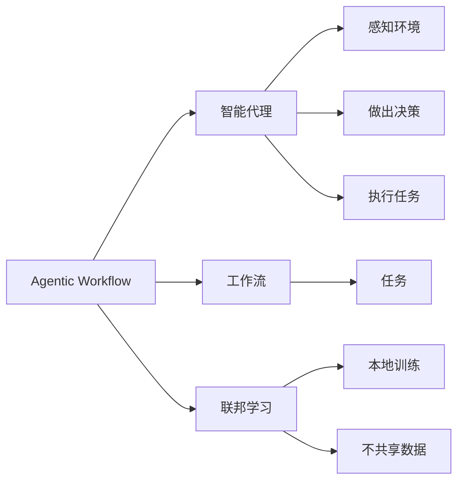

# Agentic Workflow 的应用现状

> 关键词：Agentic Workflow, 联邦学习, 自主协作, 软件架构, 分布式系统, 智能决策, 工作流引擎

## 1. 背景介绍

在当今的数字化时代，复杂系统和应用的需求日益增长，它们需要能够处理大量数据、执行复杂任务，并且能够适应不断变化的业务需求。Agentic Workflow 是一种新兴的软件架构模式，它结合了分布式系统、人工智能和软件自动化技术，旨在创建能够自主决策、协作和自我优化的流程管理系统。本文将探讨 Agentic Workflow 的应用现状，分析其核心概念、原理、实践案例以及未来的发展趋势。

### 1.1 问题的由来

随着云计算、大数据和人工智能技术的快速发展，企业面临以下挑战：

- **复杂性增加**：企业系统越来越复杂，需要处理的数据量呈指数级增长。
- **业务流程复杂**：业务流程多样化，需要灵活性和可扩展性。
- **自动化需求**：手动执行流程既耗时又容易出错，需要自动化解决方案。
- **决策智能化**：流程中的决策需要更加智能，以适应动态变化的环境。

### 1.2 研究现状

Agentic Workflow 通过引入智能代理（Agent）的概念，实现了自动化、智能决策和协作。目前，Agentic Workflow 已经在多个领域得到应用，并展现出巨大的潜力。

### 1.3 研究意义

研究 Agentic Workflow 的应用现状对于以下方面具有重要意义：

- **提高效率**：通过自动化和智能化流程管理，提高工作效率和准确性。
- **降低成本**：减少人工干预，降低运营成本。
- **增强灵活性**：适应快速变化的业务需求。
- **推动创新**：为软件开发和系统设计提供新的思路。

### 1.4 本文结构

本文将分为以下几个部分：

- **第2章**：介绍 Agentic Workflow 的核心概念与联系。
- **第3章**：阐述 Agentic Workflow 的核心算法原理和具体操作步骤。
- **第4章**：讲解 Agentic Workflow 的数学模型和公式，并结合实例进行分析。
- **第5章**：提供 Agentic Workflow 的代码实例和详细解释。
- **第6章**：探讨 Agentic Workflow 在实际应用场景中的应用。
- **第7章**：推荐相关学习资源、开发工具和论文。
- **第8章**：总结 Agentic Workflow 的未来发展趋势和挑战。
- **第9章**：提供常见问题与解答。

## 2. 核心概念与联系

### 2.1 核心概念

- **Agentic Workflow**：一种基于智能代理的自动化工作流管理系统。
- **智能代理**：能够感知环境、做出决策并执行任务的实体。
- **工作流**：一组按顺序执行的任务，用于完成特定业务流程。
- **联邦学习**：一种分布式机器学习技术，允许多个参与者在本地训练模型，而不需要共享数据。
- **软件架构**：软件系统的结构和组成部分的安排。

### 2.2 Mermaid 流程图



## 3. 核心算法原理 & 具体操作步骤

### 3.1 算法原理概述

Agentic Workflow 的核心算法原理如下：

1. **智能代理**：每个代理负责特定的任务，能够感知环境、做出决策并执行任务。
2. **工作流管理**：工作流管理系统协调和管理代理之间的协作。
3. **联邦学习**：代理使用联邦学习技术，在不共享数据的情况下训练模型。

### 3.2 算法步骤详解

1. **定义工作流**：根据业务需求定义工作流，包括任务、执行顺序和依赖关系。
2. **创建智能代理**：为每个任务创建一个智能代理，赋予其感知环境、做出决策和执行任务的能力。
3. **代理协作**：智能代理根据工作流管理系统的协调，与其他代理协作完成工作流。
4. **联邦学习**：代理使用联邦学习技术，在不共享数据的情况下训练模型。
5. **模型优化**：代理根据反馈调整模型参数，优化任务执行效果。

### 3.3 算法优缺点

#### 优点

- **自动化**：自动化工作流管理，减少人工干预。
- **智能化**：智能代理能够根据环境变化做出决策。
- **协作**：代理之间能够协作完成复杂任务。
- **隐私保护**：联邦学习技术保护数据隐私。

#### 缺点

- **复杂性**：系统设计和开发较为复杂。
- **学习成本**：需要一定的技术知识和经验。

### 3.4 算法应用领域

Agentic Workflow 可以应用于以下领域：

- **金融服务**：自动化交易执行、风险评估等。
- **供应链管理**：自动化库存管理、物流调度等。
- **医疗保健**：自动化诊断、患者管理等。
- **制造业**：自动化生产流程、质量控制等。

## 4. 数学模型和公式 & 详细讲解 & 举例说明

### 4.1 数学模型构建

Agentic Workflow 的数学模型主要包括以下几个方面：

- **智能代理决策模型**：使用决策树、神经网络等模型进行决策。
- **联邦学习模型**：使用联邦学习算法，如FedAvg、FedProx等。

### 4.2 公式推导过程

由于 Agentic Workflow 的数学模型较为复杂，这里不进行详细的公式推导。

### 4.3 案例分析与讲解

以下是一个简单的 Agentic Workflow 应用案例：

假设有一个物流配送系统，需要将货物从仓库运送到客户手中。系统使用 Agentic Workflow 进行自动化管理。

1. **定义工作流**：定义工作流包括以下几个任务：货物出库、货物装卸、货物运输、货物交付。
2. **创建智能代理**：为每个任务创建一个智能代理，负责执行相应任务。
3. **代理协作**：智能代理根据工作流管理系统的协调，协作完成工作流。
4. **联邦学习**：智能代理使用联邦学习技术，在不共享数据的情况下训练模型，优化配送路线和运输效率。

## 5. 项目实践：代码实例和详细解释说明

### 5.1 开发环境搭建

为了实践 Agentic Workflow，我们需要以下开发环境：

- 操作系统：Linux/Windows/MacOS
- 编程语言：Python
- 框架：Flask/Django
- 依赖库：TensorFlow、PyTorch、Keras、Scikit-learn等

### 5.2 源代码详细实现

以下是一个简单的 Agentic Workflow 代码实例：

```python
from flask import Flask, request, jsonify
from sklearn.linear_model import LogisticRegression
import numpy as np

app = Flask(__name__)

# 模拟联邦学习训练数据
def get_training_data():
    # ...

# 模拟联邦学习模型训练
def train_federated_model():
    # ...

# 模拟智能代理决策
def make_decision(data):
    # ...

@app.route('/predict', methods=['POST'])
def predict():
    data = request.get_json()
    prediction = make_decision(data)
    return jsonify({'prediction': prediction})

if __name__ == '__main__':
    app.run(debug=True)
```

### 5.3 代码解读与分析

这个代码实例使用了 Flask 框架创建了一个简单的 Web 服务。当接收到预测请求时，智能代理会根据输入数据做出决策，并将结果返回给客户端。

### 5.4 运行结果展示

运行该代码后，可以使用以下命令进行预测：

```bash
curl -X POST -H "Content-Type: application/json" -d '{"data": [1.0, 0.5, 0.2]}' http://localhost:5000/predict
```

返回结果将是智能代理的决策结果。

## 6. 实际应用场景

### 6.1 金融服务

在金融服务领域，Agentic Workflow 可以用于自动化交易执行、风险评估、客户服务等。

### 6.2 供应链管理

在供应链管理领域，Agentic Workflow 可以用于自动化库存管理、物流调度、供应商管理等。

### 6.3 医疗保健

在医疗保健领域，Agentic Workflow 可以用于自动化诊断、患者管理、医疗设备管理等。

### 6.4 制造业

在制造业领域，Agentic Workflow 可以用于自动化生产流程、质量控制、设备维护等。

## 7. 工具和资源推荐

### 7.1 学习资源推荐

- 《深度学习》
- 《机器学习》
- 《联邦学习》
- 《分布式系统》

### 7.2 开发工具推荐

- Flask/Django
- TensorFlow/PyTorch
- Keras
- Scikit-learn

### 7.3 相关论文推荐

- "Federated Learning: Concept and Applications"
- "Scalable and Private Learning of Deep Neural Networks with Federated Learning"
- "A Comprehensive Survey of Distributed Systems"

## 8. 总结：未来发展趋势与挑战

### 8.1 研究成果总结

Agentic Workflow 作为一种新兴的软件架构模式，在自动化、智能化流程管理方面展现出巨大的潜力。通过引入智能代理和联邦学习技术，Agentic Workflow 能够实现自动化、智能决策和协作，为复杂系统提供了一种新的解决方案。

### 8.2 未来发展趋势

- **更加智能化**：智能代理的决策能力将得到进一步提升。
- **更加自动化**：工作流管理系统将更加自动化，减少人工干预。
- **更加灵活**：Agentic Workflow 将能够更好地适应不断变化的业务需求。

### 8.3 面临的挑战

- **复杂性**：Agentic Workflow 的设计和开发相对复杂，需要一定的技术知识和经验。
- **安全性**：联邦学习技术需要保证数据的安全性和隐私性。
- **可解释性**：智能代理的决策过程需要更加可解释。

### 8.4 研究展望

未来，Agentic Workflow 将在以下方面取得进展：

- **跨领域应用**：Agentic Workflow 将应用于更多领域。
- **开源社区**：Agentic Workflow 将形成一个活跃的开源社区。
- **产业应用**：Agentic Workflow 将在更多产业中得到应用。

## 9. 附录：常见问题与解答

**Q1：什么是 Agentic Workflow？**

A：Agentic Workflow 是一种基于智能代理的自动化工作流管理系统，它结合了分布式系统、人工智能和软件自动化技术，旨在创建能够自主决策、协作和自我优化的流程管理系统。

**Q2：Agentic Workflow 的核心概念是什么？**

A：Agentic Workflow 的核心概念包括智能代理、工作流、联邦学习和软件架构。

**Q3：Agentic Workflow 的优点是什么？**

A：Agentic Workflow 的优点包括自动化、智能化、协作、隐私保护等。

**Q4：Agentic Workflow 的应用领域有哪些？**

A：Agentic Workflow 可以应用于金融服务、供应链管理、医疗保健、制造业等多个领域。

**Q5：如何实现 Agentic Workflow？**

A：实现 Agentic Workflow 需要使用合适的开发工具和框架，如 Flask/Django、TensorFlow/PyTorch、Keras、Scikit-learn 等。

作者：禅与计算机程序设计艺术 / Zen and the Art of Computer Programming