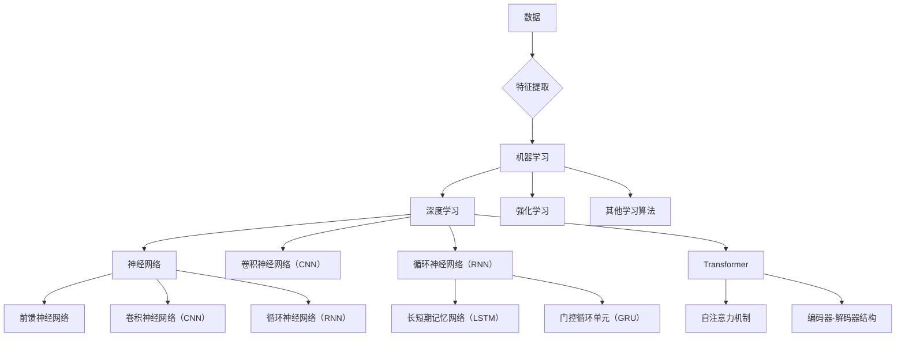

> 人工智能, 未来趋势, Andrej Karpathy, 深度学习, 机器学习, 自然语言处理, 计算机视觉, 伦理, 可解释性

# Andrej Karpathy：人工智能的未来发展前景

### 1. 背景介绍

人工智能（AI）作为计算机科学的前沿领域，正在以前所未有的速度发展。Andrej Karpathy，作为Facebook AI Research的杰出研究员，以其在深度学习、自然语言处理（NLP）和计算机视觉领域的贡献而闻名。本文将探讨Andrej Karpathy对人工智能未来发展的见解，并分析这一领域的核心概念、算法原理、实际应用以及面临的挑战。

### 2. 核心概念与联系

#### 2.1 Mermaid 流程图：人工智能核心概念



#### 2.2 核心概念解释

- **数据**：人工智能的基础，包括结构化和非结构化数据。
- **特征提取**：从数据中提取有用的信息，以便模型学习。
- **机器学习**：使计算机能够从数据中学习并做出决策。
- **深度学习**：一种机器学习技术，使用层次化的神经网络。
- **强化学习**：通过试错学习如何最大化某种累积奖励。
- **神经网络**：模仿人脑神经网络结构的计算模型。
- **卷积神经网络（CNN）**：擅长处理图像数据。
- **循环神经网络（RNN）**：擅长处理序列数据。
- **Transformer**：一种基于自注意力机制的深度学习模型，广泛应用于NLP和CV任务。
- **自注意力机制**：允许模型关注输入序列中不同位置的信息。
- **编码器-解码器结构**：一种在序列到序列任务中常用的模型结构。

### 3. 核心算法原理 & 具体操作步骤

#### 3.1 算法原理概述

人工智能的核心在于算法，以下是几个关键算法的概述：

- **深度学习**：通过多层神经网络学习复杂的数据表示。
- **神经网络**：由神经元组成的计算模型，通过权重和偏置进行学习。
- **CNN**：通过卷积层提取图像特征。
- **RNN**：通过循环层处理序列数据。
- **Transformer**：通过自注意力机制处理序列数据。

#### 3.2 算法步骤详解

1. **数据收集与预处理**：收集和预处理数据，包括清洗、归一化等步骤。
2. **模型设计**：设计合适的神经网络结构，如CNN、RNN或Transformer。
3. **模型训练**：使用标注数据进行训练，调整模型参数以最小化损失函数。
4. **模型评估**：在测试集上评估模型性能。
5. **模型部署**：将模型集成到实际应用中。

#### 3.3 算法优缺点

- **优点**：深度学习模型在图像识别、语音识别、自然语言处理等领域取得了显著成果。
- **缺点**：需要大量标注数据，模型训练需要大量计算资源，且模型的解释性较差。

#### 3.4 算法应用领域

- **计算机视觉**：图像识别、目标检测、视频分析等。
- **自然语言处理**：文本分类、机器翻译、问答系统等。
- **语音识别**：语音到文本、语音合成等。
- **推荐系统**：推荐电影、音乐、商品等。

### 4. 数学模型和公式 & 详细讲解 & 举例说明

#### 4.1 数学模型构建

深度学习模型的数学模型主要包括以下部分：

- **输入层**：数据输入到神经网络。
- **隐藏层**：通过激活函数变换输入数据。
- **输出层**：将隐藏层的输出映射到目标空间。

#### 4.2 公式推导过程

以下是一个简单的神经网络公式推导示例：

$$
y = f(W \cdot x + b)
$$

其中，$y$ 是输出，$x$ 是输入，$W$ 是权重，$b$ 是偏置，$f$ 是激活函数。

#### 4.3 案例分析与讲解

以图像识别任务为例，我们可以使用卷积神经网络（CNN）进行模型构建。

1. **数据收集与预处理**：收集大量图像数据，并进行预处理，如归一化、缩放等。
2. **模型设计**：设计一个CNN模型，包括卷积层、池化层和全连接层。
3. **模型训练**：使用标注数据进行训练，调整模型参数以最小化损失函数。
4. **模型评估**：在测试集上评估模型性能，如准确率、召回率等。
5. **模型部署**：将模型集成到实际应用中，如图像识别系统。

### 5. 项目实践：代码实例和详细解释说明

#### 5.1 开发环境搭建

1. 安装Python和PyTorch库。
2. 下载并导入所需的预训练模型和数据集。

#### 5.2 源代码详细实现

以下是一个简单的CNN模型实现示例：

```python
import torch
import torch.nn as nn

class SimpleCNN(nn.Module):
    def __init__(self):
        super(SimpleCNN, self).__init__()
        self.conv1 = nn.Conv2d(3, 32, kernel_size=3, padding=1)
        self.relu = nn.ReLU()
        self.maxpool = nn.MaxPool2d(kernel_size=2, stride=2)
        self.fc1 = nn.Linear(32 * 8 * 8, 128)
        self.fc2 = nn.Linear(128, 10)

    def forward(self, x):
        x = self.relu(self.conv1(x))
        x = self.maxpool(x)
        x = x.view(-1, 32 * 8 * 8)
        x = self.relu(self.fc1(x))
        x = self.fc2(x)
        return x

model = SimpleCNN()
```

#### 5.3 代码解读与分析

- `SimpleCNN` 类继承自 `nn.Module`，表示一个神经网络模型。
- `__init__` 方法中定义了模型的层，包括卷积层、ReLU激活函数、池化层和全连接层。
- `forward` 方法定义了模型的正向传播过程。

#### 5.4 运行结果展示

通过训练和测试，我们可以评估模型的性能，如准确率、召回率等。

### 6. 实际应用场景

人工智能技术已经在许多领域得到应用，以下是一些典型的应用场景：

- **医疗**：辅助诊断、药物研发、健康监测等。
- **金融**：风险评估、欺诈检测、个性化推荐等。
- **交通**：自动驾驶、智能交通系统等。
- **教育**：个性化学习、在线教育平台等。

### 6.4 未来应用展望

人工智能的未来发展前景广阔，以下是几个潜在的应用方向：

- **自动驾驶**：实现完全自动驾驶，解放驾驶员，提高道路安全。
- **智能机器人**：在家庭、工业等领域提供个性化服务。
- **智能助理**：提供更加自然、高效的交互体验。
- **智能医疗**：实现疾病的早期发现和精准治疗。

### 7. 工具和资源推荐

#### 7.1 学习资源推荐

- 《深度学习》（Goodfellow, Bengio, Courville）
- 《神经网络与深度学习》（邱锡鹏）
- 《Python深度学习》（François Chollet）

#### 7.2 开发工具推荐

- PyTorch
- TensorFlow
- Keras

#### 7.3 相关论文推荐

- "ImageNet Classification with Deep Convolutional Neural Networks"（Alex Krizhevsky et al.）
- "Sequence to Sequence Learning with Neural Networks"（Ilya Sutskever et al.）
- "Attention Is All You Need"（Ashish Vaswani et al.）

### 8. 总结：未来发展趋势与挑战

#### 8.1 研究成果总结

人工智能领域取得了显著的研究成果，深度学习模型在多个任务上取得了突破性进展。

#### 8.2 未来发展趋势

- **模型规模将进一步扩大**：随着算力的提升，模型规模将越来越大。
- **模型可解释性将得到提高**：研究者将致力于提高模型的解释性，使其更加透明和可靠。
- **多模态学习将成为趋势**：未来的人工智能系统将能够处理和融合多种模态的数据。

#### 8.3 面临的挑战

- **数据隐私**：如何保护用户隐私，防止数据泄露。
- **模型可解释性**：如何提高模型的可解释性，使其更加透明和可靠。
- **伦理问题**：如何确保人工智能系统的公平性、公正性和安全性。

#### 8.4 研究展望

人工智能领域的研究将持续深入，未来有望在更多领域得到应用，为人类社会带来更多福祉。

---

作者：禅与计算机程序设计艺术 / Zen and the Art of Computer Programming