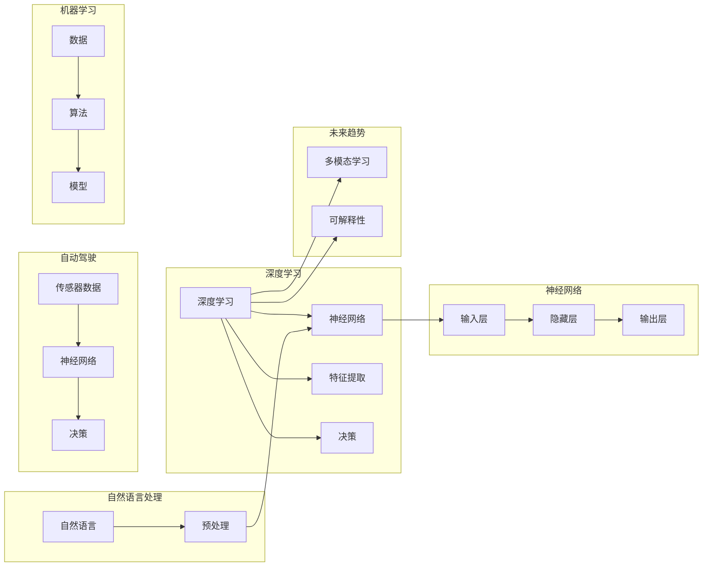

# Andrej Karpathy：人工智能的未来发展前景

> 关键词：人工智能，深度学习，神经网络，自然语言处理，自动驾驶，机器学习，未来趋势

## 1. 背景介绍

Andrej Karpathy 是一位世界著名的计算机科学家和人工智能专家，以其对深度学习和自然语言处理（NLP）领域的深刻理解和创新贡献而闻名。他的博客文章《The Unreasonable Effectiveness of Recurrent Neural Networks》和《The Unreasonable Effectiveness of Neural Networks》引发了广泛关注，推动了深度学习技术在NLP和计算机视觉等领域的应用。本文将探讨 Andrej Karpathy 的观点，分析人工智能的未来发展前景。

## 2. 核心概念与联系

### 2.1 核心概念

- **深度学习**：一种模拟人脑神经网络结构的学习方法，通过多层神经网络进行特征提取和决策。
- **神经网络**：由大量简单的计算单元（神经元）组成的复杂网络，可以用于执行复杂的任务。
- **自然语言处理**：使计算机能够理解、解释和生成人类语言的技术。
- **自动驾驶**：使汽车能够在没有人类司机的情况下进行驾驶的技术。
- **机器学习**：使计算机能够从数据中学习并做出决策的技术。

### 2.2 核心概念原理和架构的 Mermaid 流程图



## 3. 核心算法原理 & 具体操作步骤

### 3.1 算法原理概述

深度学习通过多层神经网络进行特征提取和决策。数据通过输入层进入网络，经过多个隐藏层，最终通过输出层得出结论。

### 3.2 算法步骤详解

1. 数据预处理：对输入数据进行标准化、清洗等操作。
2. 构建神经网络：定义网络结构，包括层数、每层的神经元数量等。
3. 训练模型：使用大量标记数据进行训练，优化网络参数。
4. 评估模型：使用测试集评估模型性能。
5. 部署模型：将训练好的模型应用到实际场景中。

### 3.3 算法优缺点

**优点**：

- 高效的特征提取能力。
- 自动学习复杂模式。
- 适用于各种复杂数据类型。

**缺点**：

- 计算量大，需要大量计算资源。
- 模型可解释性差。
- 对数据质量要求高。

### 3.4 算法应用领域

深度学习在以下领域得到广泛应用：

- 自然语言处理：机器翻译、文本分类、情感分析等。
- 计算机视觉：图像识别、目标检测、图像生成等。
- 自动驾驶：环境感知、决策规划、控制执行等。
- 金融：风险管理、信用评分、投资策略等。
- 医疗：疾病诊断、药物研发、医疗影像分析等。

## 4. 数学模型和公式 & 详细讲解 & 举例说明

### 4.1 数学模型构建

深度学习中的神经网络模型通常由以下数学公式描述：

$$
y = f(W \cdot x + b)
$$

其中 $y$ 是输出，$x$ 是输入，$W$ 是权重，$b$ 是偏置，$f$ 是激活函数。

### 4.2 公式推导过程

以多层感知器（MLP）为例，其数学模型可以表示为：

$$
z^{[l]} = W^{[l]} \cdot a^{[l-1]} + b^{[l]}
$$

$$
a^{[l]} = \sigma(z^{[l]})
$$

其中 $a^{[l]}$ 是第 $l$ 层的激活，$W^{[l]}$ 是第 $l$ 层的权重，$b^{[l]}$ 是第 $l$ 层的偏置，$\sigma$ 是激活函数。

### 4.3 案例分析与讲解

以图像分类任务为例，我们可以使用卷积神经网络（CNN）进行模型构建。以下是一个简单的CNN模型示例：

1. 输入层：接收图像数据。
2. 卷积层：提取图像特征。
3. 池化层：降低特征维度。
4. 全连接层：进行分类决策。

## 5. 项目实践：代码实例和详细解释说明

### 5.1 开发环境搭建

为了进行深度学习项目，我们需要以下开发环境：

1. Python 3.6+
2. TensorFlow 或 PyTorch 深度学习框架
3. NumPy、Matplotlib 等工具包

### 5.2 源代码详细实现

以下是一个简单的使用 PyTorch 框架实现的卷积神经网络模型代码示例：

```python
import torch
import torch.nn as nn

class SimpleCNN(nn.Module):
    def __init__(self):
        super(SimpleCNN, self).__init__()
        self.conv1 = nn.Conv2d(1, 32, kernel_size=3, stride=1, padding=1)
        self.conv2 = nn.Conv2d(32, 64, kernel_size=3, stride=1, padding=1)
        self.fc1 = nn.Linear(64 * 28 * 28, 128)
        self.fc2 = nn.Linear(128, 10)

    def forward(self, x):
        x = nn.functional.relu(self.conv1(x))
        x = nn.functional.max_pool2d(x, 2)
        x = nn.functional.relu(self.conv2(x))
        x = nn.functional.max_pool2d(x, 2)
        x = x.view(-1, 64 * 28 * 28)
        x = nn.functional.relu(self.fc1(x))
        x = self.fc2(x)
        return x

# 实例化模型
model = SimpleCNN()
```

### 5.3 代码解读与分析

上述代码实现了一个简单的卷积神经网络模型，用于图像分类任务。模型包含两个卷积层和两个全连接层。卷积层用于提取图像特征，全连接层用于进行分类决策。激活函数和池化层用于增强模型的表达能力和鲁棒性。

### 5.4 运行结果展示

在实际应用中，我们需要使用训练集和测试集对模型进行训练和评估。以下是一个简单的训练过程：

```python
# 训练模型
criterion = nn.CrossEntropyLoss()
optimizer = torch.optim.Adam(model.parameters(), lr=0.001)

for epoch in range(10):
    running_loss = 0.0
    for i, (inputs, labels) in enumerate(train_loader):
        optimizer.zero_grad()
        outputs = model(inputs)
        loss = criterion(outputs, labels)
        loss.backward()
        optimizer.step()
        running_loss += loss.item()
    print(f"Epoch {epoch+1}, Loss: {running_loss/len(train_loader)}")
```

## 6. 实际应用场景

### 6.1 自然语言处理

深度学习在自然语言处理领域取得了显著成果。例如，BERT 模型在多种 NLP 任务上取得了 SOTA 成绩，包括文本分类、问答系统、机器翻译等。

### 6.2 计算机视觉

深度学习在计算机视觉领域也取得了巨大成功。例如，卷积神经网络在图像分类、目标检测、人脸识别等领域都取得了 SOTA 成绩。

### 6.3 自动驾驶

深度学习在自动驾驶领域也得到了广泛应用。例如，自动驾驶系统需要通过摄像头、雷达等传感器获取环境信息，并使用深度学习模型进行环境感知、决策规划和控制执行。

### 6.4 未来应用展望

随着深度学习技术的不断发展，未来人工智能将在更多领域得到应用，例如：

- 医疗：疾病诊断、药物研发、个性化治疗等。
- 金融：风险管理、欺诈检测、智能投顾等。
- 教育：个性化学习、智能辅导、自动评估等。
- 能源：智能电网、智能交通、能源管理等。

## 7. 工具和资源推荐

### 7.1 学习资源推荐

- 《深度学习》（Ian Goodfellow、Yoshua Bengio、Aaron Courville 著）
- 《神经网络与深度学习》（邱锡鹏 著）
- Coursera、edX 等在线课程

### 7.2 开发工具推荐

- TensorFlow
- PyTorch
- Keras

### 7.3 相关论文推荐

- "A Guide to Training Your First Deep Learning Model"（Andrej Karpathy）
- "Deep Learning for Natural Language Processing"（Tom B. Brown、Benjamin Mann、Nicola Heringa、Pranav Shyam 著）
- "Convolutional Neural Networks for Visual Recognition"（Alex Krizhevsky、Geoffrey Hinton、Ilya Sutskever 著）

## 8. 总结：未来发展趋势与挑战

### 8.1 研究成果总结

深度学习技术在人工智能领域取得了巨大进展，推动了各个领域的创新发展。然而，人工智能仍面临着许多挑战，如数据隐私、算法可解释性、伦理问题等。

### 8.2 未来发展趋势

- 多模态学习：将文本、图像、语音等多种模态信息融合到模型中。
- 自监督学习：减少对标注数据的依赖，提高模型的泛化能力。
- 可解释人工智能：提高算法的透明度和可解释性。
- 量子计算：利用量子计算加速深度学习模型训练。

### 8.3 面临的挑战

- 数据隐私：如何保护用户数据隐私，防止数据泄露。
- 算法可解释性：如何提高算法的透明度和可解释性。
- 伦理问题：如何避免算法偏见和歧视。
- 算力需求：如何满足日益增长的算力需求。

### 8.4 研究展望

随着人工智能技术的不断发展，未来我们将见证更加智能、安全、可解释的人工智能系统出现。人工智能将在更多领域得到应用，为人类社会带来更多福祉。

## 9. 附录：常见问题与解答

**Q1：什么是深度学习？**

A：深度学习是一种模拟人脑神经网络结构的学习方法，通过多层神经网络进行特征提取和决策。

**Q2：深度学习有哪些应用领域？**

A：深度学习在自然语言处理、计算机视觉、自动驾驶、医疗、金融等领域得到广泛应用。

**Q3：如何学习深度学习？**

A：推荐学习《深度学习》、《神经网络与深度学习》等书籍，并参加在线课程，如 Coursera、edX 等。

**Q4：深度学习的挑战有哪些？**

A：深度学习的挑战包括数据隐私、算法可解释性、伦理问题、算力需求等。

**Q5：人工智能的未来发展趋势是什么？**

A：人工智能的未来发展趋势包括多模态学习、自监督学习、可解释人工智能、量子计算等。

作者：禅与计算机程序设计艺术 / Zen and the Art of Computer Programming