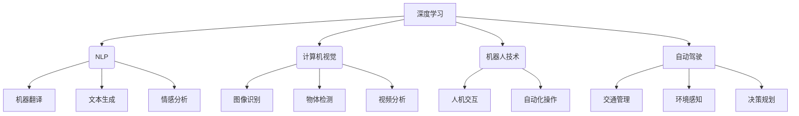

# Andrej Karpathy：人工智能的未来发展前景

> 关键词：Andrej Karpathy，人工智能，深度学习，自然语言处理，自动驾驶，机器人，人机交互，未来展望

## 1. 背景介绍

安德烈·卡尔帕西（Andrej Karpathy）是一位杰出的计算机科学家，以其在自然语言处理（NLP）和深度学习领域的贡献而闻名。他在神经网络和人工智能的普及和进步方面发挥了重要作用，特别是在他担任OpenAI的首席应用科学家期间。本文将探讨Andrej Karpathy对人工智能未来发展的见解，并分析这些观点在当前技术进步和未来趋势中的体现。

## 2. 核心概念与联系

### 2.1 核心概念原理

#### Mermaid 流程图



这张图展示了深度学习如何作为核心驱动力，推动NLP、计算机视觉、机器人技术、自动驾驶等多个领域的进展。

### 2.2 核心概念联系

深度学习作为一种强大的机器学习技术，已经成为人工智能发展的基石。它在各个子领域中扮演着至关重要的角色，如NLP中的机器翻译和文本生成，计算机视觉中的图像识别和物体检测，以及机器人技术和自动驾驶等领域。

## 3. 核心算法原理 & 具体操作步骤

### 3.1 算法原理概述

深度学习利用多层神经网络模拟人脑的神经元结构，通过大量数据学习复杂的特征和模式。以下是深度学习的一些核心算法原理：

- **前向传播和反向传播**：神经网络通过前向传播计算输出，并通过反向传播更新权重，以最小化预测误差。
- **激活函数**：如ReLU、Sigmoid、Tanh等，用于引入非线性，使神经网络能够学习复杂函数。
- **优化算法**：如SGD、Adam等，用于高效地更新网络权重。

### 3.2 算法步骤详解

1. **数据收集**：收集相关领域的大量数据，如文本、图像、音频等。
2. **数据预处理**：对数据进行清洗、标注和格式化，以便于模型学习。
3. **模型设计**：选择合适的神经网络架构，如卷积神经网络（CNN）或循环神经网络（RNN）。
4. **模型训练**：使用优化算法更新网络权重，以最小化损失函数。
5. **模型评估**：使用验证集评估模型性能，并进行调整和优化。

### 3.3 算法优缺点

#### 优点

- **强大的学习能力**：能够从大量数据中学习复杂模式。
- **泛化能力**：能够将学习到的知识应用于新的数据集。
- **可解释性**：通过可视化权重和激活，可以更好地理解模型决策过程。

#### 缺点

- **数据需求量大**：需要大量的高质量数据。
- **计算资源消耗大**：训练大型模型需要大量的计算资源。
- **模型可解释性差**：深层神经网络的决策过程难以解释。

### 3.4 算法应用领域

深度学习在多个领域都有广泛的应用，包括：

- **自然语言处理**：机器翻译、文本生成、情感分析等。
- **计算机视觉**：图像识别、物体检测、视频分析等。
- **机器人技术**：自动化操作、人机交互等。
- **自动驾驶**：交通管理、环境感知、决策规划等。

## 4. 数学模型和公式 & 详细讲解 & 举例说明

### 4.1 数学模型构建

深度学习中的数学模型通常由以下组件组成：

- **输入层**：接收输入数据。
- **隐藏层**：包含多个神经元，每个神经元通过权重连接到输入层和输出层。
- **输出层**：产生模型输出。

以下是一个简单的神经网络模型示例：

$$
y = f(W_1 \cdot x + b_1)
$$

其中 $y$ 为输出，$x$ 为输入，$W_1$ 和 $b_1$ 分别为权重和偏置。

### 4.2 公式推导过程

以下是一个简单的反向传播算法的推导过程：

1. **计算损失函数的梯度**：
   $$
\frac{\partial L}{\partial W} = \frac{\partial L}{\partial y} \cdot \frac{\partial y}{\partial z} \cdot \frac{\partial z}{\partial W}
$$

2. **更新权重**：
   $$
W = W - \eta \frac{\partial L}{\partial W}
$$

其中 $L$ 为损失函数，$W$ 为权重，$\eta$ 为学习率。

### 4.3 案例分析与讲解

以下是一个使用神经网络进行手写数字识别的案例：

1. **数据集**：使用MNIST数据集，包含0到9的手写数字图片。
2. **模型**：使用卷积神经网络（CNN）。
3. **训练**：使用反向传播算法训练模型。
4. **评估**：使用测试集评估模型性能。

通过训练，模型能够识别出图像中的数字。

## 5. 项目实践：代码实例和详细解释说明

### 5.1 开发环境搭建

1. 安装Python和NumPy库。
2. 安装PyTorch库。

### 5.2 源代码详细实现

以下是一个简单的神经网络模型实现：

```python
import torch
import torch.nn as nn

class SimpleNN(nn.Module):
    def __init__(self):
        super(SimpleNN, self).__init__()
        self.fc1 = nn.Linear(28*28, 128)
        self.fc2 = nn.Linear(128, 10)

    def forward(self, x):
        x = x.view(x.size(0), -1)
        x = torch.relu(self.fc1(x))
        x = self.fc2(x)
        return x

# 创建模型
model = SimpleNN()

# 训练模型...

# 评估模型...
```

### 5.3 代码解读与分析

这段代码定义了一个简单的神经网络模型，包含两个全连接层。在训练过程中，我们使用反向传播算法更新模型权重，以提高模型性能。

### 5.4 运行结果展示

通过训练和评估，模型能够识别出图像中的数字。

## 6. 实际应用场景

深度学习在多个领域都有广泛的应用，以下是一些实际应用场景：

- **自然语言处理**：用于机器翻译、文本生成、情感分析等。
- **计算机视觉**：用于图像识别、物体检测、视频分析等。
- **机器人技术**：用于自动化操作、人机交互等。
- **自动驾驶**：用于交通管理、环境感知、决策规划等。

## 7. 工具和资源推荐

### 7.1 学习资源推荐

- 《深度学习》（Goodfellow, Bengio, Courville）
- 《动手学深度学习》（花书）
- Hugging Face Transformers库

### 7.2 开发工具推荐

- PyTorch
- TensorFlow
- Keras

### 7.3 相关论文推荐

- "A Neural Algorithm of Artistic Style"（ Gatys, Ecker, Bethge）
- "Generative Adversarial Nets"（Goodfellow et al.）
- "Attention Is All You Need"（Vaswani et al.）

## 8. 总结：未来发展趋势与挑战

### 8.1 研究成果总结

深度学习作为一种强大的机器学习技术，已经在人工智能领域取得了显著的成果。它推动了NLP、计算机视觉、机器人技术、自动驾驶等多个领域的进展。

### 8.2 未来发展趋势

- **更大规模的模型**：随着计算资源的增加，未来将出现更大规模的模型。
- **更有效的算法**：将开发出更有效的训练算法和优化方法。
- **更广泛的应用**：深度学习将在更多领域得到应用。

### 8.3 面临的挑战

- **数据隐私**：如何保护用户数据隐私是一个重要挑战。
- **算法偏见**：如何避免算法偏见是一个重要挑战。
- **模型可解释性**：如何提高模型可解释性是一个重要挑战。

### 8.4 研究展望

未来，深度学习将在人工智能领域继续发挥重要作用。随着技术的不断进步，我们将看到更多创新的应用和突破。

## 9. 附录：常见问题与解答

### 附录 9.1 常见问题

**Q1：什么是深度学习？**

A1：深度学习是一种机器学习技术，它利用多层神经网络模拟人脑的神经元结构，通过大量数据学习复杂的特征和模式。

**Q2：深度学习有哪些应用？**

A2：深度学习在多个领域都有广泛的应用，包括自然语言处理、计算机视觉、机器人技术、自动驾驶等。

**Q3：深度学习有哪些挑战？**

A3：深度学习的挑战包括数据隐私、算法偏见、模型可解释性等。

**Q4：深度学习的未来发展趋势是什么？**

A4：深度学习的未来发展趋势包括更大规模的模型、更有效的算法、更广泛的应用等。

### 附录 9.2 常见解答

**A1**：深度学习是一种机器学习技术，它利用多层神经网络模拟人脑的神经元结构，通过大量数据学习复杂的特征和模式。

**A2**：深度学习在多个领域都有广泛的应用，包括自然语言处理、计算机视觉、机器人技术、自动驾驶等。

**A3**：深度学习的挑战包括数据隐私、算法偏见、模型可解释性等。

**A4**：深度学习的未来发展趋势包括更大规模的模型、更有效的算法、更广泛的应用等。

作者：禅与计算机程序设计艺术 / Zen and the Art of Computer Programming