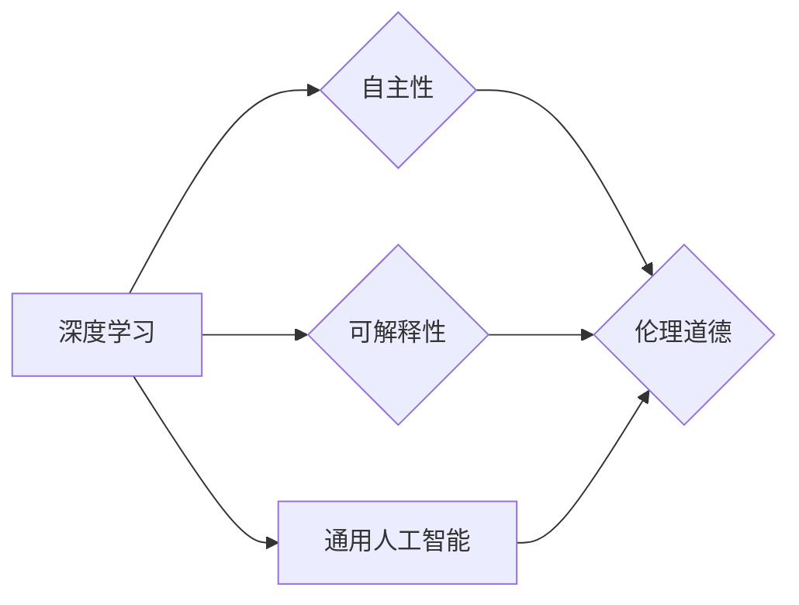

> 人工智能, 深度学习, 自主性, 可解释性, 通用人工智能, 伦理道德

# Andrej Karpathy：人工智能的未来发展方向

## 1. 背景介绍

在过去的几十年中，人工智能（AI）领域经历了翻天覆地的变化。从早期的符号主义和逻辑推理，到近年来深度学习的兴起，AI技术已经渗透到了我们生活的方方面面。Andrej Karpathy，作为Google Brain团队的成员之一，以及深度学习领域的杰出代表，他的工作对AI领域产生了深远的影响。本文将探讨Andrej Karpathy对人工智能未来发展方向的观点和见解。

## 2. 核心概念与联系

### 2.1 核心概念

在探讨人工智能的未来发展方向之前，我们首先需要明确几个核心概念：

- **深度学习**：一种利用神经网络模型进行学习和推理的技术，能够处理复杂的模式识别任务。
- **自主性**：指系统能够在不依赖人类干预的情况下执行任务的能力。
- **可解释性**：指AI系统决策过程的透明度和可理解性。
- **通用人工智能（AGI）**：一种具有广泛认知能力，能够像人类一样进行思考和学习的AI系统。
- **伦理道德**：在AI设计和应用过程中，需要考虑的社会责任和道德规范。

### 2.2 核心概念原理和架构的 Mermaid 流程图



从图中可以看出，深度学习是AI发展的基础，它推动了自主性、可解释性和通用人工智能的发展。同时，这些发展方向都需要考虑伦理道德的约束。

## 3. 核心算法原理 & 具体操作步骤

### 3.1 算法原理概述

Andrej Karpathy认为，人工智能的未来发展将依赖于以下几个核心算法原理：

- **神经网络**：模拟人脑神经元连接的数学模型，能够进行复杂的数据处理。
- **强化学习**：通过奖励和惩罚机制，让AI系统在没有明确指令的情况下学习行为。
- **迁移学习**：利用预训练模型的知识，快速适应新任务。
- **生成对抗网络（GANs）**：通过生成模型和判别模型的对抗训练，生成高质量的数据。

### 3.2 算法步骤详解

1. **数据收集与预处理**：收集大量高质量数据，并进行清洗、标注和格式化。
2. **模型选择与训练**：根据任务需求选择合适的模型，并使用预训练模型或从头开始训练。
3. **模型评估与优化**：使用验证集评估模型性能，并根据评估结果调整模型结构或超参数。
4. **模型部署与应用**：将训练好的模型部署到实际应用场景中，如自动化、辅助决策等。

### 3.3 算法优缺点

#### 优点：

- **高精度**：深度学习模型在许多任务上达到了人类专家的水平。
- **泛化能力强**：迁移学习使得模型能够快速适应新任务。
- **自主性强**：强化学习能够训练出能够自主学习的系统。

#### 缺点：

- **可解释性差**：深度学习模型通常难以解释其决策过程。
- **计算资源消耗大**：训练和推理深度学习模型需要大量的计算资源。
- **数据依赖性强**：模型性能依赖于大量高质量的数据。

### 3.4 算法应用领域

深度学习算法在各个领域都有广泛的应用，包括：

- **图像识别**：人脸识别、物体检测、医学影像分析等。
- **自然语言处理**：机器翻译、文本摘要、情感分析等。
- **语音识别**：语音转文字、语音合成等。
- **自动驾驶**：环境感知、决策规划等。

## 4. 数学模型和公式 & 详细讲解 & 举例说明

### 4.1 数学模型构建

以下是一个简单的神经网络模型示例：

$$
y = f(W \cdot x + b)
$$

其中，$W$ 是权重矩阵，$x$ 是输入向量，$b$ 是偏置向量，$f$ 是激活函数。

### 4.2 公式推导过程

以一个简单的全连接神经网络为例，其损失函数可以使用均方误差（MSE）来衡量：

$$
L(\theta) = \frac{1}{2} \sum_{i=1}^{N}(y_i - \hat{y}_i)^2
$$

其中，$y_i$ 是真实标签，$\hat{y}_i$ 是模型预测值，$N$ 是样本数量。

### 4.3 案例分析与讲解

假设我们要训练一个模型来预测房价。我们可以使用线性回归模型，其损失函数为：

$$
L(\theta) = \frac{1}{2} \sum_{i=1}^{N}(y_i - \theta_0 - \theta_1 x_{i1} - \theta_2 x_{i2})^2
$$

其中，$x_{i1}$ 和 $x_{i2}$ 是房屋的特征（如面积、房间数等），$\theta_0, \theta_1, \theta_2$ 是模型参数。

通过优化损失函数，我们可以找到最优的模型参数，从而预测房价。

## 5. 项目实践：代码实例和详细解释说明

### 5.1 开发环境搭建

以下是使用Python和TensorFlow进行神经网络训练的代码示例：

```python
import tensorflow as tf

# 创建模型
model = tf.keras.Sequential([
    tf.keras.layers.Dense(10, activation='relu', input_shape=(2,)),
    tf.keras.layers.Dense(1)
])

# 编译模型
model.compile(optimizer='adam', loss='mse')

# 训练模型
x_train = tf.random.normal([100, 2])
y_train = tf.random.normal([100, 1])

model.fit(x_train, y_train, epochs=10)

# 预测
x_test = tf.random.normal([1, 2])
y_pred = model.predict(x_test)

print(y_pred)
```

### 5.2 源代码详细实现

上述代码创建了一个简单的全连接神经网络，包含两个隐藏层。使用Adam优化器和均方误差损失函数进行训练。训练完成后，使用模型进行预测。

### 5.3 代码解读与分析

- `import tensorflow as tf`：导入TensorFlow库。
- `model = tf.keras.Sequential([...])`：创建一个序列模型，包含两个全连接层。
- `model.compile(optimizer='adam', loss='mse')`：编译模型，指定优化器和损失函数。
- `model.fit(x_train, y_train, epochs=10)`：训练模型10个epoch。
- `model.predict(x_test)`：使用模型进行预测。

## 6. 实际应用场景

### 6.1 自动驾驶

自动驾驶是AI技术的典型应用场景。通过深度学习技术，自动驾驶汽车可以实时感知周围环境，做出合理的决策，实现安全、高效的驾驶。

### 6.2 医疗诊断

AI技术在医疗诊断领域有着巨大的潜力。通过深度学习模型，可以自动分析医学影像，辅助医生进行诊断，提高诊断效率和准确性。

### 6.3 金融服务

AI技术在金融服务领域也有广泛的应用，如欺诈检测、风险管理、智能投顾等。

## 7. 工具和资源推荐

### 7.1 学习资源推荐

- 《深度学习》（Ian Goodfellow等著）
- 《神经网络与深度学习》（邱锡鹏著）
- 《TensorFlow技术详解与实战》

### 7.2 开发工具推荐

- TensorFlow
- PyTorch
- Keras

### 7.3 相关论文推荐

- "ImageNet Classification with Deep Convolutional Neural Networks"（Alex Krizhevsky等，2012）
- "The Unsupervised Learning of Visual Representations by a Deep Neural Network"（Yann LeCun等，2010）
- "Playing Atari with Deep Reinforcement Learning"（Volodymyr Mnih等，2013）

## 8. 总结：未来发展趋势与挑战

### 8.1 研究成果总结

本文介绍了Andrej Karpathy对人工智能未来发展方向的观点，并探讨了深度学习、自主性、可解释性、通用人工智能和伦理道德等核心概念。通过分析核心算法原理、具体操作步骤、数学模型和公式，以及项目实践，展示了AI技术的应用场景和工具资源。

### 8.2 未来发展趋势

未来，人工智能技术将朝着以下几个方向发展：

- **模型规模和复杂度的提升**：随着计算能力的增强，模型的规模和复杂度将不断提高，能够处理更复杂的任务。
- **多模态学习**：AI技术将能够处理图像、文本、音频等多种模态的数据，实现跨模态理解和交互。
- **可解释性和可信赖性**：为了提高AI技术的可接受度，可解释性和可信赖性将成为重要的研究方向。
- **通用人工智能**：通用人工智能将是AI技术的最终目标，通过实现AGI，AI将能够像人类一样进行思考和解决问题。

### 8.3 面临的挑战

尽管AI技术发展迅速，但仍面临着以下挑战：

- **数据质量和标注**：高质量的数据和准确的标注对于AI训练至关重要，但获取这些数据需要巨大的成本和时间。
- **计算资源**：深度学习模型需要大量的计算资源，尤其是在训练过程中。
- **伦理和道德**：AI技术的应用引发了关于伦理和道德的担忧，如隐私、偏见和失业等问题。

### 8.4 研究展望

为了应对这些挑战，未来的研究需要关注以下几个方面：

- **数据隐私保护**：研究更加安全、高效的数据隐私保护技术，如联邦学习、差分隐私等。
- **计算效率优化**：开发更加高效、节能的计算架构，如专用芯片、分布式计算等。
- **伦理和道德规范**：制定AI技术的伦理和道德规范，确保AI技术的健康发展。

## 9. 附录：常见问题与解答

### Q1：人工智能是否会取代人类？

A1：人工智能技术可以帮助人类提高工作效率、解决复杂问题，但不可能完全取代人类。AI技术只是人类智慧的延伸，需要人类的引导和控制。

### Q2：人工智能是否会带来失业？

A2：人工智能技术的发展可能会对某些行业造成冲击，导致部分岗位的减少。然而，它也会创造新的就业机会，并推动产业升级。

### Q3：人工智能是否会引发战争？

A3：人工智能技术本身是中性的，其应用取决于人类的选择。如果滥用AI技术，可能会引发战争。因此，需要加强AI伦理和道德规范的研究，确保AI技术的健康发展。

### Q4：人工智能是否会侵犯隐私？

A4：人工智能技术可以收集和分析大量数据，如果不当使用，可能会侵犯隐私。因此，需要加强数据隐私保护的研究，确保AI技术的安全性和可靠性。

作者：禅与计算机程序设计艺术 / Zen and the Art of Computer Programming