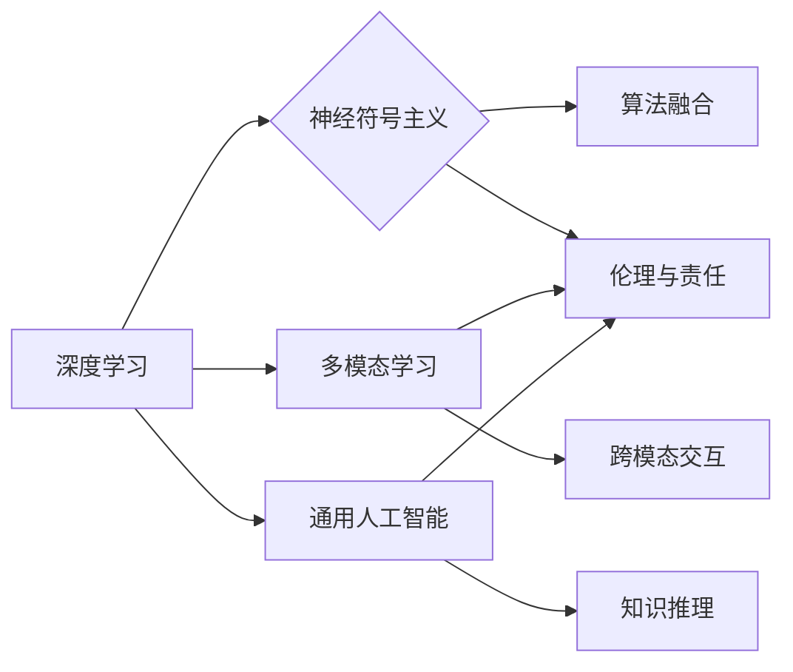

> 人工智能，深度学习，神经符号主义，多模态学习，伦理与责任，通用人工智能

# Andrej Karpathy：人工智能的未来发展方向

## 1. 背景介绍

人工智能（AI）领域正经历着前所未有的快速发展，从早期的符号主义到现代的深度学习，再到如今的神经符号主义和多模态学习，AI技术正逐渐渗透到我们的日常生活和工作中。Andrej Karpathy，作为人工智能领域的杰出代表，其关于AI未来的发展方向的观点值得我们深入探讨。

### 1.1 问题的由来

随着AI技术的进步，我们看到了许多令人瞩目的应用，如自动驾驶、智能客服、医疗诊断等。然而，AI技术也面临着诸多挑战，包括伦理问题、数据隐私、模型可解释性等。因此，探讨AI的未来发展方向，不仅是技术问题，更是社会问题。

### 1.2 研究现状

目前，AI领域的主要研究方向包括：

- 深度学习：通过多层神经网络模拟人脑处理信息的方式，在图像识别、语音识别等领域取得了显著成果。
- 神经符号主义：结合神经网络的计算能力与符号主义的逻辑推理能力，以期构建更强大的AI系统。
- 多模态学习：让AI系统同时处理文本、图像、语音等多种模态的数据，提升AI的感知和理解能力。
- 通用人工智能（AGI）：构建具有通用智能的AI系统，使其能够在各种任务中表现如人类。

### 1.3 研究意义

研究AI的未来发展方向，对于推动AI技术的发展、解决现实问题以及构建更加和谐的社会具有重要意义。

### 1.4 本文结构

本文将从Andrej Karpathy的视角出发，探讨人工智能的未来发展方向，包括核心概念、算法原理、应用场景、挑战与展望等方面。

## 2. 核心概念与联系

### 2.1 核心概念原理和架构的 Mermaid 流程图

### 2.2 核心概念解释

- **深度学习**：通过多层神经网络模拟人脑处理信息的方式，在图像识别、语音识别等领域取得了显著成果。
- **神经符号主义**：结合神经网络的计算能力与符号主义的逻辑推理能力，以期构建更强大的AI系统。
- **多模态学习**：让AI系统同时处理文本、图像、语音等多种模态的数据，提升AI的感知和理解能力。
- **通用人工智能**：构建具有通用智能的AI系统，使其能够在各种任务中表现如人类。
- **算法融合**：将不同类型的算法进行整合，以提升AI系统的性能。
- **跨模态交互**：不同模态数据之间的交互和融合，以增强AI系统的感知和理解能力。
- **知识推理**：基于符号主义的方法，让AI系统具备推理能力。
- **伦理与责任**：确保AI系统的应用符合伦理道德标准，并对AI系统的决策负责。

## 3. 核心算法原理 & 具体操作步骤

### 3.1 算法原理概述

- **深度学习**：通过多层神经网络模拟人脑处理信息的方式，通过反向传播算法不断优化网络参数，以实现特定任务的目标。
- **神经符号主义**：结合神经网络的计算能力与符号主义的逻辑推理能力，通过神经网络学习符号知识，并通过符号推理进行决策。
- **多模态学习**：通过融合不同模态的数据，让AI系统同时处理文本、图像、语音等多种数据，以提升AI的感知和理解能力。
- **通用人工智能**：通过整合多种算法和知识，构建具有通用智能的AI系统。

### 3.2 算法步骤详解

- **深度学习**：
  1. 数据预处理：对输入数据进行归一化、标准化等处理。
  2. 网络构建：设计多层神经网络结构。
  3. 损失函数选择：选择合适的损失函数，如交叉熵、均方误差等。
  4. 优化算法：选择合适的优化算法，如梯度下降、Adam等。
  5. 训练过程：使用训练数据进行网络训练，不断优化网络参数。
- **神经符号主义**：
  1. 知识表示：使用符号表示方法表示知识。
  2. 神经网络训练：使用神经网络学习知识表示。
  3. 符号推理：使用符号推理方法进行决策。
- **多模态学习**：
  1. 数据收集：收集不同模态的数据。
  2. 数据预处理：对收集到的数据进行预处理。
  3. 融合方法选择：选择合适的融合方法，如特征融合、模型融合等。
  4. 模型训练：使用融合后的数据训练模型。
- **通用人工智能**：
  1. 算法整合：整合多种算法和知识。
  2. 模型训练：使用整合后的算法和知识训练模型。

### 3.3 算法优缺点

- **深度学习**：
  - 优点：计算能力强大，能够处理大规模数据，泛化能力强。
  - 缺点：模型复杂度高，可解释性差，需要大量标注数据。
- **神经符号主义**：
  - 优点：结合神经网络的计算能力和符号主义的逻辑推理能力，可解释性强。
  - 缺点：计算复杂度高，需要大量的符号知识。
- **多模态学习**：
  - 优点：能够同时处理多种模态的数据，提升AI的感知和理解能力。
  - 缺点：融合不同模态数据的方法复杂，需要大量的数据。
- **通用人工智能**：
  - 优点：具有通用智能，能够处理各种任务。
  - 缺点：技术难度高，需要整合多种算法和知识。

### 3.4 算法应用领域

- **深度学习**：图像识别、语音识别、自然语言处理等。
- **神经符号主义**：知识图谱、专家系统、决策支持系统等。
- **多模态学习**：人机交互、智能家居、智能机器人等。
- **通用人工智能**：自动驾驶、智能客服、智能医疗等。

## 4. 数学模型和公式 & 详细讲解 & 举例说明

### 4.1 数学模型构建

- **深度学习**：多层感知机、卷积神经网络、循环神经网络等。
- **神经符号主义**：符号逻辑、语义网络、本体论等。
- **多模态学习**：特征融合、模型融合等。
- **通用人工智能**：知识表示、推理、规划等。

### 4.2 公式推导过程

- **深度学习**：
  - 激活函数：$f(x) = \sigma(x) = \frac{1}{1+e^{-x}}$
  - 反向传播：$\delta_w = \frac{\partial L}{\partial w} = \frac{\partial L}{\partial z} \cdot \frac{\partial z}{\partial w}$
- **神经符号主义**：
  - 符号逻辑：$A \wedge B, A \vee B, A \rightarrow B$
- **多模态学习**：
  - 特征融合：$F_{融合} = F_1 + F_2$
- **通用人工智能**：
  - 知识表示：$R(A, B)$

### 4.3 案例分析与讲解

- **深度学习**：使用卷积神经网络进行图像识别，通过卷积层提取图像特征，全连接层进行分类。
- **神经符号主义**：使用知识图谱进行问答系统，通过知识图谱查询和推理，给出答案。
- **多模态学习**：使用多模态数据生成语音控制机器人，通过融合文本和语音数据，实现语音识别和语义理解。
- **通用人工智能**：使用知识表示和推理技术，构建智能决策支持系统。

## 5. 项目实践：代码实例和详细解释说明

### 5.1 开发环境搭建

- **深度学习**：使用Python和TensorFlow或PyTorch等框架。
- **神经符号主义**：使用Prolog或OWL等逻辑编程语言。
- **多模态学习**：使用Python和OpenCV、TensorFlow等库。
- **通用人工智能**：使用Python和知识图谱构建工具。

### 5.2 源代码详细实现

- **深度学习**：使用PyTorch构建卷积神经网络进行图像识别。
- **神经符号主义**：使用Prolog编写专家系统。
- **多模态学习**：使用Python和OpenCV进行图像处理，与TensorFlow结合进行语音识别。
- **通用人工智能**：使用Python和知识图谱构建工具构建智能决策支持系统。

### 5.3 代码解读与分析

- **深度学习**：分析卷积神经网络的卷积层、池化层、全连接层等模块的作用和计算过程。
- **神经符号主义**：分析专家系统的规则表示、推理过程等。
- **多模态学习**：分析图像处理和语音识别的结合方式，以及模型训练过程。
- **通用人工智能**：分析知识表示和推理的流程，以及与用户交互的方式。

### 5.4 运行结果展示

- **深度学习**：展示图像识别的准确率。
- **神经符号主义**：展示问答系统的回答质量。
- **多模态学习**：展示语音控制机器人的语音识别准确率和控制效果。
- **通用人工智能**：展示智能决策支持系统的决策结果。

## 6. 实际应用场景

### 6.1 自动驾驶

- **多模态学习**：结合图像、雷达、激光雷达等多模态数据，实现更准确的车辆和障碍物检测。

### 6.2 智能客服

- **多模态学习**：结合文本和语音，实现更自然的客户服务。

### 6.3 智能医疗

- **深度学习**：利用深度学习进行疾病诊断，提高诊断准确率。

### 6.4 智能家居

- **多模态学习**：结合语音、图像等多模态数据，实现智能家居系统的智能控制。

### 6.5 通用人工智能

- **通用人工智能**：构建具有通用智能的AI系统，实现各种复杂任务。

## 7. 工具和资源推荐

### 7.1 学习资源推荐

- **书籍**：
  - 《深度学习》
  - 《神经网络与深度学习》
  - 《图灵完备：从图灵机到深度学习》
- **在线课程**：
  - Coursera的《机器学习》
  - Udacity的《深度学习纳米学位》
- **论文**：
  - 《深度学习》
  - 《神经符号主义》
  - 《多模态学习》

### 7.2 开发工具推荐

- **框架**：
  - TensorFlow
  - PyTorch
- **库**：
  - OpenCV
  - NumPy
- **平台**：
  - Google Colab
  - Kaggle

### 7.3 相关论文推荐

- **深度学习**：
  - 《深度学习》
  - 《神经网络与深度学习》
- **神经符号主义**：
  - 《神经符号主义》
- **多模态学习**：
  - 《多模态学习》
- **通用人工智能**：
  - 《通用人工智能》

## 8. 总结：未来发展趋势与挑战

### 8.1 研究成果总结

本文从Andrej Karpathy的视角出发，探讨了人工智能的未来发展方向，包括核心概念、算法原理、应用场景、挑战与展望等方面。本文认为，未来人工智能的发展将朝着深度学习、神经符号主义、多模态学习、通用人工智能等方向发展。

### 8.2 未来发展趋势

- **深度学习**：将进一步发展，如自监督学习、元学习等。
- **神经符号主义**：将与其他AI技术结合，如知识图谱、自然语言处理等。
- **多模态学习**：将进一步发展，如跨模态表示学习、跨模态推理等。
- **通用人工智能**：将更加关注可解释性、可靠性、安全性等方面。

### 8.3 面临的挑战

- **技术挑战**：如何提高模型的效率、可解释性、鲁棒性等。
- **伦理挑战**：如何处理AI带来的伦理问题，如隐私、歧视等。
- **社会挑战**：如何让AI更好地服务于人类社会，而不是取代人类。

### 8.4 研究展望

未来，人工智能将朝着更加智能化、通用化、人性化的方向发展。我们期待看到更多具有创新性和实用性的AI技术出现，为人类社会带来更加美好的未来。

## 9. 附录：常见问题与解答

**Q1：什么是深度学习？**

A：深度学习是一种基于多层神经网络的学习方法，通过学习大量数据中的特征，实现对特定任务的高效学习。

**Q2：什么是神经符号主义？**

A：神经符号主义是结合神经网络的计算能力与符号主义的逻辑推理能力，以期构建更强大的AI系统。

**Q3：什么是多模态学习？**

A：多模态学习是指让AI系统同时处理文本、图像、语音等多种模态的数据，以提升AI的感知和理解能力。

**Q4：什么是通用人工智能？**

A：通用人工智能是指具有通用智能的AI系统，使其能够在各种任务中表现如人类。

**Q5：人工智能有哪些应用场景？**

A：人工智能的应用场景非常广泛，包括自动驾驶、智能客服、医疗诊断、智能家居、通用人工智能等。

**Q6：人工智能面临的挑战有哪些？**

A：人工智能面临的挑战包括技术挑战、伦理挑战、社会挑战等。

**Q7：未来人工智能将朝着什么方向发展？**

A：未来人工智能将朝着更加智能化、通用化、人性化的方向发展。

作者：禅与计算机程序设计艺术 / Zen and the Art of Computer Programming